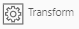

# Лабораторная работа № 1
***
 - В качестве источника данных, в лабораторной работе используется База Данных AdventureWorks2012
 - Используемые таблицы:
    - humanresources.employeepayhistory 
    - person.person
***
Задача: 
 - Руководитель ставит задачу отделу кадров: провести максимальное увеличение зарплат сотрудникам с учетом бизнес правил в декабре 2013 года
 - Он также хочет видеть факты повышения заработной платы за предыдущий год
***
Бизнес правила:
1. Повышение ЗП максимум 1 раз в год
2. Максимальное повышение ЗП за год - 20%
3. В случае несоблюдения правил 1 или 2, необходимо согласование руководителя компании
***
Чему вы научитесь в лабораторной работе:
1. Создавать и запускать Transformation и Workflow
2. Запускать Transformation не целиком, а до определенного шага и анализировать промежуточный результат    
3. Писать простейшие запросы на Spark SQL
4. Создавать переменные в Transformation и использовать их
5. Записывать данные в:
   - Hive (формат ORC)
   - Excel и CSV
6. Начитывать данные из:
   - Hive
   - Postgres
7. Join таблиц с созданием новых колонок
8. Использовать Livy консоль:
   - Останавливать сессию и батч процессы
   - Писать запросы
9. Пользоваться файловым менеджером в HDFS
10. Настраивать подключение к СУБД из интерфейса 
***
Что используется при решении задачи:

1. Hive
2. Oozie
3. Livy
4. СУБД postgres (Adventureworks)
5. Schema: humanresources, person
6. Spark SQL
***

Рекомендации:
1. Переключиться на английский язык интерфейса

***

Дополнительные материалы:
1. Синтаксис Spark SQL 3.1.1: https://spark.apache.org/docs/latest/sql-ref-syntax-qry-select.html

***
## Шаг 1. Анализ задачи
1. На выходе нужны таблицы:
   - Таблица фактов повышения ЗП за предыдущий год
   - Таблица плана повышения ЗП
   - Таблица плана повышения ЗП с конфликтами
2. Разбить по шагам:
   - Подключиться к СУБД
   - Сформировать таблицу фактов повышения ЗП за предыдущий год 
   - Сформировать таблицы с плановыми повышениями ЗП в следующем году
   - Сформировать таблицы с плановыми повышениями ЗП в следующем году с конфликтами

## Шаг 2. Создать Project
1. Перейти в раздел  / ETL / Project
2. Нажать “+” -> Project
3. Заполнить поле Name: labWorks
4.  Сохранить 

## Шаг 3. Создать Подключение к СУБД

### Шаг 3.1. Создать Software System
>##### №1
1. Перейти в раздел  / Connections / SoftwareSystem
2. Нажать “+” -> SoftwareSystem
3. Заполнить поля:
   - Name: humanresources
   - Project: выбрать labWorks
4.  Сохранить
   
>##### №2
1. Перейти в раздел  / Connections / SoftwareSystem
2. Нажать “+” -> Software System
3. Заполнить поля:
   - Name: person
   - Project: выбрать labWorks
4. Сохранить

> Оставшиеся поля заполнятся автоматически в конце Шага 2

> Примечание: автоматически создается JdbcContext в  / ETL / JdbcContext при сохранении Software System

### Шаг 3.2. Создать JdbcConnection
>##### №1
1. Перейти в раздел  / Connections / JdbcConnection
2. Нажать “+” -> JdbcConnection
3. Заполнить поля 
    - Name: humanresources
    - Project: выбрать labWorks
    - Url: jdbc:postgresql://hivemetastore:5432/Adventureworks
    - Schema: humanresources
    - User: postgres
    - Password: new_password
    - Driver: org.postgresql.Driver
4.  Сохранить
5.  Запустить Test
6. Получить сообщение об успешном соединении: [ "Connected!" ]
7. Закрыть сообщение
   
>##### №2
1. Нажать  Copy
2. Ввести name: person
3. Заменить поле:
    - Schema: person
4.  Сохранить
5.  Запустить Test
6. Получить сообщение об успешном соединении: [ "Connected!" ]

### Шаг 3.3. Создать Deployment
>##### №1
1. Перейти в раздел  / Connections / Deployment
2. Нажать “+” -> Deployment
3. Заполнить поля:
    - Name: humanresources
    - Project: выбрать labWorks
    - Connection: Выбрать humanresources
    - Software System: humanresources
4.  Сохранить
5.  Запустить в верхней панели инструментов Refresh Scheme 
6. Получить сообщение об успешном создании Scheme: [ "humanresources_at_humanresources" ]

>##### №2
1. Перейти в раздел   / Connections / Deployment
2. Нажать “+” -> Deployment
3. Заполнить поля:
   - Name: person
   - Project: выбрать labWorks
   - Connection: Выбрать Person
   - Software System: Person
4.  Сохранить
5.  Запустить Refresh Scheme
6. Получить сообщение об успешном создании Scheme: [ "person_at_person" ]

> Важно! Если при запуске Refresh Scheme возникла ошибка 
> "id to load is required for loading".
> Кнопка сохранить не отработала, нужно нажать её еще раз и повторить запуск Refresh Scheme

### Шаг 3.4. Проверить автоматически созданные Scheme
>##### №1
1. Перейти в раздел  / Connections / Scheme
2. Проверить наличие humanresources_at_humanresources (Scheme создалась на предыдущем шаге)
3. Перейти в режим редактирования 
4. Развернуть Tables (6 штук)

>##### №2
1. Перейти в раздел  / Connections / Scheme
2. Проверить наличие person_at_person (Scheme создалась на предыдущем шаге)
3. Перейти в режим редактирования
4. Развернуть Tables (13 штук)

## Шаг 4. Создать Transformation Step1

>##### №1
1. Перейти в раздел  / ETL / Transformation
2. Нажать “+” -> Transformation
3. Заполнить поля:
   - Name: tr_salary_step1
   - Label: Автоматически подставляется "= Name"
   - Project: выбрать labWorks
   - Spark Version: Выбрать SPARK3
   - Description: Формирование таблицы фактов повышения ЗП за предыдущий год
4.  Сохранить

>##### №2
1.  Нажать Run в нижней панели (снизу откроется панель инструментов)
2. Сделать Refresh страницы
3. Перейти в меню слева в autogenerated_tr_tr_salary_step1
4. Прокрутить вниз до пункта Parameters
5. Нажать  -> Property*
6. Раскрыть и заполнить поля:
   - Name: currentDate
   - Value: 2013-12-01
   - Description: Переменная для бизнес-правила: Повышение ЗП максимум 1 раз в год
7. Прокрутить вверх страницы
8.  Сохранить
9. Вернуться в трансформацию:  / ETL / Transformation / tr_salary_step1
10. В нижней панели инструментов должны появиться два этих параметра (если панель скрыта, то нажать )

>*Property для запуска через Livy. Для запуска через Oozie они не работают.

>##### №3
1. Перетащить на поле объект из 
   - SQL  
2. Выбрать его на поле трансформации
3. Справа в Свойствах:
   - Name: humanresources
   - Label: humanresources
   - Context: выбрать humanresources
4.  Сохранить

>##### №4
1. Под "SQL humanresources" нажать  (Edit SQL)
2. Открылся новый Tab SQL Editor humanresources
3.  Нажать Table в верхней панели инструментов
4. Выбрать Table: employeepayhistory
5. Выбрать Fields (через Ctrl):
   - businessentityid (id сотрудника, по нему потом подтянуть ФИО)
   - ratechangedate (дата повышения ЗП)
   - rate (процент повышения ЗП)
6. Нажать синюю кнопку Apply
7. Сгенерируется запрос:
    ```
    select 
       businessentityid,
       ratechangedate,
       rate
   from employeepayhistory
    ```
8.  Нажать Run*
9. Возникла ошибка: relation "employeepayhistory" does not exist
   - Необходимо изменить **from employeepayhistory** на **from humanresources.employeepayhistory** (особенность работы с Postgres)
10.  Нажать Run
11. Нажать галочку  (Apply)**
12. Закрыть Tab SQL Editor humanresources
11.  Сохранить

>/* В этот момент: 
> - Под запросом появится чашка кофе
> - Закутиться голубая шестеренка в нижней панели инструментов
> * Запрос отработает, как только:
>  - Шестеренка перестанет крутиться
>  - Появится сообщение о статусе выполнения задачи
>  - Вернется результат запроса

>/** При этим устанавливается структура данных на выходе узла трансформации (в Output Port)

>##### №5
1. Выбрать "SQL humanresources" на поле трансформации
2. Посмотреть, что в свойстве Statement появился запрос
3. Посмотреть, что в свойстве Output Port: OutputPort -> Fields появились 3 поля, которые вернулись из запроса с названием колонок и типом данных (появились в момент отработки Apply)

>##### №6
1. Перетащить на поле трансформации объект из 
   - Spark SQL
2. Выбрать его
3. Справа в Свойствах:
   - Name: filterSpark
   - Label: filterSpark
   - Sql Ports: 
      - Нажать  -> SQLPort
      - Развернуть появившееся поле
      - Заполнить поля:
         - Name: Salary
         - Alias: Salary
4. Соединить "SQL humanresources" и "Spark SQL filterSpark" на поле трансформации
5.  Сохранить 
6. Результат:

   

>##### №7
1. Под объектом Spark SQL filterSpark нажать  (Edit Spark SQL)
2. Открылся новый Tab Spark Editor filterSpark
3. Написать запрос, который возвращает все столбцы из предыдущего шага:
    ```
    select * from Salary
    ```
4.  Нажать Run
5. Нажать галочку  (Apply)
6.  Сохранить

>##### №8. Использование jobParameters
1. Оставаясь на этом Tab, проанализировать, как нужно изменить запрос в "Spark SQL filterSpark" 
2. Необходимо добавить к запросу фильтрацию по бизнес-правилу: Повышение ЗП максимум 1 раз в год
   1.  Используем where в запросе:
    ```
    months_between(cast('${jobParameters("currentDate")}' as date), ratechangedate, true) <= 12
    ```
   2. В нем:
      1. Используется Property currentDate, со вспомогательной функцией jobParameters*: '${jobParameters("currentDate")}'
      2. Приводится тип String к Date: cast( ... as date)
      3. Вычисляется разница в месяцах между текущей датой и датой повышения: months_between(..., ..., true)
3. Удалить * из запроса
4. Раскрыть справа меню со столбцами Salary
5. Выбрать поля по одному, через запятую:
    - businessentityid
    - rate
    - ratechangedate
6. Добавить Where
7. Итоговый запрос выглядит так:
    ```
    select 
       businessentityid,
       rate,
       ratechangedate
   from Salary
   where months_between(cast('${jobParameters("currentDate")}' as date), ratechangedate, true) <= 12
    ```
8.  Нажать Run
9. Нажать галочку  (Apply)
10. Закрыть Tab Spark Editor filterSpark
11.  Сохранить

>* jobParameters - эту функцию можно заменить на знак - &. Т.е. '${jobParameters("currentDate")}' == &currentDate
> 
> В дальнейшем будет использован именно такой синтаксис

>##### №9
1. Перетащить на поле трансформации объект из 
   - SQL
2. Выбрать его
3. Справа в Свойствах:
   - Name: person
   - Label: person
   - Context: person
4.  Сохранить

>##### №10
1. Под объектом "SQL person" нажать  (Edit SQL)
2. Открылся новый Tab SQL Editor person
3. Написать запрос, который возвращает id сотрудника и его ФИО из таблицы person:
   ```
   select
      businessentityid,
      firstname, 
      middlename,
      lastname
   from person.person
   ```
4. Нажать Run
5. Подождать, пока запрос отработает и вернет результат
6. Нажать галочку  (Apply)
7. Закрыть Tab SQL Editor person
8.  Сохранить

>##### №11. Создание блока Join. Создание Checkpoint в блоке Join
1. Перетащить на поле объект из 
   - Join
2. Соединить его сверху слева со Spark SQL
3. Соединить его снизу слева с SQL
4. Справа в Свойствах:
   - Name: joinSalary
   - Label: joinSalary
   - Join Type: Выбрать LEFT
   - Key Fields: Выбрать businessentityid
   - Joinee Key Fields: Выбрать businessentityid
   - Checkpoint*: Поставить True ( true = на этом шаге Spark сохранит промежуточный результат)
5.  Сохранить
6. Результат:
   

>*Checkpoint - это вызов метода persist в Scala (сохранение состояния DataSet или DataSource)
> - Состояние можно сохранить в ОП у кластера или на диск (HDFS)
> - Разработчик может задать место в Workflow Deployment
> - Состояние удалиться по окончанию процесса

>##### №12
1. Под объектом "Spark joinSalary" нажать  (Edit Join)
2. Открылся новый Tab Join Editor joinSalary
3. Обзорно смотрим, что в нем есть:
    - Добавление новой колонки
    - Копирование существующей
    - Изменение порядка колонок
    - Удаление колонки
    - Name: наименование колонки
    - Field Operation Type: тип операции. 
         - Add - проброс поля
         - Transform - выражение на Scala
         - SQL - выражение на Spark SQL
         - Pack - Делает структуру из полей
    - Data Type Domain: тип данных столбца
    - Source Fields: поле, которое возвращается в столбце
      - Если в названии поля стоит _1. - это столбец из 1-ой таблицы
      - Если в названии поля стоит _2. - это столбец из 2-ой таблицы
4. Нажать на "+". Создаем новый столбец с параметрами:
   - Name: personName
   - Field Operation Type: SQL
   - Data Type Domain: String
   - Source Fields: выбрать    _2.firstname, _2.middlename, _2.lastname
   - Expression: 
      ```
      concat( 
       if(_2.firstname is null, '', _2.firstname), 
       ' ', 
       if(_2.middlename is null, '', _2.middlename), 
       ' ',
       if(_2.lastname is null, '', _2.lastname) 
      )
      ```
5. Нажать галочку  (Check)
6. Справа от Expression должно появиться "OK"
7. Удалить столбцы:
   - firstname
   - middlename
   - lastname
8.  Сохранить
4. Закрыть Tab Join Editor Join

> Важно! Если Field Operation Type = Add, то Data Type Domain обязательно должен совпадать с типом в поле Source Fields (два последних пункта)

>##### №13
1. Справа сверху навести на плюсик и выбрать Source Code Editor 
2. Выбрать:
   - Tab "Step"
   - Select server: db-livy
   - Step: joinSalary (Join)
2.  Нажать Load code
3.  Нажать Run
4. Подождать, пока запрос отработает и вернет результат
7. В нем столбцы:
   - businessentityid: id сотрудника
   - rate: Процент повышения ЗП
   - ratechangedate: Дата повышения ЗП
   - personName: ФИО сотрудника
8. Таким образом проверить, что запрос отрабатывает корректно
9. Вернуться на первый Tab Transformation Transformation Designer

>##### №14
1. Перетащить на поле трансформации объект из 
   - CSV
2. Соединить Join с ним 
3. Выбрать его
4. Справа в Свойствах:
   - Name: lastYear
   - Label: lastYear
   - Hdfs: Должен быть выбран True
   - Path: /tmp/salary/lastYear.xls
   - Format: EXCEL
   - Header: Должен быть выбран True
   - EXCEL: 
      - Save Mode: OVERWRITE
5.  Сохранить
6. Результат:
   
   

>##### №15
1. Перетащить на поле трансформации объект из 
   - Local
2. Соединить Join с ним
3. Выбрать его
4. Справа в Свойствах:
   - Name: lastYearSalary
   - Label: lastYearSalary
   - Local File Format: ORC
   - Save Mode: OVERWRITE
   - Local File Name: /tmp/salary/lastYearSalary
   - Register Table: Должен быть выбран True
   - Hive Table Name: lastYearSalary
5.  Сохранить
6. Результат:

   

> Важно! Именно для этого мы поставили в Join свойство Checkpoint = true. Чтобы результат шага сохранился, а потом параллельно использовался для выгрузки в Excel и Hive.
> Если это свойство не будет проставлено, то отработают два запроса от начала трансформации до конца.


## Шаг 5. Запустить Transformation Step1

>##### №1
1. Проверить Transformation на ошибки:
   1.  Запустить в верхней панели инструментов Run/Validate
   2. Получить сообщение об отсутствии ошибок: { "result": true, "problems": [] }
2.  Запустить в нижней панели инструментов Run/Run
   
3. Получить сообщение об успешном завершении Transformation: Successful run

>##### №2
1. Выбрать "CSV lastYear" на поле трансформации
2. Под объектом нажать  (View content)
3. Открылся новый Tab CSV Target Editor CSV
4.  Нажать глаз (show)
5. Посмотреть, что внизу закрутилась шестеренка и стала голубой 
6. Подождать, пока запрос отработает и вернет результат
7. Это и есть таблица фактов повышения ЗП за предыдущий год
8. Вернуться на предыдущий Tab

>##### №3
1. Выбрать "Local lastYearSalary" на поле трансформации
2. Под объектом нажать  (View content)
3. Открылся новый Tab Local Target Editor lastYearSalary
4.  Нажать глаз (show)
5. Посмотреть, что внизу закрутилась шестеренка и стала голубой 
6. Подождать, пока запрос отработает и вернет результат
7. Это тоже таблица фактов повышения ЗП за предыдущий год, но сохраненная в Hive
8. Вернуться на предыдущий Tab

## Шаг 6. Открыть таблицу в HDFS
1. Перейти в раздел  / Servers / Livy / bd-livy
2. Нажать “+” -> HDFS Console
3. Перейти в /tmp/salary
4. Напротив lastYear.xls нажать  (download)
5. Открыть скачанный Excel
6. Перейти в /tmp/salary/lastYearSalary - тут хранится таже самая таблицы, но разбитая по партициям (от partition - разделение)

## Шаг 7. Найти все таблицы в Hive
1. Перейти в раздел  / Servers / Livy / bd-livy
2. Нажать нижний “+” -> Появится новый Tab Interpreter 1
3. Написать запрос:
   ```
   spark.sql("show tables").show()
   ```
4.  Нажать молнию (run)
5. Посмотреть список существующих таблиц
6. Убедиться, что таблица lastyearsalary создалась

## Шаг 5. Создать Transformation Step2

>##### №1
1. Перейти в раздел  / ETL / Transformation
2. Нажать “+” -> Transformation
3. Заполнить поля:
   - Name: tr_salary_step2
   - Label: Автоматически подставляется "= Name"
   - Project: выбрать labWorks
   - Spark Version: Выбрать SPARK3
   - Description: Формирование таблицы плана повышения ЗП
4.  Сохранить

>##### №2
1.  Нажать Run в нижней панели (снизу откроется панель инструментов)
2. Сделать Refresh страницы
3.  Нажать еще раз Run в нижней панели (снизу откроется панель инструментов)
4. Нажать "+" (add) в нижней панели (2 раза)
5.  Нажать Save в нижней панели
6. Сделать Refresh страницы
7.  Нажать Edit напротив первой появившейся строки с Property
8. Заполнить поля:
   - Name: maxRate
   - Value: 20
   - Description: Переменная для бизнес-правила: Максимальное повышение ЗП на 20% в год
9.  Нажать Edit напротив второй появившейся строки с Property
10.  Нажать Save в этой же строке
11.  Нажать Save в нижней панели

>##### №3
1. Перетащить на поле объект из 
   - Hive
2. Выбрать его на поле трансформации
3. Справа в Свойствах:
   - Name: hiveSalary
   - Label: hiveSalary
4.  Сохранить

>##### №4
1. Под "Hive hiveSalary" нажать  (Edit Hive)
2. Открылся новый Tab Hive Editor hiveSalary
3. Написать запрос к таблице, которую создали ранее
```
   select * from lastyearsalary
```
4.  Нажать Run
5. Дождаться, пока запрос отработает
5. Нажать галочку  (Apply)
12. Закрыть Tab Hive Source Editor hiveSalary
11.  Сохранить

>/* Если в таблице вернулись пустые строки, то нажать  Run еще раз.

>##### №5
1. Выбрать "Hive hiveSalary" на поле трансформации
2. Посмотреть, что в свойстве Statement появился запрос
3. Посмотреть, что в свойстве Output Port: OutputPort -> Fields появились 4 поля, которые вернулись из запроса с названием колонок и типом данных (появились в момент отработки Apply)

>##### №6
1. Перетащить на поле объект из 
   - Aggregation
2. Соединить его с Hive hiveSalary
3. Выбрать его на поле трансформации
4. Справа в Свойствах:
   - Name: sumUpSalary
   - Label: sumUpSalary
   - Group By Field Name: выбрать businessentityid
   - Aggregation Parameters:
      - Нажать  -> AggregationParameters (2 раза)
      - Развернуть 1 появившееся поле
      - Заполнить:
         - Result Field Name: sumUpSalary
         - Field Name: выбрать rate
         - Aggregation Function: выбрать SUM
      - Развернуть 2 появившееся поле
      - Заполнить:
         - Result Field Name: countUpSalary
         - Field Name: выбрать rate
         - Aggregation Function: выбрать COUNT
5.  Сохранить

>##### №7
1. Справа сверху навести на плюсик и выбрать Source Code Editor
2. Выбрать:
   - Tab "Step"
   - Select server: db-livy
   - Step: sumUpSalary (Aggregation)
2.  Нажать Load code
3.  Нажать Run
4. Подождать, пока запрос отработает и вернет результат
7. В нем столбцы:
   - businessentityid: id сотрудника
   - sumUpSalary: Суммарный процент повышения ЗП за год
   - countUpSalary: Количество повышений ЗП за год
8. Таким образом проверить, что запрос отрабатывает корректно
9. Вернуться на первый Tab Transformation Transformation Designer

>##### №8
1. Перетащить на поле объект из 
   - Projection
2. Соединить его с Aggregation sumUpSalary
3. Выбрать его на поле трансформации
4. Справа в Свойствах:
   - Name: excessSumAndCount
   - Label: excessSumAndCount
5.  Сохранить

>##### №8
1. Под объектом "Projection excessSumAndCount" нажать  (Edit Projection)
2. Открылся новый Tab Projection Editor excessSumAndCount
3.  Нажать New
4. Заполнить:
   - Name: excessSum
   - Field Operation Type: SQL
   - Data Type Domain: выбрать BOOLEAN
   - Source Fields: выбрать sumUpSalary: DECIMAL
   - Expression:
      ```
      sumUpSalary >= cast(&maxRate as integer)
      ```
5. Нажать галочку  (Check)
6. Справа от Expression должно появиться "OK"

7.  Нажать New
8. Заполнить:
   - Name: excessCount
   - Field Operation Type: SQL
   - Data Type Domain: выбрать BOOLEAN
   - Source Fields: выбрать countUpSalary: DECIMAL
   - Expression:
      ```
      true
      ```
9. Нажать галочку  (Check)
10. Справа от Expression должно появиться "OK"

11.  Нажать New
12. Заполнить:
- Name: maxRate
- Field Operation Type: SQL
- Data Type Domain: выбрать STRING
- Expression:
   ```
   cast(&maxRate as integer)
   ```
13. Нажать галочку  (Check)
14. Справа от Expression должно появиться "OK"
15.  Сохранить
16. Закрыть Tab Projection Editor excessSumAndCount

>##### №9
1. Перетащить на поле трансформации объект из 
   - SQL
2. Выбрать его
3. Справа в Свойствах:
   - Name: person
   - Label: person
   - Context: person
4.  Сохранить

>##### №10
1. Под объектом "SQL person" нажать  (Edit SQL)
2. Открылся новый Tab SQL Editor person
3. Написать запрос, который возвращает id сотрудника и его ФИО из таблицы person:
   ```
   select
      businessentityid,
      firstname, 
      middlename,
      lastname
   from person.person
   ```
4. Нажать Run
5. Подождать, пока запрос отработает и вернет результат
6. Нажать галочку  (Apply)
7. Закрыть Tab SQL Editor person
8.  Сохранить

>##### №11
1. Перетащить на поле объект из 
   - Join
2. Соединить его сверху слева со Spark SQL
3. Соединить его снизу слева с SQL
4. Справа в Свойствах:
   - Name: tableFactUp
   - Label: tableFactUp
   - Join Type: Выбрать LEFT
   - Key Fields: Выбрать businessentityid
   - Joinee Key Fields: Выбрать businessentityid
   - Checkpoint: Поставить True ( true = на этом шаге Spark сохранит промежуточный результат)
5.  Сохранить
6. Результат:
   

>##### №12
1. Под объектом "Join tableFactUp" нажать  (Edit Join)
2. Открылся новый Tab Join Editor tableFactUp
3. Нажать на "+". Создаем новый столбец с параметрами:
   - Name: personName
   - Field Operation Type: SQL
   - Data Type Domain: String
   - Source Fields: выбрать    _2.firstname, _2.middlename, _2.lastname
   - Expression:
      ```
      concat( 
       if(_2.firstname is null, '', _2.firstname), 
       ' ', 
       if(_2.middlename is null, '', _2.middlename), 
       ' ',
       if(_2.lastname is null, '', _2.lastname) 
      )
      ```
5. Нажать галочку  (Check)
6. Справа от Expression должно появиться "OK"
7. Удалить столбцы:
   - firstname
   - middlename
   - lastname
8.  Сохранить
4. Закрыть Tab Join Editor tableFactUp

> Важно! Если Field Operation Type = Add, то Data Type Domain обязательно должен совпадать с типом в поле Source Fields (два последних пункта)

>##### №13
1. Справа сверху навести на плюсик и выбрать Source Code Editor
2. Выбрать:
   - Tab "Step"
   - Select server: db-livy
   - Step: tableFactUp (Join)
3.  Нажать Load code
4.  Нажать Run
5. Подождать, пока запрос отработает и вернет результат
6. В нем столбцы:
   - businessentityid: id сотрудника
   - personName: ФИО сотрудника
   - sumUpSalary: Суммарный процент повышения ЗП за год
   - countUpSalary: Количество повышений ЗП за год
   - excessSum: Есть ли превышение по суммарному проценту за год
   - excessCount: Есть ли превышение по количеству повышений за год
   - newSum: Плановый процент повышения ЗП
7. Таким образом проверить, что запрос отрабатывает корректно
8. Вернуться на первый Tab Transformation Transformation Designer

>##### №14
1. Перетащить на поле объект из 
   - Selection
2. Соединить его слева с Join tableFactUp
3. Справа в Свойствах:
   - Name: selectNotExcessSum
   - Label: selectNotExcessSum
   - Expression:
      ```
      excessSum == false AND excessCount == true
      ```
5.  Сохранить

>##### №15
1. Под объектом "Selection selectNotExcessSum" нажать  (Edit Selection)
2. Открылся новый Tab Selection Editor selectNotExcessSum
3. Нажать галочку  (Apply)
4. Убедится, что фильтрация сработала
5. В нижней панели появится "ОК"
8.  Сохранить

>##### №16
1. Перетащить на поле трансформации объект из 
   - Local
2. Соединить Selection с ним
3. Выбрать его
4. Справа в Свойствах:
   - Name: tableUpSalaryConflict
   - Label: tableUpSalaryConflict
   - Local File Format: PARQUET
   - Save Mode: OVERWRITE
   - Local File Name: /tmp/salary/tableUpSalaryConflict
   - Register Table: Должен быть выбран True
   - Hive Table Name: tableUpSalaryConflict
5.  Сохранить

>##### №17
1. Перетащить на поле трансформации объект из 
   - Local
2. Соединить Selection с ним
3. Выбрать его
4. Справа в Свойствах:
   - Name: tableUpSalary
   - Label: tableUpSalary
   - Local File Format: PARQUET
   - Save Mode: OVERWRITE
   - Local File Name: /tmp/salary/tableUpSalary
   - Register Table: Должен быть выбран True
   - Hive Table Name: tableUpSalary
5.  Сохранить
6. Результат:
   

## Шаг 6. Запустить Transformation Step2

>##### №1
1. Проверить Transformation на ошибки:
   1.  Запустить в верхней панели инструментов Run/Validate
   2. Получить сообщение об отсутствии ошибок: { "result": true, "problems": [] }
2.  Запустить в нижней панели инструментов Run/Run
   
3. Получить сообщение об успешном завершении Transformation: Successful run

>##### №2
1. Выбрать "Local tableUpSalaryConflict" на поле трансформации
2. Под объектом нажать  (View content)
3. Открылся новый Tab Local Target Editor tableUpSalaryConflict
4.  Нажать глаз (show)
5. Посмотреть, что внизу закрутилась шестеренка и стала голубой 
6. Подождать, пока запрос отработает и вернет результат
7. Это таблица плана повышения ЗП с конфликтами
8. Вернуться на предыдущий Tab

>##### №3
1. Выбрать "Local tableUpSalary" на поле трансформации
2. Под объектом нажать  (View content)
3. Открылся новый Tab Local Target Editor tableUpSalary
4.  Нажать глаз (show)
5. Посмотреть, что внизу закрутилась шестеренка и стала голубой 
6. Подождать, пока запрос отработает и вернет результат
7. Это таблица плана повышения ЗП
8. Вернуться на предыдущий Tab

## Шаг 4. Проверить таблицы в HDFS
1. Перейти в раздел  / Servers / Livy / bd-livy
2. Нажать “+” -> HDFS Console
3. Перейти в /tmp/salary
4. Проверить наличие таблиц:
   - lastYear.xls
   - lastYearSalary
   - tableUpSalary
   - tableUpSalaryConflict
   
## Шаг 7. Создать и запустить Workflow

>##### №1
1. Перейти в раздел  / ETL / Workflow
2. Нажать “+” -> Workflow
3. Заполнить поля:
   - Name: wf_salary_analysis
   - Label: Автоматически подставляется "= Name"
   - Project: выбрать labWorks
4.  Сохранить

>##### №2
1. Перетащить на поле объект из 
   - Start
2. Выбрать его на поле трансформации
3. Справа в Свойствах:
   - Name: start
   - Label: start
4.  Сохранить

>##### №3
1. Перетащить на поле объект из 
   - Transformation
2. Соединить его со Start
3. Выбрать его на поле трансформации
4. Справа в Свойствах:
   - Name: step1
   - Label: step1
   - Transformation: выбрать tr_salary_step1
   - parameters:
      - Нажать  -> Property*
      - Развернуть появившееся поле
      - Заполнить:
         - Name: currentDate
         - Value: 2013-12-01
         - Description: Переменная для бизнес-правила: Повышение ЗП максимум 1 раз в год
5.  Сохранить

>*Property для запуска через Oozie

>##### №4
1. Перетащить на поле объект из 
   - Transformation
2. Соединить его с Transformation step1
3. Выбрать его на поле трансформации
4. Справа в Свойствах:
   - Name: step2
   - Label: step2
   - Transformation: выбрать tr_salary_step2
   - parameters:
      - Нажать  -> Property
      - Развернуть появившееся поле
      - Заполнить:
         - Name: maxRate
         - Value: 20
         - Description: Переменная для бизнес-правила: Максимальное повышение ЗП на 20% в год
5.  Сохранить

>##### №5
1. Перетащить на поле объект из 
   - Kill
2. Соединить его с Transformation step1 и step2
3. Выбрать его на поле трансформации
4. Справа в Свойствах:
   - Name: fail
   - Label: fail
   - Message: Workflow Salary Failed
5.  Сохранить

>##### №6
1. Перетащить на поле объект из 
   - End
2. Соединить его с Transformation step2
3. Выбрать его на поле трансформации
4. Справа в Свойствах:
   - Name: success
   - Label: success
5.  Сохранить
6. Результат:

   

>##### №7
1. Проверить Workflow на ошибки:
   1.  Запустить в верхней панели инструментов Run/Validate
   2. Получить сообщение об отсутствии ошибок: { "result": true, "problems": [] }

>##### №7
1.  Запустить в верхней панели инструментов Run/Install
2. Увидеть слева автоматически сгенерированный Workflow Deployment autogenerated_wf_wf_salary_analysis
3.  Запустить в верхней панели инструментов Run/RunIt