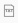
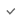

# Лабораторная работа № 2
***
- В качестве источника данных, в лабораторной работе используется База Данных AdventureWorks2012
- Используемые таблицы:
    - humanresources.employeepayhistory
    - person.person
***
Задача: 
 - Руководитель запрашивает у отдела кадров данные о повышении заработной платы сотрудникам с 2008 по 2011 в процентах
 - Он хочет видеть график: Процент повышения ЗП от 0% до 50% с шагом 5% по оси Х, Количество фактов повышения по оси Y
***
Чему вы научитесь в лабораторной работе: 
1. Использовать Pushdown-оптимизацию в Spark Datagram
2. Создавать параллельные потоки данных в трансформациях
3. Использовать операторы реляционной алгебры:
    - FULL Join
    - Projection (создание новых столбцов)
    - Selection 
    - Aggregation (COUNT)
4. Импортировать данные из Postgres
5. Экспортировать результаты в Excel

***
Пример использования Spark-оптимизации:
1. Предположим, существует запрос на соединение между двумя таблицами
    - В этой операции объединения одна из них представляет собой большую таблицу, а другая - небольшую таблицу с разным количеством разделов, разбросанных по разным узлам кластера (это может быть одна стойка или другая стойка)
    - Spark решает, какие разделы следует объединить в начале (порядок объединения), тип объединения и т. Д. Для лучшей оптимизации.
2. Spark выберет и оптимизирует самый производительный вариант Physical Plan
3. Spark создаст исполняемый код (DAG RDD) для запроса, который необходимо выполнять распределенным образом в кластере  
4. Весь этот процесс известен как Codegen

***
Pushdown-оптимизация - это перенос выполнения части кода или логики на уровень Базы Данных. 

Блок-схема для Spark запросов:
1. Logical Plan включает в себя три этапа:
    - Parsed Logical Plan ( Unresolved Logical Plan )
    - Analyzed Logical Plan ( Resolved Logical Plan )
    - Optimized Logical Plan
3. Physical Plan


 - Logical Plan - это:
   - Иллюстрация ожидаемого результата после серии множественных преобразований
   - Краткое изложение всех шагов преобразования, которые необходимо выполнить в запросе
   - Не предоставляет подробных сведений о драйвере (Master Node) или исполнителе (Worked Node). SparkContext отвечает за его создание и хранение
   - Это помогает нам получить наиболее оптимизированную версию пользовательского выражения


 - Physical Plan - это:
    - Окончательная формулировка последовательности выполнения операций 
    - Мост между Logical Plan и исполняемым кодом (DAG RDD)
    - Дерево
    - Содержит более конкретное описание того, как должно происходить (исполнение) (конкретный выбор алгоритма)
    - Пользовательские примитивы нижнего уровня (RDD)
***
Функция explain() используется для вывода на консоль плана выполнения зароса

Как использовать функцию explain() в Scala:
-  Physical Plan:
   - explain()
   - explain(mode="simple")
   - explain(mode="formatted") - детализированный
- Physical Plan && Logical Plan
   - explain(true)
   - explain(mode="extended") 
- Physical Plan && Optimized Logical Plan
   - explain(mode="cost")
-  Запрос на Scala
    - explain(mode="codegen")

***

## Шаг 1. Создать Transformation Pushdown

>##### №1
1. Перейти в раздел  / ETL / Transformation
2. Нажать “+” -> Transformation
3. Заполнить поля:
    - Name: tr_pushdown
    - Label: Автоматически подставляется "= Name"
    - Project: выбрать labWorks
    - Spark Version: Выбрать SPARK3
    - Description: Формирование таблицы фактов повышения ЗП за предыдущий год
4.  Сохранить

>##### №2
1. Перетащить на поле объект из 
    - SQL
2. Выбрать его на поле трансформации
3. Справа в Свойствах:
    - Name: humanresources
    - Label: humanresources
    - Context: выбрать humanresources
4.  Сохранить

>##### №3
1. Под "SQL humanresources" нажать  (Edit SQL)
2. Открылся новый Tab SQL Editor humanresources
3.  Нажать Table в вехней пенели инструментов
4. Выбрать Table: employeepayhistory
5. Выбрать Fields (через Ctrl):
    - ratechangedate (дата повышения ЗП)
    - rate (процент повышения ЗП)
6. Нажать синюю кнопку Apply
7. Сгенерируется запрос:
    ```
    select 
       ratechangedate,
       rate
   from employeepayhistory
    ```
8. Изменить **from employeepayhistory** на **from humanresources.employeepayhistory** (особенность работы с Postgres)
9.  Нажать Run
10. Нажать галочку  (Apply)**
11. Закрыть Tab SQL Editor humanresources
12.  Сохранить

>##### №4
1. Выбрать "SQL humanresources" на поле трансформации
2. Посмотреть, что в свойстве Statement появился запрос
3. Посмотреть, что в свойстве Output Port: OutputPort -> Fields появились 2 поля, которые вернулись из запроса с названием колонок и типом данных (появились в момент отработки Apply)

>##### №5
1. Перетащить на поле объект из 
    - Selection
2. Соединить его слева с SQL humanresources
3. Справа в Свойствах:
    - Name: yearGreaterThen2006
    - Label: yearGreaterThen2006
    - Expression:
       ```
       months_between(cast('2007-01-01' as date), ratechangedate, true) < 0
       ```
4.  Сохранить

>##### №6
1. Под объектом "Selection yearGreaterThen2006" нажать  (Edit Selection)
2. Открылся новый Tab Selection Editor yearGreat2006
3. Нажать галочку  (Apply)
4. Убедится, что фильтрация сработала
5. В нижней панели появится "ОК"
6.  Сохранить
7. Закрыть Tab Selection Editor yearGreaterThen2006

>##### №7
1. Перетащить на поле объект из 
    - Selection
2. Соединить его слева с Selection yearGreaterThen2006
3. Справа в Свойствах:
    - Name: yearLessThen2012
    - Label: yearLessThen2012
    - Checkpoint: Поставить True ( true = на этом шаге Spark сохранит промежуточный результат)
    - Expression:
       ```
       months_between(cast('2012-12-31' as date), ratechangedate, true) > 0
       ```
4.  Сохранить

>##### №8
1. Перетащить на поле объект из 
   - Aggregation
2. Соединить его с Selection yearGreaterThen2006
3. Выбрать его на поле трансформации
4. Справа в Свойствах:
   - Name: countRow
   - Label: countRow
   - Aggregation Parameters:
      - Нажать  -> AggregationParameters
      - Развернуть появившееся поле
      - Заполнить:
         - Result Field Name: countRow
         - Field Name: выбрать rate
         - Aggregation Function: выбрать COUNT
5.  Сохранить
6. Результат:
   

>##### №9
1. Перетащить на поле объект из 
    - Projection
2. Соединить его с Selection yearGreaterThen2006
3. Выбрать его на поле трансформации
4. Справа в Свойствах:
    - Name: rateInterval
    - Label: rateInterval
5.  Сохранить

>##### №10
1. Под объектом "Projection rateInterval" нажать  (Edit Projection)
2. Открылся новый Tab Projection Editor rateInterval
3.  Нажать New
4. Заполнить:
    - Name: rateInterval
    - Field Operation Type: SQL
    - Data Type Domain: выбрать STRING
    - Source Fields: выбрать rate: DECIMAL
    - Expression:
       ```
      CASE 
           WHEN rate > 0 AND rate <= 5 THEN '0-5'
           WHEN rate > 5 AND rate <= 10 THEN '6-10'
        
           WHEN rate > 10 AND rate <= 15 THEN '11-15'
           WHEN rate > 15 AND rate <= 20 THEN '16-20'
        
           WHEN rate > 20 AND rate <= 25 THEN '21-25'
           WHEN rate > 25 AND rate <= 30 THEN '26-30'
        
           WHEN rate > 30 AND rate <= 35 THEN '31-35'
           WHEN rate > 35 AND rate <= 40 THEN '36-40'
        
           WHEN rate > 40 AND rate <= 45 THEN '41-45'
           WHEN rate > 45 AND rate <= 50 THEN '46-50'
        
           ELSE '50+'
       END
       ```
5. Нажать галочку  (Check)
6. Справа от Expression должно появиться "OK"
7.  Сохранить
8. Закрыть Tab Projection Editor rateInterval

>##### №11
1. Перетащить на поле объект из 
    - Aggregation
2. Соединить его с Projection rateInterval
3. Выбрать его на поле трансформации
4. Справа в Свойствах:
    - Name: countRateInterval
    - Label: countRateInterval
    - Group By Field Name: выбрать rateInterval
    - Aggregation Parameters:
        - Нажать  -> AggregationParameters
        - Развернуть появившееся поле
        - Заполнить:
            - Result Field Name: countRateInterval
            - Field Name: выбрать rateInterval
            - Aggregation Function: выбрать COUNT
5.  Сохранить
6. Результат:
   

>##### №12
1. Справа сверху навести на плюсик и выбрать Source Code Editor
2. Выбрать:
    - Tab "Step"
    - Select server: db-livy
    - Step: countRateInterval (Aggregation)
3.  Нажать Load code
4.  Нажать Run
5. Подождать, пока запрос отработает и вернет результат
6. В нем столбцы:
    - rateInterval: Интервал повышения ЗП в процентах
    - countRateInterval: Количество фактов повышения ЗП в интервалах за приод
7. Таким образом проверить, что запрос отрабатывает корректно
   
8. Проверить вторую агрегацию
9. Выбрать:
    - Step: countRow (Aggregation)
10.  Нажать Load code
11.  Нажать Run
12. Подождать, пока запрос отработает и вернет результат
13. В нем один столбец:
    - countRow: Общее количество фактов повышения ЗП за период
14. Таким образом проверить, что запрос отрабатывает корректно
15. Вернуться на первый Tab Transformation Transformation Designer

>##### №13
1. Перетащить на поле объект из 
    - Join
2. Соединить его сверху слева с Aggregation countRow
3. Соединить его снизу слева с Aggregation countRateInterval
4. Справа в Свойствах:
    - Name: fullJoin
    - Label: fullJoin
    - Join Type: Выбрать FULL
5.  Сохранить
6. Результат:
   

>##### №14
1. Справа сверху навести на плюсик и выбрать Source Code Editor
2. Выбрать:
    - Tab "Step"
    - Select server: db-livy
    - Step: fullJoin (Join)
3.  Нажать Load code
4.  Нажать Run
5. Подождать, пока запрос отработает и вернет результат
6. В нем столбцы:
    - countRow: Общее количество фактов повышения ЗП за период
    - rateInterval: Интервал повышения ЗП в процентах
    - countRateInterval: Количество фактов повышения ЗП в интервалах за приод
7. Таким образом проверить, что запрос отрабатывает корректно
8. Вернуться на первый Tab Transformation Transformation Designer

>##### №15
1. Перетащить на поле объект из 
    - Projection
2. Соединить его с Aggregation sumUpSalary
3. Выбрать его на поле трансформации
4. Справа в Свойствах:
    - Name: percent
    - Label: percent
5.  Сохранить

>##### №16
1. Под объектом "Projection percent" нажать  (Edit Projection)
2. Открылся новый Tab Projection Editor percent
3.  Нажать New
4. Заполнить:
    - Name: percent
    - Field Operation Type: SQL
    - Data Type Domain: выбрать DECIMAL
    - Source Fields: выбрать countRateInterval: DECIMAL, countRow: DECIMAL
    - Expression:
       ```
       cast(countRateInterval * 100.00 / countRow as decimal(5,2))
       ```
5. Нажать галочку  (Check)
6. Справа от Expression должно появиться "OK"
7. Удалить поля:
    - countRateInterval
    - countRow
8.  Сохранить
9. Закрыть Tab Projection Editor percent

>##### №17
1. Перетащить на поле трансформации объект из 
    - CSV
2. Соединить Projection percent с ним
3. Выбрать его
4. Справа в Свойствах:
    - Name: histogram
    - Label: histogram
    - Hdfs: Должен быть выбран True
    - Path: /tmp/salary/histogram.xls
    - Format: EXCEL
    - Header: Должен быть выбран True
    - EXCEL:
        - Save Mode: OVERWRITE
5.  Сохранить
6. Результат:

   

## Шаг 2. Pushdown-оптимизация

>##### №1
1. Перейти в раздел  / ETL / Project / labWorks / tr_pushdown
2. Справа сверху навести на плюсик и выбрать Source Code Editor
3. Выбрать:
   - Tab "Step"
   - Select server: db-livy
   - Step: yearLessThen2012 (Selection)
4.  Нажать Load code
5.  Нажать Run
6. Подождать, пока запрос отработает и вернет результат

>##### №2
1. Изменить количество строк данных в результирующей таблице:   
   - В конце кода найти строку:
         ```
     yearLessThen2012.show(20, false)
         ```
   - Заменить 20 на 200:
         ```
     yearLessThen2012.show(200, false)
         ```
   -  Нажать Run
   - Убедиться, что в результате вернулось 200 строк, вместо 20


>##### №3

1. Вывести только физический план запроса:
   - Заменить функцию с show() на explain():
         ```
     yearLessThen2012.explain()
         ```
   -  Нажать Run
   - В результирующем поле:
      - Physical Plan

>##### №4

1. Вывести все планы запроса:
   - Заменить функцию с explain() на explain(true):
           ```
           tableFactUp.explain(true)
           ```
   -  Нажать Run
   - В результирующем поле:
      - Parsed Logical Plan
      - Analyzed Logical Plan
      - Optimized Logical Plan
      - Physical Plan   
    
>##### №5

1. Проанализировать Parsed Logical Plan ( Unresolved Logical Plan )
    ```
    == Parsed Logical Plan ==
    'Filter ('months_between(cast(2012-12-31 as date), 'ratechangedate, true) > 0)
    +- Filter (months_between(cast(cast(2007-01-01 as date) as timestamp), ratechangedate#6731, true, Some(GMT)) < cast(0 as double))
       +- Relation[rate#6730,ratechangedate#6731] JDBCRelation((select
                            rate,
                            ratechangedate
                          from humanresources.employeepayhistory) t) [numPartitions=1]
    
    ```
2. Описание:
    - Имена столбцов или таблиц могут быть неточными или даже не существовать
    - Spark создает пустой логический план на этом этапе, где нет проверок имени столбца, имени таблицы и т.д.
    - По факту - это черновой вариант будущего Spark запроса "на коленке"
    
>##### №6

1. Проанализировать Analyzed Logical Plan ( Resolved Logical Plan )
    ```
    == Analyzed Logical Plan ==
    rate: decimal(38,18), ratechangedate: timestamp
    Filter (months_between(cast(cast(2012-12-31 as date) as timestamp), ratechangedate#6731, true, Some(GMT)) > cast(0 as double))
    +- Filter (months_between(cast(cast(2007-01-01 as date) as timestamp), ratechangedate#6731, true, Some(GMT)) < cast(0 as double))
        +- Relation[rate#6730,ratechangedate#6731] JDBCRelation((select
                            rate,
                            ratechangedate
                          from humanresources.employeepayhistory) t) [numPartitions=1]
    
    ```
2. Описание:
    - Начитываются метаданные
    - Определяются типы столбцов (1 строка)

>##### №7

1. Проанализировать Optimized Logical Plan
    ```
    == Optimized Logical Plan ==
    InMemoryRelation [rate#6730, ratechangedate#6731], StorageLevel(memory, deserialized, 1 replicas)
        +- *(1) Filter ((isnotnull(ratechangedate#6731) AND (months_between(1167609600000000, ratechangedate#6731, true, Some(GMT)) < 0.0)) AND (months_between(1356912000000000, ratechangedate#6731, true, Some(GMT)) > 0.0))
            +- InMemoryTableScan [rate#6730, ratechangedate#6731], [isnotnull(ratechangedate#6731), (months_between(1167609600000000, ratechangedate#6731, true, Some(GMT)) < 0.0), (months_between(1356912000000000, ratechangedate#6731, true, Some(GMT)) > 0.0)]
                +- InMemoryRelation [rate#6730, ratechangedate#6731], StorageLevel(memory, deserialized, 1 replicas)
                    +- *(1) Scan JDBCRelation((select
                            rate,
                            ratechangedate
                         from humanresources.employeepayhistory) t) [numPartitions=1] [rate#6730,ratechangedate#6731] PushedFilters: [], ReadSchema: struct<rate:decimal(38,18),ratechangedate:timestamp>
       
    ```
2. Описание:
    - Spark самостоятельно выполняет оптимизацию через Catalyst Optimizer.
    - Catalyst Optimizer:
        - Проверяет все запросы и этапы трансформации, которые могут быть выполнены вместе
        - Генерирует все возможные варианты порядка выполнения запросов и этапов трансформаций для повышения производительности
        - Оценивая производительность каждого и выбирает наилучший
        - Изменяет последовательность выполнения этапов трансформации для снижения нагрузки и времени отработки запроса
3. В примере:
    - Spark объединил два фильтра в один с помощью оператора "AND"
    - InMemoryRelation - это логический оператор, которые представляет собой кэшированные Dataset
    - InMemoryScans - это стратегия планирования, которая приводит порядок выполнения InMemoryRelation к InMemoryTableScan
    
>##### №8

1. Проанализировать Physical Plan
    ```
    == Physical Plan ==
    InMemoryTableScan [rate#6730, ratechangedate#6731]
        +- InMemoryRelation [rate#6730, ratechangedate#6731], StorageLevel(memory, deserialized, 1 replicas)
            +- *(1) Filter ((isnotnull(ratechangedate#6731) AND (months_between(1167609600000000, ratechangedate#6731, true, Some(GMT)) < 0.0)) AND (months_between(1356912000000000, ratechangedate#6731, true, Some(GMT)) > 0.0))
                +- InMemoryTableScan [rate#6730, ratechangedate#6731], [isnotnull(ratechangedate#6731), (months_between(1167609600000000, ratechangedate#6731, true, Some(GMT)) < 0.0), (months_between(1356912000000000, ratechangedate#6731, true, Some(GMT)) > 0.0)]
                        +- InMemoryRelation [rate#6730, ratechangedate#6731], StorageLevel(memory, deserialized, 1 replicas)
                                +- *(1) Scan JDBCRelation((select
                                rate,
                                ratechangedate
                            from humanresources.employeepayhistory) t) [numPartitions=1] [rate#6730,ratechangedate#6731] PushedFilters: [], ReadSchema: struct<rate:decimal(38,18),ratechangedate:timestamp>
         
    ```
2. Описание:
    - Физический план - это внутреннее усовершенствование или оптимизация Spark. 
    - После него Spark создаст исполняемый код (DAG RDD) для запроса, который необходимо выполнять распределенным образом в кластере  

3. В примере:
    - Spark объединил два фильтра в один с помощью оператора "AND"