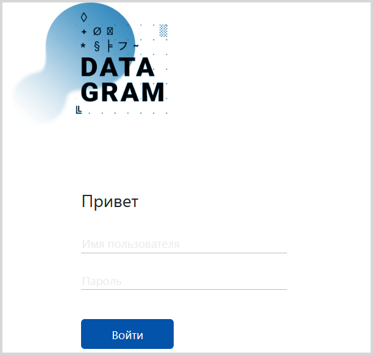
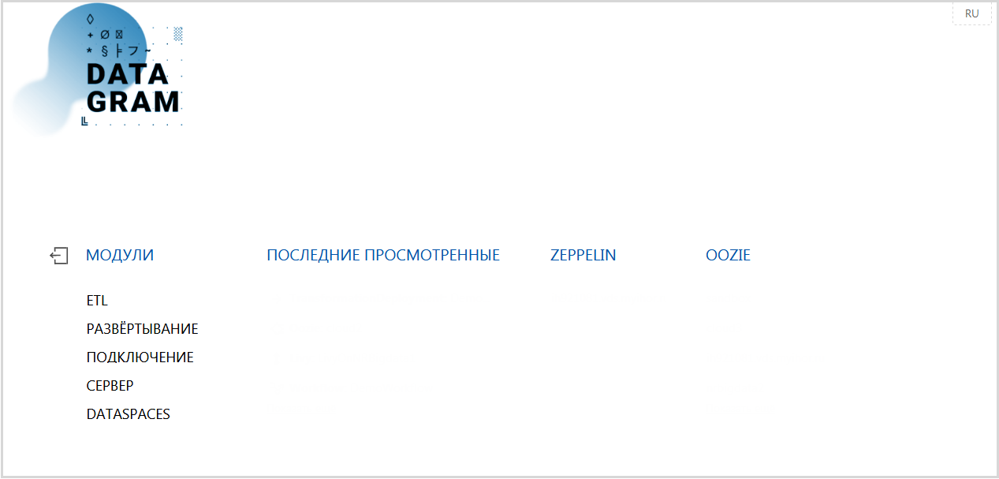

[TOC]

 

# Подготовка к установке

Перед началом установки Neoflex Datagram установите следующее ПО:

1. Hartoonworks Data Platform (http://hortonworks.com/products/data-center/hdp/) с компонентами:
   - HDFS;
   - Oozie;
   - Livy;
   - YARN;
   - Hive;
   - ZooKeeper.

> *Примечание.*
>
> *При установке Hartoonworks Data Platform необходимо сохранить (записать) путь к каталогу, в котором находится конфигурация Hadoop и путь к каталогу пользователя hdfs (на компьютере, а не в Hadoop).* 

2. PostgreSQL (https://www.postgresql.org). В PostgreSQL должны быть созданы:
   - База данных teneo (название базы может быть произвольным);
   - Пользователь, от имени которого Neoflex Datagram будет работать с базой данных. Пользователю должны быть заданы максимальные права доступа.

*Пример создания базы данных и пользователя.*

*CREATE DATABASE [db name]* – создание базы данных;

*CREATE USER [user name] WITH PASSWORD '[password]'* – создание пользователя;

*GRANT ALL privileges ON DATABASE [db name] TO [user name]* – назначение максимальных прав пользователю для работы с базой данных;

Для выхода используйте команду: *\q*

3. Maven (https://mvnrepository.com). Команда запуска установки для CentOS: *yum install maven*.

## Проверка наличия установленных программ

1. Проверьте, что в системе доступен сервер **Ambari**. Для этого в адресной строке браузера введите:

   `http://<ambarihost>:8080/#/main/dashboard/metrics`

   На экране должна появиться форма регистрации пользователя.

   

    Выполните вход в систему. По умолчанию для входа используются значения:

   ​	Username – admin;

   ​	Password – admin.

   В окне браузера отобразится главная страница сервера Ambari.

   

    Убедитесь, что установлены и запущены компоненты: HDFS, YARN, Hive, Oozie, ZooKeeper – названия данных компонентов отображаются на панели, расположенной в левой части экрана, и рядом с названием компонента установлена пиктограмма .

2. Проверьте, что Maven установлен при помощи команды: *mvn -version*.

 

# Установка программы

Представителями компании Neoflex поставляется каталог datagram с комплектом каталогов и файлов:

- mserver-*version number*-SNAPSHOT.jar;
- ldap.properties;
- mspace.dir.

Для установки программы выполните действия:

1. Скопируйте каталог datagram на компьютер, где будет развернута Neoflex Datagram. 

2. Отредактируйте файл ldap.properties:

   | Параметр      | Обязательно заполнять | Описание                                                     |
   | ------------- | --------------------- | :----------------------------------------------------------- |
   | ldap.domain   | Да                    | Доменное имя Ldap сервера.  *Для авторизации по LDAP используется userPrincipalName вида: username@domainname.com. Если поле не заполнено, то при авторизации необходимо указывать userPrincipalName полностью. Если domain указан, то допускается ввод только userName*  *Пример: ldap.domain=ldapServer.ru* |
   | ldap.host     | Да                    | Имя хоста Ldap сервера  *Пример: ldap.host=msk-ldserv1.company.ru* |
   | ldap.port     | Да                    | Порт Ldap сервера  *Пример: ldap.port=789*             |
   | ldap.base     | Да                    | Путь к каталогу для поиска пользователей  *Пример: ldap.base=CN=Users,DC=company,DC=ru* |
   | ldap.admin    | Да                    | Имя группы пользователей, которым будут предоставлены права администратора |
   | ldap.operator | Да                    | Имя группы пользователей, которым будут предоставлены права оператора |
   | ldap.user     | Да                    | Имя группы пользователей, которым будут предоставлены права пользователя |

   

3. Запустите файл mserver-*version number*-SNAPSHOT.jar при помощи стандартной команды запуска JAR-файлов Linux: **java -Dparameter=value ... -jar ${JAR_NAME}**, с указанием параметров. Каталог, указываемый в параметре -Dmspace.dir (см. таблицу "Параметры запуска") должен быть создан заранее. 

   *Пример:*

   *java -Xms2g -Xmx6g -Dfile.encoding=UTF-8 -Dmaven.home=/usr/share/maven -Dmspace.dir=/opt/datagram/mspace -Dteneo.url=jdbc:postgresql://cloud:1111/teneodev -Dteneo.user=postgres -Dteneo.password=pass -Dcust.code=dev.cloud -Dserver.port=8080 -jar /root/Setup/mserver-2.0-SNAPSHOT.jar*

**Параметры запуска**

| Параметр             | Обязательно заполнять | Описание                                                     |
| -------------------- | --------------------- | :----------------------------------------------------------- |
| -Xms2g               | Да                    | Минимальный объем ОЗУ                                        |
| -Xmx6g               | Да                    | Максимальный объем ОЗУ                                       |
| -Dfile.encoding      | Да                    | Всегда используется кодировка UTF-8                          |
| -Dmaven.home         | Да                    | Путь к инсталляции Maven (https://maven.apache.org/)         |
| -Dmspace.dir         | Да                    | Путь к каталогу программы  *Примечание.* *Каталог должен быть создан до запуска файла .jar* |
| -Ddeploy.dir         | Нет                   | Путь к каталогу, в котором хранятся ресурсы слоя сопровождения. Если параметр не задан, то каталог формируется по умолчанию: ${mspace.dir}/deployments/{cust.code} |
| -Dteneo.url          | Да                    | Url-адрес для подключения к БД репозитория метаданных        |
| -Dteneo.user         | Да                    | Имя пользователя для подключения к БД репозитория метаданных |
| -Dteneo.password     | Да                    | Пароль для подключения к БД репозитория метаданных           |
| -Dcust.code          | Нет                   | Код инсталляции (код клиента). По умолчанию: default         |
| -Dserver.port        | Нет                   | HTTP порт сервера метаданных                                 |
| -Dldap.config        | Нет                   | Путь к файлу конфигурации ldap                               |
| -Dpasswords          | Нет                   | Путь к файлу хранения паролей. По умолчанию: ${user.dir}/passwords.properties |
| -Ddencrypt.passwords | Нет                   | Опция шифрования паролей. Может принимать два значения: «false» (установлено по умолчанию) и true |

4. Запустите браузер и в адресной строке введите:

   **http://host:port/cim/ddesigner/build/index.html?**

   ,где **host** - хост сервера, на котором установлена программа, **port** - номер порта сервера.

   В окне браузера появится форма авторизации пользователя.   Для входа в программу укажите имя пользователя, пароль и нажмите кнопку **«Вход»**. На экране появится стартовое окно Neoflex Datagram. 

## Настройка Livy server

1. Перейдите в раздел "Сервер/Livy" и по кнопке  откройте форму создания сервера Livy.  

2. Заполните поля: 
**Название** - укажите название создаваемого объекта Livy Server (например: NewLivy). Названия объектов в программе должно удовлетворять правилам формирования идентификаторов в языке Java.

**URL** - Url-адрес Livy Server AP (пример: http://cloud.company.ru:8989).

**Каталог** - каталог, используемый для развертывания "Transformation" (пример: /user).

**Пользователь** - пользователь HDFS, от имени которого разворачиваются "Transformation"(пример: hdfs).

**WebHDFS** - Url-адрес HDFS API (пример: http://cloud3.company.ru:50070/webhdfs/v1).

**Количество исполнителей (executors)** - количество ядер, задействованных для реализации исполняющего процесса Spark (пример: 1).

**Использовать по умолчанию** - включите чекбокс. Для остальных настроек оставьте дефолтные значения.
 

3. Сохраните настройки кнопкой  . После сохранения настроек на экране отобразится консоль сервера Livy.  

4. Убедитесь, что установлено соединение с HDFS. Для этого откройте вкладку "Livy консоль HDFS" по кнопке (см. рисунок выше). Если соединение установлено, то на вкладке отобразится содержимое корневого каталога файловой системы. 

    

    