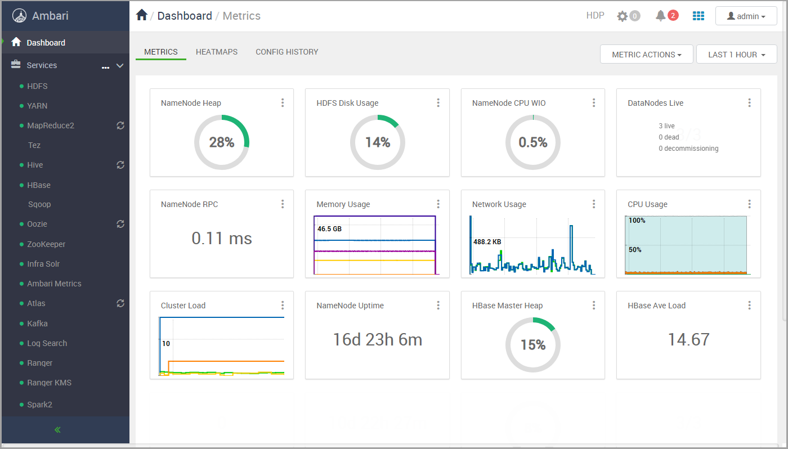

[TOC]

---

<a id= 'about_book'><a>

# О руководстве

В руководстве пользователя описаны возможности Datagram по разработке приложений для преобразования данных.

В главе «[Quick start](#quick_start)» представлен пример основных сценариев работы с программой:

-   Запуск Datagram;

-   Создание нового проекта;

-   Проектирование схемы преобразования данных;

-   Создание потока управления преобразованием данных и запуск приложения;

-   Контроль исполнения приложения и просмотр результата.

В главе «[Работа с программой](#work_with_the_program)» описаны:

-   Подготовка запуска приложения;

-   Интерфейс Datagram;

-   Подключение Datagram к базам данных внешних систем и настройки взаимодействия с исполняющими средами;

-   Элементы диаграмм трансформаций и потоков работ;

-   Запуск исполнения объектов Workflow по расписанию;

-   Дополнительные возможности программы.

В связи с непрерывно ведущимися работами по усовершенствованию программы, следует отметить, что описание программы может отличаться от того, что Вы увидите на экране.

# Описание Datagram

Datagram - это программная платформа предназначенная для разработки приложений по преобразованию данных. Datagram поддерживает как пакетный, так и потоковый режимы обработки данных.

Ядром платформы является сервер метаданных, который обеспечивает хранение и предоставляет инструменты управления хранилищами данных, преобразованиями данных, источниками и приемниками данных, исполняющими средами и т.д.

Datagram поддерживает полный цикл разработки приложений по преобразованию данных:

-   Визуальное проектирование схем преобразования данных;

-   Визуальное проектирование потоков управления преобразованиями данных;

-   Генерация исходного кода на языке Scala с библиотекой Apache Spark;

-   Компиляция и генерация приложения;

-   Развертывание приложения на исполняющей среде;

-   Планирование исполнения приложения;

-   Мониторинг исполнения приложения;

-   Инструменты для остановки и перезапуска приложений.

**Архитектура Datagram**

**Устройство программной платформы**

Программная платформа разработана на базе архитектуры, управляемой моделью (MDA). Для управления моделями применяется Eclipse Modelling Framework (EMF). Для сохранения моделей применяются PostgreSQL, Hibernate и Teneo. Для валидации моделей и трансформаций model-to-model (M2M) и model-to-text (M2T) применяется Eclipse Epsilon. Внутри платформы используются следующие типы моделей: Authentication, Relational, ETL, Runtime, DWH, UI, Metadata.

**Исполняющие среды**

Исполняющие среды Datagram базируются на Apache Spark.

Datagram может выполнять запуск приложений на серверах Apache Livy или Apache Oozie. На сервере Apache Livy запускаются приложения из сред разработки/отладки. Сервер Apache Oozie используется для запуска отлаженных приложений на рабочей среде.

**Дизайнер трансформаций**

Дизайнер трансформаций - интерфейс для визуальной разработки схем преобразования данных.

В дизайнере трансформаций поддерживается широкий спектр источников/приемников данных:

-   RDBMS источники/приемники данных использующие соединение JDBC (включая хранимые процедуры);

-   Иерархические источники/приемники: XML, AVRO и JSON;

-   Специфические форматы файловой системы HDFS: ORC, PARQUET;

-   Источники/приемники данных: CSV, Apache Hive, Apache Kafka.

Типы преобразований данных:

-   Широкий набор операций реляционной алгебры: join, sort, aggregation, union, selection, projections, pivot, explode arrays, sequence generation;

-   Специфические для Spark трансформации: Spark SQL - выполняет произвольные SQL запросы к потокам данных;

-   Алгоритмы машинного обучения с использованием Spark MLLib (decision trees, SVM, logistic regression и т.д.);

-   Jboss Rules (Drools) - система управления бизнес правилами.

Основные возможности:

-   Поддержка типов данных полей: STRING, DECIMAL, INTEGER, DATE, TIME, DATETIME, BINARY, BOOLEAN, LONG, FLOAT, DOUBLE;

-   Поддержка типов данных STRUCT и ARRAY;

-   Отслеживание происхождения полей потока данных;

-   Частичное выполнение преобразования с просмотром промежуточных результатов;

-   Просмотр сгенерированного кода приложения, его редактирование и запуск на исполнение;

-   Валидация трансформации на основе базы данных часто повторяемых ошибок;

-   Поддержка Spark Catalyst Optimizer.

**Дизайнер Workflow**

Дизайнер Workflow - интерфейс для визуальной разработки потоков управления последовательностями преобразований данных.

Основные возможности:

-   Создание потоков управления для параллельного или последовательного исполнения преобразований данных, а также потоков управления с возможностью настройки условий для запуска преобразований;

-   Универсальные элементы управления преобразованиями: shell scripts и java scripts;

-   Возможность создания потоков управления последовательностями преобразований с использованием вложенных объектов Workflow;

-   Возможность настройки исполнения Workflow по расписанию или по событиям файловой системы.

**Безопасность**

-   Централизованная аутентификация пользователей с использованием корпоративного сервера каталогов (LDAP);

-   Ролевая авторизация. Возможные роли: developer, operator, viewer;

-   Шифрование паролей доступа к внешним системам;

-   Использование алгоритма аутентификации Kerberos для подключения к исполняющим средам.

**Версионность и teamwork**

-   Блокировка одновременных обновлений;

-   Интеграция Apache Subversion;

-   Поддержка иерархии проектов;

-   Синхронизация с системой контроля версий TortoiseSVN для выбранного объекта или проекта;

-   Защищенный от обновлений код (определяемый пользователем) сохраняется при обновлении версии метаданных.

**Поддержка рабочих сред**

Поддержка цикла разработки: разработка-\>тестирование-\>Запуск на рабочей среде.

-   Импорт/экспорт метаданных;

-   Перенос метаданных между средами как полный, так и отдельного проекта;

-   Перезапись URL-адресов, паролей и т.д. при переносе в новую среду.

**Дополнительные инструменты**

- Консоль HDFS: просмотр, сохранение файлов из/в файловой системы HDFS;

- Консоль Livy: просмотр задач на сервере Livy, просмотр журналов, отмена задачи;

- Консоль Oozie: обзор задач workflow и координатора на сервере Oozie, просмотр журналов, отмена или перезапуск задач;

- Обозреватель объектов: просмотр дерева объектов метаданных.

  

#Установка Datagram

 

## Подготовка к установке

Перед началом установки Datagram установите следующее ПО:

1. Hartoonworks Data Platform (http://hortonworks.com/products/data-center/hdp/) с компонентами:
   - HDFS;
   - Oozie (не ниже версии 4.3.1);
   - Livy (не ниже версии 0.5);
   - Spark (не ниже версии 2.2);
   - YARN;
   - Hive;
   - ZooKeeper.

> *Примечание.*
>
> *При установке Hartoonworks Data Platform необходимо сохранить (записать) путь к каталогу, в котором находится конфигурация Hadoop и путь к каталогу пользователя hdfs (на компьютере, а не в Hadoop).* 

2. PostgreSQL (https://www.postgresql.org). В PostgreSQL должны быть созданы:
   - База данных teneo (название базы может быть произвольным);
   - Пользователь, от имени которого Datagram будет работать с базой данных. Пользователю должны быть заданы максимальные права доступа.

*Пример создания базы данных и пользователя.*

*CREATE DATABASE [db name]* – создание базы данных;

*CREATE USER [user name] WITH PASSWORD '[password]'* – создание пользователя;

*GRANT ALL privileges ON DATABASE [db name] TO [user name]* – назначение максимальных прав пользователю для работы с базой данных;

Для выхода используйте команду: *\q*

3. Maven (https://mvnrepository.com). Команда запуска установки для CentOS: *yum install maven*.

## Проверка наличия установленных программ

1. Проверьте, что в системе доступен сервер **Ambari**. Для этого в адресной строке браузера введите:

   `http://<ambarihost>:8080/#/main/dashboard/metrics`

   На экране должна появиться форма регистрации пользователя.

   

    Выполните вход в систему. По умолчанию для входа используются значения:

   ​	Username – admin;

   ​	Password – admin.

   В окне браузера отобразится главная страница сервера Ambari.

   

    Убедитесь, что установлены и запущены компоненты: HDFS, YARN, Hive, Oozie, ZooKeeper – названия данных компонентов отображаются на панели, расположенной в левой части экрана, и рядом с названием компонента установлена пиктограмма .

2. Проверьте, что Maven установлен при помощи команды: *mvn -version*.

## Настройка Spark

Откройте главную страницу Ambari и на панели со списком компонентов выберите пункт Spark2. На
появившейся странице выберите CONFIGS и в фильтре введите значение extra.

1. В поле spark.driver.extraClassPath установите значение: /var/lib/neoflex/share/neoflexlib/*
2. В поле spark.executor.extraClassPath установите значение: /var/lib/neoflex/share/neoflexlib/*
3. Сохраните изменения кнопкой "SAVE".

 

## Установка программы

**На компьютере, где будет производится установка, должен быть доступ к сети Интернет.**

Представителями компании Neoflex поставляется каталог datagram, содержащий:

- mserver-*version number*-SNAPSHOT.jar;
- ldap.properties;
- mspace.dir.

Для установки программы выполните действия:

1. Скопируйте каталог datagram на компьютер, где будет развернута Datagram. 

2. Отредактируйте файл ldap.properties:

   | Параметр      | Обязательно заполнять | Описание                                                     |
   | ------------- | --------------------- | :----------------------------------------------------------- |
   | ldap.domain   | Да                    | Доменное имя Ldap сервера.  *Для авторизации по LDAP используется userPrincipalName вида: username@domainname.com. Если поле не заполнено, то при авторизации необходимо указывать userPrincipalName полностью. Если domain указан, то допускается ввод только userName*  *Пример: ldap.domain=ldapServer.ru* |
   | ldap.host     | Да                    | Имя хоста Ldap сервера  *Пример: ldap.host=msk-ldserv1.company.ru* |
   | ldap.port     | Да                    | Порт Ldap сервера  *Пример: ldap.port=789*             |
   | ldap.base     | Да                    | Путь к каталогу для поиска пользователей  *Пример: ldap.base=CN=Users,DC=company,DC=ru* |
   | ldap.admin    | Да                    | Имя группы пользователей, которым будут предоставлены права администратора |
   | ldap.operator | Да                    | Имя группы пользователей, которым будут предоставлены права оператора |
   | ldap.user     | Да                    | Имя группы пользователей, которым будут предоставлены права пользователя |

   

3. Запустите файл mserver-*version number*-SNAPSHOT.jar при помощи стандартной команды запуска JAR-файлов Linux: **java -Dparameter=value ... -jar ${JAR_NAME}**, с указанием параметров. Каталог, указываемый в параметре -Dmspace.dir (см. таблицу "Параметры запуска") должен быть создан заранее. 

   *Пример:*

   *java -Xms2g -Xmx6g -Dfile.encoding=UTF-8 -Dmaven.home=/usr/share/maven -Dmspace.dir=/opt/datagram/mspace -Dteneo.url=jdbc:postgresql://cloud:1111/teneodev -Dteneo.user=postgres -Dteneo.password=pass -Dcust.code=dev.cloud -Dserver.port=8080 -jar /root/Setup/mserver-2.0-SNAPSHOT.jar*

**Параметры запуска**

| Параметр             | Обязательно заполнять | Описание                                                     |
| -------------------- | --------------------- | :----------------------------------------------------------- |
| -Xms2g               | Да                    | Минимальный объем ОЗУ                                        |
| -Xmx6g               | Да                    | Максимальный объем ОЗУ                                       |
| -Dfile.encoding      | Да                    | Всегда используется кодировка UTF-8                          |
| -Dmaven.home         | Да                    | Путь к инсталляции Maven (https://maven.apache.org/)         |
| -Dmspace.dir         | Да                    | Путь к каталогу программы  *Примечание.* *Каталог должен быть создан до запуска файла .jar* |
| -Ddeploy.dir         | Нет                   | Путь к каталогу, в котором хранятся ресурсы слоя сопровождения. Если параметр не задан, то каталог формируется по умолчанию: ${mspace.dir}/deployments/{cust.code} |
| -Dteneo.url          | Да                    | Url-адрес для подключения к БД репозитория метаданных        |
| -Dteneo.user         | Да                    | Имя пользователя для подключения к БД репозитория метаданных |
| -Dteneo.password     | Да                    | Пароль для подключения к БД репозитория метаданных           |
| -Dcust.code          | Нет                   | Код инсталляции (код клиента). По умолчанию: default         |
| -Dserver.port        | Нет                   | HTTP порт сервера метаданных                                 |
| -Dldap.config        | Нет                   | Путь к файлу конфигурации ldap                               |
| -Dpasswords          | Нет                   | Путь к файлу хранения паролей. По умолчанию: ${user.dir}/passwords.properties |
| -Ddencrypt.passwords | Нет                   | Опция шифрования паролей. Может принимать два значения: «false» (установлено по умолчанию) и true |

4. Запустите браузер и в адресной строке введите:

   **http://host:port/cim/ddesigner/build/index.html?**

   ,где **host** - хост сервера, на котором установлена программа, **port** - номер порта сервера.

   В окне браузера появится форма авторизации пользователя.   Для входа в программу укажите имя пользователя, пароль и нажмите кнопку **«Вход»**. На экране появится стартовое окно Datagram. 

### Настройка Livy server

1. Перейдите в раздел "Сервер/Livy" и по кнопке  откройте форму создания сервера Livy.  

2. Заполните поля: 
**Название** - укажите название создаваемого объекта Livy Server (например: NewLivy). Названия объектов в программе должно удовлетворять правилам формирования идентификаторов в языке Java.

**URL** - Url-адрес Livy Server AP (пример: http://cloud.company.ru:8989).

**Каталог** - каталог, используемый для развертывания "Transformation" (пример: /user).

**Пользователь** - пользователь HDFS, от имени которого разворачиваются "Transformation"(пример: hdfs).

**WebHDFS** - Url-адрес HDFS API (пример: http://cloud3.company.ru:50070/webhdfs/v1).

**Количество исполнителей (executors)** - количество ядер, задействованных для реализации исполняющего процесса Spark (пример: 1).

**Использовать по умолчанию** - включите чекбокс. Для остальных настроек оставьте дефолтные значения.
 

3. Сохраните настройки кнопкой  . После сохранения настроек на экране отобразится консоль сервера Livy.  

4. Убедитесь, что установлено соединение с HDFS. Для этого откройте вкладку "Livy консоль HDFS" по кнопке (см. рисунок выше). Если соединение установлено, то на вкладке отобразится содержимое корневого каталога файловой системы.  

     

# Quick start

## Создание нового проекта

В разделе интерфейса «**ETL/Project**» создайте объект **Project**  с названием **«DemoProject»** (остальные поля оставьте пустыми).

> *Примечание.*
>
> *Атрибуты объектов **Project** описаны в разделе руководства «[Группировка объектов программы](#grouping_program_objects)».*

Объект **«DemoProject»** необходимо создать, чтобы в дальнейшем привязать к нему объекты **Transformation** и **Workflow**, тем самым объединив их в группу. В последующем данную группу объектов можно будет переносить между программными средами.

## Создание и настройка трансформации

> *Внимание!*
>
> *Для выполнения действий, описанных далее, необходимо чтобы в программе были настроены [подключения к базе данных внешней системы](#connecting_to_the_db_of_external_systems) и [исполняющим средам](#connecting_to_the_runtime_environments).*

*В разделе рассмотрен пример создания объекта **Transformation**, для переноса данных из CSV файла в файлы формата JSON.*

*Предварительно, в файловой системе HDFS, создайте файл-источник данных Demo.txt:*

*1,Иванов,1000.00*

*2,Петров,1200.00*

*3,Сидоров,1250.00*

В разделе **"ETL/Transformation"** создайте объект с атрибутами:

-   **Name** - **DemoTransformation**;

-   **Label** - **DemoLabelTransformation**;

-   **Project** - из списка выберите ранее созданный объект «**DemoProject**».

> *Примечание.*
>
> *Атрибуты объектов **Transformation** описаны в разделе «[Объекты Transformation](#transformation_objects)».*

**Настройка и запуск трансформации** 

Кнопкой  откройте дизайнер трансформаций. В дизайнере трансформаций перетащите элементы **CSV source** и **Local target** в рабочую область и укажите направление процесса переноса данных, как показано на рисунке ниже.

> *На заметку.*
>
> *При переносе элементов в рабочую область, программа автоматически задаст им названия.*

Кликните по элементу «**CSV_source1**», чтобы открыть панель свойств.

Для элемента «**CSV_source1**» установите следующие настройки:

- В поле **Path** укажите путь к файлу, из которого будут переноситься данные (например: /user/Demo.txt);

- В группе **CSV** в поле **Delimeter** введите символ, который служит разделителем значений в файле-источнике (в примере это запятая);

- В группе **OUT PORT->Fields** добавьте три поля:

  **id - Integer**

  **name - string**

  **salary - decimal**

- Для остальных настроек оставьте дефолтные значения.

Настройте элемент «**Local_target2**»:

- В списке **Local file format** выберите **JSON**;

- В поле **local file name** укажите каталог, в который будет записан результат трансформации (пример: /user/demo/demo.json);

- В поле **Input fields mapping** настройте соответствие полей:

  **ID - id**

  **NAME - name**

  **SALARY - salary**

-   В поле **Partitions** добавьте каталог **id**, который будет входить в каталог **demo.json**;
-   Для остальных настроек оставьте значения, которые были заданы программой автоматически.

> *Примечание.*
>
> *Элементы диаграмм трансформаций описаны в разделе «[Элементы диаграмм трансформаций](#elements_of_transformation_diagrams)».*

Сохраните настройки кнопкой . Откройте список операций кнопкой и запустите операцию **"Проверить"** для автоматической проверки синтаксиса трансформации. Если действия инструкции выполнены правильно, то программа не обнаружит ошибок.

> *На заметку.*
>
> *В случае обнаружения программой ошибок проверьте код трансформации, для этого воспользуйтесь [редактором исходного кода](#code_editor).* 

Выполните операцию **"Запустить"** для запуска исполнения трансформации. После запуска объекта на исполнение, в разделе интерфейса **"Развертывание/Transformation Deployment"** будет создан объект с названием «**autogenerated_tr_DemoTransformation**», который выполнит развертывание и запуск исполнения «**DemoTransformation**» на исполняющей среде Livy Server. 

> *На заметку.*
>
> *По кнопке  можно создать новый объект Transformation Deployment.*
>
> *Атрибуты объектов **Transformation Deployment** описаны в разделе «[Объекты Transformation Deployment](#rtTransformationDeployment)».*

Дождитесь окончания исполнения трансформации - на экране появится сообщение:

- В случае успешного исполнения трансформации, на экране появится окно с сообщением: «Ок».

- Если в ходе исполнения объекта возникнет ошибка, то на экране появится окно с текстом, описывающим ошибку.

    

### Просмотр результата преобразования данных

Чтобы просмотреть файлы, полученные в результате исполнения трансформации, перейдите в интерфейс **консоли HDFS**. Для этого перейдите в раздел **"Сервер/Livy"**, в списке выберите сервер на котором разворачивалась трансформация. На открывшейся странице нажмите кнопку  и в списке выберите пункт **"Консоль HDFS"**. В консоли перейдите в каталог, который создан в результате выполнения трансформации (данный каталог указывался в настройках элемента "Local_target2" в поле "local file name").

 

## Создание и настройка потока работ

Создаваемый объект **Workflow** будет выполнять следующие действия:

1.  Запускать трансформацию «DemoTransformation»;

2.  Анализировать ее выполнение:

-   При успешном выполнении трансформации процесс будет завершен;

-   При обнаружении ошибки процесс будет прерван.

В разделе **"ETL/Workflow"** создайте объект с атрибутами:

-   **Name** - **DemoWorkflow**;

-   **Label** - **DemoLabel**;

-   **Project** - из списка выберите ранее созданный объект **DemoProject**.

> *Примечание.*
>
> *Атрибуты объектов **Workflow** описаны в разделе «[Объекты Workflow](#etlWorkflow)».*

**Настройка диаграммы потока работ**

Кнопкой  откройте дизайнер потока работ. В рабочую область дизайнера перетащите элементы **Start**, **End**, **Transformation** и **Kill**. Укажите направление потоков управления, как показано на рисунке ниже.

Настройте элементы схемы:

- Для элемента «**transformation**» в поле «**transformation**» выберите значение «**DemoTransformation**», в остальных полях оставьте дефолтные значения;
- В настройках элемента «**kill**» в поле «**message**» укажите текст сообщения об ошибке, например: «**Ошибка! Процесс остановлен**». В остальных полях оставьте значения, которые были заданы программой автоматически.

>  *Примечание.*
>
>  *Элементы диаграмм потоков работ описаны в разделе «[Элементы диаграмм объектов Workflow](#elements_of_workflow_diagrams)».*

Сохраните настройки кнопкой . Откройте список операций кнопкой и запустите операцию **"Проверить"**, программа автоматически проверит синтаксис настроенной диаграммы объекта «**DemoWorkflow**». Если проверка прошла успешно (это должно быть именно так, если действия, описанные в инструкции, выполнены правильно), то запустите объект на исполнение (операция **"Запустить"**)

После запуска объекта на исполнение, в разделе интерфейса «**Развертывание/Workflow Deployment**» будет создан объект «**autogenerated\_wf\_DemoWorkflow**», который развернет и запустит исполнение «**DemoWorkflow**» на исполняющей среде Oozie.

> *На заметку.*
>
> *По кнопке  можно создать новый объект Workflow Deployment.*
>
> *Атрибуты объектов **Workflow Deployment** описаны в разделе «[Объекты Workflow Deployment](#rtWorkflowDeployment)».*

Дождитесь окончания исполнения объекта - на экране появится сообщение:

- В случае успешного исполнения, на экране появится окно с сообщением: «Ок».

- Если в ходе исполнения объекта возникнет ошибка, то на экране появится окно с текстом, описывающим ошибку.

     

## Инструменты запуска приложений и мониторинга

Запуск исполнения объектов Workflow или Transformation выполняется приложением Meta Server и состоит из фаз:

1. Генерация исходных файлов;
2. Компиляция задачи;
3. Развертывание задачи на исполняющей среде;
4. Запуск исполнения задачи через планировщик задач (Oozie или Livy Server);
5. Выполнение задачи на исполняющей среде.

**Фазы 1, 2, 3** выполняются приложением Meta Server .

**Фаза 4** выполняется приложением Meta Server через планировщик задач Spark - Oozie или Livy Server.

**Фаза 5** выполняется в Hadoop.

Для мониторинга процессов в Datagram используются инструменты:

- **Logger** - отображает в реальном времени логи работы приложения Meta Server (фазы 1, 2, 3 и начало 4).
- **Консоли Livy и Oozie** - в интерфейсах консолей выводятся данные о результатах исполнения конкретных объектов Transformation и Workflow на исполняющих средах Hartoonworks Data Platform (фаза 5).

 

# Работа с программой

 

## Подключение Datagram к базам данных внешних систем

Для подключения Datagram к базе данных внешней системы необходимо создать и настроить объекты:

-   [JDBC Connection](#jdbcconnection_objects);
-   [Software System](#softwaresystem_objects);
-   [Deployment](#deployment_objects);
-   [Scheme](#scheme_objects);
-   [JDBC Context](#jdbccontext_objects).

### Объекты "JDBC Connection" 

Объекты **"JDBC Connection"** хранят параметры подключения к базам данных внешнних систем.

Настройка объектов выполняется в разделе интерфейса **«Подключение/JDBC Connection»**.

**Описание атрибутов объектов "JDBC Connection"**

| Атрибут              | Обязательно  заполнение | Описание             |
| -------------------- | :------------------------: | :------------------- |
| Name                 | Да                         | Название объекта.  При указании имени необходимо учитывать, что оно должно удовлетворять правилам формирования идентификаторов в языке Java   *Пример: DemoJdbcConnection* |
| Project              | Нет                        | Проект, к которому привязан объект "JDBC Connection"    *Пример: DemoProject* |
| Url                  | Да                         | Url-адрес для подключения к базе данных внешней системы    *Пример: jdbc:oracle:thin:@192.168.0.198:1522* |
| Scheme               | Да                         | scheme в терминах JDBC |
| Catalog              | Нет                        | catalog в терминах JDBC |
| User                 | Да                         | Имя пользователя, используемое для подключения к базе данных внешней системы    *Пример: system* |
| Password             | Нет                        | Пароль, используемый для подключения к базе данных внешней системы.  *Рекомендуется использовать скрытый способ хранения паролей (см. раздел «[Хранение паролей в системе](#storing_and_encrypting_passwords)»)* |
| Driver               | Да                         | Название драйвера для подключения к базе данных.  Название используемого драйвера зависит от типа и версии БД, к которой выполняется подключение    *Пример: oracle.jdbc.driver.OracleDriver* |

**Операции, доступные для объектов "JDBC Connection"**

| Название операции | Описание |
| ----------------- | :------- |
|  Протестировать   | Операция выполняет проверку соединения с базой данных внешней системы |

 

### Объекты "Software System"

**"Software System"** - объекты, описывающие внешние системы, к базам данных которых подключается Datagram.

Действия с объектами **"Software System"** выполняются в разделе интерфейса **«Подключение/Software System»**.

**Описание атрибутов объектов "Software System"**

| Атрибут              | Обязательно  заполнение | Описание |
| -------------------- | :------------------------: | :------------------- |
| Name                 | Да                         | Название объекта.  При указании имени необходимо учитывать, что оно должно удовлетворять правилам формирования идентификаторов в языке Java и не содержать подчеркиваний   *Пример: DemoSoftwareSystem* |
| Project              | Нет                        | Проект, к которому привязан объект "Software System"  *Пример: DemoProject* |
| Scheme               | Нет                        | Название объекта "Scheme", описывающего базу данных внешней системы (см. раздел "[Объекты "Scheme"](#scheme_objects)") |
| Default Deployment   | Нет                        | Объект "Deployment", к которому привязан объект "Software System"   *Пример: DemoDeployment* |

**Операции, доступные для объектов "Software System"**

| Название операции | Описание |
| ----------------- | :------- |
| Обновить схему    | При запуске операции считываются метаданные БД внешней системы. На основе полученных метаданных обновляется привязанный объект "Scheme", либо генерируется новый и сохраняется в разделе интерфейса «Подключение/Scheme», одновременно данный объект "Scheme" привязывается к объекту "Software System", из которого запускалась операция |

### Объекты "Deployment"

**"Deployment"** - это объекты, обеспечивающие связь между объектами **"Software System"** и **"JDBC Connection"**.

Действия с объектами **"Deployment"** выполняются в разделе интерфейса **«Подключение/Deployment»**.

**Описание атрибутов объектов "Deployment"**

| Атрибут           | Обязательно  заполнение | Описание                                                     |
| ----------------- | :------------------------: | :----------------------------------------------------------- |
| Name              |             Да             | Название объекта.  При указании имени необходимо учитывать, что оно должно удовлетворять правилам формирования идентификаторов в языке Java   *Пример: DemoDeployment* |
| Project           |            Нет             | Проект, к которому привязан объект "Deployment"   *Пример: DemoProject* |
| Connection        |            Нет             | Объект "JDBC Connection", который привязан к объекту "Deployment"   *Пример:Demo_JdbcConnection* |
| Software System   |            Нет             | Объект "Software System", который привязан к объекту "Deployment"   *Пример: DemoSoftwareSystem* |
| Load Stored Procs |            Нет             | При включении параметра, программа будет выполнять загрузку метаданных по хранимым процедурам |

**Операции, доступные для объектов "Deployment"**

| Название операции | Описание |
| ----------------- | :------- |
| Обновить схему    | Операция посредством объекта "JDBC Connection", который указан в атрибутах объекта "Deployment", считывает метаданные БД внешней системы. На основе полученных метаданных обновляет имеющийся объект "Scheme", либо генерирует новый и сохраняет его в разделе интерфейса «Подключение/Scheme». Далее привязывает (обновленный или созданный) объект "Scheme" к объекту "Software System", выбранному в настройках объекта "Deployment" |

 

### Объекты "Scheme"

Объекты **"Scheme"** хранят следующую информацию о базе данных внешней системы:

-   **views** - список динамически формируемых таблиц;

-   **tables** - список таблиц базы данных;

-   **Stored Procedures** - список хранимых процедур БД.

Данные объекты могут быть созданы:

-   **Автоматически** - при выполнении команды "Обновить схему" объектов "Software System" или "Deployment";

-   **Вручную** - в разделе интерфейса **"Подключение/Scheme"**.

 

### Объекты "Jdbc Context"

**"Jdbc Context"** - это объекты, обеспечивающие выбор подключения к базе данных внешней системы в настройках элементов дизайнера трансформаций (см. раздел «[Элементы диаграмм трансформаций](#elements_of_transformation_diagrams)»).

Действия с объектами **Jdbc Context** выполняются в разделе интерфейса **«ETL/Jdbc Context»**.

**Описание атрибутов объектов "Jdbc Context"**

| Атрибут              | Обязательно  заполнение | Описание          |
| -------------------- | :------------------------: | :---------------- |
| Name                 | Да                         | Название объекта. При указании имени необходимо учитывать, что оно должно соответствовать названию объекта SoftwareSystem и не должно содержать подчеркиваний   *Пример: DemoSoftwareSystem* |

 

## Подключение Datagram к исполняющим средам

В зависимости от выполняемой задачи (выполнение преобразований или управление потоком работ по преобразованию данных), Datagram может взаимодействовать с одной из исполняющих сред:

-   [**Oozie**](http://oozie.apache.org/docs/4.2.0/) - исполняет объекты Workflow;

-   [**Livy Server**](https://hortonworks.com/blog/livy-a-rest-interface-for-apache-spark/) - исполняет объекты Transformation.

Для взаимодействия с исполняющими средами в программе Datagram должны быть созданы и настроены объекты:

-   [Oozie](#oozie_objects);
-   [Workflow Deployment](#workflowdeployment_objects);
-   [Livy Server](#livyserver_objects) (работает со Spark версии 2.Х и выше);
-   [Transformation Deployment](#transformationdeployment_objects);
-   [Coordinator Deployment](#coordinatordeployment_objects) - для развертывания заданий [планировщика задач Oozie](#scheduled_execution_of_the_created_workflow_objects).

 

### Объекты "Oozie"

Объекты **"Oozie"** хранят параметры подключения к серверу Oozie и управления исполняющей средой.

Действия с объектами **"Oozie"** выполняются в разделе интерфейса **«Сервер/Oozie»**.

**Описание атрибутов объектов "Oozie"**

| Атрибут              | Обязательно заполнение | Описание             |
| -------------------- | :-----------------------: | :------------------- |
| Name                 | Да                        | Название объекта "Oozie".  При указании имени необходимо учитывать, что оно должно удовлетворять правилам формирования идентификаторов в языке Java  *Пример: DemoOozie* |
| Project              | Нет                       | Проект, к которому привязан объект "Oozie"   *Пример: DemoProject* |
| Job Traсker          | Да                        | Url-адрес Job Tracker   *Пример: cloud.neo.ru:8050* |
| Name Node            | Да                        | Параметры доступа к файловой системе HDFS   *Пример: hdfs://cloud.neo.ru:8020* |
| Master               | Да                        | Url-адрес для подключения к кластеру ([подробное описание](https://spark.apache.org/docs/latest/submitting-applications.html#master-urls))  *Пример: spark://192.168.2.65:5310, local\[4\]* |
| Mode                 | Нет                       | Атрибут определяет вариант развертывания драйвера Spark: **client** (по умолчанию) - на локальной машине в качестве внешнего клиента; **cluster** - на рабочем узле; **yarn** - YARN кластер. Конфигурация кластера задается переменными окружения |
| is Default           | Нет                       | При включенном параметре, объект "Oozie" будет использоваться по умолчанию при запуске на исполнение объектов "Workflow".  *В случае если в Datagram создано несколько объектов "Oozie", и у всех включен параметр is default, то для исполнения объекта "Workflow", объект "Oozie" будет выбран случайно* |
| Spark 2              | Нет                       | Параметр требует включения, если используется Spark версии 2.1 и выше |
| Аутентификация       | Нет                       | При включенном параметре для подключения к серверу Spark будет использоваться алгоритм аутентификации Kerberos |
| Путь к keytab        | Нет                       | Путь к файлу, в котором хранятся пароли principal |
| User Principal       | Нет                       | Principal, под которым авторизуется Meta Server |
| HCAT URL             | Нет                       | Url-адрес Hive metastore |
| HCAT Principal       | Нет                       | Principal, под которым авторизуется Hive |
| Num Executors        | Да                        | Количество исполняющих процессов Spark  *Пример: 5* |
| Executor Cores       | Да                        | Количество ядер, задействованных для реализации исполняющего процесса Spark  *Пример: 2* |
| Driver Memory        | Да                        | Объем памяти, используемый для инициализации SparkContext  *Пример: 512m, 2g* |
| Executor Memory      | Да                        | Объем памяти, используемый для каждого исполняющего процесса Spark  *Пример: 512m, 2g* |
| Queue                | Нет                       | YARN очередь, в которой будет выполняться задача |
| Retry Max            | Нет                       | Количество попыток запуска на исполнение задачи Spark  *Пример: 5* |
| Retry Interval       | Нет                       | Временной интервал между попытками запуска на исполнение задачи Spark  *Пример: 10* |
| Cred | Нет | Учетные данные реализаций ([подробнее](https://oozie.apache.org/docs/4.2.0/DG_ActionAuthentication.html#Built-in_Credentials_Implementations)) |
| Sftp                 | Нет                       | Параметр не используется.   Sftp-адрес сервера, на котором разворачиваются артефакты объектов "Workflow"  *Пример: sftp://192.168.2.44* |
| Http                 | Да                        | Url-адрес Oozie API  *Пример: http://cloud.neo.ru:12000* |
| Webhdfs              | Нет                       | Url-адрес HDFS API  *Пример: http://cloud3.neo.ru:50070/webhdfs/v1* |
| Home                 | Да                        | Каталог в HDFS, используемый для развертывания "Workflow"  *Пример: /user* |
| User                 | Да                        | Пользователь HDFS, от имени которого разворачиваются "Workflow"  *Пример: hdfs* |
| Files Browser Util   | Нет                       | Url web-консоли Hadoop |

### Объекты "Workflow Deployment" 

Объекты **"Workflow Deployment"** создают комплект файлов, описывающих "Workflow", передают их на сервер Oozie и запускают исполнение.

Действия с объектами **"Workflow Deployment"** выполняются в разделе интерфейса **«Развертывание/Workflow Deployment»**.

> *На заметку.*
>
> *В списке могут присутствовать объекты **"Workflow Deploement"** с названием **«autogenerated_[workflow name]»**. Данные объекты создаются автоматически при запуске на исполнение объектов **"Workflow"** без указания конкретного объекта "Workflow Deployment".*

**Описание атрибутов объектов "Workflow Deploement"**

| Атрибут              | Обязательно заполнение | Описание    |
| -------------------- | :-----------------------: | :---------- |
| Name                 | Да                        | Название объекта. При указании имени необходимо учитывать, что оно должно удовлетворять правилам формирования идентификаторов в языке Java  *Пример: DemoWorkflowDeployment* |
| Project              | Нет                       | Проект, к которому привязан объект "Workflow Deployment"  *Пример: DemoProject* |
| Oozie                | Нет                       | Объект "Oozie", описывающий подключение к серверу на котором исполняется объект "Workflow Deploement"  *Пример: DemoOozie* |
| Deployments          | Нет                       | Список объектов "Deployment", при помощи которых осуществляется доступ к базам данных внешних систем  *Пример: DemoDeployment* |
| Start                | Нет                       | Разворачиваемый объект Workflow |
| Debug                | Нет                       | При включенном параметре создаются файлы с промежуточным результатом трансформации |
| Slide Size           | Нет                       | Количество данных, которое единовременно записывается в Jdbc приемник данных  *Пример: 500* |
| Reject Size          | Нет                       | Максимально допустимое количество ошибок при записи данных в Jdbc приемник данных. При превышении установленного значения, выполнение трансформации будет принудительно завершено  *Пример: 1000* |
| Fetch Size           | Нет                       | Количество данных, которое единовременно считывается из Jdbc источника данных  *Пример: 100000* |
| Partition Num        | Нет                       | Количество рабочих процессов, исполняемых при записи данных в Jdbc приемник данных  *Пример: 4* |
| Master               | Да                        | Url-адрес для подключения к кластеру ([подробное описание](https://spark.apache.org/docs/latest/submitting-applications.html)) *Данная настройка объекта "Workflow Deployment" имеет приоритет над аналогичной настройкой объекта "Oozie"*  *Пример: spark://192.168.2.65:5310, local[4]* |
| Mode                 | Нет                       | Атрибут определяет вариант развертывания драйвера Spark: **client** (по умолчанию) - на локальной машине в качестве внешнего клиента; **cluster** - на рабочем узле; **yarn** - YARN кластер. Конфигурация кластера задается переменными окружения *Данная настройка объекта "Workflow Deployment" имеет приоритет над аналогичной астройкой объекта "Oozie"* |
| Num Executors        | Нет                       | Количество исполняющих процессов Spark *Данная настройка объекта "Workflow Deployment" имеет приоритет над аналогичной настройкой объекта "Oozie"*  *Пример: 5* |
| Executor Cores       | Нет                       | Количество ядер, задействованных для реализации исполняющего процесса Spark *Данная настройка объекта "Workflow Deployment" имеет приоритет над аналогичной настройкой объекта "Oozie"*  *Пример: 2* |
| Driver Memory        | Нет                       | Объем памяти, используемый для инициализации SparkContext *Данная настройка объекта "Workflow Deployment" имеет приоритет над аналогичной настройкой объекта "Oozie"*  *Пример: 512m, 2g* |
| Executor Memory      | Нет                       | Объем памяти, используемый для каждого исполняющего процесса Spark *Данная настройка объекта "Workflow Deployment" имеет приоритет над аналогичной настройкой объекта "Oozie"*  *Пример: 512m, 2g* |
| Jvm Opts             | Нет                       | Опции Java Virtual Machine |
| Persist On Disk      | Нет                       | Если параметр включен, то при выполнении операции Check Point будет происходить сохранение промежуточных данных на диск, а не в память |
| Dynamic Allocation   | Нет                       | При помощи данного параметра можно включить механизм распределения ресурсов в зависимости от рабочей нагрузки (по умолчанию выключено) |

**Описание параметров объектов "Workflow Deployment"**

| Параметр    | Обязательно заполнение | Описание |
| ----------- | :-----------------------: | :------- |
| Name        | Да                        | Название параметра |
| Expression  | Нет                       | Не используется для объектов "Workflow Deployment" |
| Description | Нет                       | Описание параметра |

**Описание опций Spark**

| Параметр | Обязательно заполнение | Описание |
| -------- | :-----------------------: | :------- |
| Name     | Да                        | Название опции |
| Value    | Нет                       | Значение опции |

**Операции, доступные для объектов "Workflow Deployment"**

| Название операции           | Описание                                                     |
| --------------------------- | :----------------------------------------------------------- |
| Проверить                   | Datagram выполняет проверку корректности объекта "Workflow" и привязанных объектов "Transformation" |
| Сгенерировать               | Операция генерирует файлы XML, описывающие объект "Workflow", и код на языке Scala, описывающий связанные c объектом "Workflow" объекты "Transformation" |
| Собрать                     | При выполнении операции происходит компиляция JAR-файлов из кода языка Scala, описывающего объекты "Transformation" и формирование каталогов с XML и JAR-файлами для передачи на Oozie |
| Скопировать                 | При выполнении операции файлы XML и JAR копируются с сервера Datagram в файловую систему ОС Linux сервера, на котором работает Oozie, далее выполняется копирование файлов в HDFS |
| Сгенерировать и скопировать | Последовательно выполняет операции: сгенерировать, собрать, скопировать |
| Запустить                   | Операция запускает исполнение файлов XML и JAR на Oozie      |
| Сгенерировать и запустить   | Последовательно выполняет операции: сгенерировать, собрать, скопировать и запустить |
| Собрать и запустить         | Последовательно выполняет операции: собрать, скопировать и запустить |

 

### Объекты "Livy Server"

Объекты **"Livy Server"** хранят параметры подключения к серверу Livy и управления исполняющей средой Spark версии 2.Х. и выше.

Действия с объектами **"Livy Server"** выполняются в разделе интерфейса **«Сервер/Livy Server»**.

**Описание атрибутов объектов "Livy Server"**

| Атрибут              | Обязательно заполнение | Описание   |
| -------------------- | :-----------------------: | :--------- |
| Name                 | Да                        | Название объекта "Livy Server". При указании имени необходимо учитывать, что оно должно удовлетворять правилам формирования идентификаторов в языке Java |
| Project              | Нет                       | Объект "Project", к которому привязан объект LivyServer |
| Http                 | Да                        | Url-адрес Livy Server API  *Пример: http://cloud.company.ru:8090* |
| Home                 | Нет                       | Каталог, используемый для развертывания "Transformation"  *Пример: /user* |
| User                 | Нет                       | Пользователь HDFS, от имени которого разворачиваются "Transformation"  *Пример: hdfs* |
| WebHDFS           | Нет                       | Url-адрес HDFS API  *Пример: http://cloud3.company.ru:50070/webhdfs/v1* |
| Аутентификация Kerberos| Нет                  | При включенном параметре для подключения к серверу Spark будет использоваться алгоритм аутентификации Kerberos |
| Путь к keytab        | Нет                       | Путь к файлу, в котором хранятся пароли для principal |
| User Principal       | Нет                       | Principal, под которым авторизуется Meta Server |
| Num Executors        | Да                        | Количество исполняющих процессов Spark  *Пример: 5* |
| Executor Cores       | Да                        | Количество ядер, задействованных для реализации исполняющего процесса Spark  *Пример: 2* |
| Driver Memory        | Да                        | Объем памяти, используемый для инициализации SparkContext  *Пример: 512m, 2g* |
| Executor Memory      | Да                        | Объем памяти, используемый для каждого исполняющего процесса Spark  *Пример: 512m, 2g* |
| is default           | Нет                       | При включенном параметре, объект "Livy Server" будет использоваться по умолчанию при запуске на исполнение объектов "Transformation". *Если в программе создано несколько объектов "Livy Server", и у всех включен параметр "is default", то для исполнения объекта Transformation объект "Livy Server" будет выбран случайно* |

 

### Объекты "Transformation Deployment" 

Объекты **"Transformation Deployment"** создают JAR-файлы, описывающие объекты "Transformation", и разворачивают их на сервере Livy.

Действия с объектами **"Transformation Deployment"** выполняются в разделе интерфейса **«Развертывание/Transformation Deployment»**.

> *Примечание.  *
> 
> *В списке могут присутствовать объекты **"Transformation Deployment"** с названием **«autogenerated_[transformation name\]»**. Данные объекты создаются автоматически при запуске на исполнение объектов **"Transformation"** без указания объекта "Transformation Deploement".*

**Описание атрибутов объектов "Transformation Deployment"**

| Атрибут         | Обязательно заполнение | Описание                                                     |
| --------------- | :-----------------------: | :----------------------------------------------------------- |
| Name            |            Да             | Название объекта "Transformation Deployment. Имя объекта должно удовлетворять правилам формирования идентификаторов в языке Java  *Пример: DemoTransformationDeployment* |
| Project         |            Нет            | Объект "Project", к которому привязан объект "Transformation Deployment"  *Пример: DemoProject* |
| Livy Server     |            Нет            | Объект "Livy Server", который обеспечивает подключение к исполняющей среде  *Пример: DemoLivyServer* |
| Transformation  |            Нет            | Объект "Transformation", который обрабатывается объектом "Transformation Deployment"  *Пример: DemoTransformation* |
| Deployments     |            Нет            | Объект "Deployment" для доступа к базам данных внешних систем  *Пример: DemoDeployment* |
| Debug           |            Нет            | При включенном параметре создаются файлы с промежуточным результатом трансформации |
| Slide Size      |            Нет            | Количество данных, которое единовременно записывается в Jdbc приемник данных  *Пример: 500* |
| Reject Size     |            Нет            | Максимально допустимое количество ошибок при записи данных в Jdbc приемник данных. При превышении установленного значения, выполнение трансформации будет принудительно завершено  *Пример: 1000* |
| Fetch Size      |            Нет            | Максимальный объем данных, единовременно захватываемый из Jdbc источника данных  *Пример: 100000* |
| Partition Num   |            Нет            | Количество рабочих процессов, исполняемых при записи данных в Jdbc приемник данных  *Пример: 4* |
| Master          |            Да             | Url-адрес для подключения к кластеру ([подробное описание](https://spark.apache.org/docs/latest/submitting-applications.html))  *Пример: spark://192.168.2.65:5310, local[4]* |
| Mode            |            Нет            | Атрибут определяет вариант развертывания драйвера Spark: **client** (по умолчанию) - на локальной машине в качестве внешнего клиента; **cluster** - на рабочем узле; **yarn** - YARN кластер. Конфигурация кластера задается переменными окружения |
| Num Executors   |            Да             | Количество исполняющих процессов Spark  *Пример: 5*    |
| Executor Cores  |            Да             | Количество ядер, задействованных для реализации исполняющего процесса Spark  *Пример: 2* |
| Driver Memory   |            Да             | Объем памяти, используемый для инициализации SparkContext  *Пример: 512m, 2g* |
| Executor Memory |            Да             | Объем памяти, используемый для каждого исполняющего процесса Spark  *Пример: 512m, 2g* |
| Persist on disk |            Нет            | Если параметр включен, то при выполнении операции "Check Point" будет происходить сохранение промежуточных данных на диск, а не в память |
| is default      |            Нет            | При включенном параметре, объект "Livy Server" будет использоваться по умолчанию при запуске на исполнение объектов "Transformation". *Если в программе создано несколько объектов "Livy Server", и у всех включен параметр "is default", то для исполнения объекта Transformation объект "Livy Server" будет выбран случайно* |

**Описание параметров объектов "Transformation Deployment"**

| Параметр     | Обязательно заполнение | Описание |
| ------------ | :-----------------------: | :------- |
| Name         | Да                        | Название параметра объекта |
| Expression   | Нет                       | Поле не используется для объектов "Transformation Deployment"|
| Description  | Нет                       | Описание параметра|

**Операции, доступные для объектов "Transformation Deployment"**

| Название операции           | Описание                                                     |
| --------------------------- | :----------------------------------------------------------- |
| Проверить                   | Datagram выполняет проверку корректности привязанного объекта "Transformation" |
| Сгенерировать               | Операция генерирует код на языке Scala, описывающий привязанный объект "Transformation" |
| Собрать                     | При выполнении операции происходит компиляция JAR-файлов из кода языка Scala, описывающего объекты "Transformation" для передачи на Livy Sеrver |
| Скопировать                 | При выполнении операции JAR-файлы копируются с сервера Datagram на исполняющую среду Livy Server |
| Сгенерировать и скопировать | Последовательно выполняет операции: сгенерировать, собрать, скопировать |
| Запустить                   | Операция запускает исполнение файлов JAR на Livy Server      |
| Сгенерировать и запустить   | Последовательно выполняет операции: сгенерировать, собрать, скопировать и запустить |
| Собрать и запустить         | Последовательно выполняет операции: собрать, скопировать и запустить |

 

### Объекты "Coordinator Deployment"

Объекты **"Coordinator Deployment"** создают файлы, описывающие объект **"Co Job"**, передают их на сервер Oozie и запускают исполнение задачи.

Действия с объектами **"Coordinator Deployment"** выполняются в разделе интерфейса **«Развертывание/Coordinator Deployment»**.

Большинство атрибутов, параметров и операций объектов **"Coordinator Deployment"** аналогичны [атрибутам](#tab_atributes_workflowdeployment_objects), [параметрам](#tab_parameters_workflowdeployment_objects) и [операциям](#tab_operations_workflowdeployment_objects) объектов **"Workflow Deployment".**

**Описание уникальных атрибутов объектов "Coordinator Deployment"**

| Атрибут     | Обязательно заполнение | Описание                                                     |
| ----------- | :-----------------------: | :----------------------------------------------------------- |
| Coordinator |            Нет            | Название привязанного объекта "Co Job"  *Пример: DemoCoJob* |
| Job Id      |            Нет            | Идентификатор привязанного объекта "Co Job" (задается программой автоматически) |

**Уникальные операции объектов "Coordinator Deployment"**

| Название операции | Описание                                                     |
| ----------------- | :----------------------------------------------------------- |
| Текущее состояние | Выдает сообщение, описывающее текущее состояние исполнения объекта "Co Job" |

### Мастер импорта. Настройка и создание

Мастер импорта автоматизирует процесс создания и настройки схемы Workflow для массовой загрузки метаданных из базы данных в кластер Hadoop, а также объектов Workflow deployment.

Для настройки мастера массовой загрузки метаданных необходимо выполнить действия:

1. Создать [трансформацию](#data_transformation), при помощи которой будет выполняться считывание метаданных из базы и их сохранение в  кластер Hadoop.  Пример простейшей трансформации, обеспечивающей требования считывания и сохранения метаданных:     
2. В разделе "Развертывание/Мастер импорта" выполнить настройку мастера импорта;
3. Настроить объект "Entities", который описывает импортируемые сущности и параметры управления Spark.

**Описание атрибутов мастера импорта**

| Атрибут             |                  Обязательно заполнение                   | Описание                                                     |
| ------------------- | :----------------------------------------------------------: | :----------------------------------------------------------- |
| Name                |                              Да                              | Название объекта. При указании имени необходимо учитывать, что оно должно удовлетворять правилам формирования идентификаторов в языке Java |
| Project             |                             Нет                              | Объект "Project", к которому привязан объект                 |
| Jdbc Context        |                              Да                              | Объект "Jdbc Context", который определяет настройки подключения к базе данных внешней системы |
| Oozie               |                              Да                              | Объект "Oozie", который описывает настройки подключения к серверу Oozie |
| Parallelism         |                              Да                              | Максимальное количество одновременно исполняемых процессов импорта |
| HDFS path           |                              Да                              | Путь к каталогу для хранения импортированных данных          |
| Register Hive table |                             Нет                              | Если параметр включен, то результат будет регистрироваться в Hive meta store |
| Database            |                             Нет                              | Название базы данных Hive                                    |
| Table prefix        | Да, если существуют совпадающие имена таблиц и представлений | Символ(ы), добавляемые к началу названия для идентификации таблицы при импорте |
| Table suffix        | Да, если существуют совпадающие имена таблиц и представлений | Символ(ы), добавляемые к концу названия для идентификации таблицы при импорте |
| View prefix         | Да, если существуют совпадающие имена таблиц и представлений | Символ(ы), добавляемые к началу названия для идентификации представлений при импорте |
| View suffix         | Да, если существуют совпадающие имена таблиц и представлений | Символ(ы), добавляемые к началу названия для идентификации представлений при импорте |
| Show tables         |                             Нет                              | При включенном чекбоксе в форме просмотра мастера импорта будут отображены таблицы |
| Show view           |                             Нет                              | При включенном чекбоксе в форме просмотра мастера импорта будут отображены представления |

**Workflow parameters**

| Параметр    | Описание                                                     |
| ----------- | ------------------------------------------------------------ |
| Name        | Название параметра объекта                                   |
| Value       | Значение параметра                                           |
| Expression  | Если флаг включен, то значение Value является выражением языка Scala. В обратном случае - текстовое значение |
| Description | Описание параметра                                           |

**Описание атрибутов Entities**

| Атрибут              |                  Обязательно заполнение                   | Описание                                                     |
| -------------------- | :----------------------------------------------------------: | :----------------------------------------------------------- |
| Name                 |                              Да                              | Название объекта. При указании имени необходимо учитывать, что оно должно удовлетворять правилам формирования идентификаторов в языке Java |
| Scheme               |                              Да                              | Объект Skheme, описывающий базу данных                       |
| Import entity type   |                              Да                              | Тип импортируемых объектов: Table или View                   |
| Active               |                             Нет                              | Если флаг установлен, то в интерфейсе мастера импорта все объекты будут выделены для импорта |
| Deleted              |                             Нет                              | Если флаг установлен, то в интерфейсе мастера импорта объекты, которые существуют в модели, но отсутствуют в базе, будут выделены красным |
| Partition field      |                              Да                              | Список названий партиций в HDFS для сохранения данных из БД. В качестве разделителя используется символ "," |
| Partition expression |                             Нет                              | Запрос на языке Spark SQL, который применяется к данным из таблицы перед их записью в партицию. Данное выражение может быть использовано, например, для изменения типа записываемых данных |
| Prestatement         |                             Нет                              | Запрос на языке Spark SQL для создания представления (view) из которого будут импортироваться данные |
| WHERE condition      |                             Нет                              | Выражение с условием WHERE для фильтрации импортируемых данных |
| ID Field             |                             Нет                              | Название поля, по которому будет определено количество данных для считывания в каждом параллельном потоке  *Пример:* *В ID field указано название поля ID. При этом программа определит максимальное и минимальное значения в поле ID и поделит его на количество потоков считывания, указанное в поле ID Parallelism* |
| ID Parallelism       |                             Нет                              | Количество параллельных потоков считывания данных            |
| Num Executors        | Да, если данная настройка Oozie не задана, или требуется изменение значения | Количество исполняющих процессов Spark *Данная настройка объекта имеет приоритет над аналогичной настройкой объекта "Oozie"*  *Пример: 5* |
| Executor cores       | Да, если данная настройка Oozie не задана, или требуется изменение значения | Количество ядер, задействованных для реализации исполняющего процесса Spark *Данная настройка имеет приоритет над аналогичной настройкой объекта "Oozie"*  *Пример: 2* |
| Driver memory        | Да, если данная настройка Oozie не задана, или требуется изменение значения | Объем памяти, используемый для инициализации SparkContext *Данная настройка объекта имеет приоритет над аналогичной настройкой объекта "Oozie"*  *Пример: 512m, 2g* |
| Executor memory      | Да, если данная настройка Oozie не задана, или требуется изменение значения | Объем памяти, используемый для каждого исполняющего процесса Spark *Данная настройка объекта имеет приоритет над аналогичной настройкой объекта "Oozie"*  *Пример: 512m, 2g* |
| Spark options        |                             Нет                              | Опции Spark: Name - название опции Spark; Value - значение опции |

####Работа в мастере импорта

После сохранения настроек создаваемого мастера импорта на экране появится форма обзора, которая позволяет изменить настройки мастера и сформировать список импортируемых объектов. 

Работа в мастере импорта поделена на три этапа:

**Этап 1.** Проверка/редактирование настроек Context, Workflow, указанных при создании мастера импорта.

> *Внимание!*
>
> *На данном этапе необходимо выбрать ранее созданную трансформацию для считывания и сохранения метаданных в поле "Transfomation".*

После проверки и выполнения всех необходимых настроек можно перейти на этап выбора импортируемых объектов, для этого нажмите кнопку "Вперед".

**Этап 2**. Выбор импортируемых объектов.

> *Примечание.*
>
> *После создания мастера импорта, список доступных для импорта объектов будет пуст. Для формирования списка нажмите кнопку "Обновить" или запустите операцию "Загрузить метаданные" из списка, открываемого по кнопке .* 

На данном этапе выберите объекты, которые необходимо импортировать. Выбранные объекты подсвечиваются голубым цветом.

Для удобства поиска объектов для импорта, используйте фильтры в списке объектов, а также настройки отображения объектов.

> *Примечание.*
>
> *Объекты, которые существуют в модели, но отсутствуют в базе, будут выделены красным*. 

После выбора объектов для импорта, если не требуются дополнительные настройки/редактирование атрибутов импортируемых объектов, можно [запустить генерацию Workflow](#Workflow_generating), который будет выполнять импорт данных. 

Если атрибуты каких-либо импортируемых объектов требуют дополнительных настроек, то по кнопке "Вперед" перейдите на следующий этап. 

**Этап 3.** Настройка атрибутов импортируемых объектов

На третьем этапе для каждого отдельного импортируемого объекта можно задать/отредактировать  атрибуты. Данные атрибуты аналогичны тем, что описаны в таблице ["Описание атрибутов Entities"](#TabEntitiesAttributes).  Также данная форма позволяет для каждого импортируемого объекта задать отдельную трансформацию для считывание метаданных из базы и их сохранения в кластер Hadoop.

После выполнения всех необходимых настроек запустите генерацию Workflow, которая позволит выполнять импорт данных. 

**Генерация Workflow для импорта данных**

Создание Workflow запускается операцией "Сгенерировать Workflow" из списка, доступного по кнопке . 

Сгенерированному Workflow будет присвоено название по правилу: "[*Import wizard name*]workflow". Для запуска или редактирования схемы сгенерированного workflow перейдите в раздел интерфейса «ETL/Workflow» (см. раздел ["Поток работ"](#workflow_managment)). 

## Трансформация данных

 

### Объекты "Transformation"

**"Transformation"** - это объекты, описывающие логику преобразований данных.

Действия с объектами **"Transformation"** выполняются в разделе интерфейса **«ETL/Transformation»**.

**Описание атрибутов объектов "Transformation"**

| Атрибут              | Обязательно заполнение | Описание             |
| -------------------- | :-----------------------: | :------------------- |
| Name                 | Да                        | Название объекта "Transformation". При указании имени необходимо учитывать, что оно должно удовлетворять правилам формирования идентификаторов в языке Java  *Пример: DemoTransformationDeployment* |
| Label                | Нет                       | Примечание или короткий комментарий (например: DemoLabel). Допускается использовать кириллицу |
| Project              | Нет                       | Объект "Project", к которому привязан объект "Transformation" |
| Json View            | Нет                       | Представление объекта в формате json |
| Sources              | Нет                       | Описание источников данных (sources), используемых в схеме трансформации |
| Targets              | Нет                       | Описание приемников данных (targets), используемых в схеме трансформации |
| Transformation steps | Нет                       | Описание элементов преобразующих данные (data transformation), используемых в схеме трансформации |
| Transitions          | Нет                       | Описание переходов (data flows) между элементами схемы трансформации |
| Parameters           | Нет                       | Параметры объекта "Transformation". **Name** - название параметра объекта; **Value** - значение параметра; **Expression** - если флаг включен, то значение Value является выражением языка Scala. В обратном случае - текстовое значение; **Description** - описание параметра |

> *На заметку.*
>
> *Для отправки измененных параметров объекта "Transformation" необходимо выполнить операцию **«Запустить»** для соответствующего объекта **"Transformation Deployment"**.*

**Операции объектов "Transformation"**

| Название операции | Описание |
| ----------------- | :--------|
| Импорт                       | Из каталога проекта, имя которого совпадает с именем объекта "Project", к которому привязан выбранный объект "Transformation", импортируются данные объекта "Transformation" |
| Экспорт                      | В каталог проекта, имя которого совпадает с именем объекта "Project", к которому привязан выбранный объект "Transformation", экспортируются данные объекта "Transformation" |
| Проверить                    | Операция выполняет проверку корректности настроек объекта и логики его работы |
| Запустить                    | Операция запускает исполнение трансформации |

 

### Элементы диаграмм трансформаций

 

#### Группа элементов SOURCES

 

 

##### ***Local source***

В качестве источника данных используется файл, хранимый в файловой системе HDFS сервера Oozie. При помощи данного элемента может быть создана схема потоковой обработки исходных данных.

**Описание атрибутов элемента Local source**

| Атрибут              | Обязательно заполнение | Описание      |
| -------------------- | :-----------------------: | :------------ |
| Name                 | Да                   | Название элемента.  Название должно удовлетворять правилам формирования идентификаторов в языке Java |
| Label                | Нет                  | Краткое описание элемента |
| Sample Size          | Нет                  | Ограничение количества строк выводимых в окне просмотра данных |
| Checkpoint           | Нет                  | Включает/выключает функцию сохранения результата, полученного при выполнении данного элемента диаграммы трансформации (см. описание атрибута **persistOnDisk** объектов ["Transformation Deployment"](#transformationdeployment_objects)) |
| Local file name      | Да                   | Путь к файлу, используемому в качестве источника данных  *Пример: /user/hdfs/demo/demo.txt* |
| Local File Format    | Да                   | Формат записи данных в файле-источнике: **JSON**; **PARQUET;** **ORC;** **JDBC;** **CSV** |
| Streaming            | Нет                  | При включенном параметре элемент трансформации отслеживает появление новых данных и запускает исполнение трансформации (потоковая обработка данных) |
| Options              | Нет                  | Опции элемента трансформации: **key** - название опции; **value** - значение опции  *Пример настройки опции для чтения данных из CSV файла, в котором в качестве разделителя используется символ «;»: **sep** - значение поля key; **;** - значение поля value* |
| Output port          | Да                   | Описание формата исходящего потока данных, полученных в результате выполнения данного элемента диаграммы трансформации и передаваемых следующему элементу (см. приложение «[Соответствие типов полей в дизайнере трансформаций классам языка Scala](#appendix1)»)|
| Debug list           | Нет                  | Список отладочных файлов, в которых содержится промежуточный результат выполнения элемента |

 

##### ***CSV source***

В качестве источника данных может быть использован CSV файл или таблица Excel.

**Описание атрибутов элемента CSV source**

| Атрибут              | Обязательно заполнение | Описание      |
| -------------------- | :-----------------------: | :------------ |
| Name                 | Да                   | Название элемента. Название должно удовлетворять правилам формирования идентификаторов в языке Java |
| Label                | Нет                  | Краткое описание элемента |
| Sample Size          | Нет                  | Ограничение количества строк выводимых в окне просмотра данных |
| Checkpoint           | Нет                  | Включает/выключает функцию сохранения результата, полученного при выполнении данного элемента диаграммы трансформации (см. описание атрибута **persistOnDisk** объектов ["Transformation Deployment"](#transformationdeployment_objects)) |
| HDFS                 | Нет                  | Включение параметра указывает на то, что файл-источник хранится в файловой системе HDFS, в обратном случае - используется файловая система хоста |
| Path                 | Да                   | Путь к файлу-источнику данных |
| Format | Да | Формат файла-источника данных: CSV ([описание атрибутов CSV](#tab_atributes_csvsource)); EXCEL ([описание атрибутов Excel](#tab_atributes_excelsource)) |
| Header               | Нет                  | Если параметр включен, то при извлечении данных из файла будет пропускаться первая строка (используется, если в необходимо пропустить заголовок при считывании данных) |
| Output port          | Да                   | Описание формата исходящего потока данных, полученных в результате выполнения данного элемента диаграммы трансформации и передаваемых следующему элементу (см. приложение «[Соответствие типов полей в дизайнере трансформаций классам языка Scala](#appendix1)»)|
| Debug list           | Нет                  | Список отладочных файлов, в которых содержится промежуточный результат выполнения элемента |

**Атрибуты формата CSV**

| Атрибут     | Обязательно заполнение | Описание                                                     |
| ----------- | :-----------------------: | :----------------------------------------------------------- |
| Charset     |            Да             | Кодировка, используемая в файле-источнике                    |
| Delimiter   |            Да             | Символ, используемый в качестве разделителя между значениями в CSV |
| Quote       |            Нет            | Символы, предназначенные для выделения значения, содержащего символы Delimiter  *Пример: Если в качестве разделителя используется символ [,], то значение 2,5 должно быть обозначено: "2,5"* |
| Escape      |            Нет            | Символы, предназначенные для выделения значения, содержащего символы Quote |
| Comment     |            Нет            | Символ, предназначенный для обозначения комментария. Строки, помеченные таким символом, игнорируются при извлечении данных |
| Date format |            Нет            | Описание формата Date  *Пример: dd.mm.yyyy*            |
| Null value  |            Нет            | Текстовое значение, которое интерпретируется как Null при чтении данных из файла-источника |

**Атрибуты формата Excel**

| Атрибут                    | Обязательно заполнение | Описание                                                     |
| -------------------------- | :-----------------------: | :----------------------------------------------------------- |
| Data address               |            Да             | Адрес данных для начала считывания (по умолчанию: А1) *Пример: 'My Sheet'!B3:C35* |
| Add color columns          |            Да             | Окрашивание колонок (по умолчанию: false)                    |
| Treat empty values as null |            Нет            | Если параметр включен, то при чтении пустые значения будут определены как Null |
| Timestamp format           |            Нет            | Описание формата Timestamp  *Пример: mm-dd-yyyy hh:mm:ss* |
| Max rows in memory         |            Нет            | Если значение установлено, то будет задействован streaming reader. Используется для считывания данных из больших файлов  *Пример: 20* |

 

##### ***XML source***

В качестве источника используется файл, содержащий данные в формате XML ([более подробное описание](https://github.com/databricks/spark-xml)). Работа элемента поддержана в версии Spark 2.Х и выше.

**Описание атрибутов элемента XML source**

| Атрибут              | Обязательно заполнение | Описание      |
| -------------------- | :-----------------------: | :------------ |
| Name                 | Да                   | Название элемента. Название должно удовлетворять правилам формирования идентификаторов в языке Java |
| Label                | Нет                  | Краткое описание элемента |
| Sample Size          | Нет                  | Ограничение количества строк выводимых в окне просмотра данных |
| Checkpoint           | Нет                  | Включает/выключает функцию сохранения результата, полученного при выполнении данного элемента диаграммы трансформации (см. описание атрибута **persistOnDisk** объектов ["Transformation Deployment"](#transformationdeployment_objects)) |
| HDFS                 | Нет                  | Включение параметра указывает на то, что файл-источник хранится в файловой системе HDFS, в обратном случае - используется файловая система хоста |
| Path                 | Да                   | Путь к файлу-источнику данных |
| Charset              | Да                   | Кодировка, используемая в файле |
| Row Tag              | Нет                  | Тег XML-файла, который будет определен как строка |
| Sampling Ratio       | Да                   | Процент строк для определения типа данных в полях.  *Пример: так как xml может быть создан без проверки, то его содержимое может выглядеть следующим образом: `<rows>` `<row><field1>1</field1><row>` `<row><field1>2</field1><row>` `<row><field1>3</field1><row>` `<row><field1>Январь</field1><row>` `</rows>` В результате, если Sampling Ratio установить 75% (без последней строки), то тип данных для field1 определится как INTEGER. Если 100%, то уже STRING* |
| Exclude Attribute    | Нет                  | Если параметр включен, то при чтении атрибуты элементов будут исключены |
| Treat Empty Values As Nulls| Нет            | Если параметр включен, то при чтении пустые значения будут определены как Null |
| Mode                 | Да                   | Выбор режима обработки поврежденных записей: **PERMISSIVE** (по умолчанию) - при обнаружении поврежденной записи в строке устанавливается значение Null. Текст поврежденной строки сохраняетcя в новое поле, указанное в параметре Сolumn Name Of Corrupt Record; **DROPMALFORMED** - игнорирует поврежденную запись; **FAILFAST** - при обнаружении поврежденной записи выводит сообщение с предупреждением |
| Column Name Of Corrupt Record| Да           | Название поля, в котором сохраняются поврежденные строки в режиме PERMISSIVE |
| Attribute Prefix     | Да                   | Символ, используемый для обособления атрибутов |
| Value Tag            | Да                   | Тег, используемый в качестве метки для значения атрибута элемента, не имеющего наследников |
| Ignore Surrounding Spaces| Нет              | Если параметр включен, то при чтении данных пробелы, окружающие значение будут игнорироваться |
| Explode Fields       | Нет                  | Список полей, по которым будут развернуты строки, т.е. для каждого элемента внутри указанного массива будет создана строка во всем наборе данных. Список формируется при помощи параметров: **alias** - псевдоним поля; **path** - путь к полю.  *Пример:* *Содержимое xml файла:*  `<rows>`   `<dep name=”Бухгалтерия”>`   `<employers>`   `<fio>Иванов</fio>`  `<fio>Петров</fio>`   `<fio>Сидоров</fio>`   `</employers>`   `</dep>`   `<dep name=”HR”>`  `<employers>`   `<fio>Иванов</fio>`   `<fio>Петров</fio>`   `<fio>Сидоров</fio>`   `</employers>`   `</dep>`   `<employers>`   *Если не указывать Explode Fields, то будет сформирован набор данных:* `Dep - employers` `Бухгалтерия - нечитаемая структура`  *Если настроить Explode Fields:* ***alias*** *– emloyers;* ***path*** *– dep.employers, то сформируется набор данных:* `Dep - employers.fio` `Бухгалтерия - Иванов` `Бухгалтерия - Петров` `Бухгалтерия - Сидоров` `HR - Иванова` `HR - Петрова` `HR - Сидорова` |
| Output port          | Да                   | Описание формата исходящего потока данных, полученных в результате выполнения данного элемента диаграммы трансформации и передаваемых следующему элементу (см. приложение «[Соответствие типов полей в дизайнере трансформаций классам языка Scala](#appendix1)»)|
| Debug list           | Нет                  | Список отладочных файлов, в которых содержится промежуточный результат выполнения элемента |

 

##### ***Avro source***

В качестве источника используется файл в формате *.avro.

**Описание атрибутов элемента Avro source**

| Атрибут              | Обязательно заполнение | Описание      |
| -------------------- | :-----------------------: | :------------ |
| Name                 | Да                   | Название элемента. Название должно удовлетворять правилам формирования идентификаторов в языке Java |
| Label                | Нет                  | Краткое описание элемента |
| Sample Size          | Нет                  | Ограничение количества строк выводимых в окне просмотра данных |
| Checkpoint           | Нет                  | Включает/выключает функцию сохранения результата, полученного при выполнении данного элемента диаграммы трансформации (см. описание атрибута **persistOnDisk** объектов ["Transformation Deployment"](#transformationdeployment_objects)) |
| HDFS                 | Нет                  | Включение параметра указывает на то, что файл-источник хранится в файловой системе HDFS, в обратном случае - используется файловая система хоста |
| Path                 | Да                   | Путь к файлу-источнику данных |
| Schema HDFS          | Нет                  | Включение параметра указывает на то, что файл схемы Avro хранится в файловой системе HDFS, в обратном случае - используется файловая система хоста |
| Schema Path          | Нет                  | Путь к файлу схемы Avro, в котором описан формат сообщения |
| Charset              | Да                   | Кодировка, используемая в файле-источнике |
| Explode Fields       | Да                   | Список полей, по которым будут развернуты строки. Список формируется при помощи параметров: **alias** - псевдоним поля; **fields** - название поля |
| Output port          | Да                   | Описание формата исходящего потока данных, полученных в результате выполнения данного элемента диаграммы трансформации и передаваемых следующему элементу (см. приложение «[Соответствие типов полей в дизайнере трансформаций классам языка Scala](#appendix1)»)|
| Debug list           | Нет                  | Список отладочных файлов, в которых содержится промежуточный результат выполнения элемента |

 

##### ***Expression source***

В качестве источника данных используется массив (Array) элементов типа Map на языке Scala.

**Описание атрибутов элемента Expression source**

| Атрибут              | Обязательно заполнение | Описание      |
| -------------------- | :-----------------------: | :------------ |
| Name                 | Да                   | Название элемента.  Название должно удовлетворять правилам формирования идентификаторов в языке Java |
| Label                | Нет                  | Краткое описание элемента |
| Checkpoint           | Нет                  | Включает/выключает функцию сохранения результата, полученного при выполнении данного элемента диаграммы трансформации (см. описание атрибута **persistOnDisk** объектов ["Transformation Deployment"](#transformationdeployment_objects)) |
| Expression           | Нет                  | Выражение на языке Scala |
| Output port          | Да                   | Описание формата исходящего потока данных, полученных в результате выполнения данного элемента диаграммы трансформации и передаваемых следующему элементу (см. приложение «[Соответствие типов полей в дизайнере трансформаций классам языка Scala](#appendix1)»)|
| Debug list           | Нет                  | Список отладочных файлов, в которых содержится промежуточный результат выполнения элемента |

 

##### ***SQL source***

В качестве источника данных используются результат запроса к реляционной базе данных внешней системы.

**Описание атрибутов элемента SQL source**

| Атрибут              | Обязательно заполнение | Описание      |
| -------------------- | :-----------------------: | :------------ |
| Name                 | Да                   | Название элемента.  Название должно удовлетворять правилам формирования идентификаторов в языке Java |
| Label                | Нет                  | Краткое описание элемента |
| Sample Size (Количество возвращаемых строк)| Нет                  | Ограничение количества строк выводимых в окне просмотра данных |
| Checkpoint           | Нет                  | Включает/выключает функцию сохранения результата, полученного при выполнении данного элемента диаграммы трансформации (см. описание атрибута **persistOnDisk** объектов ["Transformation Deployment"](#transformationdeployment_objects)) |
| Context From String | Нет | Если чекбокс включен, то контекст выбирается не из списка, а из строкового поля. При включении чекбокса появится поле Context from string, в котором необходимо указать строковое наименование контекста |
| Context              | Да                   | Объект "Jdbc Context", который определяет настройки подключения к базе данных внешней системы |
| Sql Options          | Нет                  |[Дополнительные параметры SQL]( https://spark.apache.org/docs/latest/sql-programming-guide.html#manually-specifying-options)|
| Statement            | Да                   | Запрос на языке SQL, в результате выполнения которого формируется таблица-источник данных  *Пример: select\*from system.help* |
| Output port          | Да                   | Описание формата исходящего потока данных, полученных в результате выполнения данного элемента диаграммы трансформации и передаваемых следующему элементу (см. приложение «[Соответствие типов полей в дизайнере трансформаций классам языка Scala](#appendix1)»)|
| Scheme on read | Нет | Включение флага необходимо в случае, когда схема источника заранее не известна и будет определена в момент чтения данных. Используется в запросах типа SELECT*FROM |
| Is parallel | Нет | При включенном параметре будет производится параллельное чтение данных из источника |
| Partition column | Да, если включено параллельное чтение данных | Колонка, по которой выполняется разбиение на интервалы при параллельном чтении данных |
| Num partitions | Да, если включено параллельное чтение данных | Количество параллельных потоков чтения данных из источника |
| Debug list           | Нет                  | Список отладочных файлов, в которых содержится промежуточный результат выполнения элемента |

##### ***Hive source***

В качестве источника данных используются результат выполнения запроса на языке SQL.

**Описание атрибутов элемента Hive source**

| Атрибут              | Обязательно заполнение | Описание      |
| -------------------- | :-----------------------: | :------------ |
| Name                 | Да                   | Название элемента.  Название должно удовлетворять правилам формирования идентификаторов в языке Java |
| Label                | Нет                  | Краткое описание элемента |
| Sample Size          | Нет                  | Ограничение количества строк выводимых в окне просмотра данных |
| Checkpoint           | Нет                  | Включает/выключает функцию сохранения результата, полученного при выполнении данного элемента диаграммы трансформации (см. описание атрибута **persistOnDisk** объектов ["Transformation Deployment"](#transformationdeployment_objects)) |
| Context              | Да                   | Объект "Jdbc Context", используемый при считывании данных в режиме "design time" |
| Explain              | Нет                  | Включение функции EXPLAIN (Appache Hive), которая предоставляет данные о выполнении запроса, указанного в поле Statement |
| Statement            | Да                   | Запрос на языке SQL, в результате выполнения которого формируется таблица-источник данных  *Пример: select\*from system.help* |
| Output port          | Да                   | Описание формата исходящего потока данных, полученных в результате выполнения данного элемента диаграммы трансформации и передаваемых следующему элементу (см. приложение «[Соответствие типов полей в дизайнере трансформаций классам языка Scala](#appendix1)»)|
| Debug list           | Нет                  | Список отладочных файлов, в которых содержится промежуточный результат выполнения элемента |

##### ***HBase source***

В качестве источника данных используется таблица базы данных HBase.

**Описание атрибутов элемента HBase source** 

| Атрибут         | Обязательно заполнение | Описание                                                     |
| --------------- | :-----------------------: | :----------------------------------------------------------- |
| Name            |            Да             | Название элемента. Название должно удовлетворять правилам формирования идентификаторов в языке Java |
| Label           |            Нет            | Краткое описание элемента                                    |
| Checkpoint      |            Нет            | Включает/выключает функцию сохранения результата, полученного при выполнении данного элемента диаграммы трансформации (см. описание атрибута **persistOnDisk** объектов ["Transformation Deployment"](#transformationdeployment_objects)) |
| Name space      |            Да             | Имя атрибута space, где располагается таблица                |
| Table name      |            Да             | Название таблицы, используемой в качестве источника данных  *Пример: Users\_purchase* |
| Row Key         |            Да             | Значение row key таблицы                                     |
| Min stamp       |            Нет            | Минимальная версия, возвращаемая в запросе                   |
| Max stamp       |            Нет            | Максимальная версия, возвращаемая в запросе                  |
| Max version     |            Нет            | Максимальное количество версий для каждого ключа             |
| Merge to latest |            Нет            | Объединяет все версии в одну, если включено                  |
| Output port     |            Да             | Описание формата исходящего потока данных, полученных в результате выполнения данного элемента диаграммы трансформации и передаваемых следующему элементу (см. приложение «[Соответствие типов полей в дизайнере трансформаций классам языка Scala](#appendix1)») |
| Debug list      |            Нет            | Список отладочных файлов, в которых содержится промежуточный результат выполнения элемента |

 

##### ***Table source***

В качестве источника данных используется одиночная таблица базы данных внешней системы.

**Описание атрибутов элемента Table source**

| Атрибут              | Обязательно заполнение | Описание      |
| -------------------- | :-----------------------: | :------------ |
| Name                 | Да                   | Название элемента. Название должно удовлетворять правилам формирования идентификаторов в языке Java |
| Label                | Нет                  | Краткое описание элемента |
| Sample Size          | Нет                  | Ограничение количества строк выводимых в окне просмотра данных |
| Checkpoint           | Нет                  | Включает/выключает функцию сохранения результата, полученного при выполнении данного элемента диаграммы трансформации (см. описание атрибута **persistOnDisk** объектов ["Transformation Deployment"](#transformationdeployment_objects)) |
| Context              | Да                   | Объект "Jdbc Context", который определяет настройки подключения к базе данных внешней системы |
| Table name           | Да                   | Название таблицы, используемой в качестве источника данных  *Пример: Users\_purchase* |
| Output port          | Да                   | Описание формата исходящего потока данных, полученных в результате выполнения данного элемента диаграммы трансформации и передаваемых следующему элементу (см. приложение «[Соответствие типов полей в дизайнере трансформаций классам языка Scala](#appendix1)»)|
| Debug list           | Нет                  | Список отладочных файлов, в которых содержится промежуточный результат выполнения элемента |

 

##### ***Kafka source***

В качестве источника данных использует сообщения системы [Apache Kafka](http://kafka.apache.org), которые поступают по схеме «издатель-подписчик». Элемент Kafka source реализует потоковое чтение данных (read stream).

**Описание атрибутов элемента Kafka source**

| Атрибут              | Обязательно заполнение | Описание      |
| -------------------- | :-----------------------: | :------------ |
| Name                 | Да                   | Название элемента.  Название должно удовлетворять правилам формирования идентификаторов в языке Java |
| Label                | Нет                  | Краткое описание элемента |
| Checkpoint           | Нет                  | Включает/выключает функцию сохранения результата, полученного при выполнении данного элемента диаграммы трансформации (см. описание атрибута **persistOnDisk** объектов ["Transformation Deployment"](#transformationdeployment_objects)) |
| Bootstrap servers    | Нет                  | Имена хостов и номера портов bootstrap серверов Kafka  *Пример: host1:port1,host2:port2* |
| Kafka consume type   | Нет                  | Способ приема сообщений: **ASSIGN** - принимать отдельные партиции; **SUBSCRIBE** - подписка; **SUBSCRIBE_PATTERN** - шаблон названий топиков |
| Consume option value | Нет                  | В поле устанавливается значение опции в зависимости от выбранного способа приема сообщений: **ASSIGN** - Список принимаемых партиций. *Пример: json string {"topicA":[0,1],"topicB":[2,4]}*  **SUBSCRIBE** - Через запятую перечисляется список топиков. *Пример: test или test1, test2*  **SUBSCRIBE_PATTERN** - Шаблон задается регулярным выражением на языке Java, по которому будет определяться название топика |
| Options              | Нет                  | Опции элемента: **key** - название опции; **value** - значение опции.  Примеры опций: 1. Стартовая точка для запуска запроса. Значение поля key: **startingOffsets;** Значение поля value: **earliest**, **latest**, также можно задать начальные партиции каждого топика, например: **json string {"topicA":{"0":23,"1":-1},"topicB":{"0":-2}}**.  2. Прерывание выполнения запроса в случае ошибки. Значение поля key: **failOnDataLoss;** Значение поля value: **true** или **false.**   3. Время ожидания выполнения запроса к системе Kafka. Значение поля key: **kafkaConsumer.pollTimeoutMs;** В поле value устанавливается количество миллисекунд.  4.  Количество попыток отправки повторного запроса к системе Kafka. Значение поля key: **fetchOffset.numRetries;** В поле value устанавливается количество попыток.  5.  Время ожидания между повторными отправками запроса к системе Kafka. Значение поля key: **fetchOffset.retryIntervalMs;** В поле value устанавливается количество миллисекунд.  6.  Ограничение количества смещений, обрабатываемых за один запуск. Указанное количество пропорционально распределяется между партициями топиков разного объема. Значение поля key: **maxOffsetsPerTrigger**; В поле value устанавливается максимальное количество смещений |
| Value type | Нет | Формат сообщений: AVRO; XML; JSON |
| Value Scheme | Нет | Объект «[Scheme data set](#etlSchemeDataset)», используемый для конвертации данных из сообщений |
| Output port          | Да                   | Описание формата исходящего потока данных, полученных в результате выполнения данного элемента диаграммы трансформации и передаваемых следующему элементу (см. приложение «[Соответствие типов полей в дизайнере трансформаций классам языка Scala](#appendix1)»)|
| Debug list           | Нет                  | Список отладочных файлов, в которых содержится промежуточный результат выполнения элемента |

**Структура сообщений Apache Kafka**

| Поле        |   Тип данных |
| ----------- | :------------|
| key         |  BINARY      |
| value       |  BINARY      |
| topic       |  STRING      |
| partition   |  INTEGER     |
| offset      |  LONG (разрядности просто integer'а недостаточно) |
| timestamp   |  Дата-время |
| timestampMap|  INTEGER |

 

#### Группа элементов DATA TRANSFORM

 

##### ***Join***

Элемент выполняет функции оператора JOIN языка SQL и поддерживает следующие типы объединения таблиц:

- INNER JOIN;
- LEFT JOIN;
- RIGHT JOIN;
- FULL JOIN.

**Описание атрибутов элемента Join**

| Атрибут              | Обязательно заполнение | Описание      |
| -------------------- | :-----------------------: | :------------ |
| Name                 | Да                   | Название элемента.  Название должно удовлетворять правилам формирования идентификаторов в языке Java |
| Label                | Нет                  | Краткое описание элемента |
| Checkpoint           | Нет                  | Включает/выключает функцию сохранения результата, полученного при выполнении данного элемента диаграммы трансформации (см. описание атрибута **persistOnDisk** объектов ["Transformation Deployment"](#transformationdeployment_objects)) |
| Join type            | Да                   | Тип операции JOIN: INNER; LEFT; RIGHT; FULL |
| Key fields           | Да                   | Название поля таблицы, поступающей на вход in элемента трансформации |
| Join key field       | Да                   | Название поля таблицы, поступающей на вход join элемента трансформации |
| Watermark field      | Нет                  | Названия полей, которые используются при [потоковой обработке](https://spark.apache.org/docs/latest/structured-streaming-programming-guide.html#handling-late-data-and-watermarking) |
| Watermark threshold  | Нет                  | Пороговое значение |
| Output port          | Да                   | Описание формата исходящего потока данных, полученных в результате выполнения данного элемента диаграммы трансформации и передаваемых следующему элементу (см. приложение «[Соответствие типов полей в дизайнере трансформаций классам языка Scala](#appendix1)»). **Debug list** Список отладочных файлов, в которых содержится промежуточный результат выполнения элемента |

Для элемента **Join** доступна функция визуальной настройки правила объединения таблиц.

**Описание полей формы создания правила объединения таблиц**

| Название поля        | Обязательно заполнение | Описание      |
| -------------------- | :-----------------------: | :------------ |
| Name                 | Да                        | Название правила |
| Field operation type | Да                        | Тип опрерации: **SQL** - позволяет указать произвольное SQL выражение в поле Expression, которое будет применено к полям, указанным в Source fields; **TRANSFORM** - к полям, указанным в Source fields будет применяться выражение на языке Scala, которое указывается в поле Expression; **ADD** - сохраняет значения полей без применения к ним выражений; **PACK** - операция формирует набор переменных различного типа (структуру). Результирующее значение имеет тип STRUCT |
| Data type domain     | Да                        | Тип данных полей, указанных в Source fields |
| Source fields        | Да                        | Список настраиваемых полей |

 

##### ***Aggregation***

Элемент выполняет функции операторов агрегации.

**Описание атрибутов элемента Aggregation**

| Атрибут              | Обязательно заполнение | Описание      |
| -------------------- | :-----------------------: | :------------ |
| Name                 | Да                   | Название элемента.  Название должно удовлетворять правилам формирования идентификаторов в языке Java |
| Label                | Нет                  | Краткое описание элемента |
| Checkpoint           | Нет                  | Включает/выключает функцию сохранения результата, полученного при выполнении данного элемента диаграммы трансформации (см. описание атрибута **persistOnDisk** объектов ["Transformation Deployment"](#transformationdeployment_objects)) |
| Group by field name  | Да                   | Название поля по которому выполняется группировка |
| Aggregation parameters | Да                 | Параметры агрегации: **result field name** - название результирующего поля; **field name** - название поля по которому выполняется агрегация; **aggregation function** - тип функции агрегации: 1. AVG -возвращает среднее значение столбца таблицы. Результирующее значение имеет тип DECIMAL; 2. SUM - возвращает сумму значений столбца таблицы. Результирующее значение имеет тип DECIMAL; 3. MIN - возвращает минимальное значение столбца таблицы, в результате тип данных не меняется; 4. MAX - возвращает максимальное значение столбца таблицы, в результате тип данных не меняется; 5. FIRST - возвращает первое значение столбца таблицы, в результате тип данных не меняется; 6. LAST - возвращает последнее значение столбца таблицы, тип данных не меняется; 7. COUNT - возвращает количество записей (строк) в таблице. Результирующее значение имеет тип LONG; 8. LIST - функция формирует массив данных. Результирующее значение имеет тип ARRAY |
| Pivot field          |                      | Колонки, добавляемые к результирующему набору данных |
| Pivot parameters     |                      | Значения, которые будут преобразовываться в колонки ([подробнее](https://spark.apache.org/docs/2.3.0/api/scala/index.html#org.apache.spark.sql.RelationalGroupedDataset)) |
| User aggregation     | Нет                  | Если флаг выключен, то используются стандартные функции агрегации (из списка Aggregation parameters») и применяются ко всем полям, выбранным в списке Group by field name  *Пример: (поле1, поле 2, ...).agg(max(полеN) as resultFieldN, count(полеN+1) as resultFieldN1, ...))*. Соответственно, в каждом элементе списка Aggregation parameters следует определить все три поля: result field name, field name, aggregation function.  Если флаг включен, то агрегация будет определяться пользовательскими выражениями без учета выбранной функции агрегации в поле Aggregation function. Важно учитывать следующее: Модель определяет список полей на выходе по Group by field name и Result field name. Соответственно, при написании выражений необходимо пользоваться набором названий, определенных в списках Group by field name и Result field name.  Таким образом, если выражение пользовательской агрегации применяется к большому количеству полей, то все они должны быть определены - созданы элементы в Group by field name и Result field name |
| Expression           | Да, если включен User aggregation | Выражение, выполняемое для каждой строки входящих данных внутри группы. Данное выражение действует после выражения Init Expression |
| Init Expression      | Да, если включен User aggregation | Инициализирующее выражение. Выполняется один раз для каждой группы данных |
| Final Expression     | Да, если включен User aggregation | Выражение финализации. Данное выражение выполняется в конце один раз для каждой группы данных для получения результата |
| Merge Expression     | Да, если включен User aggregation | Выражение используется для объединения промежуточных результатов агрегации |
| Output port          | Да                   | Описание формата исходящего потока данных, полученных в результате выполнения данного элемента диаграммы трансформации и передаваемых следующему элементу (см. приложение «[Соответствие типов полей в дизайнере трансформаций классам языка Scala](#appendix1)»). **Debug list** Список отладочных файлов, в которых содержится промежуточный результат выполнения элемента |

 

##### ***Selection***

Элемент выполняет функцию фильтрации потока данных при помощи выражения на языке SQL:

- если результат применения выражения - true, то данные пропускаются;
- если результат применения выражения - false, то данные отфильтровываются.

**Описание атрибутов элемента Selection**

| Атрибут              | Обязательно заполнение | Описание      |
| -------------------- | :-----------------------: | :------------ |
| Name                 | Да                   | Название элемента.  Название должно удовлетворять правилам формирования идентификаторов в языке Java |
| Label                | Нет                  | Краткое описание элемента |
| Checkpoint           | Нет                  | Включает/выключает функцию сохранения результата, полученного при выполнении данного элемента диаграммы трансформации (см. описание атрибута **persistOnDisk** объектов ["Transformation Deployment"](#transformationdeployment_objects)) |
| Expression           | Да                   | Выражение на языке SQL |
| Output port          | Да                   | Описание формата исходящего потока данных, полученных в результате выполнения данного элемента диаграммы трансформации и передаваемых следующему элементу (см. приложение «[Соответствие типов полей в дизайнере трансформаций классам языка Scala](#appendix1)»). **Debug list** Список отладочных файлов, в которых содержится промежуточный результат выполнения элемента |

 

##### ***Projection***

Элемент позволяет изменять формат входящего потока данных в соответствии с заданными условиями.

**Описание атрибутов элемента Projection**

| Атрибут              | Обязательно заполнение | Описание      |
| -------------------- | :-----------------------: | :------------ |
| Name                 | Да                   | Название элемента. Название должно удовлетворять правилам формирования идентификаторов в языке Java |
| Label                | Нет                  | Краткое описание элемента |
| Checkpoint           | Нет                  | Включает/выключает функцию сохранения результата, полученного при выполнении данного элемента диаграммы трансформации (см. описание атрибута **persistOnDisk** объектов ["Transformation Deployment"](#transformationdeployment_objects)) |
| Watermark field      | Нет | Названия полей, которые используются при [потоковой обработке](https://spark.apache.org/docs/latest/structured-streaming-programming-guide.html#handling-late-data-and-watermarking) |
| Watermark threshold  | Нет | Пороговое значение |
| Output port          | Да                   | Описание формата исходящего потока данных, полученных в результате выполнения данного элемента диаграммы трансформации и передаваемых следующему элементу (см. приложение «[Соответствие типов полей в дизайнере трансформаций классам языка Scala](#appendix1)»). **Debug list** Список отладочных файлов, в которых содержится промежуточный результат выполнения элемента |

Для элемента **Projection** доступна функция настройки преобразования.

**Описание полей формы создания правила преобразования**

| Название поля        | Обязательно заполнение | Описание      |
| -------------------- | :-----------------------: | :------------ |
| Name                 | Да                        | Название правила |
| Field operation type | Да                        | Тип опрерации: **SQL** - произвольное SQL варажение, которое будет применено для форматирования данных; **TRANSFORM** - к полям будет применяться выражение на языке Scala, которое указывается в поле Expression; **ADD** - сохраняет значения полей без применения к ним выражений; **PACK** - операция формирует набор переменных различного типа (структуру). Результирующее значение имеет тип STRUCT |
| Data type domain     | Да                        | Тип данных полей (см. приложение [Соответствие типов полей в дизайнере трансформаций классам языка Scala](#appendix1)) |
| Source fields        | Да                        | Список настраиваемых полей |

##### ***Sequence***

Элемент выполняет функции генерации последовательности значений.

**Описание атрибутов элемента Sequence**

| Атрибут              | Обязательно заполнение | Описание      |
| -------------------- | :-----------------------: | :------------ |
| Name                 | Да                   | Название элемента.  Название должно удовлетворять правилам формирования идентификаторов в языке Java |
| Label                | Нет                  | Краткое описание элемента |
| Checkpoint           | Нет                  | Включает/выключает функцию сохранения результата, полученного при выполнении данного элемента диаграммы трансформации (см. описание атрибута **persistOnDisk** объектов ["Transformation Deployment"](#transformationdeployment_objects)) |
| Field name           | Да                   | Название поля, в котором записывается сгенерированная последовательность значений |
| Sequence type        | Да                   | Тип последовательности: ORACLE - последовательность формируется при помощи объекта Sequence БД Oracle; LOCAL - формирует последовательность от 1 до ∞ |
| Context              | Да                   | Объект "Jdbc Context", который определяет настройки подключения к базе данных внешней системы |
| Sequence name        | Используется при работе с БД Oracle | Название генератора последовательности значений |
| Batch size           | Используется при работе с БД Oracle | Количество значений в формируемой последовательности |
| Output port          | Да                   | Описание формата исходящего потока данных, полученных в результате выполнения данного элемента диаграммы трансформации и передаваемых следующему элементу (см. приложение «[Соответствие типов полей в дизайнере трансформаций классам языка Scala](#appendix1)»). **Debug list** Список отладочных файлов, в которых содержится промежуточный результат выполнения элемента |

 

##### ***Sort***

Элемент, позволяющий выполнить сортировку входящего потока данных.

**Описание атрибутов элемента Sort**

| Атрибут              | Обязательно заполнение | Описание      |
| -------------------- | :-----------------------: | :------------ |
| Name                 | Да                   | Название элемента. Название должно удовлетворять правилам формирования идентификаторов в языке Java |
| Label                | Нет                  | Краткое описание элемента |
| Checkpoint           | Нет                  | Включает/выключает функцию сохранения результата, полученного при выполнении данного элемента диаграммы трансформации (см. описание атрибута **persistOnDisk** объектов ["Transformation Deployment"](#transformationdeployment_objects)) |
| Sort features        | Да                   | Список полей, по которым выполняется сортировка: **Field name** - название поля, для которого выполняется сортировка; **Ascending** - при включенном параметре, сортировка записей выполняется по возрастанию |
| Output port          | Да                   | Описание формата исходящего потока данных, полученных в результате выполнения данного элемента диаграммы трансформации и передаваемых следующему элементу (см. приложение «[Соответствие типов полей в дизайнере трансформаций классам языка Scala](#appendix1)»). **Debug list** Список отладочных файлов, в которых содержится промежуточный результат выполнения элемента |

 

##### ***Group with state***

Элемент позволяет обрабатывать входящий поток данных при помощи обработчика, написанного пользователем на языке Scala и/или процессора анализа событий (см. раздел ["Потоковая обработка данных"](#evnstreaming)).

**Описание атрибутов элемента Group with state**

| Атрибут                    | Обязательно заполнение | Описание                                                     |
| -------------------------- | :-----------------------: | :----------------------------------------------------------- |
| Name                       |            Да             | Название элемента. Название должно удовлетворять правилам формирования идентификаторов в языке Java |
| Label                      |            Нет            | Краткое описание элемента                                    |
| Output port                |            Да             | Описание формата исходящего потока данных, полученных в результате выполнения данного элемента диаграммы трансформации и передаваемых следующему элементу (см. приложение «[Соответствие типов полей в дизайнере трансформаций классам языка Scala](#appendix1)»). **Debug list** Список отладочных файлов, в которых содержится промежуточный результат выполнения элемента |
| Input port                 |            Да             | Описание входящего потока данных                             |
| Checkpoint                 |            Нет            | Включает/выключает функцию сохранения результата, полученного при выполнении данного элемента диаграммы трансформации (см. описание атрибута **persistOnDisk** объектов ["Transformation Deployment"](#transformationdeployment_objects)) |
| List of group by key       |            Нет            | Список полей, по которым выполняется группировка данных      |
| Internal state definition  |            Нет            | Описание внутренней структуры данных, которая используется для обработки группы данных |
| Flat map groups with state |            Нет            | Текст функции обработки данных на языке Scala                |
| Events processor           |            Нет            | Объект [Events processor](#evnEventsProcessor), используемый для обработки входящего потока данных |
| Refresh timeout            |            Нет            | Время ожидания обновления данных в группе. По истечении установленного времени, если данные в группе не изменились, группа будет закрыта |
| Sort group by field        |            Нет            | Название поля, по которому сортируется входящий поток данных перед началом обработки |
| Output mode                |            Нет            | Параметр записи данных ([подробнее](http://spark.apache.org/docs/2.2.2/api/java/org/apache/spark/sql/streaming/OutputMode.html)) |

 

##### ***Union***

Элемент выполняет функции оператора UNION языка SQL.

**Описание атрибутов элемента Union**

| Атрибут              | Обязательно заполнение | Описание      |
| -------------------- | :-----------------------: | :------------ |
| Name                 | Да                   | Название элемента.  Название должно удовлетворять правилам формирования идентификаторов в языке Java |
| Label                | Нет                  | Краткое описание элемента |
| Checkpoint           | Нет                  | Включает/выключает функцию сохранения результата, полученного при выполнении данного элемента диаграммы трансформации (см. описание атрибута **persistOnDisk** объектов ["Transformation Deployment"](#transformationdeployment_objects)) |
| Output port          | Да                   | Описание формата исходящего потока данных, полученных в результате выполнения данного элемента диаграммы трансформации и передаваемых следующему элементу (см. приложение «[Соответствие типов полей в дизайнере трансформаций классам языка Scala](#appendix1)»). **Debug list** Список отладочных файлов, в которых содержится промежуточный результат выполнения элемента |

Правила объединения полей создаются в соответствующем окне.

**Описание полей формы создания правила объединения полей**

| Название поля        | Обязательно заполнение | Описание      |
| -------------------- | :-----------------------: | :------------ |
| Name                 | Да                        | Название правила |
| Data type domain     | Да                        | Тип данных полей (см. приложение [Соответствие типов полей в дизайнере трансформаций классам языка Scala](#appendix1)) |
| Input port field     | Да                        | Список полей, поступающих на вход "In" элемента Union |
| Union port field     | Да                        | Список полей, поступающих на вход "Union" элемента |

 

##### ***Drools***

Элемент позволяет анализировать входящий поток данных средствами [Drools Expert](http://www.drools.org).

**Описание атрибутов элемента Drools**

| Атрибут              | Обязательно заполнение | Описание      |
| -------------------- | :-----------------------: | :------------ |
| Name                 | Да                   | Название элемента.  Название должно удовлетворять правилам формирования идентификаторов в языке Java |
| Label                | Нет                  | Краткое описание элемента |
| Checkpoint           | Нет                  | Включает/выключает функцию сохранения результата, полученного при выполнении данного элемента диаграммы трансформации (см. описание атрибута **persistOnDisk** объектов ["Transformation Deployment"](#transformationdeployment_objects)) |
| Rule Files           | Нет                  | Список файлов, описывающих правила обработки входящего потока данных: **File url** - Url-адрес файла; **File type** - тип файла: CSV, XLS, DRL, PKG, JAR, OTHER - тип файла определяется по расширению; **Hdfs** - включение параметра указывает на то, что файл хранится в файловой системе HDFS, в обратном случае - используется файловая система хоста |
| Globals | Нет | Список [глобальных переменных](https://docs.jboss.org/drools/release/5.5.0.Final/drools-expert-docs/html_single/index.html#d0e4569). **Name** - имя глобальной переменной; **Value** - значение; **Expression** - если флаг включен, то значение Value является выражением языка Scala. В обратном случае - текстовое значение; **Description** - описание переменной |
| Input fact type name | Да                   | Полное имя типа, передаваемого на вход правила для каждой строки (обычно описывается в файле *.drl) |
| Result fact type name| Да                   | Полное имя типа, передаваемого на выход правила для каждой строки |
| Result query name    | Да                   | Имя результирующего запроса |
| Result fact object name| Да                 | Имя объекта, полученного после выполнения запроса Result query name |
| Output port          | Да                   | Описание формата исходящего потока данных, полученных в результате выполнения данного элемента диаграммы трансформации и передаваемых следующему элементу (см. приложение «[Соответствие типов полей в дизайнере трансформаций классам языка Scala](#appendix1)»). **Debug list** Список отладочных файлов, в которых содержится промежуточный результат выполнения элемента |

##### ***Model based analysis***

Элемент позволяет выполнять статистический анализ данных, основанный на применении прошедшей обучение модели, при помощи [apache.spark.mllib](http://spark.apache.org/mllib). В настоящее время поддержана классификация на основе деревьев принятия решений, метода свободных векторов, регрессионного анализа, наивного байесовского классификатора. Полный список методов:

- Decision Tree;
- Gradient Boosted Trees;
- Random Forest Trees;
- SVM;
- Naive Bayes;
- Logistic Regression;
- Linear Regression;
- Isotonic Regression.

Для настройки элемента Model based analysis необходимо заранее создать модель анализа данных и провести ее обучение. Создание, настройку и обучение модели можно выполнить, например, при помощи инструмента Zeppelin, входящего в поставку Ambari.

**Описание атрибутов элемента Model based analysis**

| Атрибут              | Обязательно заполнение | Описание      |
| -------------------- | :-----------------------: | :------------ |
| Name                 | Да                   | Название элемента.  Название должно удовлетворять правилам формирования идентификаторов в языке Java |
| Label                | Нет                  | Краткое описание элемента |
| Checkpoint           | Нет                  | Включает/выключает функцию сохранения результата, полученного при выполнении данного элемента диаграммы трансформации (см. описание атрибута **persistOnDisk** объектов ["Transformation Deployment"](#transformationdeployment_objects)) |
| Model file           | Да                   | Путь файлу модели анализа данных |
| Label field name     | Да                   | Название поля (типа Decimal), в которое будет записан результат анализа входящих данных |
| Model features fields| Да                   | Список полей типа Decimal, на основе которых делается анализ (модель делает предположение и записывает результат в поле, название которого задано в Label field name) |
| Method name          | Да                   | Методы анализа данных: DecisionTree; GradientBoostedTrees; RandomForestTrees; SVM; NaiveBayes; LogisticRegression; LinearRegression; IsotonicRegression |
| Output port          | Да                   | Описание формата исходящего потока данных, полученных в результате выполнения данного элемента диаграммы трансформации и передаваемых следующему элементу (см. приложение «[Соответствие типов полей в дизайнере трансформаций классам языка Scala](#appendix1)»). **Debug list** Список отладочных файлов, в которых содержится промежуточный результат выполнения элемента |

На выходе элемента будет получен набор данных поданных на вход с добавлением нового поля, название которого задавалось атрибутом «Label field name», куда записано предположение (prediction).

##### ***Spark SQL***

Элемент позволяет применять запросы на языке SQL к RDD ([подробнее](http://spark.apache.org/docs/latest/programming-guide#rdd-persistence)).

**Описание атрибутов элемента Spark SQL**

| Атрибут              | Обязательно заполнение | Описание      |
| -------------------- | :-----------------------: | :------------ |
| Name                 | Да                   | Название элемента.  Название должно удовлетворять правилам формирования идентификаторов в языке Java |
| Label                | Нет                  | Краткое описание элемента |
| Checkpoint           | Нет                  | Включает/выключает функцию сохранения результата, полученного при выполнении данного элемента диаграммы трансформации (см. описание атрибута **persistOnDisk** объектов ["Transformation Deployment"](#transformationdeployment_objects)) |
| Explain              | Нет                  | Включение функции EXPLAIN, которая предоставляет данные о выполнении запроса, указанного в поле Statement |
| Custom SQL           | Нет                  | Используется для пользовательской кастомизации. Значение выражения не перезаписывается при обновлении версии метаданных |
| Количество возвращаемых строк | Нет         | Количество возвращаемых строк |
| Statement            | Да                   | Запрос на языке SQL, который будет применяться к RDD |
| Sql ports            | Да                   | Названия принимающих портов и их псевдонимы. Псевдонимы портов используются при написании запросов.  *Примечание.* *Элемент может не иметь входящих портов вообще, тогда он будет выступать, как источник данных* |
| Output port          | Да                   | Описание формата исходящего потока данных, полученных в результате выполнения данного элемента диаграммы трансформации и передаваемых следующему элементу (см. приложение «[Соответствие типов полей в дизайнере трансформаций классам языка Scala](#appendix1)»). **Debug list** Список отладочных файлов, в которых содержится промежуточный результат выполнения элемента  *Внимание!* *Созданное автоматически описание формата исходящего потока данных требует проверки и, возможно, корректировки, т.к. в случаях, когда на принимающие порты элемента поступают данные от нескольких элементов, и эти данные имеют одинаковые названия полей, то в Output port программа создаст только одно поле с таким названием. Также необходимо вручную задавать новые поля, если таковые создаются в результате запроса (например: SELECT MAX(id) AS max_id)* |

> *Примечание.*
> 
> *Для элемента **Spark SQL** доступна функция редактирования запроса. Особенностью элемента является то, что данные могут быть обработаны только в режиме «run time».*

##### ***Explode fields***

Элемент предоставляет доступ к данным из массива данных. Элемент разворачивает массив и делает из одной записи столько строк, сколько элементов в массиве.

**Описание атрибутов элемента Explode fields**

| Атрибут              | Обязательно заполнение | Описание      |
| -------------------- | :-----------------------: | :------------ |
| Name                 | Да                   | Название элемента.  Название должно удовлетворять правилам формирования идентификаторов в языке Java |
| Label                | Нет                  | Краткое описание элемента |
| Checkpoint           | Нет                  | Включает/выключает функцию сохранения результата, полученного при выполнении данного элемента диаграммы трансформации (см. описание атрибута **persistOnDisk** объектов ["Transformation Deployment"](#transformationdeployment_objects)) |
| Explode Fields       | Нет                  | Alias - псевдоним поля; Field - cписок полей, по которым будут развернуты строки, т.е. для каждого элемента внутри указанного массива будет создана строка во всем наборе данных; Data type domain - тип данных |
| Output port          | Да                   | Описание формата исходящего потока данных, полученных в результате выполнения данного элемента диаграммы трансформации и передаваемых следующему элементу (см. приложение «[Соответствие типов полей в дизайнере трансформаций классам языка Scala](#appendix1)»). **Debug list** Список отладочных файлов, в которых содержится промежуточный результат выполнения элемента |

#### Группа элементов TARGETS

 

##### ***Local target***

В качестве приемника данных используется файл, хранимый в файловой системе HDFS сервера Oozie.

**Описание атрибутов элемента Local target**

| Атрибут              | Обязательно заполнение | Описание      |
| -------------------- | :-----------------------: | :------------ |
| Name                 | Да                   | Название элемента. Название должно удовлетворять правилам формирования идентификаторов в языке Java |
| Label                | Нет                  | Краткое описание элемента |
| Local file format    | Да                   | Формат файла, в котором сохраняются данные: JSON; PARQUET; ORC; JDBC; CSV  |
| Save mode            | Да                   | Режим операции записи результатов выполнения элемента: **APPEND** - добавляет только новые данные; **OVERWRITE** - перезаписывает все данные; **DISCARD** - удаляет партиции, указанные в подменю PARTITIONS |
| Local file name      | Да                   | Указывается путь и название файла, который будет создан в результате выполнения трансформации |
| Delete before save   | Нет                  | Если включено, то выполняется удаление данных, сформированных в результате предыдущего выполнения данного элемента |
| Register table | Нет                  | Если параметр включен, то результат будет регистрироваться в Hive meta store |
| Coalesce From String | Нет | Если параметр включен, то значение свойства Coalesce берется из строки СoalesceString, которая появляется вместо поля Сoalesce |
| Coalesce/СoalesceString | Нет | Свойство Coalesce тип Integer. СoalesceString - в данном поле указывается выражение на языке Scala для параметризации свойства Coalesce. *Внимание! Выражение, параметризующее свойство Coalesce, должно возвращать значение типа Int* |
| Repartition Num From String | Нет | Если параметр включен, то значение свойства Repartition Num берется из строки Repartition Num String, которое появляется вместо поля Repartition Num |
| Repartition Num/Repartition Num String | Нет | Свойство Repartition Num тип Integer. Repartition Num String - в данном поле указывается выражение на языке Scala для параметризации свойства Repartition Num  *Пример:* `jobParameters.getOrElse("rNum",2).asInstanceOf[Int]` |
| RepartitionExpression |  | В поле указывается Scala код вида: `col("id"), expr("a + 1")`, программа сгенерирует код вида: `dsOut.repartition(numPartitions= 10, partitionExprs = col("id")).write(...)`  `dsOut.coalesce(2)` Или в случае параметризации: `dsOut.coalesce(jobParameters.getOrElse("coaNum", 2).asInstanceOf[Int])` |
| Hive table name | Нет | Имя таблицы в Hive metastote |
| Options              | Нет                  | key - название опции; value - значение опции |
| Partition From String | Нет | Если чекбокс включен, то партиции будут выбраны из текстового поля, а не из списка партиций.  При включении чекбокса появится поле Partitions String, в котором необходимо перечислить партиции. В качестве разделителя могут использоваться символы "," или ";". Допускается использование параметров |
| Partitions           | Да                   | Список партиций (каталогов). При разбиении на партиции, данные сортируются по каталогам. Количество партиций должно быть меньше, чем количество атрибутов. Например, таблицу со столбцами ID и NAME можно разбить по какому-нибудь одному атрибуту: либо ID, либо NAME |

 

##### ***Table target***

В качестве приемника данных используется одиночная таблица базы данных внешней системы.

**Описание атрибутов элемента Table target**

| Атрибут              | Обязательно заполнение | Описание      |
| -------------------- | :-----------------------: | :------------ |
| Name                 | Да                   | Название элемента.  Название должно удовлетворять правилам формирования идентификаторов в языке Java |
| Label                | Нет                  | Краткое описание элемента |
| Context              | Да                   | Объект "Jdbc Context", который определяет настройки подключения к базе данных внешней системы |
| Table name           | Да                   | Название таблицы, используемой в качестве приемника данных |
| Target type          | Да                   | Тип операции записи результатов выполнения элемента: **INSERT** - добавляет новые данные в таблицу; **UPDATE** - обновляет данные в таблице; **DELETE** - удаляет записи по ключу; **MERGE** - работает только для БД Oracle. Если в момент записи данных в таблицу в ней присутствуют старые записи, то выполнится операция Update. Если данные отсутствуют, то выполнится операция Insert |
| Clear                | Нет                  | При включенном параметре выполняется очистка значений в таблице, сформированной в результате предыдущего выполнения данного элемента |
| Check If Exists      | Нет                  | Если параметр включен, то при отсутствии какого-либо поля в таблице процесс будет завершаться ошибкой (будет выполняться reject вместо генерации записей) |
| Pre SQL statement | Нет | SQL запрос, выполняемый на входе данного элемента диаграммы трансформации |
| Post SQL statement | Нет | SQL запрос, выполняемый на выходе данного элемента |
| Input fields mapping | Да                   | Маппинг входных и выходных данных |

 

##### ***Procedure target***

В качестве приемника данных используется вызов хранимой процедуры.

**Описание атрибутов элемента Procedure target**

| Атрибут              | Обязательно заполнение | Описание      |
| -------------------- | :-----------------------: | :------------ |
| Name                 | Да                   | Название элемента.  Название должно удовлетворять правилам формирования идентификаторов в языке Java |
| Label                | Нет                  | Краткое описание элемента |
| Context              | Да                   | Объект "Jdbc Context", который определяет настройки подключения к базе данных внешней системы |
| Catalog name         | Да                   | Catalog name в терминах Jdbc |
| Stored procedure     | Да                   | Procedure name в терминах Jdbc |
| Pre SQL statement    | Нет                  | SQL запрос, выполняемый на входе данного элемента диаграммы трансформации |
| Post SQL statement   | Нет                  | SQL запрос, выполняемый на выходе данного элемента диаграммы трансформации |
| Input fields mapping | Да                   | Маппинг входных и выходных данных |

Для элемента **Procedure target** доступна функция загрузки процедуры, используемой в качестве приемника данных. Функция запускается двойным кликом по пиктограмме элемента, находящейся в рабочей области. Обновление/загрузка списка процедур может занимать продолжительное время.

 

##### ***CSV target***

В качестве приемника данных может быть использован CSV файл или таблица Excel.

**Описание атрибутов элемента CSV target**

| Атрибут              | Обязательно заполнение | Описание      |
| -------------------- | :-----------------------: | :------------ |
| Name                 | Да                   | Название элемента. Название должно удовлетворять правилам формирования идентификаторов в языке Java |
| Label                | Нет                  | Краткое описание элемента |
| Sample Size          | Нет                  | Ограничение количества строк в окне просмотра массива данных, поступающих на вход элемента |
| HDFS                 | Нет                  | Включение параметра указывает на то, что файл-приемник хранится в файловой системе HDFS, в обратном случае - используется файловая система хоста |
| Path                 | Да                   | Путь к файлу-приемнику данных |
| Format | Да | Формат файла-приемника данных: CSV ([описание атрибутов CSV](#tab_atributes_csvtarget)); EXCEL ([описание атрибутов Excel](#tab_atributes_exceltarget)) |

**Атрибуты формата CSV**

| Атрибут     | Обязательно заполнение | Описание                                                     |
| ----------- | :-----------------------: | :----------------------------------------------------------- |
| Charset     |            Да             | Кодировка, используемая в файле-приемнике                    |
| Delimiter   |            Да             | Символ, используемый в качестве разделителя между значениями в CSV |
| Quote       |            Нет            | Символы, предназначенные для выделения значения, содержащего символы Delimiter  *Пример: Если в качестве разделителя используется символ [,], то значение 2,5 должно быть обозначено: "2,5"* |
| Escape      |            Нет            | Символы, предназначенные для выделения значения, содержащего символы Quote |
| Comment     |            Нет            | Символ, предназначенный для обозначения комментария. Строки, помеченные таким символом, игнорируются при извлечении данных |
| Date format |            Нет            | Описание формата Date  *Пример: dd.mm.yyyy*            |
| Null value  |            Нет            | Текстовое значение, которое интерпретируется как Null при записи данных |
| Codec       |            Нет            | Название кодека, используемого для сжатия данных. Если значение не указано, то сжатие данных не используется |
| Quote mode  |            Нет            | Режим обособления значений символом Quote: **ALL** - обособляются все значения; **MINIMAL** - обособляются только те значения, которые содержат символ Delimiter; **NON_NUMERIC** - обособляются только текстовые данные; **NONE** - не обособляются |

**Атрибуты формата Excel**

| Атрибут          | Обязательно заполнение | Описание |
| ---------------- | :------------------------: | :------- |
| Save mode        | Да                         | Тип операции записи результатов выполнения элемента: **APPEND** – добавляет данные в таблицу; **OVERWRITE** – перезаписывает данные в таблице; **DISCARD** - не используется |
| Data address     | Да                         | Адрес данных для начала записи (по умолчанию: А1)  *Пример: 'My Sheet'!B3:C35* |
| Date format      | Нет                        | Описание формата Date  *Пример: dd.mm.yyyy*           |
| Timestamp format | Нет                        | Описание формата Timestamp  *Пример: mm-dd-yyyy hh:mm:ss* |

 

##### ***XML target***

В качестве приемника данных используется XML-файл ([более подробное описание](https://github.com/databricks/spark-xml)). Работа элемента поддержана в версии Spark 2.Х и выше.

**Описание атрибутов элемента XML target**

| Атрибут              | Обязательно заполнение | Описание      |
| -------------------- | :-----------------------: | :------------ |
| Name                 | Да                   | Название элемента.  Название должно удовлетворять правилам формирования идентификаторов в языке Java |
| Label                | Нет                  | Краткое описание элемента |
| HDFS                 | Нет                  | Включение параметра указывает на то, что файл-приемник хранится в файловой системе HDFS, в обратном случае - используется файловая система хоста |
| Path                 | Да                   | Путь к файлу-приемнику данных |
| Charset              | Да                   | Кодировка, используемая в файле |
| Row Tag              | Нет                  | Тег XML-файла, который будет определен, как строка |
| Root Tag             |                      | Корневой тег XML-файла |
| Null Value           | Нет                  | Значение, которое интерпретируется как Null |
| Attribute Prefix     | Да                   | Символ, используемый для обособления атрибутов |
| Value Tag            | Да                   | Тег, используемый в качестве метки для значения атрибута элемента, не имеющего наследников |
| Compression          | Нет                  | Название кодека, используемого для сжатия файла при сохранении |

##### ***Streaming target***

Приемник данных, при помощи которого можно организовать потоковую обработку данных. В зависимости от настроек, элемент может записывать результат трансформации в файл, хранимый в файловой системе HDFS или в таблицу базы данных внешней системы.

**Описание атрибутов элемента Stream target**

| Атрибут              | Обязательно заполнение | Описание      |
| -------------------- | :-----------------------: | :------------ |
| Name                 | Да                   | Название элемента. Название должно удовлетворять правилам формирования идентификаторов в языке Java |
| Label                | Нет                  | Краткое описание элемента |
| Context | Да | Объект "Jdbc Context", который определяет настройки подключения к базе данных внешней системы |
| Output mode          | Да                   | Режим записи результатов выполнения элемента: **APPEND** – (используется по умолчанию) добавляет только новые данные в таблицу результатов; **COMPLETE** – перезаписывает все данные в таблице результатов. Данный режим используется только для трансформаций с аггрегациями |
| Checkpoint Location  | Да                   | Путь к файлу в который записывается результат, полученный при выполнении данного элемента диаграммы |
| Local File Format    | Да                   | Формат файла-приемника данных.  *При выборе формата HBASE, в настройках добавятся дополнительные поля, необходимые для сохранения данных в таблице HBASE. Данные поля описаны в элементе трансформации [Hbase target](#etlHbaseTarget)* |
| Local File Name      | Да                   | Название файла-приемника данных |
| Trigger              | Нет                  | Интервал времени между запусками проверки наличия необработанных данных в источнике. Если значение не задано, то проверка будет выполняться постоянно |
| Trigger units        | Нет                  | Единица измерения атрибута Trigger |
| Timeout              | Нет                  | Интервал между выполнениями запроса. Если параметр не задан, то запрос работает бесконечно |
| Refresh timeout | Нет | Интервал между обновлениями справочников |
| Options              | Нет                  | Опции элемента:  **key** – название опции; **value** – значение опции |
| Partitions           | Да                   | Список партиций (каталогов). При разбиении на партиции, данные сортируются по каталогам. Количество партиций должно быть меньше, чем количество атрибутов. Например, таблицу со столбцами ID и NAME можно разбить по какому-нибудь одному атрибуту, либо ID, либо NAME |

#####  ***Hive target***

Элемент **Hive target**, как и **Table target**, записывает данные в таблицы баз данных. Отличительной особенностью элемента **Hive target** является то, что при работе использует Hive (систему управления базами данных на основе Hadoop).

> *Примечание.*
>
> *Для использования элемента **Hive target** в схеме трансформации необходимо загрузить метаданные таблицы, которая будет являться приемником данных.*

**Описание атрибутов элемента Hive target**

| Атрибут              | Обязательно заполнение | Описание      |
| -------------------- | :-----------------------: | :------------ |
| Name                 | Да                   | Название элемента. Название должно удовлетворять правилам формирования идентификаторов в языке Java |
| Label                | Нет                  | Краткое описание элемента |
| Context              | Да                   | Объект "Jdbc Context", который определяет настройки подключения к базе данных внешней системы |
| Table name           | Да                   | Название таблицы, используемой в качестве приемника данных |
| Hive Target Type     | Да                   | Тип операции записи результатов выполнения элемента: **APPEND** – добавляет данные в таблицу; **OVERWRITE** – перезаписывает данные в таблице; **IGNORE** – если точно такие же записи уже существуют, они не будут перезаписаны (проигнорированы); **ERROR** – выдает ошибку, если точно такие же записи уже существуют |
| Pre SQL statement    | Нет                  | SQL запрос, выполняемый на входе данного элемента диаграммы трансформации |
| Post SQL statement   | Нет                  | SQL запрос, выполняемый на выходе данного элемента |
| Partitions           | Да                   | Список партиций (каталогов).  При разбиении на партиции, данные сортируются по каталогам. Количество партиций должно быть меньше, чем количество атрибутов. Например, таблицу со столбцами ID и NAME можно разбить по какому-нибудь одному атрибуту, либо ID, либо NAME |
| Input fields mapping | Да                   | Маппинг входных и выходных данных |

##### ***HBase target***

В качестве приемника данных используется таблица базы данных HBase.

**Описание атрибутов элемента HBase target**

| Атрибут               | Обязательно заполнение | Описание                                                     |
| --------------------- | :-----------------------: | :----------------------------------------------------------- |
| Name                  |            Да             | Название элемента. Название должно удовлетворять правилам формирования идентификаторов в языке Java |
| Label                 |            Нет            | Краткое описание элемента                                    |
| Name space            |            Да             | Имя атрибута space, где располагается таблица                |
| Table name            |            Да             | Название таблицы, используемой в качестве приемника данных  *Пример: Users\_purchase* |
| Row Key               |            Да             | Значение row key таблицы                                     |
| Regions for new table |            Да             | Значение атрибута Region для создаваемой таблицы в приемнике данных. Region должен быть ≥ 5 |
| Version column        |            Нет            | Колонка, значение которой будет использоваться в качестве версии |
| Input fields mapping  |            Да             | Маппинг входных и выходных данных                            |

##### ***Kafka target***

Элемент из поступающих на вход данных формирует сообщения и отправляет их в систему [Apache Kafka](http://kafka.apache.org). Данный элемент не является стриминговым.

**Описание атрибутов элемента Kafka target**

| Атрибут              | Обязательно заполнение | Описание      |
| -------------------- | :-----------------------: | :------------ |
| Name                 | Да                   | Название элемента. Название должно удовлетворять правилам формирования идентификаторов в языке Java |
| Label                | Нет                  | Краткое описание элемента |
| Bootstrap servers    | Да                   | Имя хоста и номер порта bootstrap сервера Kafka |
| Topic                | Нет                  | Название топика |
| Message key          | Нет                  | Название поля, которое будет служить ключом сообщения |
| Message value        | Нет                  | Название поля, которое будет служить значением сообщения |
| Properties           | Нет                  | Дополнительные свойства отправки сообщений: **key** – название свойства; **value** – значение свойства. Для ознакомления с полным списком свойств перейдите в раздел Configuration settings на [странице](https://www.tutorialspoint.com/apache_kafka/apache_kafka_simple_producer_example.htm#Configuration Settings) |
| Value type | Нет | Формат сообщений: AVRO; XML; JSON |
| Value Scheme | Нет | Объект «[Scheme data set](#etlSchemeDataset)», используемый для конвертации данных, отправляемых в Kafka |

### Агрегатные пользовательские функции

Впрограмме реализована возможность применения агрегатных пользовательских функций ([UDAF](https://blog.cloudera.com/blog/2017/02/working-with-udfs-in-apache-spark/)) в SQL и Spark SQL запросах при настройке элементов трансформаций, потоков работ и т.д. 

Создание и настройка агрегатных пользовательских функций выполняется в разделе интерфейса **"ETL/User defined function"**.

**Атрибуты User defined function**

| Атрибут        | Обязательно заполнение | Описание                                                     |
| -------------- | :-----------------------: | :----------------------------------------------------------- |
| UDF name       |            Да             | Название объекта User defined function. При указании имени необходимо учитывать, что оно должно удовлетворять правилам формирования идентификаторов в языке Java |
| Code           |            Нет            | Выражение (поддерживаются языки: Scala, Java)                |
| UDF class name |            Нет            | Имя класса UDF                                               |
| Project        |            Нет            | Объект "Project", к которому привязан объект "User defined function" |

### Объекты "Scheme data set"

Объекты **"Scheme data set"** хранят настройки для сериализации/десириализации данных при работе с бинарными сообщениями системы [Apache Kafka](http://kafka.apache.org). Данные объекты используются в работе элементов схем трансформации [Kafka source](#etlKafkaSource) и [Kafka target](#etlKafkaTarget).

Работа с объектами "Scheme data set" выполняется в разделе: **"ETL/Scheme data set"**.

**Атрибуты Scheme data set**

| Атрибут     | Обязательно заполнение | Описание                                                     |
| ----------- | :-----------------------: | :----------------------------------------------------------- |
| Name        |            Да             | Название объекта Scheme data set. При указании имени необходимо учитывать, что оно должно удовлетворять правилам формирования идентификаторов в языке Java |
| Scheme      |            Нет            | Описание схемы сообщений, получаемых из [Apache Kafka](http://kafka.apache.org) |
| Scheme type |            Нет            | Формат схемы сообщений: AVRO; XML; JSON                      |
| Dataset     |            Нет            | Описание структуры в которую конвертируются данные из сообщений |

<a id='etlUnitTest'>

### Unit-тестs трансформации данных

Unit-тестирование позволяет пользователю проверить работу отдельных элементов схемы трансформации данных. 

Принцип работы unit-тестов заключается в том, что на этапе настройки теста source, target и любые transformation steps, созданной пользователем схемы трансформации, подменяются JSON-объектами (заглушки или mock steps). Далее, тест запускается в Local Mode Spark Context, и программа сравнивает Dataset, полученный в ходе выполнения схемы преобразований данных с заглушками и Dataset, полученный из Target, который так же представлен JSON-файлом.

####Создание и настройка unit-теста

Откройте схему трансформации, которую необходимо протестировать. Форма создания нового unit-теста открывается по кнопке . 

Форма создания/редактирования атрибутов теста.

**Атрибуты Unit-тестов**

| Атрибут        | Обязательно заполнение | Описание                                                     |
| -------------- | :-----------------------: | :----------------------------------------------------------- |
| Наименование   |            Да             | Название unit-теста                                          |
| Enable         |            Нет            | Если флаг включен, то тест будет выполняться при запуске тестирования трансформации |
| Mock steps     |            Нет            | Список заглушек (mock steps) для элементов схемы трансформации. Пример создания заглушки приведен ниже. *Внимание! Заглушки должны быть созданы для всех Source и Target теста. В случае, если это не выполнено, тест считается некорректным и не выполняется* |
| Mock functions |            Нет            | Список объектов, подменяющих User Defined Functions. Mock function создаются аналогичным образом, как и Mock steps |
| Трансформация  |            Нет            | Название трансформации данных, к которой привязан unit-тест  |
| Параметры      |            Нет            | Список параметров развертывания теста. Данные параметры подменяют параметры развертывания трансформации |

**Пример создания заглушки для приемника данных с названием Local_9 (см. рисунок выше).**

В списке Mock steps по кнопке  открывается форма создания заглушки. В форме заполняются поля:

1. **Наименование** - название заглушки, которое **обязательно должно совпадать с названием подменяемого элемента схемы трансформации**. В данном случае это "Local_9";
2. **Тело** - JSON, который будет заменять исполняемый код элемента трансформации.

После выполнения всех необходимых настроек сохраните тест кнопкой . Созданный тест отобразится в списке тестов трансформации данных.

#### Редактирование Unit-теста

Для перехода в форму редактирования кликните по названию теста в списке созданных тестов в дизайнере трансформаций (см. рисунок выше).

В данной форме возможно редактирование всех атрибутов теста, заданных при создании. Так же для unit-теста существует функция редактирования кода. Для перехода в редактор кода нажмите кнопку  и из списка выберите пункт "Редактор тестового кода".

Для сохранения изменений нажмите кнопку . 

####Валидация, генерация и запуск unit-тестов

Вызов валидации, генерации кода и запуск тестов выполняется из контекстных меню трансформации или теста.

Чтобы выполнить данные операции для конкретного теста, перейдите в форму редактора теста и по кнопке  откройте меню со списком операций. 

Из интерфейса дизайнера трансформации есть возможность запуска операций для всех тестов, созданных для нее и у которых включен флаг Enable.

> *Примечание.*
>
> *Так же запуск тестов происходит автоматически при сборке/копировании трансформации, развертывании/запуске потока работ.*

## Поток работ

 

### Объекты "Workflow"

Объекты **"Workflow"** - это объекты, описывающие алгоритм управления потоком работ по преобразованию исходных данных.

Действия с объектами **"Workflow"** выполняются в разделе интерфейса «ETL/Workflow».

**Описание атрибутов объектов "Workflow"**

| Атрибут              | Обязательно заполнение | Описание             |
| -------------------- | :-----------------------: | :------------------- |
| Name                 | Да                        | Название объекта "Workflow". При указании имени необходимо учитывать, что оно должно удовлетворять правилам формирования идентификаторов в языке Java  *Пример: DemoTransformationDeployment* |
| Label                | Нет                       | Примечание или короткий комментарий. Допускается использовать кириллицу |
| Project              | Нет                       | Объект "Project", к которому привязан объект "Workflow" |
| Nodes                | Нет                       | Описание элементов схемы управления |
| Json View            | Нет                       | Представление объекта в формате json |

 

**Атрибуты вложенного объекта SLA (см. раздел «[SLA мониторинг задач Oozie](#sla_monitoring_oozie_tasks)»)**

| Атрибут              | Обязательно заполнение | Описание             |
| -------------------- | :-----------------------: | :------------------- |
| Nominal Time         | Да                        | Точка отсчета для SLA. Переменная nominal_time создается автоматически при запуске задачи из Datagram. В нее записывается текущее время |
| Should Start         | В зависимости от отслеживаемых событий | Количество времени, относительно Nominal Time, в течение которого должна запуститься задача. Может быть задана в: Минутах - MINUTES; Часах - HOURS; Днях - DAYS  *Пример: 10***MINUTES* |
| Should End           | В зависимости от отслеживаемых событий | Количество времени, в течение которого должно быть закончено исполнение задачи относительно Nominal Time. Может быть задана в: Минутах - MINUTES; Часах - HOURS; Днях - DAYS  *Пример: 2***HOURS* |
| Max Duration         | В зависимости от отслеживаемых событий | Максимальная продолжительность исполнения задачи относительно Nominal Time. Может быть задана в: Минутах - MINUTES; Часах - HOURS; Днях - DAYS  *Пример: 3***HOURS* |
| Alert Events         | Да                   | Список отслеживаемых событий, для которых необходимо отправлять отчет по электронной почте: start_miss; end_miss; duration_miss.  В качестве разделителя используется запятая  *Пример: start_miss, end_miss, duration_miss* |
| Alert Contact        | Да                   | Список адресов электронной почты, на которые будут отправляться оповещения. В качестве разделителя используется запятая  *Пример: example@box.com* |

**Операции, доступные для объектов "Workflow"**

| Название операции          | Описание |
| -------------------------- | :------- |
| Проверить                  | Операция выполняет проверку корректности настроек объекта и логики его работы |
| Создать представление      | Операция создает представление объекта в формате json |
| Сгенерировать и скопировать| При выполнении операции генерируются файлы JAR и XML, описывающие объект, и копируются с сервера Datagram в файловую систему HDFS |
| Импорт                     | Из каталога проекта, имя которого совпадает с именем объекта Project, к которому привязан выбранный объект Workflow, импортируются данные объекта Workflow |
| Экспорт                    | В каталог проекта, имя которого совпадает с именем объекта Project, к которому привязан выбранный объект Workflow, экспортируются данные объекта Workflow |
| Запустить                  | Операция запускает исполнение объекта |

 

### Элементы диаграмм объектов Workflow

Дизайнер диаграмм объектов **Workflow** предназначен для построения диаграмм, описывающих поток работ и обеспечивающих запуск, управление и контроль над выполнением преобразований исходных данных в исполняющей среде Oozie. [Описание исполняющей среды Oozie](https://oozie.apache.org/docs/4.2.0/WorkflowFunctionalSpec.html#a3.1.1_Start_Control_Node)

 

#### Группа элементов POINT

В группе собраны элементы, обеспечивающие запуск, завершение исполнения потока работ и прерывание исполнения в случае ошибки.

##### ***Start***

Элемент обозначает начало диаграммы потока работ.

> *На заметку.*
>
> *Диаграмма, описывающая поток работ, может содержать только один элемент **start**.*

**Атрибуты элемента Start**

| Атрибут              | Обязательно заполнение | Описание      |
| -------------------- | :-----------------------: | :------------ |
| Name                 | Да                   | Название элемента.  Название должно удовлетворять правилам формирования идентификаторов в языке Java |
| Label                | Нет                  | Краткое описание элемента |

 

##### ***End***

Элемент используется для обозначения успешного окончания диаграммы потока работ.

> *На заметку.*
>
> *Диаграмма, описывающая поток работ, может содержать только один элемент **end**. Если в момент достижения элемента **end** один или несколько элементов диаграммы еще выполнялись, то выполнение элементов будет принудительно остановлено, и это не будет считаться ошибкой.*

**Атрибуты элемента End**

| Атрибут              | Обязательно заполнение | Описание      |
| -------------------- | :-----------------------: | :------------ |
| Name                 | Да                   | Название элемента.  Название должно удовлетворять правилам формирования идентификаторов в языке Java |
| Label                | Нет                  | Краткое описание элемента |

 

##### ***Kill***

Элемент используется для контроля исполнения отдельных элементов или части диаграммы потока работ. В случае обнаружения ошибки, элемент принудительно останавливает исполнение диаграммы, при этом может выполняться запись заданного текста сообщения об ошибке в лог Oozie.

**Описание атрибутов элемента kill**

| Атрибут              | Обязательно заполнение | Описание      |
| -------------------- | :-----------------------: | :------------ |
| Name                 | Да                   | Название элемента.  Название должно удовлетворять правилам формирования идентификаторов в языке Java |
| Label                | Нет                  | Краткое описание элемента |
| Properties Message   | Нет                  | Текст сообщения, которое записывается в лог Oozie в случае выполнения данного элемента |

                                        

#### Группа элементов RULE

Элементы данной группы используются для определения последовательности выполнения заданий:

-   параллельность или последовательность выполнения заданий определяется элементами ветвления (fork) и соединения (join);

-   последовательность выполнения заданий в зависимости от доступности определенных данных или завершения каких-либо других событий определяется элементами принятия решений (decision).

##### ***Fork***

Элементы **fork** позволяют настроить параллельное выполнение неограниченного количества заданий.

**Описание атрибутов элемента Fork**

| Атрибут              | Обязательно заполнение | Описание      |
| -------------------- | :-----------------------: | :------------ |
| Name                 | Да                   | Название элемента.  Название должно удовлетворять правилам формирования идентификаторов в языке Java |
| Label                | Нет                  | Краткое описание элемента |
| Paths       | Да                   | Количество и названия передающих портов элемента |

 

##### ***Join***

Элементы **Join** позволяют объединять неограниченное количество параллельных заданий.

**Описание атрибутов элемента Join**

| Атрибут              | Обязательно заполнение | Описание      |
| -------------------- | :-----------------------: | :------------ |
| Name                 | Да                   | Название элемента.  Название должно удовлетворять правилам формирования идентификаторов в языке Java |
| Label                | Нет                  | Краткое описание элемента |
| To                   | Да                   | Элемент схемы к которому подключен порт Out элемента Join |

 

##### ***Decision***

Элементы **Decision** управляют запуском выполнения заданий в зависимости от условий, описываемых в виде предикатов.

**Описание атрибутов элемента Decision**

| Атрибут              | Обязательно заполнение | Описание      |
| -------------------- | :-----------------------: | :------------ |
| Name                 | Да                   | Название элемента.  Название должно удовлетворять правилам формирования идентификаторов в языке Java |
| Label                | Нет                  | Краткое описание элемента |
| Cases                | Да                   | Описание исходящих портов: **Label** - название порта; **Predicate** - предикат времени или событий, записанный на языке [Expression Language](https://jcp.org/en/jsr/detail?id=152), результат вычисления которого может иметь одно из значений: true или false |
| Default              | Да                   | Переход по умолчанию |

#### Группа элементов ACTION

Элементы группы определяют задания по преобразованию исходных данных в диаграммах потока работ.

##### ***Transformation***

Элементы **Transformation** предназначены для включения в диаграмму потока работ трансформаций данных (Transformation).

**Атрибуты элемента Transformation**

| Атрибут              | Обязательно заполнение | Описание      |
| -------------------- | :-----------------------: | :------------ |
| Name                 | Да                   | Название элемента.  Название должно удовлетворять правилам формирования идентификаторов в языке Java |
| Label                | Нет                  | Краткое описание элемента |
| Transformation       | Да                   | Из списка выбирается объект "Transformation", который должен использоваться в схеме |
| Jvm opts             | Нет                  | Опции Java Virtual Machine |
| Prepare              | Нет                  | Действия, выполняемые перед началом работы элемента: **Delete dir** - список каталогов, удаляемых при запуске элемента; **Mk dir** - список каталогов, которые будут создаваться при запуске элемента |
| Parameters | Нет | Параметры: **Name** - название параметра; **Value** - значение параметра; **Expression** - если флаг включен, то значение Value является выражением языка Scala. В обратном случае - текстовое значение; **Description** - описание параметра |
| Sla                  | Нет                  | Настройки SLA мониторинга (см. таблицу ["Атрибуты вложенного объекта SLA"](#tab_sla_minitoring)) |
| Ok                   | Да                   | Название элемента подключенного к порту Ok |
| Error                | Да                   | Название элемента подключенного к порту Error |

##### ***Workflow***

Элементы **Workflow** предназначены для включения в диаграмму потока работ вложенных объектов **Workflow**.

**Атрибуты элемента Workflow**

| Атрибут              | Обязательно заполнение | Описание      |
| -------------------- | :-----------------------: | :------------ |
| Name                 | Да                   | Название элемента.  Название должно удовлетворять правилам формирования идентификаторов в языке Java |
| Label                | Нет                  | Краткое описание элемента |
| Sub Workflow         | Да                   | Название объекта "Workflow", привязанного к данному элементу |
| Propagate Configuration| Нет                | Если параметр включен, то конфигурация основного Workflow применяется к вложенным Sub Workflow |
| Properties           | Нет                  | Список свойств конфигурации окружения (hadoop config), которые требуется переопределить: Name - название свойства; value - новое значение |
| Sla                  | Нет                  | Настройки SLA мониторинга (см. таблицу ["Атрибуты вложенного объекта SLA"](#tab_sla_minitoring)) |
| Ok                   | Да                   | Название элемента подключенного к порту Ok |
| Error                | Да                   | Название элемента подключенного к порту Error |

 

##### ***Execute shell***

Элемент **Execute shell** позволяет выполнять в диаграмме потока работ shell скрипты.

**Атрибуты элемента Execute shell**

| Атрибут              | Обязательно заполнение | Описание      |
| -------------------- | :-----------------------: | :------------ |
| Name                 | Да                   | Название элемента.  Название должно удовлетворять правилам формирования идентификаторов в языке Java |
| Label                | Нет                  | Краткое описание элемента |
| Exec                 | Да                   | Имя файла, содержащего shell скрипт.  *Пример: script.sh* |
| Args                 | Да                   | Аргументы shell скрипта |
| File                 | Да                   | Путь к файлу, содержащему shell скрипт.  *Пример: /home/hdfs/data/script.sh* |
| Capture Output       | Нет                  | Включение параметра позволяет сохранять данные, полученные в результате выполнения данного элемента, для использования в диаграмме в дальнейшем. Данные должны соответствовать требованиям: 1. Формат результата должен соответствовать формату файла свойств Java; 2. Размер результирующего файла не должен превышать 2 kB |
| Sla                  | Нет                  | Настройки SLA мониторинга (см. таблицу ["Атрибуты вложенного объекта SLA"](#tab_sla_minitoring)) |
| Ok                   | Да                   | Название элемента подключенного к порту Ok |
| Error                | Да                   | Название элемента подключенного к порту Error |

 

##### ***Execute Java***

Элемент **Execute Java** позволяет выполнять в диаграмме потока работ java скрипты.

**Атрибуты элемента Execute Java**

| Атрибут              | Обязательно заполнение | Описание      |
| -------------------- | :-----------------------: | :------------ |
| Name                 | Да                   | Название элемента.  Название должно удовлетворять правилам формирования идентификаторов в языке Java |
| Label                | Нет                  | Краткое описание элемента |
| Jar files            | Нет                  | Путь к файлам, к которым Spark должен предоставить доступ во время работы элемента Execute java |
| Prepare              | Нет                  | Действия, выполняемые перед началом работы элемента: **Delete dir** - список каталогов, удаляемых при запуске элемента; **Mk dir** - список каталогов, которые будут создаваться при запуске элемента |
| Main class           | Да                   | Полное имя класса, содержащего метод public static void main(args), который будет выполнен |
| Args                 | Нет                  | Список аргументов, передаваемых в функцию main |
| Javaopts             | Нет                  | Параметры Java Virtual Machine |
| Capture Output       | Нет                  | Включение параметра позволяет сохранять данные, полученные в результате выполнения данного элемента, для использования в диаграмме в дальнейшем. Данные должны соответствовать требованиям: 1. Формат результата должен соответствовать формату файла свойств Java; 2. Размер результирующего файла не должен превышать 2 kB |
| File                 | Нет                  | Путь к файлу, к которому Spark должен предоставить доступ во время работы элемента Execute java |
| Archive              | Нет                  | Путь к архиву, к которому Spark должен предоставить доступ во время работы элемента Execute java |
| Properties           | Нет                  | Список свойств конфигурации окружения (hadoop config), которые требуется переопределить: Name - название свойства; Value - новое значение |
| Sla                  | Нет                  | Настройки SLA мониторинга (см. таблицу ["Атрибуты вложенного объекта SLA"](#tab_sla_minitoring)) |
| Ok                   | Да                   | Название элемента подключенного к порту Ok |
| Error                | Да                   | Название элемента подключенного к порту Error |

 

## Запуск на исполнение настроенных объектов Transformation и Workflow

В разделе ["Quick start"](#quick_start) был рассмотрен вариант запуска на исполнение объектов **Transformation** и **Workflow** из интерфейса дизайнера диаграмм. Данный способ удобен при создании либо редактировании диаграмм объектов. В случаях, когда необходимо периодически выполнять запуск уже настроенных объектов, удобнее это делать из формы просмотра объектов **[Transformation Deployment](#transformationdeployment_objects)** (запускает объекты Transformation) или **[Workflow Deployment](#workflowdeployment_objects)** (запускает объекты Workflow).

 

### Запуск исполнения настроенного объекта Transformation

Для запуска перейдите в раздел «**Развертывание/Transformation Deployment**». Найдите в списке или создайте новый объект **Transformation Deployment** (см. раздел «[Объекты Transformation Deployment](#transformationdeployment_objects)»), при помощи которого будет запущен объект **Transformation**.

> *На заметку.*
>
> *Объект **Transformation Deployment** будет запускать объект **Transformation**, который привязан к нему. Таким образом, в списке необходимо выбрать объект **TransformationDeployment**, у которого в столбце **«Transformation»** указано название объекта **Transformation**, запуск которого нужно выполнить.*

Откройте форму просмотра выбранного объекта **Transformation Deployment**. В форме просмотра в списке **«Выполнить операцию»** выберите пункт **«Запустить»** (см. раздел "[Объекты Transformation Deployment](#transformationdeployment_objects)").

 

### Запуск исполнения настроенного объекта Workflow

Процедура запуска объектов **Workflow** схожа с процедурой запуска объектов **Transformation**, описанной в предыдущем разделе. Разница заключается в том, что запуск объектов **Workflow** выполняется из формы просмотра объекта **Workflow Deployment** (см. раздел «[Объекты WorkflowDeployment](#workflowdeployment_objects)»). Список объектов **WorkflowDeployment** доступен в разделе интерфейса «**Развертывание/Workflow Deployment**».

> *На заметку.*
>
> *Объект **WorkflowDeployment** запускает объект **Workflow**, который привязан к нему. Привязка объекта может быть определена в форме редактирования объекта **WorkflowDeployment** в поле **«Workflows»**.*

 

### Запуск исполнения настроенного объекта Workflow по расписанию

В программе поддерживается работа с модулем [Oozie Coordinator](https://oozie.apache.org/docs/4.2.0/CoordinatorFunctionalSpec.html), что позволяет выполнять запуск исполнения объектов **Workflow** по расписанию.

Для запуска исполнения объектов Workflow по расписанию в программе должны быть созданы и настроены объекты:

- [**Oozie**](#oozie_objects), описывающий параметры подключения к серверу Oozie и управления исполняющей средой;

- [**Coordinator Deployments**](#coordinatordeployment_objects), отвечающий за создание комплекта файлов, описывающих объект **CoJob** и связанный с ним **Workflow**, передачу файлов на сервер Oozie и запуск исполнения;

- **CoJob**, описывающий параметры работы Oozie Coordinator.

    

    

### Объекты CoJob

Объекты **CoJob** ,а также вложенные объекты, хранят настройки работы модуля Oozie Coordinator.

Действия с объектами **CoJob** выполняются в разделе интерфейса **«ETL/CoJob»**.

**Атрибуты объекта CoJob**

| Атрибут              | Обязательно заполнение | Описание             |
| -------------------- | :-----------------------: | :------------------- |
| Name                 | Да                        | Название объекта.  При указании имени необходимо учитывать, что оно должно удовлетворять правилам формирования идентификаторов в языке Java  *Пример: DemoOozie* |
| Project              | Нет                       | Проект, к которому привязан объект  *Пример: DemoProject* |
| Frequency            | Нет                       | Периодичность запусков исполнения объекта Workflow в заданном интервале времени. Может быть задана в минутах, или выражением на языке [Expression Language](https://oozie.apache.org/docs/4.2.0/CoordinatorFunctionalSpec.html#a3._Expression_Language_for_Parameterization).  *Пример в минутах: 10;* *Пример выражения:${coord:days(1)}* |
| Start                | Нет                       | Начало временного интервала, в течение которого происходят запуски исполнения объекта Workflow.  Пример:2016-09-02T08:05Z |
| End                  | Нет                       | Конец временного интервала, в течение которого происходят запуски исполнения объекта Workflow.  *Пример:2016-09-03T10:25Z* |
| Timezone             | Нет                       | Часовой пояс (стандарт UTC или GMT).  *Пример:Etc/GMT-4* |

**Атрибуты вложенного объекта Controls (описывает параметры управления исполнением экземпляров объекта Workflow)**

| Атрибут     | Обязательно заполнение | Описание                                                     |
| ----------- | :-----------------------: | :----------------------------------------------------------- |
| Timeout     |            Нет            | Время ожидания возникновения дополнительных условий для запуска очередного экземпляра объекта Workflow (задается в минутах). **Значение «**0**»** - означает, что во время исполнения объекта должны сохраняться дополнительные условия запуска. Если по каким-либо причинам дополнительные условия запуска прекратят существовать, то исполнение объекта будет отложено; **Значение «**-1**»** - означает, что запуск исполнения объекта Workflow будет выполняться без учета дополнительных условий. *Если поле не заполнено, то передается значение «-1»* |
| Concurrency |            Нет            | Количество параллельно исполняемых экземпляров объекта Workflow, относящихся к одному CoJob  *Пример: 3* |
| Execution   |            Нет            | Порядок исполнения нескольких экземпляров объекта Workflow, относящихся к одному CoJob: FIFO; LIFO; LAST_ONLY; NONE Варианты описаны в документации [Oozie Coordinator](https://oozie.apache.org/docs/4.2.0/CoordinatorFunctionalSpec.html#a6.3._Synchronous_Coordinator_Application_Definition) |
| Throttle    |            Нет            | Количество экземпляров объекта Workflow, находящихся в состоянии ожидания (по умолчанию: 12) |

**Атрибуты вложенного объекта Datasets** (описывает набор данных, который может быть использован как входное или выходное событие ([подробнее](https://oozie.apache.org/docs/4.2.0/CoordinatorFunctionalSpec.html#a5.1._Synchronous_Datasets)).

| Атрибут              | Обязательно заполнение | Описание             |
| -------------------- | :-----------------------: | :------------------- |
| Name                 | Да                   | Название набора данных.  *Пример: DemoDataset* |
| Frequency            | Нет                  | Периодичность проверок наличия набора данных. Может быть задана в минутах, или выражением на языке [Expression Language](https://oozie.apache.org/docs/4.2.0/CoordinatorFunctionalSpec.hml#a3._Expression_Language_for_Parameterization)  *Пример в минутах: 10;* *Пример выражения: ${coord:hours(1)}* |
| Initial instance     | Нет                  | Дата и время (в формате UTC) возникновения первого экземпляра набора данных.  *Пример: 2001-01-01T00:01Z* |
| Timezone             | Нет                  | Часовой пояс (стандарт UTC или GMT).  *Пример:Etc/GMT-4* |
| Uri Template         | Нет                  | Шаблон Uri для идентификации набора данных. Может быть задан константой или переменным значением.  *Пример константы: `hdfs://cloud:5531/data/${YEAR}/${MONTH};`* *Пример переменной: `hdfs://cloud:5531/place/${market}/${language}`* |
| Done Flag            | Нет                  | Флаг, обозначающий завершение формирования набора данных |

**Атрибуты вложенного объекта Input Events** (входные события)

| Атрибут              | Обязательно заполнение | Описание             |
| -------------------- | :-----------------------: | :------------------- |
| Name                 | Да                   | Название входного события.  *Пример: DemoInputEvent* |
| Dataset              | Нет                  | Название объекта dataset, который описывает набор данных, используемый в качестве входного события.  *Пример: DemoDataset* |
| Instance             | Нет                  | Начальная точка для определения Start Instance и End Instance.  *Пример: ${coord:current(0)}* |
| Start Instance       | Нет                  | Время создания первого контролируемого набора данных.  *Пример: ${coord:current(-23)}* |
| End Instance         | Нет                  | Время создания последнего контролируемого набора данных.  *Пример: ${coord:current(0)}* |

**Атрибуты вложенного объекта Output Events** (выходные события)

| Атрибут              | Обязательно заполнение | Описание             |
| -------------------- | :-----------------------: | :------------------- |
| Name                 | Да                   | Название входного события.  *Пример: DemoOutputEvent* |
| Dataset              | Нет                  | Название объекта dataset, который описывает набор данных, используемый в качестве выходного события.  *Пример: DemoDataset* |
| Instance             | Нет                  | Начальная точка для определения Start Instance и End Instance.  *Пример: ${coord:current(0)}* |
| Start Instance       | Нет                  | Время создания первого контролируемого набора данных.  *Пример: ${coord:current(-23)}* |
| End Instance         | Нет                  | Время создания последнего контролируемого набора данных.  *Пример: ${coord:current(0)}* |

**Атрибуты вложенного объекта Action**

| Атрибут              | Обязательно заполнение | Описание             |
| -------------------- | :-----------------------: | :------------------- |
| Name                 | Да                   | Название объекта Action.  *Пример: DemoAction* |
| Workflow             | Да                   | Привязанный объект Workflow.  *Пример: DemoWorkflow* |
| SLA                  | Нет                  | Настройки SLA мониторинга (см. ["Атрибуты вложенного объекта SLA"](#tab_sla_minitoring)) |
| Configuration        | Нет                  | Параметры объекта, передаваемые на исполнительную среду: Name - название параметра; Expression - включение параметра означает, что значение является выражением языка Scala. В обратном случае – текстовое значение; Description - описание параметра |

## Подсистема переноса метаданных

Подсистема переноса метаданных решает задачи экспорта/импорта объектов программы между программными средами. Подсистема переноса может выполнять экспорт/импорт, как всех объектов программы, так и групп объектов.

При работе в режиме экспорта, подсистема переноса метаданных создает комплект файлов, описывающих экспортируемые объекты и внешние связи между ними. 

Datagram может работать с системами контроля версий данных [TortoiseSVN](https://tortoisesvn.net) или [GIT](https://github.com/arch7tect/dg_bluepring.git), параметры подключения к которым задаются в настройках объектов [**Project**](#tab_project_param).

### Объекты Project. Группировка объектов программы

Группировка объектов программы для экспорта/импорта метаданных выполняется посредством их привязки к одному объекту **Project**. Другими словами, чтобы сгруппировать объекты для переноса, достаточно в форме настройки каждого из объектов в поле **Project** из списка выбрать один и тот же объект **Project.**

> *На заметку.*
>
> *При использовании функции группировки объектов для переноса метаданных необходимо учитывать, что программа, помимо объектов, привязанных к одному объекту **Project**, автоматически добавит связанные с ними объекты. Например, если в группу для переноса входит объект **Workflow**, диаграмма которого управляет исполнением нескольких объектов **Transformation**, то данные объекты **Transformation** также попадут в группу независимо от их привязки к объектам **Project**.*

Работа с объектами **Project** выполняются в разделе интерфейса **«ETL/Project»**.

**Описание атрибутов объектов Project**

| Атрибут              | Обязательно заполнение | Описание             |
| -------------------- | :-----------------------: | :------------------- |
| Name                 | Да                   | Название объекта Project. Необходимо учитывать, что название должно удовлетворять правилам формирования идентификаторов Java |
| Parent Project       | Нет                  | Родительский проект |
| VCS Enabled   | Нет                  | Включение параметра означает, что для учета версий файлов, описывающих экспортируемые объекты и внешние связи между ними, используется система контроля версий данных |
| VCS type | Да, если используется система контроля версий данных | Тип системы контроля версий данных SVN или GIT |
| VCS URL          | Обязательно при включении VCS Enabled | Url-адрес сервера системы контроля версий данных |
| Connect As Logged In User | Нет | Если параметр включен, то для подключения к SVN/GIT используется логин/пароль текущего пользователя |
| VCS User Name     | Обязательно при включении VCS Enabled | Имя пользователя для аутентификации Datagram в системе контроля версий данных |
| VCS Password      | Обязательно при включении VCS Enabled | Пароль пользователя для входа в систему контроля версий данных. *Рекомендуется использовать скрытый способ хранения паролей (см. раздел «[Хранение паролей в системе](#storing_and_encrypting_passwords)»)* |
| VCS Commit Message | Нет                  | Текст сообщения, которое будет записываться при выполнении операции Commit |

 

### Операции экспорта/импорта метаданных

Операции экспорта/импорта метаданных объектов доступны из форм просмотра и редактирования объектов Project по кнопке «**Выполнить операцию**».

**Операции, доступные для объектов Project**

| Название операции          | Описание                                                     |
| -------------------------- | :----------------------------------------------------------- |
| Загрузить проект           | Выполняет загрузку метаданных из удалённого репозитория в каталог: _$_{deploy.dir}/cim/MetaServer/data/projects/${project.name}, затем загружает их в БД postgres |
| Выгрузить проект           | Выполняет выгрузку всех метаданных проекта из БД postgres в каталог: _$_{deploy.dir}/cim/MetaServer/data/projects/​_$_{project.name} и далее в удалённый репозиторий |
| Загрузить архив            | Выполняет загрузку метаданных проекта из ZIP архива          |
| Выгрузить архив            | Выполняет выгрузку всех метаданных проекта из БД postgres в виде ZIP архива |
| Загрузить репозиторий      | Загружает все объекты из каталога _$_{deploy.dir}/cim/MetaServer/data/all |
| Выгрузить репозиторий      | Подсистема переноса метаданных создает комплект файлов, описывающих все объекты программы, независимо от привязки к объекту Project, из формы просмотра/редактирования которого запущена операция. Данные файлы сохраняются в каталоге: _$_{deploy.dir}/cim/MetaServer/data/all и могут быть использованы для импорта в другую программную среду |
| Загрузить данные проекта   | Операция загружает данные проекта из каталога: _$_{deploy.dir}/cim/MetaServer/data/projects/_$_{project.name}/_data |
| Выгрузить данные           | Операция выгружает любые данные из HDFS                      |
| Восстановить ссылки        | Операция восстанавливает внешние связи между объектами программы |
| Удалить потерянные объекты | Системная функция                                            |
| VCS Checkout               | В SVN выполняет команду Checkout.  В GIT выполняет команду git clone, если задан url. Если url не задан, команду git init |
| VCS Update                 | В SVN выполняет команду Update.  В GIT выполняет команду git pull, если задан url. В обратном случае - git checkout |
| VCS Checkout or Update     | Выполняет команду Checkout или Update в зависимости от наличия файлов |
| VCS Commit                 | Операция фиксирует внесенные изменения с созданием новой ревизии в репозитории SVN.  В GIT операция Commit со списком файлов (вызывается из трансформации) выполняет команду git add для каждого файла, git commit и, если задан url, то git push.  *При выполнении операции commit из центрального репозитория SVN/GIT удаляются файлы, удалённые локально* |
| VCS Cleanup                | Очистка lock-файлов SVN.  В GIT выполняет команду git gc–aggressive |

**Пример работы с подсистемой переноса метаданных**

В главе ["Quick start"](#quick_start) в описании процесса создания объектов [**Transformation**](#transformation_creating) и [**Workflow**](#workflow_creating) указывалось, что в форме создания каждого из объектов в поле **Project** необходимо выбрать объект **"DemoProject"**. Таким образом была выполнена привязка объектов **Transformation** и **Workflow** к объекту **"DemoProject"** и формирование группы объектов для переноса.

Чтобы создать комплект файлов экспорта объектов программы в другую программную среду, перейдите в форму просмотра объекта **"DemoProject"** и нажмите кнопку «**Выполнить операцию**», в появившемся списке кликните по операции «**Выгрузить проект**».

После завершения операции будет сформирован комплект файлов, описывающих объекты программы и связи между ними, в каталоге: 

 _$_{deploy.dir}/cim/MetaServer/data/projects/_$_{project.name} 

Для того чтобы импортировать объекты, скопируйте каталог **${project.name}**, полученный в результате выполнения операции «**Выгрузить проект**», в каталог:

 _$_{deploy.dir}/cim/MetaServer/data/projects/_$_{project.name} 

находящийся на другом сервере, где установлена программа.

В интерфейсе программной среды, в которую импортируются объекты создайте объект **Project** с названием, соответствующим названию каталога **${project.name}**, и выполните операцию «**Загрузить проект**».

**Пример настройки подключения к системе контроля версий данных**

Далее приведен пример подключения к системе контроля версий данных GIT. Подключение к системе SVN выполняется аналогичным образом. Для подключения к системе контроля версий данных GIT выполните следующие действия:

1. В форме создания/редактирования Project включите флаг "VCS Enabled";
2. В поле "VCS Type" установите тип системы контроля версий данных - GIT;
3. В поле “VCS URL” укажите URL внешнего репозитория GIT, например: https://github.com/arch7tect/dg_bluepring.git;
4. Если для доступа Datagram к внешнему репозиторию GIT создан отдельный пользователь, тогда в полях "VCS User Name" и "VCS Password" укажите его имя и пароль. Если необходимо использовать имя и пароль текущего пользователя для доступа к внешнему репозиторию, то включите флаг "Connect As Logged In User";
5. Сохраните настройки;
6. Выполнить команду VCS Checkout Or Update. По этой команде выполнится клонирование
   внешнего репозитория в каталог _$_{deploy.dir}/cim/MetaServer/data/projects/_$_{project.name} сервера DG.

##Система управления версиями в Datagram

В Datagram реализована возможность командной работы над проектами посредством использования GIT для контроля версий данных. 

**Создание начального репозитория GIT**

Начальный репозиторий GIT с именем master (что соответствует git branch master) создается автоматически и только один раз при старте приложения. Данный репозиторий  располагается в файловой системе сервера Datagram в каталоге: `${user.dir}/gitflow/${teneo.database}/${repo.name}`  и соответствует схеме БД public (схема public  - это начальная схема БД и создается в момент установки Datagram).

**Правила и ограничения при формировании branch от текущей ветки репозитория**

Клонирование текущей ветки репозитория происходит следующим образом:

1. Создается клон репозитория master с именем, заданным пользователем. Далее в нем создается branch с именем, соответствующем имени клона репозитория master. Затем выполняется push в master.

2. Создается новая схема БД с именем, соответствующем имени клона репозитория master. Далее все объекты из схемы public копируются в новую схему.

Таким образом, для каждой ветки создаётся серверный клон репозитория master, каждому репозитарию соответствует собственная схема в БД. Описанная схема работы обусловлена следующими ограничениями:

- Ввиду того, что Datagram - серверное приложение, пользователи не могут иметь собственную локальную версию GIT репозитория.

- Внутри одного репозитория нельзя переключать текущие ветки, т.к. с ним могут одновременно работать несколько пользователей.

  

###Работа с системой управления версиями 

**Выбор branch в текущей сессии пользователя**

Для выбора branch перейдите в меню пользователя и откройте список "Branch", в списке выберите необходимую ветку.  

**Выполнение операций GIT**

Для перехода в интерфейс операций GIT, на панели "Ссылки" выберите пункт "Информация о приложении".

В открывшемся окне перейдите на вкладку "Ветки".

**Команды GITflow**

| Команда      | Параметры                                                    | Описание                                                     |
| ------------ | :----------------------------------------------------------- | :----------------------------------------------------------- |
| REFRESH_INFO |                                                              | Обновляет информацию о списке branches и текущем branch      |
| SET_CURRENT  |                                                              | Переключает текущую сессию пользователя на работу с новым branch. То же самое делается в меню User->Branch |
| CLONE        | BranchName – имя нового бранча и схемы БД. Имя должно удовлетворять требованиям БД к именам схем (например, не должно содержать “.”) | 1.Клонируется текущая ветка репозитория master в новый репозиторий branchName. 2. Выполняется checkout/create branch branchName. 3. Выполняется push в master. 4. Создаётся новая схема БД с именем branchName и копируются данные из текущей |
| COMMIT       | CommitMessage – комментарий коммита; Sync – если установлено true, то будет выполнена загрузка изменённых данных в БД | 1. Выполняется команда status. 2. По результатам выполняются команды add и rm. 3. Выполняется commit. 4. Выполняется push в master. 5. Если sync=true, то выполняется загрузка изменённых данных в БД. Изменёнными считаются файлы, изменившиеся с коммита refs/tag/db или с момента создания branch. 6. Refs/tag/db устанавливается в последний commit |
| CHANGES      | From – метка начала; To - метка конца                     | Выводит в лог список изменений между метками. Метка — это либо имя тега (refs/tag/db), либо название branch, либо HEAD, либо ObjectId commit-а |
| EXPORT       |                                                              | 1. Экспортирует полное содержимое БД в GIT репозиторий 2. Выполняет commit.  3. Refs/tag/db устанавливается в последний commit. Экспорт осуществляется в файлы: `/model/${package}/${class}/${objectName}.xmi` и `/model/${package}/${class}/${objectName}.ref`, где xmi – содержимое объектов, ref – внешние ссылки между объектами в json формате |
| IMPORT       |                                                              | Импортируются все файлы с расширениями .xmi и .ref           |
| IMPORTREFS   |                                                              | Импортируются все файлы с расширением .ref                   |
| DELETE       |                                                              | Удаление текущего репозитория и схемы БД                     |
| STATUS       |                                                              | Вывод в лог результата команды git status                    |
| PULL         | Remote – удалённый GIT репозитарий; Username – пользователь репозитория; Password – пароль; RemoteBranch – branch в удалённом репозитории | Выполняется git pull. Remote прописывается в файл конфигурации remote/origin/url так, что в следующий раз задавать remote не обязательно |
| PUSH         | Remote – удалённый GIT репозитарий; Username – пользователь репозитория; Password – пароль | Выполняется git push                                         |
| MERGE        | ToBranch – целевой branch                                    | 1. Git push текущего репозитория. 2. Git fetch целевого репозитория 3. Git merge NO FF целевого branch c текущим branch 4. Устанавливается целевой branch в качестве текущего. При возникновении конфликтов возможна ошибка операции, в таком случае, необходимо вмешательство администратора и ручное разрешение конфликтов |

## Адаптация подсистемы Meta Server для работы с разворачиваемым репозиторием

Иногда для разворачивания репозитория может потребоваться адаптация подсистемы **Meta Server**. Адаптация выполняется при помощи настройки объектов **Environment** и вложенных объектов **Environment Parameter**.

 

### Объекты Environment

Данные объекты содержат список параметров среды, которые необходимо изменить для корректной работы подсистемы **Meta Server** с разворачиваемым репозиторием.

Действия с объектами **Environment** выполняются в разделе интерфейса **«Развертывание/Environment»**.

**Атрибуты объектов Environment**

| Атрибут              | Обязательно заполнение | Описание             |
| -------------------- | :-----------------------: | :------------------- |
| Name                 | Да                        | Название объекта. При указании имени необходимо учитывать, что оно должно удовлетворять правилам формирования идентификаторов в языке Java.  ***Внимание!*** *Название объекта Environment должно совпадать со значением параметра запуска customer_code, указанном в файле Install_env* |
| Description          | Нет                       | Описание объекта Environment |

Список параметров, которые необходимо отредактировать формируется при помощи вложенных объектов **Environment Parameter**.

**Атрибуты вложенных объектов Parameter**

| Атрибут              | Обязательно заполнение | Описание             |
| -------------------- | :-----------------------: | :------------------- |
| Name                 | Да                        | Название объекта. При указании имени необходимо учитывать, что оно должно удовлетворять правилам формирования идентификаторов в языке Java|
| Description          | Нет                       | Описание объекта Parameter |
| Object class         | Да                        | Класс объекта.  *Пример: rt.Oozie* |
| Object name          | Да                        | Название объекта.  *Пример: ambarioozie* |
| Attribute path       | Да                        | Путь к атрибуту, параметр которого необходимо изменить. Задается на языке [Expression Language](https://docs.spring.io/spring/docs/current/spring-framework-reference/html/expressions.html).  *Пример: nameNode* |
| Parameter value      | Да                        | Новое значение параметра. Строковые значения должны выделяться одинарными кавычками. Любой другой тип значений не выделяется символами.  *Пример: 'hdfs://cloud3.neo.ru:8020'* |

Для завершения адаптации подсистемы Meta Server необходимо выполнить одну из операций, доступных для объекта **Environment**.

**Операции, доступные для объектов Environment**

| Название операции                   | Описание    |
| ----------------------------------- | :-----------|
| Перезаписать параметры              | Операция устанавливает перезаписываемые параметры, указанные в выбранном объекте Environment |
| Перезаписать параметры текущей среды| Операция устанавливает перезаписываемые параметры из объекта Environment, название которого соответствует текущему значению параметра запуска customer_code |
| Зашифровать строку                  | При помощи данной операции можно зашифровать любой текст, например, чтобы не указывать пароль в явном виде |
| Расшифровать строку                 | Операция расшифровывает текстовое значение, зашифрованное при помощи операции "Зашифровать строку" |

## Sandbox. Инструмент анализа данных

Sandbox предназначен, в первую очередь, для аналитиков, работающих с разнородными данными в том числе и в области BigData. Инструмент позволяет упростить процессы анализа, инжиниринга данных и бизнес-аналитики при помощи визуализации данных, полученных из источников:

- **JDBC** - ссылка на таблицу или результат выполнения SQL запроса (View);
- **Hive** - ссылка на Hive таблицу или ссылка на данные, хранимые в HDFS, для которых предоставляется доступ через Hive;
- **Результат пользовательского запроса** к данным из workspace.

Основная сущность, с которой работает пользователь в Sandbox - это датасеты (Dataset), которые создаются в рамках рабочей области (workspace), при этом:

- для базы данных каждая таблица, или результат выполнения запроса, представляется в виде отдельного датасета;
- если в качестве источника данных используются файлы из HDFS, то содержимое каждого файла представляется в виде отдельного датасета.

Для работы с **Sandbox** необходимо настроить объекты:

- **Cluster**;

- **Workspace**.

### Создание объекта Cluster

Объекты **Cluster** хранят параметры подключений к серверу Livy, Hive Metastore, источникам данных и используется при создании Workspaces.

Действия с объектами **Cluster** выполняются в разделе интерфейса **«Sandbox/Cluster»**.

**Атрибуты объектов Cluster**

| Атрибут                          | Обязательно заполнение | Описание                                                     |
| -------------------------------- | :-----------------------: | :----------------------------------------------------------- |
| Name                             |            Да             | Название объекта. При указании имени необходимо учитывать, что оно должно удовлетворять правилам формирования идентификаторов в языке Java |
| Code                             |            Да             | Код объекта                                                  |
| Cluster description              |            Нет            | Описание кластера Hadoop                                     |
| Livy server                      |            Нет            | Из списка выбирается сервер Livy                             |
| Connection to Hive Thrift Server |            Нет            | Строка для jdbc подключения к Hive Thrift Server  *Пример:  jdbc:hive2://nchd-rep69-h.moex.com:2181,nchd-rep68-h.moex.com:2181,nchd-rep67-h.moex.com:2181/;serviceDiscoveryMode=zooKeeper;zoo KeeperNamespace=hiveserver2* |
| Hive Metastore URI               |            Нет            | URI Hive Metastore  *Пример:  thrift://nchd-rep69-h.moex.com:9083* |
| References Connection            |            Нет            | Jdbc соединение для БД, в которой будут храниться cправочники, структура и наполнение которых определяются пользователями. Так как справочники могут модифицироваться и дополняться позаписно, хранить их в HDFS невозможно |

### Workspace. Рабочее пространство для анализа данных

Workspace - это основной интерфейс системы Sandbox в котором отображается структура данных, содержимое сформированных датасетов и хранятся инструменты для анализа и инжиниринга данных. 

В системе существуют следующие типы workspace:

- **Analytic workspace** - рабочая область, предназначенная для анализа данных;
- **Jdbc workspace** - позволяет разработчикам загрузить данные из источника и ограничить права доступа к отдельным датасетам;
- **Model pipeline workspace** - специализированный workspace, предназначенный для разработки моделей. В workspace данного типа содержится модель, требуемые датасеты, ноутбуки, в которых находится код для нужд Data Science, такой как трансформация и калибровка входных данных, фильтрация пиков, вызов модели, оценка результата, обучение модели, и т.д.  

Действия с объектами **Workspace** выполняются в разделе интерфейса **«Sandbox/Workspace»**.

**Атрибуты Analytic и Model Pipeline workspace**

| Атрибут                                   | Обязательно заполнение | Описание                                                     |
| ----------------------------------------- | :-----------------------: | :----------------------------------------------------------- |
| Name                                      | Заполняется автоматически | Название рабочей области                                     |
| Shortname                                 |            Да             | Код рабочей области                                          |
| Workspace description (Model description) |            Нет            | Описание рабочей области                                     |
| User - Owner                              | Заполняется автоматически | Имя пользователя, создавшего рабочую область                 |
| Group - Owner                             | Заполняется автоматически | Название группы пользователей                                |
| Parent Workspace                          | Заполняется автоматически | Имя рабочей области, которая является родительской по отношению к редактируемой |
| Cluster                                   |            Нет            | Из списка выбирается объект cluster                          |
| Project                                   |            Нет            | Проект, к которому привязан объект                           |
| Parameters                                |            Нет            | Параметры workspace. **Name** - Название параметра объекта; **Expression** - Включение параметра означает, что значение является выражением языка Scala. В обратном случае - текстовое значение; **Description** - Описание параметра |

Jdbc workspace имеет дополнительные атрибуты.

**Атрибуты Jdbc workspace**

| Атрибут                | Обязательно заполнение | Описание                                                     |
| ---------------------- | :-----------------------: | :----------------------------------------------------------- |
| Jdbc connection        |            Нет            | Из списка выбирается объект Jdbc connection, который необходимо использовать для подключения к базе данных |
| Default schema to work |            Нет            | Из списка выбирается объект Scheme, описывающий базу данных  |

**Операции workspace (доступны по кнопке )**

| Название операции         | Описание                                                     |
| ------------------------- | :----------------------------------------------------------- |
| Full copy                 | Доступна для Analytik workspace. Создает копию рабочего пространства |
| Import schema             | Доступна для JDBC workspace. Импортирует схему базы данных. Используется для наполнения JDBC workspace |
| Copy model for validation | Доступна для Model pipeline. Операция создает полную копию Model pipeline для выполнения валидации модели. Копия модели сохраняется в разделе Sandbox/Model validations |

#### Наполнение Workspace

После создания workspace (analytic или Jdbc), ее необходимо наполнить данными, другими словами создать датасеты и, если это необходимо, создать дочерние workspace. 

**Датасеты** - это основная единица работы с данными в рамках приложения, соединяет в себе непосредственно набор данных, способ их получения, и структуру с бизнес-описанием атрибутов.

**Child workspaces** - дочерние рабочие среды, данные из которых будут доступны в рабочей workspace. Независимо от типа родительской workspace, Child workspaces могут быть любого типа.  

##### *Импорт схемы в Jdbc workspace*

В **Jdbc workspace** существует возможность автоматически создать датасеты для всей базы данных по кнопке (Import schema). При этом, в настройках Jdbc workspace обязательно должны быть указаны атрибуты **Jdbc connection** и **Default schema to work**. После загрузки базы данных, на экране будут показаны датасеты в виде блоков, а в левой части экрана представлена структура Workspace. 

##### *Импорт датасетов*

Во всех типах Workspace можно импортировать уже созданные датасеты из других workspace. Для этого кликните по кнопке (Import datasets), на экране появится окно выбора датасетов для импорта. 

В окне выберите workspace, в которой находятся нужные датасеты, а затем отметьте датасеты, которые необходимо импортировать. Для завершения импорта нажмите кнопку "Import".

##### *Создание датасетов и child workspaces*

Чтобы создать датасет и/или child workspace, нажмите кнопку , расположенную рядом с соответствующим пунктом на панели со структурой workspace. Описание видов датасетов и их атрибуты описаны в главе "[Виды датасетов](#sseDatasetTypes)" 

### Инструменты получения данных и разработки моделей

#### Виды датасетов

##### *Dataset*

Данный тип на основании различных источников данных, описывает логику трансформации данных и получившуюся структуру.

**Атрибуты Dataset**

| Атрибут                    | Обязательно заполнение | Описание                                                   |
| -------------------------- | :-----------------------: | :--------------------------------------------------------- |
| Name                       | Заполняется автоматически | Имя датасета                                               |
| Short name                 |            Да             | Код датасета                                               |
| Dataset description        |            Нет            | Описание датасета                                          |
| User - Owner               | Заполняется автоматически | Имя пользователя, создавшего датасет                       |
| Group - Owner              | Заполняется автоматически | Название группы пользователей                              |
| Parent Workspace           | Заполняется автоматически | Имя рабочего пространства, в котором существует датасет    |
| Project                    |            Нет            | Проект, к которому привязан датасет                        |
| Used datasets              |            Нет            | Список зависимых датасетов                                 |
| Dataset access permissions |            Нет            | Настройки доступа к датасету                               |
| Dataset columns            |            Нет            | Array Scalar Struct                                  |
| Partition columns          |            Нет            | Список колонок, по которым будут партицироваться данные    |
| Used Interpreter           |            Да             | Интерпретатор выражения: Spark; Python; R; SQL |
| Expression                 |            Нет            | Выражение, для формирования датасета                       |

На рисунке ниже представлен пример настройки датасета.   

Для формирования данных в датасете, используйте одну из команд:

 (Run) - запускает выполнение запроса и отображает результат в пространстве интерфейса под запросом (см. рисунок выше). Используется для отладки;   (Build) - запускает выполнение запроса и сохраняет результат в HDFS;  (Full rebuild) - пересчитывает все датасеты - источники данных, выполняет запрос настраиваемого датасета и сохраняет результат в HDFS; (Schedule full rebuild) - запускает операцию "Full rebuild" и создает объект "[ScheduledTask](#rtScheduledTask)" для последующего запуска операции по расписанию.  По кнопке  доступны формы: 

- Конструктор - форма создания/изменения свойств датасета (показана на рисунке выше);
- Dataset метаданные - форма просмотра метаданных;
- Dataset обзор - форма для визуализации данных;
- Редактор свойств - расширенная форма, котороя позволяет отредактировать свойства датасета, задать/отредактировать настройки доступа к датасету, просмотреть историю изменений.

##### *Hive dataset*

Hive dataset – описывает существующую таблицу в Hive Metastore, ее структуру, и предоставляет доступ к данным через Hive Thrift Server.

**Атрибуты Hive dataset**

| Атрибут                    | Обязательно заполнение | Описание                                                |
| -------------------------- | :-----------------------: | :------------------------------------------------------ |
| Name                       | Заполняется автоматически | Имя датасета                                            |
| Short name                 |            Да             | Код датасета                                            |
| Dataset description        |            Нет            | Описание датасета                                       |
| User - Owner               | Заполняется автоматически | Имя пользователя, создавшего датасет                    |
| Group - Owner              | Заполняется автоматически | Название группы пользователей                           |
| Parent Workspace           | Заполняется автоматически | Имя рабочего пространства, в котором существует датасет |
| Project                    |            Нет            | Проект, к которому привязан датасет                     |
| Datasets                   |            Нет            | Список зависимых датасетов                              |
| Dataset access permissions |            Нет            | Настройки доступа к датасету                            |
| Dataset columns            |            Нет            | Array Scalar Struct                               |
| Partition columns          |            Нет            | Список колонок, по которым будут партицироваться данные |
| Hive Database              |            Нет            | Название базы данных                                    |
| Hive Table Name            |            Нет            | Название таблицы                                        |

По кнопке  доступны формы: 

- Метаданные - форма просмотра метаданных;
- Обзор - форма для визуализации данных;
- Редактор свойств.

**Операции Hive dataset**

- Import metadata - данная операция импортирует метаданные из источника данных. Операция доступна по кнопке . 

##### *Hive external dataset*

Hive external dataset – описывает набор данных, расположенных в файлах на HDFS (в настоящий момент поддерживаются форматы parquet, orc, json, xml, csv). Предоставляет доступ к данным, как к external таблице Hive через Hive Thrift Server.

**Атрибуты Hive external dataset**

| Атрибут                    | Обязательно заполнение | Описание                                                |
| -------------------------- | :-----------------------: | :------------------------------------------------------ |
| Name                       | Заполняется автоматически | Имя датасета                                            |
| Short name                 |            Да             | Код датасета                                            |
| Dataset description        |            Нет            | Описание датасета                                       |
| User - Owner               | Заполняется автоматически | Имя пользователя, создавшего датасет                    |
| Group - Owner              | Заполняется автоматически | Название группы пользователей                           |
| Parent Workspace           | Заполняется автоматически | Имя рабочего пространства, в котором существует датасет |
| Project                    |            Нет            | Проект, к которому привязан датасет                     |
| Datasets                   |            Нет            | Список зависимых датасетов                              |
| Dataset access permissions |            Нет            | Настройки доступа к датасету                            |
| Dataset columns            |            Нет            | Array Scalar Struct                               |
| Partition columns          |            Нет            | Список колонок, по которым будут партицироваться данные |
| Hive Database              |            Нет            | Название базы данных                                    |
| Hive Table Name            |            Нет            | Название таблицы                                        |
| HDFS Dataset Location      |            Нет            | Путь к файлу-источнику данных в HDFS                    |
| File type                  |            Нет            | Из списка выбирается формат файла-источника данных      |

По кнопке  доступны формы: 

- Метаданные - форма просмотра метаданных;
- Обзор - форма для визуализации данных;
- Редактор свойств.

**Операции Hive external dataset**

Операции доступны по кнопке . 

- Import metadata - данная операция импортирует метаданные из источника данных. 
- Build hive table - создает external table в Hive. 

##### *Jdbc dataset*

Jdbc dataset – аналог view над реляционными данными из jdbc совместимого источника.

**Атрибуты Jdbc dataset**

| Атрибут                    | Обязательно заполнение | Описание                                                     |
| -------------------------- | :-----------------------: | :----------------------------------------------------------- |
| Name                       | Заполняется автоматически | Имя датасета                                                 |
| Short name                 |            Да             | Код датасета                                                 |
| Dataset description        |            Нет            | Описание датасета                                            |
| User - Owner               | Заполняется автоматически | Имя пользователя, создавшего датасет                         |
| Group - Owner              | Заполняется автоматически | Название группы пользователей                                |
| Parent Workspace           | Заполняется автоматически | Имя рабочего пространства, в котором существует датасет      |
| Project                    |            Нет            | Проект, к которому привязан датасет                          |
| Datasets                   |            Нет            | Список зависимых датасетов                                   |
| Dataset access permissions |            Нет            | Настройки доступа к датасету                                 |
| Dataset columns            |            Нет            | Array Scalar Struct                                    |
| Partition columns          |            Нет            | Список колонок, по которым будут партицироваться данные      |
| Dataset read connection    |            Нет            | Название объекта Jdbc Connection, используемого для подключения к базе данных |
| Dataset read query         |            Нет            | SQL запрос, для формирования датасета                        |

В текстовом поле записывается выражение, которое сформирует датасет.

Для запуска выполнения запроса нажмите кнопку "Run". 

По кнопке  доступны формы: 

- Конструктор - форма быстрого создания/изменения свойств датасета;
- Метаданные - форма просмотра метаданных;
- Обзор - форма для визуализации данных;
- Редактор свойств - расширенная форма, котороя позволяет отредактировать свойства датасета, задать/отредактировать настройки доступа к датасету, просмотреть историю изменений.

##### *Jdbc table dataset*

Jdbc table dataset – описывает существующую таблицу в jdbc источнике данных.

**Атрибуты Jdbc table dataset**

| Атрибут                    | Обязательно заполнение | Описание                                                |
| -------------------------- | :-----------------------: | :------------------------------------------------------ |
| Name                       | Заполняется автоматически | Имя датасета                                            |
| Short name                 |            Да             | Код датасета                                            |
| Dataset description        |            Нет            | Описание датасета                                       |
| User - Owner               | Заполняется автоматически | Имя пользователя, создавшего датасет                    |
| Group - Owner              | Заполняется автоматически | Название группы пользователей                           |
| Parent Workspace           | Заполняется автоматически | Имя рабочего пространства, в котором существует датасет |
| Project                    |            Нет            | Проект, к которому привязан датасет                     |
| Datasets                   |            Нет            | Список зависимых датасетов                              |
| Dataset access permissions |            Нет            | Настройки доступа к датасету                            |
| Dataset columns            |            Нет            | Array Scalar Struct                               |
| Partition columns          |            Нет            | Список колонок, по которым будут партицироваться данные |
| Dataset read connection    |            Нет            | Из списка выбирается объект Jdbc Connection             |
| Database schema            |            Нет            | Из списка выбирается объект Scheme                      |
| Database table             |            Нет            | Название таблицы - источника данных                     |

По кнопке  доступны формы: 

- Метаданные - форма просмотра метаданных;
- Обзор - форма для визуализации данных;
- Редактор свойств.

**Операции Jdbc table dataset**

- Import metadata - данная операция импортирует метаданные из источника данных. Операция доступна по кнопке . 

##### *Linked dataset*

Linked dataset – вспомогательная сущность. Позволяет ссылаться на датасеты, которые подготовили и опубликовали другие аналитики или разработчики.

**Атрибуты Linked dataset**

| Атрибут                    | Обязательно заполнение | Описание                                                |
| -------------------------- | :-----------------------: | :------------------------------------------------------ |
| Name                       | Заполняется автоматически | Имя датасета                                            |
| Short name                 |            Да             | Код датасета                                            |
| Dataset description        |            Нет            | Описание датасета                                       |
| User - Owner               | Заполняется автоматически | Имя пользователя, создавшего датасет                    |
| Group - Owner              | Заполняется автоматически | Название группы пользователей                           |
| Parent Workspace           | Заполняется автоматически | Имя рабочего пространства, в котором существует датасет |
| Project                    |            Нет            | Проект, к которому привязан датасет                     |
| Datasets                   |            Нет            | Список зависимых датасетов                              |
| Dataset access permissions |            Нет            | Настройки доступа к датасету                            |
| Dataset columns            |            Нет            | Array Scalar Struct                               |
| Partition columns          |            Нет            | Список колонок, по которым будут партицироваться данные |
| Linked dataset             |            Нет            | Название датасетв из которого берутся данные            |

По кнопке  доступны формы: 

- Метаданные - форма просмотра метаданных;
- Обзор - форма для визуализации данных;
- Редактор свойств.

**Операции Linked dataset**

- Import metadata - данная операция импортирует метаданные из источника данных. Операция доступна по кнопке . 

##### *Reference dataset*

Reference dataset – вспомогательная сущность. Позволяет аналитику создавать и, в дальнейшем, дополнять справочники для классификации данных в существующих датасетах.

**Атрибуты Reference dataset**

| Атрибут                    | Обязательно заполнение | Описание                                                |
| -------------------------- | :-----------------------: | :------------------------------------------------------ |
| Name                       | Заполняется автоматически | Имя датасета                                            |
| Short name                 |            Да             | Код датасета                                            |
| Dataset description        |            Нет            | Описание датасета                                       |
| User - Owner               | Заполняется автоматически | Имя пользователя, создавшего датасет                    |
| Group - Owner              | Заполняется автоматически | Название группы пользователей                           |
| Parent Workspace           | Заполняется автоматически | Имя рабочего пространства, в котором существует датасет |
| Project                    |            Нет            | Проект, к которому привязан датасет                     |
| Datasets                   |            Нет            | Список зависимых датасетов                              |
| Dataset access permissions |            Нет            | Настройки доступа к датасету                            |
| Dataset columns            |            Нет            | Array Scalar Struct                               |
| Partition columns          |            Нет            | Список колонок, по которым будут партицироваться данные |
| Primary key                |            Нет            | Значение Primary key                                    |

По кнопке  доступны формы: 

- Метаданные - форма просмотра метаданных;
- Обзор - форма для визуализации данных;
- Редактор свойств.

**Операции Reference dataset**

Операции доступны по кнопке . 

- Recreate table - пересоздает таблицу с данными. 
- Load CSV file - загружает данные из CSV файла в датасет. 

##### *Notebook*

**Notebook** - аналог Zeppelin Notebook. 

**Атрибуты Notebook**

| Атрибут                    | Обязательно заполнение | Описание                                                     |
| -------------------------- | :-----------------------: | :----------------------------------------------------------- |
| Name                       | Заполняется автоматически | Имя notebook                                                 |
| Short name                 |            Да             | Код notebook                                                 |
| Dataset description        |            Нет            | Описание notebook                                            |
| User - Owner               | Заполняется автоматически | Имя пользователя, создавшего notebook                        |
| Group - Owner              | Заполняется автоматически | Название группы пользователей                                |
| Parent Workspace           | Заполняется автоматически | Имя рабочего пространства, в котором существует датасет      |
| Project                    |            Нет            | Проект, к которому привязан notebook                         |
| Datasets                   |            Нет            | Список зависимых датасетов                                   |
| Dataset access permissions |            Нет            | Настройки доступа к notebook                                 |
| Notebook paragraphs        |            Нет            | Список параграфов в notebook                                 |
| Parameters                 |            Нет            | Параметры объекта notebook. **Name** - Название параметра; **Value** - Значение параметра; **Expression** - Включение параметра означает, что значение является выражением языка Scala. В обратном случае - текстовое значение; **Description** - Описание параметра |

По кнопке  доступны формы: 

- Обзор - форма для визуализации данных;
- Редактор свойств.

###### Работа с notebook

После создания notebook на экране отобразится форма Notebook view. Если при создании notebook были указаны параграфы (поле "Notebook paragraphs"), то данные параграфы также отобразятся в форме.

Для добавления новых параграфов используйте кнопки , расположенную в заголовке notebook, или , которая появляется при подведении курсора к центру пространства под параграфом.

После создания необходимого количества параграфов, для каждого из них выберите интерпритатор кода и напечатайте запрос или код на соответствующем языке. Если в коде должны быть использованы данные из других датасетов, то их необходимо добаить в notebook, для этого кликните по полю "Добавить датасет", расположенном на панели в правой части экрана.

Для формирования данных в notebook запустите выполнение кода одним из вариантов:

- По кнопке , расположенной в заголовке notebook будет запущено выполнение всех параграфов;
- По кнопке , расположенной в блоке параграфа будет запущено выполнение данного параграфа.

После запуска в параграфах отобразятся результаты выполнения кода.

По кнопке , расположенной в блоке параграфа, доступен список настроек вывода данных и редактора кода данного параграфа. 

**Использование параграфа в других notebook**

Иногда может возникнуть необходимость использовать уже созданный параграф в другом notebook. Для этого откройте notebook, из которого нужно импортировать параграф в другой notebook. По кнопке  откройте меню настройки вывода данных (см. рисунок выше) и нажмите кнопку . На экране появится форма выбора notebook, в который будет добавлен параграф. 

В форме выберите notebook и нажмите кнопку "Import".

#### Работа с датасетами

##### *Просмотр данных датасета*

Переход на вкладку "Dataset view" для просмотра данных возможен двумя способами:

1. Откройте датасет, нажмите кнопку  и выберите пункт "View". 

   

2. Откройте workspace, найдите нужный датасет, нажмите кнопку  и выберите пункт "View data". 

На вкладке "View" данные могут быть представлены в виде:

- Таблицы. 

  

- Линейного графика. 

- Гистограммы. 

##### *Просмотр метаданных датасета*

Для просмотра метаданных, перейдите на вкладку "Dataset metadata". Для этого выберите пункт "Metadata" в списке, открываемом кнопкой  в открытом датасете, или кнопкой   в открытом workspace. На вкладке "Dataset metadata" представлены:

- Common - метаданные датасета.

  

- Dataset columns - на вкладке представленны метаданные, импортированные из источника данных датасета.

  

Для импорта/обновления метаданных в датасете используйте операцию "Import metadata", которая доступна по кнопке  (данная операция доступна не для всех датасетов).

##### *Редактирование атрибутов датасета*

Редактирование атрибутов датасета выполняется на вкладке "Properties editor". Для перехода на вкладку выберите пункт "Properties editor" в списке, открываемом кнопкой  в открытом датасете, или кнопкой   в открытом workspace. Атрибуты датасетов описаны в соответствующих пунктах раздела ["Виды датасетов"](#sseDatasetTypes). 

#### Library of functions

Функции, хранимые в данной библиотеке представляют собой ноутбуки, которые содержат параграфы с кодом, на которые можно сослаться (импортировать) в любом другом notebook (в конкретный параграф), в любом workspace.

Для создания функции откройте workspace и кликните по кнопке  в списке "Library of functions", которая расположена на левой панели.

  

[Импорт параграфа](#link_to_paragraph) notebook из библиотеки функций выполняется аналогичным способом, как импорт параграфов из обычного notebook. 

####Model notebooks

Model notebooks - библиотека, содержащая ноутбуки с моделями, которые могут быть развернуты в качестве сервиса на исполняющей среде. После развертывания модель представляет из себя сервис, доступный по Rest API.

####Business process

Business process - объект, предназначенный для управления разработкой модели (Model Pipeline Workspace). Например, при получении задания на разработку модели может быть создан бизнес-процесс, содержащий этапы: постановка задачи - разработка - тестирование - развертывание
в продакшн - валидация. В ходе обработки бизнес процесса на соответствующем Model Pipeline Workspace появятся задачи для запуска соответствующих этапов жизненного цикла, например, для передачи модели с постановки задачи на разработку.

Действия с объектами **Business process** выполняются в разделе интерфейса **«Sandbox/Business process»**.

**Атрибуты Business process**

| Атрибут             | Обязательно заполнение | Описание                                                     |
| ------------------- | :-----------------------: | :----------------------------------------------------------- |
| Business process    |            Да             | Название бизнес-процесса                                     |
| Target object class |            Нет            | Название Model pipeline, над которым будет осуществляется бизнес-процесс. Этот объект будет менять состояния в соответствии с описанием бизнес-процесса. Например, бизнес-процесс "Разработка модели" может содержать состояния: Разработка, Тестирование, Продакшн |
| States              |            Нет            | Состояния, в которых может находится target object в ходе выполнения бизнес-процесса (атрибуты States описаны в таблице ниже). Например, объект "Модель" может находится в одном из состояний: Разработка, Тестирование, Продакшн |
| Description         |            Нет            | Описание бизнес-процесса                                     |
| Start state         |            Нет            | Начальное состояние target object в бизнес-процессе. Таким образом, при создании бизнес-процесса и связи его с target object, последний всегда будет находится в этом состоянии. Например, объект "Модель" при создании бизнес-процесса "Разработка модели", всегда в начале находится в состоянии Разработка |
| Project             |            Нет            | Проект, к которому привязан объект                           |

**Атрибуты States**

| Атрибут     | Обязательно заполнение | Описание                                                     |
| ----------- | :-----------------------: | :----------------------------------------------------------- |
| State name  |            Да             | Название состояния бизнес-процесса                           |
| Transitions |            Нет            | Возможные переходы из состояния. Например, из состояния Разработка target object может перейти только в Тестирование, а из Тестирования можно вернуть в разработку или перевести в Продакшн. **Transition** - название перехода в бизнес-процессе; **Description** - описание перехода; **Next state** - следующее состояние target object в бизнес-процессе; **Action** - действие, которое будет выполнено при выполнении перехода. Действие описывается на Groovy; **Allower to user roles** - список ролей, пользователям из состава которых доступна функция перевода target object в следующее состояние; **Guard condition** - условие, которое должно быть выполнено для перехода. Условие описывается на Groovy |
| Description |            Нет            | Описание состояния бизнес-процесса                           |

#####Реализация бизнес-процесса в Model pipeline

После создания бизнес-процесса откройте Model pipeline, разработкой которой должен управлять бизнес-процесс. 

Кликните по названию бизнес-процесса в списке, на экране появится форма обзора.

**Операции Business process**

| Название операции         | Описание |
| ------------------------- | :------- |
| Proceed to state          |          |
| Get available transitions |          |

####Валидация моделей

В разделе "Sandbox/Model validations" хранятся полные копии Model pipeline, полученные в результате выполнения операции [Copy model for validation](#tab_WorkspaceOperations) . Данные копии обладают всем набором инструментов рабочего пространства Model pipeline и предназначены для сохранения оригинала настроенной Model pipeline при выполнении процедуры валидации.

 

## Дополнительные возможности программы

### Подключение к серверу Zeppelin

Для подключения к серверу, в разделе "Сервер/Zeppelin" создайте объект типа Zeppelin.

**Атрибуты объектов Zeppelin**

| Атрибут   | Обязательно заполнение | Описание                                                     |
| --------- | :-----------------------: | :----------------------------------------------------------- |
| Name      |            Да             | Название объекта. При указании имени необходимо учитывать, что оно должно удовлетворять правилам формирования идентификаторов в языке Java |
| Project   |            Нет            | Проект, к которому привязан объект                           |
| Http      |            Да             | Url-адрес сервера Zeppelin                                   |
| User name |            Да             | Имя пользователя для входа на сервер Zeppelin                |
| Password  |            Да             | Пароль для входа на сервер Zeppelin                          |

Для перехода на главную страницу сервера нажмите кнопку , расположенную в строке "Http". 

### Синхронизация с сервером Atlas

Для подключения к серверу, в разделе "Сервер/Atlas" создайте объект типа Atlas.

**Атрибуты объектов Atlas**

| Атрибут       | Обязательно заполнение | Описание                                                     |
| ------------- | :-----------------------: | :----------------------------------------------------------- |
| Atlas service |            Да             | Название объекта. При указании имени необходимо учитывать, что оно должно удовлетворять правилам формирования идентификаторов в языке Java |
| Project       |            Нет            | Проект, к которому привязан объект                           |
| Http url      |            Да             | Url-адрес сервера Atlas                                      |
| User name     |            Да             | Имя пользователя для входа на сервер Atlas                   |
| Password      |            Да             | Пароль для входа на сервер Atlas                             |

Для перехода на главную страницу сервера нажмите кнопку , расположенную в строке "Http". Для синхронизации данных с сервером Atlas выполните операцию "Опубликовать схемы", которая доступна по кнопке .

 

### Перенос данных из CSV файлов в базу данных внешней системы

В ситуациях, когда необходимо выполнить перенос данных из большого количества CSV файлов в базу данных внешней системы для каждого CSV файла нужно настроить свой объект **Transformation**, а для управления трансформациями создать объект **Workflow**. Выполнение такого объема настроек может занять значительное количество времени. Для решения данной проблемы в программе разработаны объекты **StagingArea**.

 

#### Объекты Staging Area

Атрибуты объектов **Staging Area**, а также атрибуты вложенных объектов, описывают параметры переноса данных из CSV файлов в базу данных и позволяют автоматизировать создание объектов **Transformation** и **Workflow** для выполнения переноса.

Действия с объектами **Staging Area** выполняются в разделе интерфейса **«Инструменты/Staging Area»**.

**Атрибуты объектов Staging Area**

| Атрибут              | Обязательно заполнение | Описание             |
| -------------------- | :-----------------------: | :------------------- |
| Name                 | Да                        | Название объекта. При указании имени необходимо учитывать, что оно должно удовлетворять правилам формирования идентификаторов в языке Java|
| Oozie                | Нет                       | Объект Oozie, для подключения к серверу Oozie |
| Deployments          | Нет                       | Список объектов Deployment, при помощи которых выполняется доступ к базам данных внешних систем |
| Project              | Нет                       | Проект, к которому привязан объект |
| Context              | Нет                       | В поле устанавливается объект JdbcContext, который определяет настройки подключения к нужной базе данных |
| Software system      | Нет                       | Объект Software system, который описывает внешнюю систему, к которой будет выполнено подключение |
| Catalog              | Нет                       | Путь к каталогу, в котором хранятся CSV файлы |
| CSV Options          | Нет                       | Delimiter - символ, используемый в качестве разделителя между значениями в CSV; Date Format - формат даты, используемый в файле; Charset - Кодировка, используемая в файле; Header - Если параметр включен, то пропускается первая строка при чтении данных из CSV файла |

**Параметры объектов Staging Area**

| Параметр    | Обязательно заполнение | Описание   |
| ----------- | :-----------------------: | :--------- |
| Name        | Да                        | Название параметра объекта |
| Value       | Нет                       | Значение параметра |
| Expression  | Нет                       | Включение параметра означает, что значение является выражением языка Scala. В обратном случае - текстовое значение |
| Description | Нет                       | Описание параметра |

**Атрибуты вложенного объекта Default Fields**

| Параметр    | Обязательно заполнение | Описание   |
| ----------- | :-----------------------: | :--------- |
| Name        | Да                        | Название объекта Default Field |
| Field       | Нет                       | Название поля столбца в таблице |
| Expression  | Нет                       | Выражение на языке Scala, используемое для формирования значение, которое записывается в столбец таблицы |
| Static      | Нет                       | Если параметр включен, то значение рассчитывается один и записывается во все строки столбца. В обратном случае значение рассчитывается для каждой строки |

**Атрибуты вложенного объекта Tables**

| Параметр    | Обязательно заполнение | Описание   |
| ----------- | :-----------------------: | :--------- |
| Name        | Да                        | Название объекта Default Field |
| Table       | Нет                       | Название таблицы, в которую переносятся данные из CSV файла |
| File Name   | Нет                       | Название файла, из которого переносятся данные |
| Columns     | Нет                       | Список полей с данными в CSV файле |
| Default Fields| Нет                     | Список столбцов в таблице |
| Mappings (используется в случае несоответствия названий полей в CSV файле и таблице) | Нет |From - название поля в CSV; To - название столбца таблицы, в который переносятся данные |
| CSV Options (используется, если в конкретном файле параметры CSV отличаются  от заданных для объекта Staging Area)| Нет | Delimiter - символ, используемый в качестве разделителя между значениями в CSV; Date Format - формат даты, используемый в файле; Charset - Кодировка, используемая в файле; Header - Если параметр включен, то пропускается первая строка при чтении данных из CSV файла |

**Операции, доступные для объектов Staging Area**

| Название операции | Описание |
| ---------------------- | :----------------------------------------------------------- |
| Сгенерировать Workflow | При выполнении операции программа автоматически генерирует объекты Transformation, Workflow и WorkflowDeployment, необходимые для исполнения трансформации на сервере Oozie.  Названия создаваемых объектов формируются по правилам: `workflow.name = stagingArea.name + _workflow`; `workflowDeployment.name = stagingArea.name + _WorkflowDeployment`; `transformation.name = stagingArea.name + _stagingTable.table.name` |

 

## Запуск операций объектов по расписанию

Объекты "Scheduled task" позволяют настроить запуск любых операций любых объектов программы по расписанию.

Действия с объектами "Scheduled task" выполняются в разделе интерфейса «Сервер/Scheduled task».

**Атрибуты объектов Scheduled task**

| Атрибут            | Обязательно заполнение | Описание                                                     |
| :----------------- | :-----------------------: | ------------------------------------------------------------ |
| Name               |            Да             | Название объекта "Scheduled task"                            |
| Project            |            Нет            | Объект "Project", к которому привязан объект "Scheduled task" |
| Enable             |            Нет            | Включить/выключить работу "Scheduled task"                   |
| Entity Type        |            Нет            | Тип сущности ([см. таблицу](#tab_entityType))                |
| Entity Name        |            Нет            | Название сущности для которой будет применяться запуск по расписанию (имя объекта) |
| Method name        |            Нет            | Имя метода ([см. таблицу](#tab_methodName))                  |
| Scheduler          |            Нет            | Типы расписания: **Chron** - устанавливаетcя расписание запусков заданий при помощи chron выражения ([подробнее](https://docs.oracle.com/cd/E12058_01/doc/doc.1014/e12030/cron_expressions.htm)); **Delay** - запуск задания через указанный период времени. Началом отсчета интервала времени для каждого последующего периода запуска является окончание предыдущего запуска задания; **Once** - единичный запуск задания по времени, указанном в поле "Start time". Если "Start time" не задан, то запуск будет произведен единожды при выполнении операции "Refresh scheduler". Параметр Disable After Run позволяет настроить отключение объекта "Scheduled task" после запуска задания; **Period** - запуск задания через указанный период времени.  Данный тип расписания не отслеживает завершенность предыдущего запуска задания, это необходимо учитывать, т.к. может произойти наложение запусков |
| Backoff Policy     |            Нет            | Поддерживаемые типы Backoff Policy ([подробнее](https://docs.spring.io/spring/docs/current/javadoc-api/org/springframework/util/backoff/BackOff.html)): Exponential Backoff Policy; Exponential Random Backoff Policy; Fixed Backoff Policy; No Backoff Policy; Uniform Random Backoff Policy |
| Retry Policy       |            Нет            | Поддерживаемые типы Retry Policy ([подробнее](https://docs.spring.io/spring-retry/docs/api/current/org/springframework/retry/RetryPolicy.html)): Always Retry Policy; Never Retry Policy; Simple Retry Policy; Timeout Retry Policy |
| Last Schedule Time | Заполняется автоматически | Расчетное время последнего запуска по расписанию             |
| Last Run Time      | Заполняется автоматически | Реальное время последнего запуска                            |
| Last Error Time    | Заполняется автоматически | Время возникновения ошибки запуска                           |
| Last Error         | Заполняется автоматически | Описание ошибки                                              |

**Операции, доступные для объектов Scheduled task**

| Название операции | Описание                                                     |
| ----------------- | :----------------------------------------------------------- |
| Refresh Scheduler | Операция запускает выполнение Scheduled task с измененными настройками, если такие вносились |

**Соответствие типов объектов и Entity type**

| Тип объекта               | Entity name                 |
| ------------------------- | --------------------------- |
| JDBC Connection           | rt.JdbcConnection           |
| Software System           | rt.SoftwareSystem           |
| Deployment                | rt.Deployment               |
| Workflow Deployment       | rt.WorkflowDeployment       |
| Transformation Deployment | rt.TransformationDeployment |
| Coordinator deployment    | rt.CoordinatorDeployment    |
| Transformation            | etl.Transformation          |
| Workflow                  | etl.Workflow                |
| Project                   | etl.Project                 |
| Workspace                 | sse.Workspace               |
| Environment               | rt.Environment              |
| Scheduled task            | rt.ScheduledTask            |

**Соответствие операций и Method name**

| Название операции                    | Method name                                                  |
| ------------------------------------ | ------------------------------------------------------------ |
| Протестировать                       | test                                                         |
| Обновить схему                       | refreshScheme                                                |
| Проверить                            | validate                                                     |
| Сгенирировать                        | generate                                                     |
| Собрать                              | build                                                        |
| Скопировать                          | deploy                                                       |
| Сгенерировать и скопировать          | install                                                      |
| Запустить                            | run runit (для объектов Workflow)                         |
| Сгенерировать и запустить            | generateAndRun                                               |
| Собрать и запустить                  | buildAndRun                                                  |
| Текущее состояние                    | getStatus                                                    |
| Импорт                               | importTransformation (для объектов Transformation) importWorkflow (для объектов Workflow) |
| Экспорт                              | exportTransformation (для объектов Transformation) exportWorkflow (для объектов Workflow) |
| Зависимости                          | dependencies                                                 |
| Создать представление                | setJsonView                                                  |
| Загрузить проект                     | importProject                                                |
| Выгрузить проект                     | exportProject                                                |
| Загрузить архив                      | uploadArchive                                                |
| Выгрузить архив                      | downloadArchive                                              |
| Загрузить репозиторий                | importRepo                                                   |
| Выгрузить репозиторий                | exportRepo                                                   |
| Очистить проект                      | clear                                                        |
| Восстановить ссылки                  | importScripts                                                |
| Удалить потерянные объекты           | clearLost                                                    |
| SVN Checkout                         | svnCheckout                                                  |
| SVN Update                           | svnUpdate                                                    |
| SVN Checkout or Update               | svnCheckoutOrUpdate                                          |
| SVN Commit                           | svnCommit                                                    |
| SVN Cleanup                          | svnCleanup                                                   |
| Перезаписать параметры               | rewriteParameters                                            |
| Перезаписать параметры текущей среды | rewriteCurrent                                               |
| Зашифровать строку                   | encryptString                                                |
| Расшифровать строку                  | decryptString                                                |

## Streaming. Потоковая обработка данных

Streaming - cистема потоковой обработки данных, которая позволяет анализировать входящий поток данных, получаемых из Kafka или из других систем в форматах *.json или *.avro.

Данная система может быть использована в различных сферах бизнеса, где требуется беспрерывный анализ входящего потока событий, например: анализ поведения пользователя на страницах сайта или контроль перемещения автомобилей при организации перевозок и т.д.

Для организации потоковой обработки данных необходимо создать и настроить объекты:

- Events processor;
- [Transformation](#data_transformation) (схема трансформации обязательно должна содержать элемент [Group with state](#etlGroupwithstate) при помощи которого в схему включаются правила обработки входящего потока данных).

 

### Объекты Events processor

Объекты Events processor хранят описания структур входящего и исходящего потока данных, а также  правила их обработки. Настроенные объекты Events processor используются в схемах трансформации. Включение Events processor в схему трансформации выполняется при помощи элемента [Group with state](#groupwithstate).

Действия с объектами **Events processor** выполняются в разделе интерфейса **«Streaming/Events processor»**.

**Атрибуты объектов Events processor**

| Атрибут                  | Обязательно заполнение | Описание                                                     |
| :----------------------- | :-----------------------: | ------------------------------------------------------------ |
| Name                     |            Да             | Название объекта                                             |
| Description              |            Нет            | Описание объекта                                             |
| Project                  |            Нет            | Объект "Project", к которому привязан объект "Events processor" |
| Input structure          |            Да             | Описание структуры входящего потока данных                   |
| Internal state structure |            Нет            | Структура данных с промежуточными результатами обработки входящего потока, рассчитанными между событиями. Internal state structure сохраняются между вызовами |
| Output structure         |            Нет            | Описание структуры исходящего потока данных                  |
| Local variables          |            Нет            | Структура данных с промежуточными результатами обработки входящего потока, рассчитанными между правилами. Local variables не сохраняются между вызовами |
| Rules                    |            Нет            | Список правил анализа событий  *Между собой все правила объединяются логическим оператором AND* |

##### *Настройка потоков данных и правил анализа*

После создания объекта Events processor перейдите на вкладку "Rule editor", которая открывается по кнопке , расположенной в правой части экрана. Если при создании нового Event processor не были созданы структуры данных, то их необходимо создать. Создание структуры данных выполняется на панели, расположенной в правой части экрана.

После того, как структура данных создана, можно перейти к созданию правил анализа событий.

Новые правила создаются по кнопке  (см. рисунок выше). 

> *Примечание.*
>
> *Количество создаваемых правил не ограничено. Между собой правила верхнего уровня объединяются логическим оператором AND.* 

Каждое правило состоит из условия, которое задается в строке When и действия, которое задается в строке Then. 

> *Примечание.*
>
> *Если в Drools используется функция "Modify", тогда включите функцию Modify fact.*

**Типы условий**

| Название условия  | Описание                                                     |
| ----------------- | ------------------------------------------------------------ |
| AND               | Создает условие "All of this are true" внутри условия        |
| OR                | Создает условие "Any of this are true" внутри условия        |
| Expression        | Позволяет записать условие в виде выражения на языке [Mvel](https://github.com/mvel/mvel) |
| Params            | Условие сравнивает два параметра.   Для настройки условия необходимо выбрать два параметра, кликнув по left и right, и выбрать знак сравнения, кликнув по "..." |
| Params-Expression | Условие позволяет сравнивать значение параметра с результатом выполнения выражения на языке [Mvel](https://github.com/mvel/mvel). Настройка условия схожа с настройкой условия Params, только вместо параметра right записывается выражение |

**Типы действий**

| Название действия | Описание                                                     |
| ----------------- | ------------------------------------------------------------ |
| Function          | Вызов [пользовательской функции](#evnEventsProcessor)        |
| Set value         | Установка значения переменной                                |
| Map value         | Присваивает переменной значение другой переменной            |
| Timeout           | Установка таймаута для группы                                |
| Add output        | Добавляет выходной факт                                      |
| Remove state      | Прекращает обработку потока событий с указанным значением состояния |
| Initialize fact   |                                                              |

 

### Объекты Function

Объекты Function предназначены для создания пользовательских функций, которые можно использовать в качестве действий в правилах Events processor. 

Действия с объектами **Function** выполняются в разделе интерфейса **«Streaming/Function»**

**Атрибуты объектов Function**

| Атрибут           | Обязательно заполнение | Описание                                                     |
| :---------------- | :-----------------------: | ------------------------------------------------------------ |
| Library           |            Нет            | Название библиотеки, к которой привязан объект Function. Библиотеки создаются в разделе интерфейса: "Streaming/Functions library" |
| Text pattern      |            Нет            | Описание объекта, которое отображается в окне поиска функции при настройке правил анализа событий |
| Name              |            Да             | Имя объекта                                                  |
| Input parameters  |            Да             | Описание входящих параметров                                 |
| Output parameters |            Да             | Описание исходящих параметров                                |
| Scala source code |            Нет            | Код функции на языке Scala                                   |
| Description       |            Нет            | Описание кода функции                                        |

## SLA мониторинг задач Oozie

SLA позволяет ([подробнее](https://oozie.apache.org/docs/4.0.0/DG_SLAMonitoring.html)):

1.  Посылать сообщения, если в ходе выполнения задача не уложилась во временные рамки, указанные в ее настройках (задачи Oozie - это Coordinator Jobs и Workflow, а также Task запущенные в ходе Workflow);

2.  Показывать результат на закладке «SLA» в Oozie web Console.

Для того чтобы появилась закладка, настройте Oozie, для этого в site.xml укажите:

1.  `<property>`

2.  `<name>oozie.services.ext</name>`

3.  `<value>`

4.  `org.apache.oozie.service.EventHandlerService,org.apache.oozie.sla.service.SLAService </value>`

5.  `</property>`

6.  `<property>`

7.  `<name>oozie.service.EventHandlerService.event.listeners</name>`

8.  `<value>`

9.  `org.apache.oozie.sla.listener.SLAJobEventListener,org.apache.oozie.sla.listener.SLAEmailEventListener`

10.  `</value>`

11.  `</property>`

**Пример настройки Workflow для SLA.**

1.  Точка отчета для SLA - это переменная nominal\_time, такая переменная создается автоматически при запуске задачи из Datagram, туда записывается текущее время;

2.  Задача должна запуститься в течение 10 минут после nominal\_time;

3.  Задача должна завершиться через 20 минут после nominal\_time;

4.  Задача максимально должна длиться не более 30 минут начиная с nominal\_time;

5.  Информировать в случае если начало, конец и длительность не уложились в указанные рамки;

6.  Выслать отчет об ошибке на [psimanihin@neoflex.ru](mailto:psimanihin@neoflex.ru).

 

# Приложения

 

## Приложение 1. Соответствие типов полей в дизайнере трансформаций классам языка Scala

| Тип данных в дизайнере | Соответствующий класс языка Scala |
| ---------------------- | :-------------------------------- |
| STRING                 | java.lang.String |
| DECIMAL                | java.math.BigDecimal |
| INTEGER                | java.lang.Integer |
| DATE                   | java.sql.Date |
| TIME                   | java.sql.Timestamp |
| DATETIME               | java.sql.Timestamp |
| BINARY                 | Array[Byte] |
| BOOLEAN                | java.lang.Boolean |
| LONG                   | java.lang.Long |
| FLOAT                  | java.lang.Float |
| STRUCT                 | - |
| ARRAY                  | - |

 

## Приложение 2. Встроенные функции редактора выражений

| **ABS(arg: java.math.BigDecimal): java.math.BigDecimal**              |
| --------------------------------------------------------------------- |
| Функция принимает значение одного аргумента и возвращает его абсолютное значение.  *Аргументы:* **аrg** - число, абсолютное значение которого необходимо определить.  *Возвращаемое значение:* абсолютное значение аргумента |

| **ABS(arg: java.lang.Integer): java.lang.Integer**                  |
| ------------------------------------------------------------------- |
| Функция принимает значение одного аргумента и возвращает его абсолютное значение.  *Аргументы:* **аrg** - число, абсолютное значение которого необходимо определить.  *Возвращаемое значение:* Абсолютное значение аргумента |

| **SIGN(arg: java.math.BigDecimal): java.lang.Integer**              |
| ------------------------------------------------------------------- |
| Функция принимает значение одного аргумента и возвращает результат применения signum-функции.  *Аргументы:* **аrg** - значение аргумента к которому применяется signum-функция.  *Возвращаемое значение:* **-1**, если arg < 0; **1**, если arg > 0; **0**, если arg = 0 |

| **SIGN(arg: java.lang.Integer): java.lang.Integer**                 |
| ------------------------------------------------------------------- |
| Функция принимает значение одного аргумента и возвращает результат применения signum-функции.  *Аргументы:* **аrg** - значение аргумента к которому применяется signum-функция.  *Возвращаемое значение:* **-1**, если arg < 0; **1**, если arg > 0; **0**, если arg = 0 |

| **NVL(expr: AnyRef, arg1: AnyRef): AnyRef**                  |
| ------------------------------------------------------------ |
| Функция получает два аргумента (expr и arg1). Если expr не равен null (Nill), то функция возвращает его значение. Если expr равен null (Nill), то возвращает значение arg1.  *Аргументы:* **expr** - значение, сравниваемое с null; **arg1** - аргумент.  *Возвращаемое значение:* **expr**, если expr ≠ null (Nill); **arg1**, если expr = null (Nill) |

| **NVL2(expr: AnyRef, arg1: AnyRef, arg2: AnyRef): AnyRef**          |
| ------------------------------------------------------------------- |
| Функция получает три аргумента (expr, arg1 и arg2). Если expr не равен null (Nill), то функция возвращает значение аргумента arg1. Если expr равен null (Nill), то возвращает значение arg2.  *Аргументы:* **expr** - значение, сравниваемое с null; **аrg1** и **arg2** - аргументы.  *Возвращаемое значение:* **arg1**, если expr ≠ null; **arg2**, если expr = null |

| **COALESCE(arg: AnyRef\*): AnyRef**                          |
| ------------------------------------------------------------ |
| Функция принимает произвольное количество аргументов и возвращает значение первого аргумента, который не равен null (Nill). Если значения всех аргументов определены как null (Nill) или они отсутствуют, то функция вернет null (Nill).  *Аргументы:* **arg** - значения аргументов, которые сравниваются с null.  *Возвращаемое значение:* **Значение первого аргумента**, который не равен null (Nill); **null (Nill)**, если значения всех аргументов определены как null (Nill) |

| **DEFINED(arg: AnyRef): Boolean**                                   |
| ------------------------------------------------------------------- |
| Функция принимает один аргумент и проверяет определено ли его значение.  *Аргументы:* **arg** - значение, сравниваемое с null.  *Возвращаемое значение:* **False** - если значение аргумента не определено (равно null (Nill)); **True** - если значение аргумента определено |

| **DECODE(expr: AnyRef, search1: AnyRef, result1: AnyRef,...,searchN:  AnyRef, resultN: AnyRef,...[,default: AnyRef]): AnyRef** |
| ------------------------------------------------------------ |
| Функция последовательно сравнивает значение аргумента expr со значениями аргументов search1, search2,…, searcN. При обнаружении равенства значений аргументов, функция возвращает значение соответствующего аргумента result. Если равенств не найдено, то функция вернет значение аргумента default или null, если аргумент default не задан.  *Аргументы:* **expr** - значение аргумента с которым функция сравнивает значения аргументов search; **search1,...,searchN** - значения аргументов, сравниваемые со значением аргумента expr; **result1,...,resultN** - значения аргументов, которые функция может вернуть в случае равенства значений аргументов expr и соответствующего search.  *Возвращаемое значение:* **resultX** - если значение аргумента expr=searchX; **default** - если равенств не найдено; **null** - если равенств не найдено и default не задан.  *Пример:* DECODE (warehouse_id,1,'Southlake',2,'San Francisco',3,'New Jersey',4,'Seattle', ,'Non domestic') В приведенном примере функция вернет значение: Southlake, если warehouse_id = 1; San Francisco, если warehouse_id =2; Non domestic, если warehouse_id не равно 1, 2, 3, или 4 |

| **DATETIME(date_part: java.sql.Timestamp, hourOfDay: Int, minute: Int, second: Int, millisecond: Int): java.sql.Timestamp** |
| ------------------------------------------------------------------- |
| Функция принимает объект java.sql.Timestamp и четыре значения типа Int, возвращает объект java.sql.Timestamp.  *Аргументы:* **date_part** - объект java.sql.Timestamp из которого выбираются компоненты даты [год, месяц, день]; **hourOfDay** - количество часов в диапазоне от 0 до 23; **minute** - количество минут в диапазоне от 0 до 59; **second** - количество секунд в диапазоне от 0 до 59; **millisecond** - количество миллисекунд в диапазоне от 0 до 999.  *Возвращаемое значение:* **java.sql.Timestamp**, полученный из аргументов |

| **DATETIME(date_part: java.sql.Timestamp, time_part: java.sql.Timestamp): java.sql.Timestamp** |
| ------------------------------------------------------------ |
| Функция принимает два объекта: java.sql.Timestamp. Из первого объекта выбирает компоненты даты, из второго объекта – компоненты времени и возвращает объект java.sql.Timestamp с выбранными значениями.  *Аргументы:* **date_part** - объект java.sql.Timestamp из которого выбираются компоненты даты [год, месяц, день]; **time_part** - объект java.sql.Timestamp из которого выбираются компоненты времени [часы, минуты, секунды, миллисекунды].  *Возвращаемое значение:* **java.sql.Timestamp**, полученный из аргументов |

| **DATETIME(date: java.sql.Date, time_part: java.sql.Timestamp): java.sql.Timestamp** |
| ------------------------------------------------------------------- |
| Функция принимает два объекта: java.sql.Date и java.sql.Timestamp. Из первого объекта выбирает значения даты, из второго объекта - компонент времени и возвращает объект java.sql.Timestamp с выбранными значениями.  *Аргументы:* **date** - значения [год, месяц, день], полученные из объекта java.sql.Date; **time_part** - значения [часы, минуты, секунды, миллисекунды], полученные из объекта java.sql.Timestamp.  *Возвращаемое значение:* **java.sql.Timestamp**, полученный из аргументов |

| **DATETIME(year: Int, month: Int, dayOfMonth: Int, time_part: java.sql.Timestamp): java.sql.Timestamp** |
| ------------------------------------------------------------------- |
| Функция принимает четыре значения типа Int, объект java.sql.Timestamp, из которого выбирает компонент времени и возвращает объект java.sql.Timestamp.  *Аргументы:* **year** - значение типа Int [год]; **month** - значение типа Int [месяц]; **dayOfMonth** - значение типа Int [день]; **time_part** - компоненты времени [часы, минуты, секунды, миллисекунды], выбранные из объекта java.sql.Timestamp.  *Возвращаемое значение:* **java.sql.Timestamp**, полученный из аргументов |

| **DATETIME(date: java.sql.Date): java.sql.Timestamp**               |
| ------------------------------------------------------------------- |
| Функция преобразует значения объекта java.sql.Date в объект java.sql.Timestamp.  *Аргументы:* **date** - значения, полученные из объекта java.sql.Date.  *Возвращаемое значение:* **java.sql.Timestamp**, полученный из аргумента |

| **DATETIME(year: Int, month: Int, dayOfMonth: Int, hourOfDay: Int, minute: Int, second: Int, millisecond: Int): java.sql.Timestamp**   |
| ------------------------------------------------------------------- |
| Функция принимает семь значений типа Int и возвращает объект java.sql.Timestamp.  *Аргументы:* **year** - значение типа Int [год]; **month** - значение типа Int [месяц]; **dayOfMonth** - значение типа Int [день]; **hourOfDay** - значение типа Int [часы]; **minute** - значение типа Int [минуты]; **second** - значение типа Int [секунды]; **millisecond** - значение типа Int [миллисекунды].  *Возвращаемое значение:* **java.sql.Timestamp**, полученный из аргументов |

| **DATETIME_STRING(timestamp: java.sql.Timestamp): String**         |
| ------------------------------------------------------------------- |
| Функция преобразует значения объекта java.sql.Timestamp в строковую величину вида: `y-M-d H:m:s.S` (пример: 2016-04-15 13:38:45.999).  *Аргументы:* **timestamp** - значение, которое необходимо отформатировать.  *Возвращаемое значение:* Строковое представление **timestamp** |

| **DATETIME(value: String): java.sql.Timestamp**                     |
| ------------------------------------------------------------------- |
| Функция преобразует строковую величину вида: `y-M-d H:m:s.S` (пример: 2016-04-15 13:38:45.999) в объект java.sql.Timestamp.  *Аргументы:* **value** - строка, которую необходимо преобразовать.  *Возвращаемое значение:* **java.sql.Timestamp**, полученный из аргумента |

| **DATETIME(): java.sql.Timestamp**                                  |
| ------------------------------------------------------------------- |
| Функция возвращает значение [1900, 1, 1, 0, 0, 0, 0] в объекте java.sql.Timestamp.  *Возвращаемое значение:* **java.sql.Timestamp** со значением [1900, 1, 1, 0, 0, 0, 0] |

| **DATE_STRING(date: java.sql.Date): String**                       |
| ------------------------------------------------------------------- |
| Функция преобразует значения объекта java.sql.Date в строковую величину вида: y-M-d (пример: 2016-04-15).  *Аргументы:* **date** - значение, которое необходимо отформатировать.  *Возвращаемое значение:* Строковое представление **date** |

| **DATE_PART(timestamp: java.sql.Timestamp): java.sql.Timestamp**   |
| ------------------------------------------------------------------- |
| Функция принимает объект java.sql.Timestamp и возвращает объект java.sql.Timestamp со значением [год, месяц, день, 0, 0, 0, 0].  *Аргументы:* **timestamp** - компонент даты [год, месяц, день] из объекта java.sql.Timestamp.  *Возвращаемое значение:* **java.sql.Timestamp**, полученный из аргумента |

| **DATE_PART(value: String): java.sql.Timestamp**                   |
| ------------------------------------------------------------------- |
| Функция принимает значение типа String (y-M-d) и возвращает объект java.sql.Timestamp.  *Аргументы:* **value** - значение типа String (пример: 2016-04-15).  *Возвращаемое значение:* **java.sql.Timestamp**, полученный из аргумента |

| **TIME_PART(timestamp: java.sql.Timestamp): java.sql.Timestamp**   |
| ------------------------------------------------------------------- |
| Функция принимает объект java.sql.Timestamp, из которого выбирает компонент времени и возвращает объект java.sql.Timestamp.  *Аргументы:* **timestamp** - значения, полученные из объекта java.sql.Timestamp.  *Возвращаемое значение:* **java.sql.Timestamp**, полученный из аргумента |

| **TIME_STRING(timestamp: java.sql.Timestamp): String**             |
| ------------------------------------------------------------------- |
| Функция преобразует значения объекта java.sql.Timestamp в строковую величину вида: `H:m:s.S` (пример: 13:38:45.999).  *Аргументы:* **timestamp** - значения, полученные из объектаjava.sql.Timestamp.  *Возвращаемое значение:* Строковое представление **timestamp** |

| **TIME(hourOfDay: Int, minute: Int, second: Int, millisecond: Int): java.sql.Timestamp** |
| ------------------------------------------------------------------- |
| Функция принимает четыре значения типа Int и преобразует их в объект java.sql.Timestamp.  *Аргументы:* **hourOfDay** - значение типа Int [часы]; **minute** - значение типа Int [минуты]; **second** - значение типа Int [секунды]; **millisecond** - значение типа Int [миллисекунды].  *Возвращаемое значение:* Объект **java.sql.Timestamp**, полученный из аргументов |

| **TIME(value: String): java.sql.Timestamp**                         |
| ------------------------------------------------------------------- |
| Функция преобразует принятое значение типа String (H:m:s.S) в объект java.sql.Timestamp.  *Аргументы:* **value** - значение типа String (пример: 13:38:45.999).  *Возвращаемое значение:* **java.sql.Timestamp**, полученный из аргумента |

| **DATE(timestamp: java.sql.Timestamp): java.sql.Date**       |
| ------------------------------------------------------------ |
| Функция выбирает компонент даты из объекта java.sql.Timestamp и возвращает объект java.sql.Date с этими значениями.  *Аргументы:* **timestamp** - значение из объекта java.sql.Timestamp, которое необходимо преобразовать.  *Возвращаемое значение:* **java.sql.Date**, полученный из аргумента |

| **DATE(value: String): java.sql.Date**                       |
| ------------------------------------------------------------ |
| Функция принимает значение типа String (y-M-d) и преобразует его в объект java.sql.Date.  *Аргументы:* **value** - значение типа String (пример: 2016-04-15), которое необходимо преобразовать.  *Возвращаемое значение:* **java.sql.Date**, полученный из аргумента |

| **DATE(year: Int, month: Int, dayOfMonth: Int): java.sql.Date**     |
| ------------------------------------------------------------------- |
| Функция принимает три значения типа Int и возвращает их в объекте java.sql.Date.  *Аргументы:* **year** - значение типа Int [год]; **month** - значение типа Int [месяц]; **dayOfMonth** - значение типа Int [день].  *Возвращаемое значение:* **java.sql.Date**, полученный из аргумента |

| **NOW(): java.sql.Timestamp**                                       |
| ------------------------------------------------------------------- |
| Функция возвращает значение текущей даты и времени в объекте java.sql.Timestamp.  *Возвращаемое значение:* Текущая дата и время |

| **TODAY(): java.sql.Date**                                          |
| ------------------------------------------------------------------- |
| Функция возвращает значение текущей даты в объекте java.sql.Date.  *Возвращаемое значение:* **java.sql.Date**, полученный из текущей даты |

| **YEAR(timestamp: java.sql.Timestamp): Int**                        |
| ------------------------------------------------------------------- |
| Функция выбирает из объекта java.sql.Timestamp значение [год] и возвращает значение типа Int.  *Аргументы:* **timestamp** - значения объекта java.sql.Timestamp.  *Возвращаемое значение:* Значение типа **Int** |

| **MONTH(timestamp: java.sql.Timestamp): Int**                       |
| ------------------------------------------------------------------- |
| Функция выбирает из объекта java.sql.Timestamp значение [месяц] и возвращает значение типа Int.  *Аргументы:* **timestamp** - значения объекта java.sql.Timestamp.  *Возвращаемое значение:* Значение типа **Int** |

| **DAY_OF_MONTH(timestamp: java.sql.Timestamp): Int**              |
| ------------------------------------------------------------------- |
| Функция выбирает из объекта java.sql.Timestamp значение [день] и возвращает значение типа Int.  *Аргументы:* **timestamp** - значения объекта java.sql.Timestamp.  *Возвращаемое значение:* Значение типа **Int** |

| **HOUR_OF_DAY(timestamp: java.sql.Timestamp): Int**               |
| ------------------------------------------------------------------- |
| Функция выбирает из объекта java.sql.Timestamp значение [часы] и возвращает значение типа Int.  *Аргументы:* **timestamp** - значения объекта java.sql.Timestamp.  *Возвращаемое значение:* Значение типа **Int** |

| **MINUTE(timestamp: java.sql.Timestamp): Int**                      |
| ------------------------------------------------------------------- |
| Функция выбирает из объекта java.sql.Timestamp значение [минуты] и возвращает значение типа Int.  *Аргументы:* **timestamp** - значения объекта java.sql.Timestamp.  *Возвращаемое значение:* Значение типа **Int** |

| **SECOND(timestamp: java.sql.Timestamp): Int**                      |
| ------------------------------------------------------------------- |
| Функция выбирает из объекта java.sql.Timestamp значение [секунды] и возвращает значение типа Int.  *Аргументы:* **timestamp** - значения объекта java.sql.Timestamp.  *Возвращаемое значение:* Значение типа **Int** |

| **MILLISECOND(timestamp: java.sql.Timestamp): Int**                 |
| ------------------------------------------------------------------- |
| Функция выбирает из объекта java.sql.Timestamp значение [миллисекунды] и возвращает значение типа Int.  *Аргументы:* **timestamp** - значения объекта java.sql.Timestamp.  *Возвращаемое значение:* Значение типа **Int** |

| **ADD(timestamp: java.sql.Timestamp, shift: java.math.BigDecimal): java.sql.Timestamp** |
| ------------------------------------------------------------ |
| Функция принимает два аргумента. К значению [миллисекунды] из java.sql.Timestamp прибавляет значение аргумента shift и формирует объект java.sql.Timestamp.  *Аргументы:* **timestamp** - значения из объекта java.sql.Timestamp; **shift** - значение java.math.BigDecimal.  *Возвращаемое значение:* **java.sql.Timestamp** с измененным значением [миллисекунды] |

| **ADD_DAYS(timestamp: java.sql.Timestamp, days: Int): java.sql.Timestamp** |
| ------------------------------------------------------------------- |
| Функция принимает два аргумента. К значению [дни] из java.sql.Timestamp прибавляет значение аргумента days и возвращает объект java.sql.Timestamp.  *Аргументы:* **timestamp** - значения из объекта java.sql.Timestamp; **days** - значение типа Int.  *Возвращаемое значение:* **java.sql.Timestamp** с измененным значением [дни] |

| **ADD_HOURS(timestamp: java.sql.Timestamp, hours: Int): java.sql.Timestamp** |
| ------------------------------------------------------------ |
| Функция принимает два аргумента. К значению [часы] из java.sql.Timestamp прибавляет значение аргумента hours и формирует объект java.sql.Timestamp.  *Аргументы:* **timestamp** - значения из объекта java.sql.Timestamp; **hours** - значение типа Int.  *Возвращаемое значение:* **java.sql.Timestamp** с измененным значением [часы] |

| **ADD_SECONDS(timestamp: java.sql.Timestamp, seconds: Int): java.sql.Timestamp** |
| ------------------------------------------------------------ |
| Функция принимает два аргумента. К значению [секунды] из java.sql.Timestamp прибавляет значение аргумента seconds и формирует объект java.sql.Timestamp.  *Аргументы:* **timestamp** - значения из объекта java.sql.Timestamp; **seconds** - значение типа Int.  *Возвращаемое значение:* **java.sql.Timestamp** с измененным значением [секунды] |

| **SUBTRACT(t1: java.sql.Timestamp, t2: java.sql.Timestamp): java.math.BigDecimal** |
| ------------------------------------------------------------------- |
| Функция принимает два аргумента (t1, t2) и вычисляет в миллисекундах количество времени между датами, возвращает это значение в объекте java.math.BigDecimal.  *Аргументы:* **t1** - значение времени и даты из объекта java.sql.Timestamp; **t2** - значение времени и даты из объекта java.sql.Timestamp.  *Возвращаемое значение:* **java.math.BigDecimal**, полученный из аргумента |

| **INTEGER(value: Int): java.lang.Integer**                          |
| ------------------------------------------------------------------- |
| Функция преобразует значение аргумента типа Int в объект java.lang.Integer.  *Аргументы:* **value** - значение типа Int, которое необходимо преобразовать.  *Возвращаемое значение:* **java.lang.Integer**, полученный из аргумента |

| **INTEGER(value: java.math.BigDecimal): java.lang.Integer**           |
| ------------------------------------------------------------------- |
| Функция преобразует объект java.math.BigDecimal в объект java.lang.Integer.  *Аргументы:* **value** - значение, которое необходимо преобразовать.  *Возвращаемое значение:* Целая часть аргумента **value** |

| **INTEGER(value: Double): java.lang.Integer**                         |
| ------------------------------------------------------------------- |
| Функция преобразует значение аргумента типа Double в объект java.lang.Integer.  *Аргументы:* **value** - значение типа Double, которое необходимо преобразовать.  *Возвращаемое значение:* **java.lang.Integer**, полученный из аргумента |

| **INTEGER(value: String): java.lang.Integer**                         |
| ------------------------------------------------------------------- |
| Функция преобразует значение аргумента типа String в объект java.lang.Integer.  *Аргументы:* **value** - значение типа String, которое необходимо преобразовать.  *Возвращаемое значение:* **java.lang.Integer**, полученный из аргумента |

| **INTEGER(value: String, radix: Int): java.lang.Integer**             |
| ------------------------------------------------------------------- |
| Функция преобразует значение аргумента value в заданной системе счисления в объект java.lang.Integer.  *Аргументы:* **value** - значение, которое необходимо преобразовать; **radix** - основание системы счисления (2 - двоичная, 8 - восьмеричная и т.д.).  *Возвращаемое значение:* **java.lang.Integer**, полученный из аргумента |

| **DECIMAL(value: Int): java.math.BigDecimal**                         |
| ------------------------------------------------------------------- |
| Функция преобразует значение аргумента типа Integer в объект java.math.BigDecimal.  *Аргументы:* **value** - значение типа Integer, которое необходимо преобразовать.  *Возвращаемое значение:* **java.math.BigDecimal**, полученный из аргумента |

| **DECIMAL(value: String): java.math.BigDecimal**                      |
| ------------------------------------------------------------------- |
| Функция преобразует значение аргумента типа String в объект java.math.BigDecimal.  *Аргументы:* **value** - значение типа String, которое необходимо преобразовать.  *Возвращаемое значение:* **java.math.BigDecimal**, полученный из аргумента |

| **DECIMAL(value: Double): java.math.BigDecimal**                      |
| ------------------------------------------------------------------- |
| Функция преобразует значение аргумента типа Double в объект java.math.BigDecimal.  *Аргументы:* **value** - значение типа Double, которое необходимо преобразовать.  *Возвращаемое значение:* **java.math.BigDecimal**, полученный из аргумента |

| **DECIMAL(timestamp: java.sql.Timestamp): java.math.BigDecimal**    |
| ------------------------------------------------------------------- |
| Функция возвращает объект java.math.BigDecimal со значением количества миллисекунд прошедших с 01.01.1970 до даты, указанной в объекте java.sql.Timestamp.  *Аргументы:* **timestamp** - значения объекта java.sql.Timestamp.  *Возвращаемое значение:* **java.math.BigDecimal** с вычисленным количеством миллисекунд |

##Приложение 3.  API Meta Server

Каждый объект, хранящийся в программе, содержит поля \_type_ и e_id, например: {“_type_”: “etl.Project”, “e_id”: 123456, …}.

Поле \_type_ содержит строку вида: {package}.{EntityType}

Все типы объектов описаны в emf описаниях (примеры описания для пакетов <a href="DataFiles/etl.emf" target="_blank">etl</a> и <a href="DataFiles/rt.emf" target="_blank">rt</a>).

Тип аутентификации для всех запросов – basic.

**Запросы**

| Тип запроса                                                  | Описание                                                     |
| ------------------------------------------------------------ | ------------------------------------------------------------ |
| Delete /api/teneo/{package}.{EntityType}/{e_id}              | Удаляет объект                                               |
| Get/api/deep/{package}.{EntityType}/{id}                     | Возвращает объект со всеми вложенными подобъектами. Для ссылочных вложенных объектов возвращаются только атрибуты без вложенных подобъектов. |
| Get/api/teneo/{package}.{EntityType}                         | Возвращает список объектов данного типа                      |
| Get/api/teneo/select/{select … }                             | Произвольный HSQL запрос                                     |
| Post /api/teneo/{package}.{EntityType}                       | Изменяет или создает объект. Тело запроса – json представление объекта со всеми его вложенными подобъектами. Если присутствует атрибут e_id, то происходит update, если нет, то insert |
| Get/api/operation/MetaServer/{ package}/{EntityType}/{name}/{method}?param1=value1&… | Вызов операции по объекту. Name – имя объекта (значение атрибута name) Method – статический метод в groovy классе, расположенном по пути: mserver-2.0-SNAPSHOT.jar:\BOOT-INF\lib\MetaServer-2.0-SNAPSHOT.jar:\cim\MetaServer\pim\scripts\psm\groovy\MetaServer\{package}\{EntityType} |

**Операции** 

| Операция | Описание |
| -------- | -------- |
| etl.Project.downloadArchive | Выгрузка архива проекта в виде аттачмента {project name}.zip. Передать параметр export=true |
| etl.Project.uploadArchive  | Загрузка архива. Ожидает zip архив в multipart параметре file. Пример: `<form method="POST" enctype="multipart/form-data" action="/upload">` `File to upload: <input type="file" name="file">` `Name: <input type="text" name="name">` `<input type="submit"value="Upload"> Press here to upload the file!` `</form>` |
| rt. TransformationDeployment.generate | Генерация исходного кода |
| rt. TransformationDeployment.build | Компиляция |
| rt. TransformationDeployment.deploy | Копирование в hdfs jar файла и файла параметров |
| rt. TransformationDeployment.run | Запуск, возвращает: {“data”:“sessionId”: sessionId}} - не ждёт завершения |
| rt. TransformationDeployment.waitJob | Ожидает завершения, получает sessionId, timeout (интервал проверки, по умолчанию – 500мс) |
| rt. TransformationDeployment.install | Последовательно выполняет: generate, build |
| rt. TransformationDeployment.generateAndRun | Последовательно выполняет: install, deploy, run, waitJob |
| rt. TransformationDeployment.buildAndRun | Последовательно выполняет: build, deploy, run, waitJob |