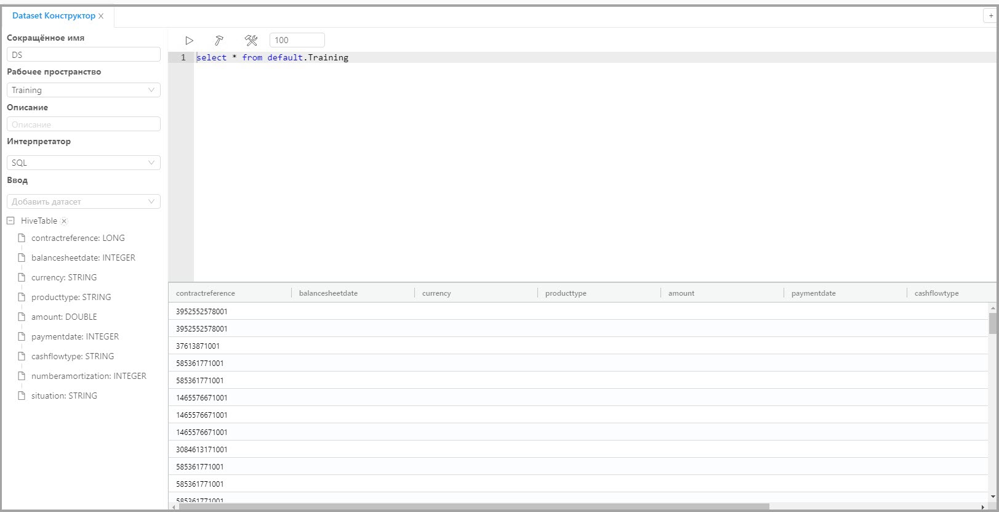

# Неисправности и способы их устранения

## Ошибка идентификации пользователя в программе.

**Описание неисправности:**

Пользователь не может выполнить вход в программу.

**Способ устранения неисправности:**

Проверьте параметры подключения к серверу LDAP, указанные в файле ldap.properties:

| Параметр      | Обязательно заполнять | Описание                                                     |
| ------------- | --------------------- | :----------------------------------------------------------- |
| ldap.domain   | Да                    | Доменное имя Ldap сервера.  *Для авторизации по LDAP используется userPrincipalName вида: username@domainname.com. Если поле не заполнено, то при авторизации необходимо указывать userPrincipalName полностью. Если domain указан, то допускается ввод только userName*  *Пример: ldap.domain=ldapServer.ru* |
| ldap.host     | Да                    | Имя хоста Ldap сервера  *Пример: ldap.host=msk-ldserv1.company.ru* |
| ldap.port     | Да                    | Порт Ldap сервера  *Пример: ldap.port=789*             |
| ldap.base     | Да                    | Путь к каталогу для поиска пользователей  *Пример: ldap.base=CN=Users,DC=company,DC=ru* |
| ldap.admin    | Да                    | Имя группы пользователей, которым будут предоставлены права администратора |
| ldap.operator | Да                    | Имя группы пользователей, которым будут предоставлены права оператора |
| ldap.user     | Да                    | Имя группы пользователей, которым будут предоставлены права пользователя |

## Ошибки, возникающие при выполнении трансформаций данных

### Batch finished with status dead

**Описание неисправности:**

Выполнение трансформации данных оканчивается сообщением: "Batch finished with status dead See Batches in Livy Console for details".

**Способ устранения неисправности:**

- Если источником данных является файл (.csv, .xml, .avro), то необходимо проверить:
  1.  Корректность данных в поле "Path" в настройках элемента трансформации;
  2.  Если файл хранится в файловой системе HDFS, то необходимо проверить настройки доступа к HDFS в объекте Livy Server. А также наличие ошибок и статус HDFS в Ambary.
- Если источником данных является таблица, то необходимо проверить:
  1. Корректность выбора объекта Context в настройках элемента;
  2. Настройки объектов JDBC Connection, Software System, Deployment, которые используются для создания подключения к базе данных.  

- Если источником данных является Kafka, то необходимо проверить параметры подключения к серверу Kafka в настройках элемента трансформации Kafka Source.

### Connection refused

**Описание неисправности:**

Выполнение трансформации данных оканчивается сообщением: "Connection refused".

**Способ устранения неисправности:**

Проверьте настройки объектов Transformation deployment, который разворачивает трансформацию, и связанного с ним объета Livy server.

## Ошибки, возникающие при работе с проектами

### file(s) unzipped. 0 object(s) imported

**Описание неисправности:**

Выполнение загрузки архива проекта оканчивается сообщением: "file(s) unzipped. 0 object(s) imported".

**Способ устранения неисправности:**

Проверьте структуру архива проекта. Файлы проекта должны находятся в корневом каталоге архива.

## Ошибки, возникающие при работе с датасетами.

### null pointer exception

**Описание неисправности:**

При выполнении параграфа в notebook появляется ошибка: "null pointer exception".

**Способ устранения неисправности:**

Проверьте значение Cluster в атрибутах workspace.

###В Dataset Constructor SQL запрос возвращает результат с пустыми полями

**Описание неисправности:**

Средствами ETL трансформации была получена и зарегистрирована Hive таблица из CSV
файла. В Dataset Constructor SQL запрос возвращает результат с пустыми полями (или с частично пустыми) .

**Способ устранения неисправности:**

Проверить target columns в ETL трансформации. Имена колонок должны быть в нижнем регистре. На рисунке внизу зеленым выделен правильный формат, а красным неправильный.

