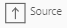

# Лабораторная работа № 1

Переходим в приложение Datagram

## Шаг 1. Создать Project

Первым шагом будет создание проекта

1. Перейти в раздел  / ETL / Project
2. Нажать “+” -> Project
3. Заполнить поле Name: labWorks
4.  Сохранить 

В левом дереве у нас, в итоге, появятся артефакты. Две трансформации и Workflow.

## Шаг 2. Создать Подключение к СУБД

Следующим шагом необходимо создать Connection-ны к СУБД AdventureWorks

Её содержимое, можно посмотреть с помощью Hue
Так как он включен в сборку мини кластера
http://localhost:8888/ (перейти в интерфейс)


Я буду использовать две Схемы: humanresources и person
 - В humanresources понадобится таблица employeepayhistory (наприметь простой запрос select * from humanresources.employeepayhistory)
 - В person понадобится таблица person

Вернемся в Datagram

1. Перейти в раздел  / Connections

Для создания Connection-нов, необходимо создать SoftwareSystem, JdbcConnection и Deployment к humanresources и person

### Шаг 2.1. Создать Software System
>##### №1
1. Перейти в раздел  / Connections / SoftwareSystem
2. Нажать “+” -> SoftwareSystem
3. Заполнить поля:
   - Name: humanresources
   - Project: выбрать labWorks
4.  Сохранить

Поля Scheme и Default Deployment заполнятся автоматически позже

>##### №2
1. Перейти в раздел  / Connections / SoftwareSystem
2. Нажать 
3. Заполнить поле:
   - Name: person
4.  Сохранить

### Шаг 2.2. Создать JdbcConnection
>##### №1
1. Перейти в раздел  / Connections / JdbcConnection
2. Нажать “+” -> JdbcConnection
3. Заполнить поля 
    - Name: humanresources
    - Project: выбрать labWorks
    - Url: jdbc:postgresql://hivemetastore:5432/Adventureworks
    - Schema: humanresources
    - User: postgres
    - Password: new_password
    - Driver: org.postgresql.Driver
4.  Сохранить
5.  Запустить Test
6. Получить сообщение об успешном соединении: [ "Connected!" ]
7. Закрыть сообщение
   
>##### №2
1. Нажать  Copy
2. Ввести name: person
3. Заменить поле:
    - Schema: person
4.  Сохранить
5.  Запустить Test
6. Получить сообщение об успешном соединении: [ "Connected!" ]

### Шаг 3.3. Создать Deployment
>##### №1
1. Перейти в раздел  / Connections / Deployment
2. Нажать “+” -> Deployment
3. Заполнить поля:
    - Name: humanresources
    - Project: выбрать labWorks
    - Connection: Выбрать humanresources
    - Software System: humanresources
4.  Сохранить
5.  Запустить в верхней панели инструментов Refresh Scheme* 
6. Получить сообщение об успешном создании Schema: [ "humanresources_at_humanresources" ]

>Refresh Scheme* - Функция считывания метаданных из внешних источников и копирования их в Datagram 

Её мы проверим позже

>##### №2
1. Перейти в раздел   / Connections / Deployment
2. Нажать “+” -> Deployment
3. Заполнить поля:
   - Name: person
   - Project: выбрать labWorks
   - Connection: Выбрать Person
   - Software System: Person
4.  Сохранить
5.  Запустить Refresh Scheme
6. Получить сообщение об успешном создании Schema: [ "person_at_person" ]


### Шаг 2.4. Проверить автоматически созданную Scheme

>##### №1
1. Перейти в раздел  / Connections / Scheme
2. Проверить наличие humanresources_at_humanresources (Scheme создалась на предыдущем шаге)
3. Перейти в режим редактирования 
4. Развернуть Tables (6 штук)

В наличии все таблицы, как и в Hue

>##### №2
1. Перейти в раздел  / Connections / Scheme
2. Проверить наличие person_at_person (Scheme создалась на предыдущем шаге)
3. Перейти в режим редактирования
4. Развернуть Tables (13 штук)

## Шаг 4. Создать Transformation Step1

Подготовка к созданию Трансформаций окончена. Преступим к самому главному

>##### №1
1. Перейти в раздел  / ETL / Transformation
2. Нажать “+” -> Transformation
3. Заполнить поля:
   - Name: tr_salary_step1
   - Label: Автоматически подставляется "= Name"
   - Project: выбрать labWorks
   - Spark Version: Выбрать SPARK3
   - Description: Формирование таблицы фактов повышения ЗП за предыдущий год
4.  Сохранить

>##### №2

Для удобства, создадим переменную, которую будем использовать в нескольких шагах Трансформации

1.  Нажать Run в нижней панели (снизу откроется панель инструментов)
2. Нажать "+" (add) в нижней панели
3.  Нажать Edit напротив первой появившейся строки с Property
4. Заполнить поля:
   - Name: currentDate
   - Value: 2013-12-01
   - Description: Переменная для бизнес-правила: Повышение ЗП максимум 1 раз в год
5.  Нажать Save в этой же строке
6.  Нажать Save в нижней панели

Свернуть нижнюю панель

>##### №3 

Создадим запрос к Scheme humanresources

1. Перетащить на поле объект из 
   - SQL  
2. Выбрать его на поле трансформации
3. Справа в Свойствах:
   - Name: humanresources
   - Label: humanresources
   - Context: выбрать humanresources
4.  Сохранить

>##### №4
1. Под "SQL humanresources" нажать  (Edit SQL)
2.  Нажать Table в верхней панели инструментов
3. Выбрать Table: employeepayhistory
4. Выбрать Fields (через Ctrl):
   - businessentityid (id сотрудника, по нему потом подтянуть ФИО)
   - ratechangedate (дата повышения ЗП)
   - rate (процент повышения ЗП)
5. Нажать синюю кнопку Apply
6. Сгенерируется запрос:
    ```
    select 
       businessentityid,
       ratechangedate,
       rate
   from employeepayhistory
    ```
7.  Нажать Run*
8. Возникла ошибка: relation "employeepayhistory" does not exist
   - Перейдем в Hue, попробуем отработать запрос там, тоже ошибка.
   - Скорректируем запрос, запустим заново
   - Скопировать в Datagram
9.  Нажать Run
10. Нажать галочку  (Apply)**
11.  Сохранить

>/* В этот момент: 
> - Под запросом появится чашка кофе
> - Закутиться голубая шестеренка в нижней панели инструментов
> * Запрос отработает, как только:
>  - Шестеренка перестанет крутиться
>  - Появится сообщение о статусе выполнения задачи
>  - Вернется результат запроса

>/** При этим устанавливается структура данных на выходе узла трансформации (в Output Port)

>##### №5
1. Выбрать "SQL humanresources" на поле трансформации
2. Посмотреть, что в свойстве Statement появился запрос
3. Посмотреть, что в свойстве Output Port: OutputPort -> Fields появились 3 поля, которые вернулись из запроса с названием колонок и типом данных (появились в момент отработки Apply)

>##### №6
 
С помощью Spark SQL добавим фильтр по Дате повышения ЗП, с использованием нашей переменной currentDate
 
1. Перетащить на поле трансформации объект из 
   - Spark SQL
2. Выбрать его
3. Справа в Свойствах:
   - Name: filterSpark
   - Label: filterSpark
   - Sql Ports (чтобы появился кржок слева): 
      - Нажать  -> SQLPort
      - Развернуть появившееся поле
      - Заполнить поля:
         - Name: Salary
         - Alias: Salary
4. Соединить "SQL humanresources" и "Spark SQL filterSpark" на поле трансформации
5.  Сохранить

>##### №7
1. Под объектом Spark SQL filterSpark нажать  (Edit Spark SQL)
2. Написать запрос, который возвращает все столбцы из предыдущего шага:
    ```
    select * from Salary (На Salary нажать)
    ```
3.  Нажать Run

>##### №8. Использование jobParameters
1. Добавить к запросу 
    ```
    where months_between(cast('${jobParameters("currentDate")}' as date), ratechangedate, true) <= 12
    ```
2.  Нажать Run

Есть альтернативный метод использования переменных - '${jobParameters("currentDate")}' == &currentDate

1.  Нажать Run
2. Нажать галочку  (Apply)
3.  Сохранить

>##### №9
1. Перетащить на поле трансформации объект из 
   - SQL
3. Справа в Свойствах:
   - Name: person
   - Label: person
   - Context: person
4.  Сохранить

>##### №10
1. Под объектом "SQL person" нажать  (Edit SQL)
3. Написать запрос, который возвращает id сотрудника и его ФИО из таблицы person:
   ```
   select
      businessentityid,
      firstname, 
      middlename,
      lastname
   from person.person
   ```
4. Нажать Run
5. Подождать, пока запрос отработает и вернет результат
6. Нажать галочку  (Apply)
8.  Сохранить

>##### №11. Создание блока Join. Создание Checkpoint в блоке Join

Далее необходимо сДжойнить две таблицы. Правую к левой. Сверху - левая, Снизу - правая.
 
1. Перетащить на поле объект из 
   - Join
2. Соединить его сверху слева со Spark SQL
3. Соединить его снизу слева с SQL
4. Справа в Свойствах:
   - Name: joinSalary
   - Label: joinSalary
   - Join Type: Выбрать LEFT
   - Key Fields: Выбрать businessentityid (ключ левой таблицы)
   - Joinee Key Fields: Выбрать businessentityid (ключ правой таблицы)
   - Checkpoint*: Поставить True ( true = на этом шаге Spark сохранит промежуточный результат)
5.  Сохранить

>*Checkpoint - это вызов метода persist в Scala (сохранение состояния DataSet или DataSource)

>##### №12
1. Под объектом "Spark joinSalary" нажать  (Edit Join)
2. Нажать на "+". Создаем новый столбец с параметрами:
   - Name: personName
   - Field Operation Type: SQL
   - Data Type Domain: String
   - Source Fields: выбрать    _2.firstname, _2.middlename, _2.lastname
      - Если в названии поля стоит _1. - это столбец из 1-ой таблицы (левой)
      - Если в названии поля стоит _2. - это столбец из 2-ой таблицы (правой)
   - Expression: 
      ```
      concat( 
       if(_2.firstname is null, '', _2.firstname), 
       ' ', 
       if(_2.middlename is null, '', _2.middlename), 
       ' ',
       if(_2.lastname is null, '', _2.lastname) 
      )
      ```
5. Нажать галочку  (Check)
6. Справа от Expression должно появиться "OK"
   
В Spark SQL можем использовать простую функцию if. И обязательно is null. Или, в противном случае, если хоть одно поле будет null, то результат будет null

7. Удалить столбцы:
   - firstname
   - middlename
   - lastname
8.  Сохранить
