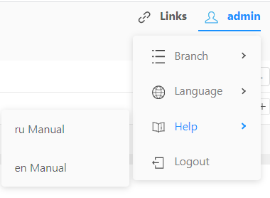

# Быстрый старт
Рассмотрим решение модельной задачи с помощью Датаграм. 
В качестве источника данных используется БД AdventureWorks, 
первоначально [опубликованная](https://github.com/microsoft/sql-server-samples/tree/master/samples/databases/adventure-works) 
компанией Microsoft и [сконвертированная](https://github.com/lorint/AdventureWorks-for-Postgres) 
в БД Postgres.
Модельная задача взята из книги **REAL SQL QUERIES 50 CHALLENGES** (QUESTION 17: LONG TIME NO SALE).

## Постановка задачи
Необходимо найти всё магазины, 
в которых не было заказов 12 месяцев и больше. 
Принять в качестве текущей даты - 07.11.2008.

## Вход в систему
При входе откроется форма логина. Вводим 
```properties
User: admin
Password: admin
```
и попадаем в окно трансформации, решающей модельную задачу.
  
На диаграмме стрелками показаны потоки данных и изображены 9 узлов трансформации, из которых 
3 узла слева - источники данных, 2 узла справа - цели данных.

## Просмотр данных источников
Для просмотра данных источника, необходимо кликнуть мышкой на соответствующий источник и нажать кнопку .  
  
В открывшемся редакторе SQL нажать кнопку  для просмотра результатов запроса. 
Первый запуск запроса может быть дольше обычного, т.к. запускается новый Spark-процесс и создается новый Spark Context.    
    
В этом же редакторе можно просмотреть список таблиц и полей в БД ().    
  

## Запуск трансформации
Для запуска трансформации необходимо открыть панель запуска, нажав на кнопку  внизу
экрана, и ещё раз нажать кнопку  в открывшейся панели.  

При первом запуске трансформации выполняется предварительная сборка с помощью проекта maven. 
При сборке первого проекта maven выкачивает из интернета необходимые зависимости.
Будьте готовы, что из-за этих особенностей, первый запуск трансформации в сессии будет происходить дольше обычного.
В панели запуска можно также редактировать параметры трансформации. 
В последующем, эти параметры можно использовать в текстах SQL, Spark SQL запросах и выражениях.

## Просмотр логов работы
Следить за ходом процесса сборки и запуска трансформации можно из панели логирования. Нажмите кнопку 
внизу экрана. В открывшейся панели можно следить за логом сборки и запуска.  
  
Для закрытия панели нажмите кнопку  повторно.

## Просмотр результатов работы
В случае успешного завершения трансформации появится сообщение:  
  
Трансформация сохраняет результаты своей работы в HDFS, в файлы формата ORC и PARQUET.
Для просмотра результатов работы можно кликнуть на цель данных, затем на кнопку .  
  
В открывшемся окне нажать кнопку .  
  

## Отладка, просмотр промежуточных результатов
Для просмотра промежуточных результатов (просмотра потока данных в середине трансформации),
кликните на узел SparkSQL с именем Spark_SQL_13, затем на кнопку .  
  
В открывшемся редакторе Spark SQL нажмите кнопку .   
  
В этом случае сгенерится и выполнится частичный код трансформации, 
от источников и до текущего узла,
соответственно, мы видим поток данных, который будет при работе трансформации на выходе из текущего узла. 

## Просмотр кода трансформации
Чтобы иметь представление о том, что происходит "под капотом", иногда
полезно видеть код сгенерённой трансформации. 
Для этого нажмите на кнопку  в правом верхнем углу
экрана и выберите пункт "Source Code Editor".
Откроется окно с исходным кодом трансформации.  
  
На закладке "Step" можно сгенерить и выполнить код для конкретного узла трансформации,
нажимая кнопки  и  соответственно.


## Просмотр файлов результирующих данных в HDFS
Результатом работы трансформации является набор файлов в HDFS в формате ORC и PARQUET.
Мы можем просмотреть эти файлы, скачать их, удалить и т.д.
Для этого нажмите кнопку  в левом верхнем углу экрана.
Далее выбирайте SERVERS / livy / bd-livy / Кнопка  в правом верхнем углу / HDFS Console.  
    
Откроется браузер файловой системы HDFS.    
  

## Просмотр результирующих данных через запрос в Hive
Для просмотра данных через Hive наша трансформация регистрирует результирующие
файлы формата ORC и PARQUET как внешние таблицы Hive.  
  
Сделаем запрос к этим таблицам. Откроем интерпретатор Spark:
 / SERVERS / livy / bd-livy /  / Livy Console / Interpreter 1;
и выполним запрос 
```sql
spark.sql("select * from dm_long_time_no_sale").show()
```
  

## Дальнейшие шаги
Справочная система встроена в программу:  
  
По ссылке [LabWorks](https://github.com/neoflex-consulting/datagram/tree/master/MetaServer/DOC/Labs) 
расположены лабораторные работы для дальнейшего самостоятельного изучения Datagram.