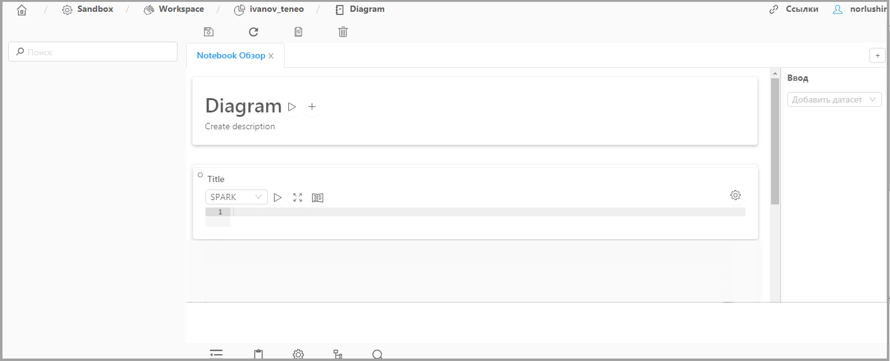
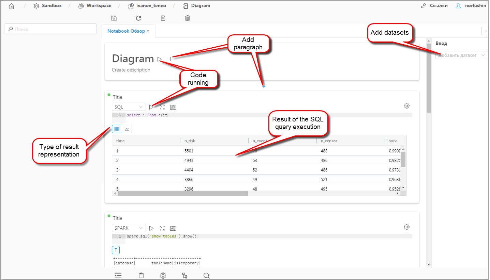
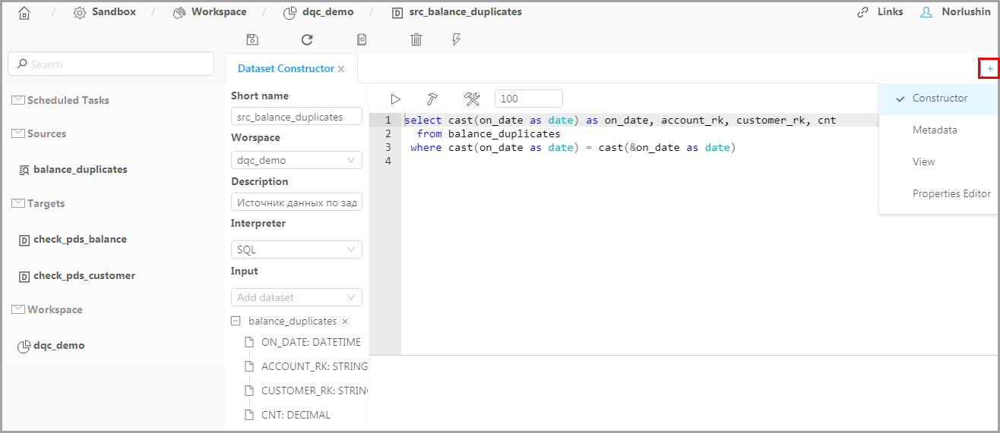
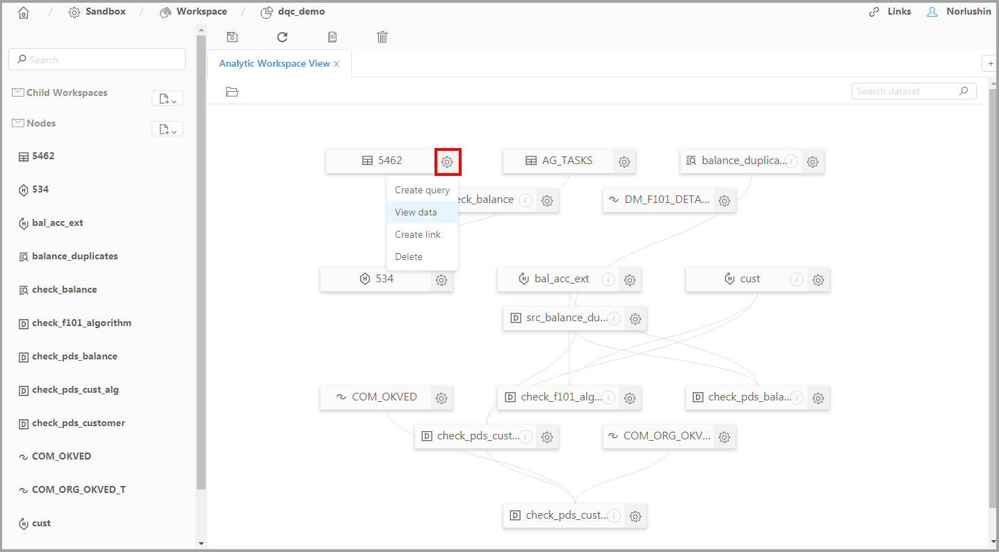
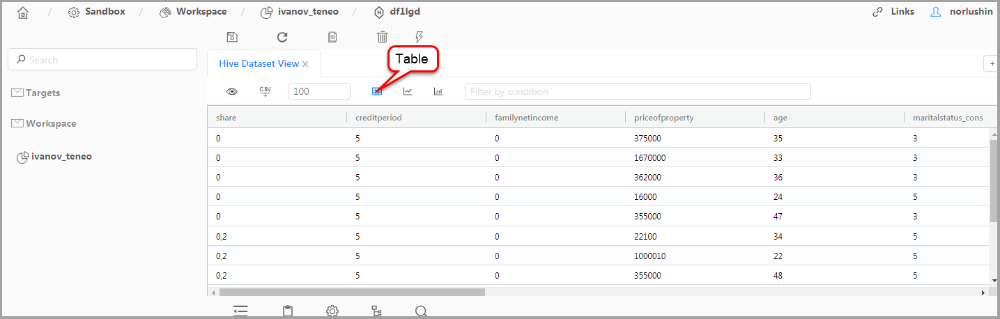
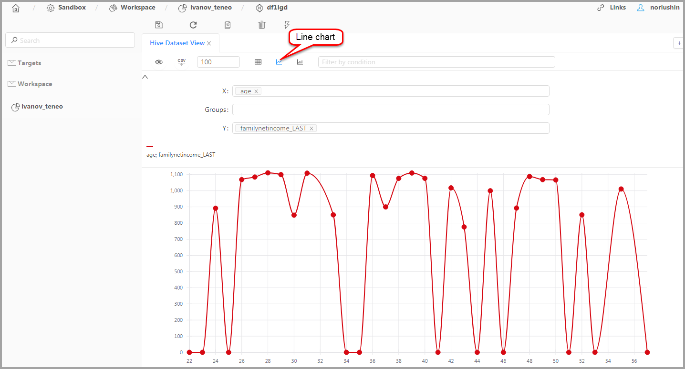
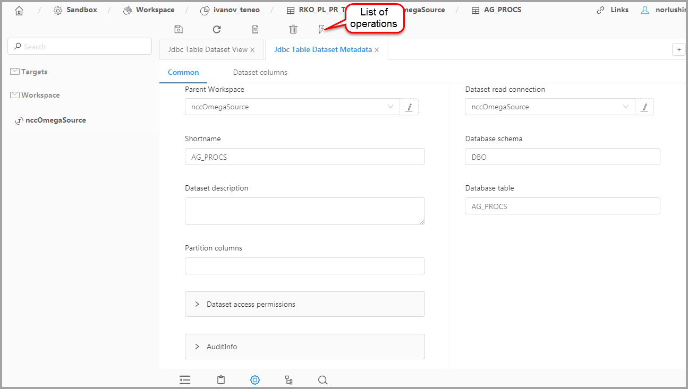
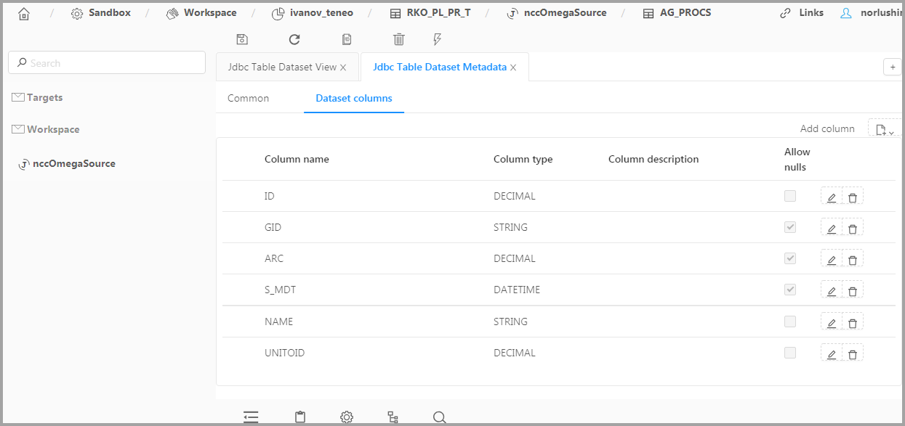
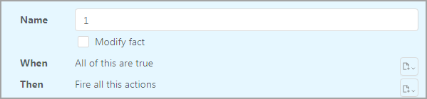

[TOC]

---

<a id= 'about_book'><a>

# About manual  

This manual describes how to use the Neoflex Datagram software for data processing applications development. It contains the following chapters:

**Quick start.** It describes the basic operations in the program to help you get started:

* Starting the program;
* Creating a new project;
* Creating and designing a Transformation;
* Creating and designing a Workflow;
* Objects execution starting;
* Application execution monitoring.

**Work with program.** This chapter includes the paragraphs in which describes:

* Preparing to run the framework;
* Program tools for connecting to external systems databases and runtime environments;
* Diagram elements for visual designing data transformations and workflows;
* Special tools to run applications;
* Tools for a metadata migrating between software environments.

As the Neoflex Datagram improving is continuing, it should be noted the description may be different from what you will see on the screen.

# Technical overview of Neoflex Datagram 

Neoflex Datagram is a framework for data processing applications development. It supports both batch and streaming data processing mode. 

The core of the framework is Metadata Server. Metadata Server provide store and management tools for information about data sources and targets, execution environment, data mappings, transformation sequences, etc. 

Neoflex Datagram supports full cycle of data processing applications development:

- Visual design of data flows, data mappings and data transformations;
- Visual design of control flows and transformations sequences;
- Source code generation for **Scala** with **Apache Spark** library;
- Compiling and building application;
- Deploying application to runtime environment and execution scheduling;
- Monitoring application execution;
- Tools for stopping and restarting applications.

**Architecture overview**

**Framework internals**

The framework is developed in model-driven architecture (**MDA**). For model management, Eclipse Modelling Framework (**EMF**) is used. To persist models, **PostgreSQL**/**Hibernate**/**Teneo** is used. For model validation, model-to-model (**M2M**) and model-to-text (**M2T**) transformation, **Eclipse Epsilon** is used. The following types of models are used internally: Authentication, Relational, ETL, Runtime, DWH, UI.

**Runtime Environment**

Runtime environment is based on **Apache Spark**.

Neoflex Datagram can execute applications with **Apache Oozie** or **Apache Livy** servers. Apache Oozie is used in production. Apache Livy is used in development/debugging environment. 

**Transformation Designer**

Visual designer for data flows and data mappings.

Wide range of sources/targets are supported: 

- RDBMS sources/targets via **JDBC** (including stored procedures);
- Structural sources/targets: **xml, avro** and **json**;
- HDFS specific file formats: **ORC**, **PARQUET**;
- **CSV, Apache Hive, Apache Kafka** source/targets.

Data transformations types:

- Extended set of relational algebra operations: join, sort, aggregation, union, selection, projections, pivot, explode arrays, sequence generation;
- Spark specific: **Spark SQL**;
- Model Based Analysis using **Spark MLLib** (decision trees, SVM, logistic regression etc.);
- JBoss Rules (**Drools**) - Business Rule Management System.

Key features:

- View source/target content;
- Support for struct/array data types;
- Data fields lineage tracking;
- Partial execution of the transformation with viewing of intermediate results;
- Generated code can be viewed, edited and executed immediately;
- Validation of transformations based on database of the most frequent errors;
- Support for Spark Catalyst Optimizer. 

**Workflow Designer**

- Visual designer for transformations sequences;
- **Conditional**, **parallel** or **sequential** transformation execution;
- Generic steps: **shell** scripts or **java** programs;
- Sub workflows of arbitrary nesting level;
- Scheduled workflow execution by time or file system events.

**Security**

- **Active Directory (LDAP)** authentication;
- Role-based authorization. Possible roles: developer, operator, viewer;
- Encrypted passwords for access to external systems;
- Support for **Kerberos** authentication of runtime environment. 

**Versions and teamwork**

- Optimistic locking for concurrent updates;
- **Apache Subversion** integration;
- Hierarchical projects;
- Project based, or object based check-in/check-out;
- Protected (user-defined) code persists while updating the metadata version. 

**Environment support**

Support for dev->test->prod development cycle.

- Import/Export metadata;
- Move metadata (full, or project based) to a new environment;
- Rewrite urls, passwords etc., while moving to the new environment. 

**Supplement tools**

- HDFS Console: view, download and upload files from/to **HDFS** file system;
- Livy Console: browse tasks on **Livy** server, view logs, cancel tasks;
- Oozie Console: browse workflow and coordinator jobs on Ozzie, view logs, cancel or restart jobs;
- Object Explorer: explore and filter metadata object tree. 

# Quick start

## Program Launch 

Start the browser and type an address like this:

**http://host:port/cim/ddesigner/build/index.html?**

where:

**host** – the host of the server where Neoflex Datagram was installed;

**port** – the port number of the server.

Press Enter and the login form will appear.

Fill out the form and click the **Login** button. The start window of the program will appear. 

## Creating a New Project

To create a new **Project**,  click on **New** at **ETL/Project**.

The creation form will appear. Type **DemoProject** in the Name field and click **Save**. 

The new project with name **DemoProject** is created. 

> *Comment.*
>
> *Project attributes are described  in the chapter [Groupping program objects](#grouping_program_objects).*

The DemoProject is created to link Transformation and Workflow objects to it, thereby combining them into a group. Subsequently, this group of objects can be transferred between software environments.

## Creating and configuring a Transformation

> *Attention!*
>
> *Ensure that the program has pre-configured [external system databases](#connecting_to_the_db_of_external_systems)  and [runtime environments connections](#connecting_to_the_runtime_environments) before you perform the steps are described below.*

The transformation will migrate data from CSV to JSON. Both source and target files are stored in HDFS. 

First you have to create CSV file 'demo.txt' in HDFS.

*CSV file contents:*

*1,Ivanov,1000.00*

*2,Petrov,1200.00*

*3,Sidorov,1250.00*

Once you had created the source file, go to **ETL/Transformation** and click on **New** to appear the Transformation creation form. Fill out fields:

- **Name** - **DemoTransformation**;
- **Label** - **DemoLabelTransformation**;
- **Project** - select **DemoProject** from list;
- Leave the remaining fields by default.

> *Comment.*
>
> *Transformation properties are described in [Transformation objects](#etlTransformation).*

**Designing transformation diagram and starting DemoTransformation** 

Click  and select **Designer** from list to open Transformation designer. Place **CSV source** and **Local target** on workspace, set a data transfer direction as shown below. 

Click on **CSV_source1** which located in workspace to open property panel and set properties: 

* Type the path to **Demo.txt** in the **Path** field (for example: user/Demo.txt);
* In **CSV group** type the comma symbol in **Delimiter** field; 
* In **OUT PORT->Fields** add three fields:
  1. **id - Integer**
  2. **name - string**
  3. **salary - decimal**
* Others settings are left default.

Open **Local_target2** properties panel and fill out:

* Select **JSON** from **Local file format** list;
* In the **Path** field type the path where will be created JSON file (for example: /user/demo/demo.json);
* In **Table** field set fields mapping:
  1. **ID - id**
  2. **NAME - name**
  3. **SALARY - salary**
* In **Partition** field add directory with name **Id** which will be included in demo.json directory;
* Others settings are left default.

> *Comment.*
>
> *Transformation diagram elements are described in "[Transformation diagram elements](#elements_of_transformation_diagrams)".*

Click the Save button () to save **DemoTransformation** settings. Validate **DemoTransformation** by the **Validate** button (). The program will not detect errors if settings are correct.

>  *Comment*
>
> *In case of error detecting, you can check transformation code using the [source code editor](#code_editor)*.

Now **DemoTransformation** can be executed. To do it click on **Run** (). After starting of **DemoTransformation** execution  the program will automatically create a Transformation Deployment object with name «**autogenerated_tr_DemoTransformation**» which will deploy **DemoTransformation** at Livy Server.

> *Comment.*
>
> *If you want to create another Transformation Deployment object click  . The Transformation Deployment objects are described in "[Transformation Deployment](#rtTransformationDeployment)".*

### Viewing result of data transformation

For viewing of **DemoTransformation** result use **HDFS Console**. To open it go to **Servers/Livy**, select Livy Server on which  **DemoTransformation** was deployed. Click  and select **HDFS Console** from list. In HDFS Console go to the directory you specified in **Local_target2** properties.

 

## Creating and configuring a Workflow

The **Workflow object** will do:

1. Running the **DemoTransformation** execution;

2. Analyzing the **DemoTransformation** execution: the transformation will be completed or it will be interrupted if an error is detected.

For Workflow creating go to **ETL/Workflow** and click on New to appear the Workflow creation form. Fill out fields:

- **Name - DemoWorkflow**;

- **Label - DemoLabelWorkflow**;

- **Project** - select **DemoProject** from list;

- Leave the remaining fields by default.

> *Comment.*
>
> *Workflow properties are described in [Workflow objects](#etlWorkflow).*

**Designing workflow diagram and starting DemoWorkflow** 

Open Workflow designer using button.  Place **Start**, **End**, **Transformation** and **Kill** on workspace. Set a direction of management flows as shown below. 

Configure elements of diagram:

* In **transformation** settings select **DemoTransformation** from **Transformation** list. leave default values in the other fields;
* In **kill** settings type error message in **Message** field. For example: "Error. Transformation process is aborted". leave the default values in the other fields.

> *Comment.*
>
> *Workflow diagram elements are described in "[Workflow diagram elements](#elements_of_workflow_diagrams)".*

Save DemoWorkflow settings using button . Open command list  and run **Validate** command. The program will not detect errors if settings are correct.

> *Comment*
>
> *In case of error detecting, you should check DemoWorkflow settings*.

Now run **DemoWorkflow** with **Run** command. After starting of **DemoWorkflow** execution  the program will automatically create a Workflow Deployment object with name «**autogenerated\_wf\_DemoWorkflow**» which will deploy **DemoWorkflow** at Oozie.

> *Comment.*
>
> *If you want to create another Workflow Deployment object click . The Workflow Deployment objects are described in "[Workflow Deployment](#rtWorkflowDeployment)".*

## Tools for monitoring applications 

Starting of the execution Workflow or Transformation objects  is performed by the Meta Server application and consists of phases:

1. File generation;
2. Task compilation;
3. Deployment task at runtime environment;
4. Starting task execution through task planner (Oozie or Livy Server);
5. Perform the task at runtime environment.

Phases 1 - 3 are performed by Meta Server.

Phase 4 is performed by Meta Server through task planner Spark: Oozie or Live Server.

Phase 5 is performed at Hadoop.

Tools for monitoring processes:

* **Logger** displays real-time logs of Meta Server application (phases 1, 2, 3 and start the phase 4).
* **Livy** and **Oozie** **consoles**. Consoles display information about results of Transformation and Workflow execution at Hadoop (phase 5).

 

# Work with the program

 

## Prepare for running Neoflex Datagram

 

### Program sources

Program resources include files .html, .js, .groovy (used for configuring application logic), metadata models in the ecore format, transformation scripts, validation and generation scripts in [EMF Epsilon](http://www.eclipse.org/epsilon/), etc. For the resources downloading Java ClassLoader is used.

The program is used a multi-layer resource scheme. Essence of it is that resources related to each further layer have a higher priority when they are used by the program in relation to resources related to all previous layers. Physically, a multi-layered scheme is realized by storing resource files in different directories for which the name and appropriate layer are specified by the program startup options (look  [table](#tab_starting_param)).

The layers described below are presented in order of increasing priority in the using resources related to them:

* **Integrated resources layer** – catalog stores the resources included in setup package;
* **Implementation layer** – catalog related to these layer stores resources which the implementation team created to customize the program to meet customer requirements. The program has limited access to the directory - «read only». The directory path is set in startup option mspace.dir;
* **Maintenance layer** – in this directory the maintenance team can create the resources needed to customize the application during operation. In addition, the catalog is used to recording artifacts that the program creates while it is running and to organize metadata import/export. The directory path is set in startup option deploy.dir;
* **Temporary resources layer** – A service layer. Used by the program to export some types of resources from other layers. The temp directory is recreated when application starts and cannot be used for resources long storing.

### Startup options

The program is delivered as JAR-file **mserver-${MSERVER_VER}.jar**, where {MSERVER_VER} is a program version number.

To run program is used Linux standard start command for JAR-files with startup options:

**java -Dparameter=value … -jar ${JAR_NAME}**

**Startup options**

| Option             | Fill out | Description                                                  |
| ------------------ | -------- | :----------------------------------------------------------- |
| file.encoding      | Yes      | UTF-8 is always used                                         |
| maven.home         | Yes      | [Maven](https://maven.apache.org/) installation path         |
| mspace.dir         | Yes      | Implementation layer directory path                          |
| deploy.dir         | No       | Maintenance layer directory path. If option is not specified, the directory will be generated by default: ${mspace.dir}/deployments/{cust.code} |
| teneo.url          | Yes      | Teneo url                                                    |
| teneo.user         | Yes      | User name for connecting to Teneo                            |
| teneo.password     | Yes      | Password for connecting to Teneo                             |
| cust.code          | No       | Installation code                                            |
| mserver.port       | No       | HTTP port of Meta Server                                     |
| ldap.config        | No       | Path to LDAP configuration file                              |
| passwords          | No       | Path to password storing file. By default: ${user.dir}/passwords.properties  («[Storing and encrypting passwords](#storing_and_encrypting_passwords)») |
| dencrypt.passwords | No       | Encrypt passwords option: «false» (default) and true («[Storing and encrypting passwords](#storing_and_encrypting_passwords)») |

 

 

### Initialization scripts

Groove initialization scripts are used at the program starting. The groove scripts are stored in the directory:

**/cim/MetaServer/pim/scripts/psm/groovy/init/**

> *Attention!*
>
> *Initialization scripts files are not recommended to be edited.*

**Initialization scripts**

| Parameter                 | Description                                                  |
| ------------------------- | :----------------------------------------------------------- |
| A10_events                | Hibernate events initialization                              |
| A20_UserInfo              | Not used                                                     |
| A30_DataInit              | Metadata loading initialization during program installation (see [Metadata migration subsystem](#metadata_migration_subsystem)) |
| A40_ScheduleClearLost     | Starting periodic task to check data integrity               |
| A50_HealthJobServers      | Starting the Job Server diagnostic                           |
| A60_HealthOozieServers    | Starting the Oozie diagnostic                                |
| A70_HealthJdbcConnections | Starting diagnostic of external system connections           |
| A80_HealthSVNServers      | Starting the TortoiseSVN diagnostic                          |

 

### User accounts

Neoflex Datagram supports user centralized authentication and authorization using the Lightweight Directory Access Protocol (LDAP).

Depending on LDAP group belonging, the user can be assigned one of the roles:

* **Administrator** – full access to the program;
* **Operator** – access to logger, Oozie console, Livy console, HDFS console. Users can design and run transformations and workflows;
* **User** – access to logger, Oozie console, Livy console, HDFS console, run workflows and transformation.

The LDAP integration is realized using the [Spring LDAP](http://docs.spring.io/spring-ldap/docs/current/reference/) library.

The LDAP connection settings and user group and role mappings are set in file **ldap.properties** which included in the program delivery package.

### Storing and encrypting passwords

The program provides two ways to store passwords for external systems database and TortoiseSVN:

1. The passwords are typed when you create Project or Jdbc Connection objects. The passwords will be masked in view/edit forms. This way is not recommend to use;
2. The passwords for each object are written in the system file. The file path is specified by startup option **passwords** (look [table](#tab_starting_param)).

The password storing file format:

**etl.Project.\${Project name}.svnPassword**=**ХХХ**,

ХХХ is password for TortoiseSVN.

**rt.JdbcConnection.\${Jdbc Connection object name}.password=YYY**,

YYY is password for external system database.

**Encrypting passwords**

Regardless of the storage method, the passwords can be encrypted. The encryption function is managed by startup option **dencrypt.passwords** (look at  [table](#tab_starting_param)).

The option can get one of the values:

* **false** (default) – the passwords do not encrypt;
* **true** – encryption function is enabled. This means that all passwords will be stored in DB in encrypted form: Base64(AES128(plainPassword)). The decryption key is stored in file **${user.dir}/skey.bin**.

 

## Connecting to external system databases

To connect to the database of an external system you have to create and configure the objects:

- [JDBC Connection](#jdbcconnection_objects);
- [Software System](#softwaresystem_objects);
- [Deployment](#deployment_objects);
- [Scheme](#scheme_objects);
- [JDBC Context](#jdbccontext_objects).

### JDBC Connection objects 

The **Jdbc Connection** objects store settings for connecting to external system DB.

For **Jdbc Connection** objects configuring go to **Connections/Jdbc Connection**.

**JDBC Connection attributes**

| Atribut  | Fill out | Description                                                  |
| -------- | :------: | :----------------------------------------------------------- |
| Name     |   Yes    | Name of the Jdbc Connection object. It must be a valid Java identifier |
| Project  |    No    | Project to which Jdbc Connection object is linked            |
| Url      |   Yes    | URL of the external system database                          |
| Scheme   |   Yes    | Jdbc scheme                                                  |
| Catalog  |    No    | Jdbc catalog                                                 |
| User     |   Yes    | Username to external system DB connection                    |
| Password |    No    | Password to external system connection  *The hidden method of storing passwords is recommended to use («[Storing and encrypting passwords](#storing_and_encrypting_passwords)»)* |
| Driver   |   Yes    | Jdbc driver class name     *Example: oracle.jdbc.driver.OracleDriver* |

**JDBC Connection operations**

| Operation name | Description                                    |
| -------------- | :--------------------------------------------- |
| Test           | The operation verifies the database connection |

 

### Software System objects

The **Software System** objects describe the external system to which Neoflex Datagram connects. 

For **Software System** objects configuring go to **Connections/Software System**.

**Software System attributes**

| Attribute          | Fill out | Description                                                  |
| ------------------ | :------: | :----------------------------------------------------------- |
| Name               |   Yes    | Name of the Software System object. It must be a valid Java identifier |
| Project            |    No    | The project to which Software System object is linked        |
| Scheme             |    No    | Name of Scheme object  which describes external system database  ([Scheme objects](#scheme_objects)) |
| Default Deployment |    No    | Deployment object that is used by default                    |

**Software System operations**

| Operation name | Description                                                  |
| -------------- | :----------------------------------------------------------- |
| Refresh        | When you start the operation, Neoflex Datagram reads metadata of database and refreshes the linked Scheme object. If the Scheme object is not created, the program will create and link it to Software System object |

### Deployment objects

The **Deployment** objects link the **Software System** and **Jdbc Connection** in program to create a connection.

For **Deployment** objects configuring go to **Connections/Deployment**.

**Deployment attributes**

| Attribute         | Fill out | Description                                                  |
| ----------------- | :------: | :----------------------------------------------------------- |
| Name              |   Yes    | Name of the Deployment object. It must be a valid Java identifier |
| Project           |    No    | Project to which Deployment object is linked                 |
| Connection        |    No    | Jdbc Connection object is used to create connection          |
| Software System   |    No    | Software System object is used to create connection          |
| Load Stored Procs |    No    | The program will load metadata of the stored procedures if the parameter is on |

**Deployment operations**

| Operation name | Description                                                  |
| -------------- | :----------------------------------------------------------- |
| Refresh scheme | When you start the operation, Neoflex Datagram reads metadata of database and refreshes the Scheme object which was linked to selected Software System object. If the Scheme object is not created, the program will create and link it to Software System object |

 

### Scheme objects

The **Scheme** objects store following information about external system database:

* **views** – list of dynamically generated tables;
* **tables** – list of database tables;
* **Stored Procedures** – list of stored procedures of database.

The **Scheme** objects can be created in two ways:

* **Automatically** – by the **Refresh scheme** operation of **Deployment** or **SoftwareSystem** objects;
* **Manually** – in the tab called **Connections/Scheme**.

 

### Jdbc Context objects

The **Jdbc Context** objects provide a choice of connection to the external systems databases in transformation designer ([Transformation diagram elements](#elements_of_transformation_diagrams)).

For  **Jdbc Context** objects configuring go to **ETL/ JdbcContext**.

**Jdbc Context attributes**

| Attribute | Fill out | Description                                                  |
| --------- | :------: | :----------------------------------------------------------- |
| Name      |   Yes    | Name of the Jdbc Context object. The name must coincide the name of Software System object and not contain underscores |

 

## Connecting to runtime environments

Neoflex Datagram can interact with one of the runtime environments depending on the executed task:

* [**Oozie**](http://oozie.apache.org/docs/4.2.0/) – Workflow objects execution;
* [**Livy Server**](https://hortonworks.com/blog/livy-a-rest-interface-for-apache-spark/) –Transformation object execution.

To connect to the runtime environments you have to create objects: 

- [Oozie](#oozie_objects);
- [Workflow Deployment](#workflowdeployment_objects);
- [Livy Server](#livyserver_objects) (works with Spark 2.Х and above);
- [Transformation Deployment](#transformationdeployment_objects);
- [Coordinator Deployment](#coordinatordeployment_objects) - used for deployment of Oozie Coordinator tasks ([Scheduled execution of the created workflow objects](#scheduled_execution_of_the_created_workflow_objects)).

 

### Oozie objects

The **Oozie** objects store connection settings to Oozie server.

For **Oozie** objects configuring go to **Server/Oozie**.

**Oozie attributes**

| Attribute           | Fill out | Description                                                  |
| ------------------- | :------: | :----------------------------------------------------------- |
| Name                |   Yes    | Name of Oozie object. It must be a valid Java identifier  |
| Project             |    No    | Project to which Oozie object is linked                      |
| Job Traсker         |   Yes    | Url of Job Tracker   *Example: cloud.neo.ru:8050*      |
| Name Node           |   Yes    | Parameters of access to HDFS   *Example: hdfs://cloud.neo.ru:8020* |
| Master              |   Yes    | Url of Master ([detailed description](https://spark.apache.org/docs/latest/submitting-applications.html#master-urls))  *Example: spark://192.168.2.65:5310, local\[4\]* |
| Mode                |    No    | Spark driver deployment modes: **client** (by default) - run Spark locally as an external client; **cluster** - connect to  Spark cluster; **yarn** - connect to YARN cluster in client or cluster mode. Cluster configuration is set by environment variables |
| is Default          |    No    | Turn on if you want to use the Oozie object by default.  *If several Oozie objects have the checkbox enabled, the program will select the Oozie object randomly to execute Workflow* |
| Spark 2             |    No    | Turn on if you use Spark  2.1 and above                      |
| Is Kerberos enabled |    No    | Select the checkbox if you want to use the Kerberos authentications to Spark server connection |
| Key Tab Location    |    No    | Path to the file where principal passwords are stored        |
| User Principal      |    No    | Principal used for Meta Server authorization                 |
| HCAT URL            |    No    | Url of Hive metastore                                        |
| HCAT Principal      |    No    | Principal for Hive authorization                             |
| Num Executors       |   Yes    | Number of Spark executing processes                          |
| Executor Cores      |   Yes    | Number of cores used for the Spark executing process         |
| Driver Memory       |   Yes    | Memory volume used for Spark Context initialization          |
| Executor Memory     |   Yes    | Memory volume used for each Spark executing process          |
| Queue               |    No    | The YARN queue in which task will be run                     |
| Retry Max           |    No    | Number of attempts to start the execution of Spark task      |
| Retry Interval      |    No    | Time interval between attempts to run the Spark task         |
| Cred                |    No    | Implementation credentials ([more information](https://oozie.apache.org/docs/4.2.0/DG_ActionAuthentication.html#Built-in_Credentials_Implementations)) |
| Sftp                |    No    | Is not used  Sftp address of the server on which the Workflow object artifacts are deployed |
| Http                |   Yes    | Url Oozie API                                                |
| Webhdfs             |    No    | Url HDFS API                                                 |
| Home                |   Yes    | Directory in HDFS used for Workflow deployment               |
| User                |   Yes    | HDFS user name used for Workflow deployment                  |
| Files Browser Util  |    No    | Url of Hadoop web console                                    |

### Workflow Deployment objects 

The **Workflow Deployment** objects prepare a set of files describing Workflow and deploy workflow tasks at Oozie. 

For  **Workflow Deployment** objects configuring go to **Deployment/Workflow Deployment**.

**Workflow Deployment attributes**

| Attribute          | Fill out | Description                                                  |
| ------------------ | :------: | :----------------------------------------------------------- |
| Name               |   Yes    | Name of Workflow deployment object. It must be a valid Java identifier |
| Project            |    No    | Project to which Jdbc Connection object is linked            |
| Oozie              |    No    | The Oozie object used for Oozie server connecting            |
| Deployments        |    No    | Deployment object used for connection to the external system databases |
| Start              |    No    | The Workflow Object from which execution begins              |
| Debug              |    No    | If the check box is selected, the program will create a files with the intermediate result of workflow execution |
| Slide Size         |    No    | Amount of data that is written at a time to the Jdbc data receiver |
| Reject Size        |    No    | Maximum number of errors that can occur during writing data to the Jdbc data receiver. Workflow execution will be interrupted If the set value is exceed |
| Fetch Size         |    No    | Amount of data that is is read at a time from the Jdbc data source |
| Partition Num      |    No    | Amount of working processes are executed during writing data to the Jdbc data receiver |
| Master             |   Yes    | Url of Master ([detailed description](https://spark.apache.org/docs/latest/submitting-applications.html#master-urls)).  *This setting of the Workflow Deployment object has priority over the same setting of the Oozie object* |
| Mode               |    No    | Spark driver deployment modes: **client** (by default) - run Spark locally as an external client; **cluster** - connect to  Spark cluster; **yarn** - connect to YARN cluster in client or cluster mode. Cluster configuration is set by environment variables.  *This setting of the Workflow Deployment object has priority over the same setting of the Oozie object* |
| Num Executors      |    No    | Number of Spark executing processes.  *This setting of the Workflow Deployment object has priority over the same setting of the Oozie object* |
| Executor Cores     |    No    | Number of cores used for the Spark executing process.  *This setting of the Workflow Deployment object has priority over the same setting of the Oozie object* |
| Driver Memory      |    No    | Memory volume used for Spark Context initialization.  *This setting of the Workflow Deployment object has priority over the same setting of the Oozie object* |
| Executor Memory    |    No    | Memory volume used for each Spark executing process.  *This setting of the Workflow Deployment object has priority over the same setting of the Oozie object* |
| Jvm Opts           |    No    | Java Virtual Machine options                                 |
| Persist On Disk    |    No    | If enabled, the intermediate data received by Check Point operation will be saved on disk, not in memory |
| Dynamic Allocation |    No    | This setting enables the mechanism of dynamic allocation resources which relocates resources depending of the workload |

**Workflow Deployment parameters**

| Parameter   | Fill out | Description              |
| ----------- | :------: | :----------------------- |
| Name        |   Yes    | Name of parameter        |
| Expression  |    No    | Is not used              |
| Description |    No    | Description of parameter |

**Spark options**

| Parameter | Fill out | Description  |
| --------- | :------: | :----------- |
| Name      |   Yes    | Option name  |
| Value     |    No    | Option value |

**Workflow Deployment operations**

| Operation        | Description                                                  |
| ---------------- | :----------------------------------------------------------- |
| Validate         | Validates Workflow and linked Transformation objects         |
| Generate         | The operation generates XML files describing Workflow object, and code in Scala language describing Transformation objects linked to the Workflow |
| Build            | The operation compiles JAR files from Scala language code describing Transformations objects and creates directories with XML and JAR files for sending to Oozie |
| Deploy           | The operation copies files from Neoflex Datagram to the Linux OS file system where running Oozie, then copies the files to HDFS |
| Install          | Performs operations sequentially: generate, build and deploy |
| Run              | The operation starts the execution of XML and JAR files at Oozie |
| Generate and run | Performs operations sequentially: generate, build, deploy and run |
| Build and run    | Performs operations sequentially: build, deploy and run      |

 

### Livy objects

The **Livy** objects store settings for connecting to the Livy Server.

For **Livy** objects configuring go to **Server/Livy**.

**Livy attributes**

| Attribute           | Fill out | Description                                                  |
| ------------------- | :------: | :----------------------------------------------------------- |
| Name                |   Yes    | Name of Livy object. It must be a valid Java identifier   |
| Project             |    No    | Project to which the Livy object is linked                   |
| Http                |   Yes    | Http address Livy Server API  *Example: http://cloud.neo.ru:8090* |
| Home                |    No    | Directory used for deployment of Transformation object       |
| User                |    No    | User name used for Transformation deployment                 |
| Webhdfs             |    No    | Url of HDFS API                                              |
| Is Kerberos enabled |    No    | Select the checkbox if you want to use the Kerberos authentications to Spark server connection |
| Key tab location    |    No    | Path to the file where principal passwords are stored        |
| User Principal      |    No    | Principal used for Meta Server authorization                 |
| Num Executors       |   Yes    | Number of Spark executing processes                          |
| Executor Cores      |   Yes    | Number of cores used for the Spark executing process         |
| Driver Memory       |   Yes    | Memory volume used for Spark Context initialization          |
| Executor Memory     |   Yes    | Memory volume used for each Spark executing process          |
| is default          |    No    | Turn on if you want to use the Transformation Deployment object by default.  *If several Transformation Deployment objects have the checkbox enabled, the program will select the Livy object randomly to deploy Transformation* |

 

### Transformation Deployment objects 

The **Transformation Deployment** objects create JAR files describing Transformation objects and deploy transformation tasks at the Livy Server.

For  **Transformation Deployment** objects configuring go to **Deployment/Transformation Deployment**.

**Transformation Deployment attributes**

| Attribute       | Fill out | Description                                                  |
| --------------- | :------: | :----------------------------------------------------------- |
| Name            |   Yes    | Name of Transformation Deployment object. It must be a valid Java identifier |
| Project         |    No    | Project to which the Transformation Deployment is linked     |
| Livy Server     |    No    | The Livy object used for connection to Livy Server           |
| Transformation  |    No    | Transformation object that is deployed by Transformation Deployment object |
| Deployments     |    No    | The Livy object used for Livy Server connecting              |
| Debug           |    No    | If the check box is selected, the program will create a files with the intermediate result of transformation execution |
| Slide Size      |    No    | Amount of data that is written at a time to the Jdbc data receiver |
| Reject Size     |    No    | Maximum number of errors that can occur during writing data to the Jdbc data receiver. Transformation execution will be interrupted If the set value is exceed |
| Fetch Size      |    No    | Amount of data that is is read at a time from the Jdbc data source |
| Partition Num   |    No    | Amount of working processes are executed during writing data to the Jdbc data receiver |
| Master          |   Yes    | Url of Master ([detailed description](https://spark.apache.org/docs/latest/submitting-applications.html#master-urls)) |
| Mode            |    No    | Spark driver deployment modes: **client** (by default) - run Spark locally as an external client; **cluster** - connect to  Spark cluster; **yarn** - connect to YARN cluster in client or cluster mode. Cluster configuration is set by environment variables |
| Num Executors   |   Yes    | Number of Spark executing processes.  *This setting of the Transformation Deployment object has priority over the same setting of the Livy object* |
| Executor Cores  |   Yes    | Number of cores used for the Spark executing process  *This setting of the Transformation Deployment object has priority over the same setting of the Livy object* |
| Driver Memory   |   Yes    | Memory volume used for Spark Context initialization  *This setting of the Transformation Deployment object has priority over the same setting of the Livy object* |
| Executor Memory |   Yes    | Memory volume used for each Spark executing process  *This setting of the Transformation Deployment object has priority over the same setting of the Livy object* |
| Persist on disk |    No    | If enabled, the intermediate data received by Check Point operation will be saved on disk, not in memory |
| is default      |    No    | Turn on if you want to use the Transformation Deployment object by default |

**Transformation Deployment parameters**

| Parameter   | Fill out | Description           |
| ----------- | :------: | :-------------------- |
| Name        |   Yes    | Name of parameter     |
| Expression  |    No    | Is not used           |
| Description |    No    | Parameter description |

**Transformation Deployment operations**

| Operation        | Description                                                  |
| ---------------- | :----------------------------------------------------------- |
| Validate         | Validates code of the linked Transformation object           |
| Generate         | The operation generates code in Scala language describing Transformation object |
| Build            | The operation compiles JAR files from Scala language code describing Transformations objects for sending to Livy Server |
| Deploy           | The operation copies files from Neoflex Datagram to Livy Server |
| Install          | Performs operations sequentially: generate, build and deploy |
| Run              | The operation starts the execution of JAR files at Livy Server |
| Generate and run | Performs operations sequentially: generate, build, deploy and run |
| Build and run    | Performs operations sequentially: build, deploy and run      |

 

### Coordinator Deployment objects

The **Coordinator Deployment** objects deploy Oozie Coordinator tasks at Oozie

Most of the attributes, parameters, and operations of the Coordinator Deployment objects are similar to the [attributes](#tab_atributes_workflowdeployment_objects), [parameters](#tab_parameters_workflowdeployment_objects), and [operations](#tab_operations_workflowdeployment_objects) of the Workflow Deployment objects.

For  **Coordinator Deployment** objects configuring go to **Deployment/Coordinator Deployment**.

**Coordinator Deployment unique attributes**

| Attribute   | Fill out | Description                                            |
| ----------- | :------: | :----------------------------------------------------- |
| Coordinator |    No    | Name of the linked Co Job object                       |
| Job Id      |    No    | ID of the linked Co Job object ( is set automatically) |

**Coordinator Deployment unique operations**

| Operation  | Description                                                  |
| ---------- | :----------------------------------------------------------- |
| Get status | Displays a message describing current status of the Co Job object execution |

## Data transformation

 

### Transformation objects

The **Transformation** objects is used for adjusting of data transformation logic.

For  **Transformation** objects configuring go to **ETL/Transformation**.

**Transformation attributes**

| Attribute            | Fill out | Description                                                  |
| -------------------- | :------: | :----------------------------------------------------------- |
| Name                 |   Yes    | Name of the Transformation object. It must be a valid Java identifier |
| Label                |    No    | Comment or brief description of the Transformation object    |
| Project              |    No    | The project to which the Transformation object was linked    |
| Json View            |    No    | Json view of the Transformation object                       |
| Sources              |    No    | Description of the Data source elements used in the transformation scheme |
| Targets              |    No    | Description of the Data target elements used in the transformation scheme |
| Transformation steps |    No    | Description of the Transformation elements used in the transformation scheme |
| Transitions          |    No    | Description of transitions (data flows) between elements of the transformation scheme |
| Parameters           |    No    | Transformation parameters. **Name** - name of the parameter; **Expression** - enabling the parameter means that the value is expression in the Scala language. Otherwise, it is a text value; **Description** - description of the parameter |

> *Comment*
>
> *To send changed properties of the Transformation object, execute Run operation for the appropriate Transformation Deployment object.*

**Transformation operations**

| Operation             | Description                                                  |
| --------------------- | :----------------------------------------------------------- |
| Import Transformation | Imports files of the Transformation object in the project directory |
| Export Transformation | Export files of the Transformation object from the project directory |
| Validate              | Validates code of the Transformation object                  |
| Run                   | Starts the Transformation execution                          |

 

### Transformation diagrams elements

 

#### Data sources

The group contains data source elements:

- [Local source](#local_source);
- [CSV source](#csv_source);
- [XML source](#xml_source);
- [Avro source](#avro_source);
- [Expression source](#expression_source);
- [SQL source](#sql_source);
- [Hive source](#hive_source);
- [Table source](#table_source);
- [Kafka source](#kafka_source).

 

 

##### ***Local source***

The **Local source**  can extract data from files stored in HDFS of the Oozie Server.

The element can be used to create a streaming data processing.

**Local source attributes**

| Attribute         | Fill out | Description                                                  |
| ----------------- | :------: | :----------------------------------------------------------- |
| Name              |   Yes    | Name of the Local source element. It must be a valid Java identifier |
| Label             |    No    | Comment or brief description of the element                  |
| Sample Size       |    No    | Number of lines displayed in the data viewer                 |
| Checkpoint        |    No    | Enable/disable function of storing a result obtained in execution of the element (see **Persist On Disk** attribute description of  [Transformation Deployment](#transformationdeployment_objects) objects) |
| Local file name   |    No    | Path to source file  *Example: /user/hdfs/demo/demo.txt* |
| Local File Format |    No    | Format of source file: **JSON**; **PARQUET;** **ORC;** **JDBC;** **CSV** |
| Streaming         |    No    | Enable/disable function of new data tracking to start transformation execution. This function used for data streaming |
| Options           |    No    | Options of element: **key** - option name; **value** - option value  *Example of option settings to read data from CSV file in which the delimiter is semicolon symbol: **sep** - key value; **;** - option value* |
| Output port       |   Yes    | Description of outgoing data flow obtained in execution of the element ([Appendix 1. Accordance of field types in the transformation designer to classes of Scala language](#appendix1)) |
| Debug list        |    No    | List of debug files contained the intermediate result of element execution |

 

##### ***CSV source***

The **CSV source** is used to extract data from CSV file or Excel spreadsheet.

**CSV source attributes**

| Attribute   | Fill out | Description                                                  |
| ----------- | :------: | :----------------------------------------------------------- |
| Name        |   Yes    | Name of the CSV source element. It must be a valid Java identifier |
| Label       |    No    | Comment or brief description of the element                  |
| Sample Size |    No    | Number of lines displayed in the data viewer                 |
| Checkpoint  |    No    | Enable/disable function of storing a result obtained in execution of the element (see **Persist On Disk** attribute in description of  [Transformation Deployment](#transformationdeployment_objects) objects) |
| HDFS        |    No    | Should be enabled if source file stored in HDFS. Otherwise the host file system is used |
| Path        |   Yes    | Path to source file                                          |
| Format      |   Yes    | Format of the data source file: CSV ([description of CSV attributes](#tab_atributes_csvsource)) ; EXCEL ([description of Excel attributes](#tab_atributes_excelsource)) |
| Header      |    No    | If enabled, the header row will be skipped when extracting data from source |
| Output port |   Yes    | Description of outgoing data flow obtained in execution of the element ([Appendix 1. Accordance of field types in the transformation designer to classes of Scala language](#appendix1)) |
| Debug list  |    No    | List of debug files contained the intermediate result of element execution |

**CSV attributes**

| Attribute   | Fill out | Description                                                  |
| ----------- | :------: | :----------------------------------------------------------- |
| Charset     |   Yes    | Charset used in source file                                  |
| Delimiter   |   Yes    | A symbol is used as a separator between values in CSV        |
| Quote       |    No    | A symbol used for marking of values that contain Delimiter   |
| Escape      |    No    | A symbol used for marking of values that contain Quote       |
| Comment     |    No    | A symbol used to marking a comment. Lines marked with this character are ignored when extracting data from file |
| Date format |    No    | Description of Date format  *Example: dd.mm.yyyy*      |
| Null value  |    No    | Text value is interpreted as Null when extracting data from the source file |

**Excel attributes**

| Attribute                  | Fill out | Description                                                  |
| -------------------------- | :------: | :----------------------------------------------------------- |
| Data address               |   Yes    | Data address to start reading (default: А1)  *Example: 'My Sheet'!B3:C35* |
| Add color columns          |   Yes    | Coloring columns (default: false)                            |
| Treat empty values as null |   Yes    | If enabled, empty values will be determined as Null when extracting data from source |
| Timestamp format           |    No    | Description of Timestamp format  *Example: mm-dd-yyyy hh:mm:ss* |
| Max rows in memory         |    No    | If set, uses a streaming reader which can help with big files  *Example: 20* |

 

##### ***XML source***

The **XML source** is used to extract data from XML file ([detailed description](https://github.com/databricks/spark-xml)). 

Element supported in version of Spark 2.X and above.

**XML source attributes**

| Attribute                     | Fill out | Description                                                  |
| ----------------------------- | -------- | ------------------------------------------------------------ |
| Name                          | Yes      | Name of the XML source element. It must be a valid Java identifier |
| Label                         | No       | Comment or brief description of the element                  |
| Sample Size                   | No       | Number of lines displayed in the data viewer                 |
| Checkpoint                    | No       | Enable/disable function of storing a result obtained in execution of the element (see **Persist On Disk** attribute in description of  [Transformation Deployment](#transformationdeployment_objects) objects) |
| HDFS                          | No       | Should be enabled if source file stored in HDFS. Otherwise the host file system is used |
| Path                          | Yes      | Path to source file                                          |
| Charset                       | Yes      | Charset used in source file                                  |
| Row Tag                       | No       | XML file tag to be defined as a row                          |
| Sampling Ratio                | Yes      | The percentage of rows for definitions the data type in fields.  *Example: Content of XML file: `<rows>` `<row><field1>1</field1><row>` `<row><field1>2</field1><row>` `<row><field1>3</field1><row>` `<row><field1>Январь</field1><row>` `</rows>` If the Sampling Ratio is set 75% (without last row), the data type for field 1 is defined as INTEGER. If 100%, then STRING* |
| Exclude Attribute             | No       | The option is used to skip the attributes of elements when extracting data from source file.  Turn on to skip |
| Treat Empty Values As Nulls   | No       | If the option is enabled, empty values will be determined as Null when extracting data from source file |
| Mode                          | Yes      | Mode of handling corrupt records: **PERMISSIVE** (by default) - if corrupt record is found, Null will be set in string. Text of corrupt record is saved in field which is set in Сolumn Name Of Corrupt Record; **DROPMALFORMED** - ignore corrupted record; **FAILFAST** - if corrupt record is found, the warning message will be shown |
| Column Name Of Corrupt Record | Yes      | Used in **PERMISSIVE** mode. Name of field in which text of the corrupted record are stored |
| Attribute Prefix              | Yes      | Symbol is used to determine attributes                       |
| Value Tag                     | Yes      | Tag used as value label of element attribute that has no inheritors |
| Ignore Surrounding Spaces     | No       | If the option is enabled, spaces surrounding value will be ignored when extracting data from source file |
| Explode Fields                | No       | List of fields by which the rows will be unfolded, i.e. for each element within the specified array a row in the entire data set will be created. List is created using parameters: **alias** - alias of field; **path** - path to field.  *Example:* *XML file content:*  `<rows>`   `<dep name=”Бухгалтерия”>`   `<employers>`   `<fio>Иванов</fio>`  `<fio>Петров</fio>`   `<fio>Сидоров</fio>`   `</employers>`   `</dep>`   `<dep name=”HR”>`  `<employers>`   `<fio>Иванов</fio>`   `<fio>Петров</fio>`   `<fio>Сидоров</fio>`   `</employers>`   `</dep>`   `<employers>`   *If Explode Fields is not set, data set will be created:* `Dep - employers` `Бухгалтерия - unreadable structure`  *If Explode Fields has values:* ***alias*** *– emloyers;* ***path*** *– dep.employers, data set will be created:* `Dep - employers.fio` `Бухгалтерия - Иванов` `Бухгалтерия - Петров` `Бухгалтерия - Сидоров` `HR - Иванова` `HR - Петрова` `HR - Сидорова` |
| Output port                   | Yes      | Description of outgoing data flow obtained in execution of the element ([Appendix 1. Accordance of field types in the transformation designer to classes of Scala language](#appendix1)) |
| Debug list                    | No       | List of debug files contained the intermediate result of element execution |

 

##### ***Avro source***

The **Avro source** extracts data from avro file.

**Avro source attributes**

| Attribute      | Fill out | Description                                                  |
| -------------- | :------: | :----------------------------------------------------------- |
| Name           |   Yes    | Name of the Avro source element. It must be a valid Java identifier |
| Label          |    No    | Comment or brief description of the element                  |
| Sample Size    |    No    | Number of lines displayed in the data viewer                 |
| Checkpoint     |    No    | Enable/disable function of storing a result obtained in execution of the element (see **Persist On Disk** attribute in description of  [Transformation Deployment](#transformationdeployment_objects) objects) |
| HDFS           |    No    | Should be enabled if a source file stored in HDFS. Otherwise the host file system is used |
| Path           |   Yes    | Path to source file                                          |
| Schema HDFS    |    No    | Should be enabled if Avro scheme file stored in HDFS. Otherwise the host file system is used |
| Schema Path    |    No    | Path to Avro scheme file                                     |
| Charset        |   Yes    | Charset used in source file                                  |
| Explode Fields |   Yes    | List of fields by which the rows will be unfolded. List is created using parameters: **alias** - alias of field; **path** - path to field |
| Output port    |   Yes    | Description of outgoing data flow obtained in execution of the element ([Appendix 1. Accordance of field types in the transformation designer to classes of Scala language](#appendix1)) |
| Debug list     |    No    | List of debug files contained the intermediate result of element execution |

 

##### ***Expression source***

The **Expression source** is a Map type array of elements in Scala language.

**Expression source attributes**

| Attribute   | Fill out | Description                                                  |
| ----------- | :------: | :----------------------------------------------------------- |
| Name        |   Yes    | Name of the Expression source element. It must be a valid Java identifier |
| Label       |    No    | Comment or brief description of the element                  |
| Checkpoint  |    No    | Enable/disable function of storing a result obtained in execution of the element (see **Persist On Disk** attribute in description of  [Transformation Deployment](#transformationdeployment_objects) objects) |
| Expression  |    No    | Expression in Scala language                                 |
| Output port |   Yes    | Description of outgoing data flow obtained in execution of the element ([Appendix 1. Accordance of field types in the transformation designer to classes of Scala language](#appendix1)) |
| Debug list  |    No    | List of debug files contained the intermediate result of element execution |

 

##### ***SQL source***

The **SQL source** is a result of query to the relational database of external system.

**SQL source attributes**

| Attribute   | Fill out | Description                                                  |
| ----------- | :------: | :----------------------------------------------------------- |
| Name        |   Yes    | Name of the SQL source element. It must be a valid Java identifier |
| Label       |    No    | Comment or brief description of the element                  |
| Sample Size |    No    | Number of lines displayed in the data viewer                 |
| Checkpoint  |    No    | Enable/disable function of storing a result obtained in execution of the element (see **Persist On Disk** attribute in description of  [Transformation Deployment](#transformationdeployment_objects) objects) |
| Context     |   Yes    | The Jdbc Context object which determines a connection settings to the external system database |
| Sql Options |    No    | [Additional parameters of SQL](https://spark.apache.org/docs/latest/sql-programming-guide.html#manually-specifying-options) |
| Statement   |   Yes    | Query in SQL language to create a data source table   *Example: select\*from system.help* |
| Output port |    No    | Description of outgoing data flow obtained in execution of the element ([Appendix 1. Accordance of field types in the transformation designer to classes of Scala language](#appendix1)) |
| Debug list  |    No    | List of debug files contained the intermediate result of element execution |

##### ***Hive source***

The **Hive source** is a result of query to the Hive database.

**Hive source attributes**

| Attribute   | Fill out | Description                                                  |
| ----------- | :------: | :----------------------------------------------------------- |
| Name        |   Yes    | Name of the Hive source element. It must be a valid Java identifier |
| Label       |    No    | Comment or brief description of the element                  |
| Sample Size |    No    | Number of lines displayed in the data viewer                 |
| Checkpoint  |    No    | Enable/disable function of storing a result obtained in execution of the element (see **Persist On Disk** attribute in description of  [Transformation Deployment](#transformationdeployment_objects) objects) |
| Context     |   Yes    | The Jdbc Context object which determines a connection settings to the external system database |
| Explain     |    No    | Enable/disable the EXPLAIN (Appache Hive) function, which provides data about the execution of the query specified in the Statement field |
| Statement   |   Yes    | Query in SQL language to create a data source table  *Example: select\*from system.help* |
| Output port |   Yes    | Description of outgoing data flow obtained in execution of the element ([Appendix 1. Accordance of field types in the transformation designer to classes of Scala language](#appendix1)) |
| Debug list  |    No    | List of debug files contained the intermediate result of element execution |

##### ***HBase source***

The HBase source uses a Hbase table as data source.

**HBase source attributes** 

| Attribut        | Fill out | Description                                                  |
| --------------- | :------: | :----------------------------------------------------------- |
| Name            |   Yes    | Name of the Table source element. It must be a valid Java identifier |
| Label           |    No    | Comment or brief description of the element                  |
| Checkpoint      |    No    | Enable/disable function of storing a result obtained in execution of the element (see **Persist On Disk** attribute in description of  [Transformation Deployment](#transformationdeployment_objects) objects) |
| Name space      |   Yes    | Name of space attribute where table is located               |
| Table name      |   Yes    | Name of table is used as data source  *Example: Users\_purchase* |
| Row Key         |   Yes    | Row key value of table                                       |
| Min stamp       |    No    | Minimal version returned in the request                      |
| Max stamp       |    No    | Maximal version returned in the request                      |
| Max version     |    No    | Maximum number of versions for each key                      |
| Merge to latest |    No    | If enabled, all versions will be merged into one             |
| Output port     |   Yes    | Description of outgoing data flow obtained in execution of the element ([Appendix 1. Accordance of field types in the transformation designer to classes of Scala language](#appendix1)) |
| Debug list      |    No    | List of debug files contained the intermediate result of element execution |

 

##### ***Table source***

The **Table source** is a single table of external system database.

**Table source attributes**

| Attribute   | Fill out | Description                                                  |
| ----------- | :------: | :----------------------------------------------------------- |
| Name        |   Yes    | Name of the Table source element. It must be a valid Java identifier |
| Label       |    No    | Comment or brief description of the element                  |
| Sample Size |    No    | Number of lines displayed in the data viewer                 |
| Checkpoint  |    No    | Enable/disable function of storing a result obtained in execution of the element (see **Persist On Disk** attribute in description of  [Transformation Deployment](#transformationdeployment_objects) objects) |
| Context     |   Yes    | The Jdbc Context object which determines a connection settings to the external system database |
| Table name  |   Yes    | Name of a table is used as a data source  *example: Users\_ID* |
| Output port |   Yes    | Description of outgoing data flow obtained in execution of the element ([Appendix 1. Accordance of field types in the transformation designer to classes of Scala language](#appendix1)) |
| Debug list  |    No    | List of debug files contained the intermediate result of element execution |

 

##### ***Kafka source***

The **Kafka source** is a message of the [Apache Kafka](http://kafka.apache.org), which comes under "publisher-subscriber" scheme. The Kafka source element implements streaming read of data.

**Kafka source attributes**

| Attribute            | Fill out | Description                                                  |
| -------------------- | :------: | :----------------------------------------------------------- |
| Name                 |   Yes    | Name of the Kafka source element. It must be a valid Java identifier |
| Label                |    No    | Comment or brief description of the element                  |
| Checkpoint           |    No    | Enable/disable function of storing a result obtained in execution of the element (see **Persist On Disk** attribute in description of  [Transformation Deployment](#transformationdeployment_objects) objects) |
| Bootstrap servers    |    No    | Bootstrap host and port of Kafka servers  *Example: host1:port1,host2:port2* |
| Kafka consume type   |    No    | Type of the messages consuming: **ASSIGN** - receives separate partitions; **SUBSCRIBE** - subscribe to the given list of topics; **SUBSCRIBE_PATTERN** - template of topic title |
| Consume option value |    No    | Options value depends on the Kafka consumer type: **ASSIGN** - list of accepted partitions. *Example: json string {"topicA":[0,1],"topicB":[2,4]}*  **SUBSCRIBE** - comma-separated list of topics. *Example: test or test1, test2*  **SUBSCRIBE_PATTERN** - the template is set by a regular expression in Java to determine a name of topic |
| Options              |    No    | Element options: **key** - option name; **value** - option value.  *Examples of options:*  *1. Starting point to run the query.* *key: **startingOffsets;*** *value: **earliest**, **latest**, you can also set the initial partitions for each topic:* ***json string {"topicA":{"0":23,"1":-1},"topicB":{"0":-2}}***.  *2. Interrupting of request execution if errors occur.* *key: **failOnDataLoss;*** *value: **true** или **false.***   *3. Waiting time of request execution to Kafka*. *key: **kafkaConsumer.pollTimeoutMs;*** *In value field type number of milliseconds.*  *4. Number of attempts to repeat request to Kafka.* *key: **fetchOffset.numRetries;*** *In value field type number of attempts.*  *5. Timeout between re-sending a request to Kafka.* *key: **fetchOffset.retryIntervalMs;*** *In value field type number of milliseconds.*  *6.  Number of offsets that are processed in a single run. Specified number is proportionally distributed between different sizes topics partitions.* *key: **maxOffsetsPerTrigger**;* *In value field type max number of ofsets* |
| Output port          |    No    | Description of outgoing data flow obtained in execution of the element ([Appendix 1. Accordance of field types in the transformation designer to classes of Scala language](#appendix1)) |
| Debug list           |    No    | List of debug files contained the intermediate result of element execution |

**Structure of Apache Kafka messages**

| Field        | Data type |
| ------------ | :-------- |
| key          | BINARY    |
| value        | BINARY    |
| topic        | STRING    |
| partition    | INTEGER   |
| offset       | LONG      |
| timestamp    | Date-time |
| timestampMap | INTEGER   |

 

#### Data transform elements

The group contains elements used for data transformations:

- [Join](#join);
- [Aggregation](#aggregation);
- [Selection](#selection);
- [Projection](#projection);
- [Sequence](#sequence);
- [Sort](#sort);
- [Union](#union);
- [Drools](#drools);
- [Model based analysis](#model_based_analysis);
- [Spark SQL](#spark_sql);
- [Explode](#explode).

 

##### ***Join***

The **Join element** performs a function of the SQL JOIN operator. Depending on settings, it lets to perform different types of table joins:

- INNER JOIN;
- LEFT JOIN;
- RIGHT JOIN;
- FULL JOIN.

**Join attributes**

| Attribute           | Fill out | Description                                                  |
| ------------------- | :------: | :----------------------------------------------------------- |
| Name                |   Yes    | Name of the Join element. It must be a valid Java identifier |
| Label               |    No    | Comment or brief description of the element                  |
| Checkpoint          |    No    | Enable/disable function of storing a result obtained in execution of the element (see **Persist On Disk** attribute in description of  [Transformation Deployment](#transformationdeployment_objects) objects) |
| Join type           |   Yes    | Type of JOIN: INNER; LEFT; RIGHT; FULL           |
| Key fields          |   Yes    | Name of table field entering the IN port of the transformation element |
| Join key field      |   Yes    | Name of table field entering the JOIN port of the transformation element |
| Watermark field     |    No    | Names of fields are used when [stream processing](https://spark.apache.org/docs/latest/structured-streaming-programming-guide.html#handling-late-data-and-watermarking) |
| Watermark threshold |    No    | Threshold value                                              |
| Output port         |   Yes    | Description of outgoing data flow obtained in execution of the element ([Appendix 1. Accordance of field types in the transformation designer to classes of Scala language](#appendix1)) |
| Debug list          |    No    | List of debug files contained the intermediate result of element execution |

The  Join rules are created in Join edit form.

**Description of Join edit form**

| Field name           | Fill out | Description                                                  |
| -------------------- | :------: | :----------------------------------------------------------- |
| Name                 |   Yes    | Name of rule                                                 |
| Field operation type |   Yes    | Operation type: **SQL** - allows to type custom SQL expression in Expression field. The expression will be applied to the table fields are set in Source fields; **TRANSFORM** -  allows to type custom expression in Scala language in Expression field. The expression will be applied to the table fields are set in Source fields; **ADD** - saves the field values without applying expression to its; **PACK** - creates a set of different type variables (structure).  The resulting value is a STRUCT data type |
| Data type domain     |   Yes    | Data type of fields set in Source fields ([Appendix 1. Accordance of field types in the transformation designer to classes of Scala language](#appendix1)) |
| Source fields        |   Yes    | List of edited fields                                        |

 

##### ***Aggregation***

The **Aggregation element** performs the functions of aggregation operators.

**Aggregation attributes**

| Attribute              |             Fill out             | Description                                                  |
| ---------------------- | :------------------------------: | :----------------------------------------------------------- |
| Name                   |               Yes                | Name of the Join element. It must be a valid Java identifier |
| Label                  |                No                | Comment or brief description of the element                  |
| Checkpoint             |                No                | Enable/disable the function of storing a result obtained in execution of element (see **Persist On Disk** attribute description of [Transformation Deployment](#transformationdeployment_objects)) |
| Group by field name    |                No                | Name of fields for grouping                                  |
| Aggregation parameters |               Yes                | **result field name** - name of field obtained in aggregation function  execution; **field name** - name of field for aggregation function execution; **aggregation function**: 1. AVG - returns average value of a table column. Resulting value is of type DECIMAL; 2. SUM - returns the sum of a table column values. Resulting value is of type DECIMAL; 3. MIN - returns min value of a table column. Data type of resulting value is not changed; 4. MAX - returns max value of a table column. Data type of resulting value is not changed; 5. FIRST - returns a first value of table column. Data type of resulting value is not changed; 6. LAST - returns a last value of table column. Data type of resulting value is not changed; 7. COUNT - returns a number of table lines. Resulting value is of type LONG; 8. LIST - the function forms an array of data. Resulting value is of type ARRAY  Standard aggregation functions apply to all fields selected in Group by field name. Accordingly, you have to specify all items of Aggregation parameters list: result field name, field name, aggregation function.  *Example: (field1, field 2, ...).agg(max(fieldN) as resultFieldN, count(fieldN+1) as resultFieldN1, ...))* |
| Pivot field            |                No                | Columns added to resulting data set                          |
| Pivot parameters       |                No                | Values to be converted to columns ([detailed information](https://spark.apache.org/docs/2.3.0/api/scala/index.html#org.apache.spark.sql.RelationalGroupedDataset)) |
| User aggregation       |                No                | If function is enabled the custom expression will determine a aggregation function, without taking into account the selected aggregation function in Aggregation function field. Important to consider the following: The model determines a list of fields in output port by Group by field name and Result field name. Accordingly, when writing expressions, you have to use a set of field names defined in Group by field name and Result field name |
| Expression             | Yes, if User aggregation is used | The expression applied for each row of input data within a group. This expression applied after InitExpression |
| Init Expression        | Yes, if User aggregation is used | Initialization expression. This expression applied only once for each data group |
| Final Expression       | Yes, if User aggregation is used | Finalization expression. This expression applied at the end once for each data group to get a result |
| Merge Expression       | Yes, if User aggregation is used | Merge expression is used to combine intermediate aggregation results |
| Output port            |               Yes                | Description of outgoing data flow obtained in execution of the element ([Appendix 1. Accordance of field types in the transformation designer to classes of Scala language](#appendix1)) |
| Debug list             |                No                | List of debug files contained the intermediate result of element execution |

 

##### ***Selection***

The **Selection element** is used to filter input data flow by using an SQL expression:

- if the result of expression applying is true, the data is accepted;
- if the result of expression applying is false, the data is rejected.

**Selection attributes**

| Attribute   | Fill out | Description                                                  |
| ----------- | :------: | :----------------------------------------------------------- |
| Name        |   Yes    | Name of the Selection element. It must be a valid Java identifier |
| Label       |    No    | Comment or brief description                                 |
| Checkpoint  |    No    | Enable/disable the function of storing a result obtained in execution of element (see **Persist On Disk** attribute description of [Transformation Deployment](#transformationdeployment_objects)) |
| Expression  |    No    | SQL expression for filtering                                 |
| Output port |   Yes    | Description of outgoing data flow obtained in execution of the element ([Appendix 1. Accordance of field types in the transformation designer to classes of Scala language](#appendix1)) |

 

##### ***Projection***

The **Projection element** changes the format of an input data flow according to custom conditions.

**Projection attributes**

| Attribute           | Fill out | Description                                                  |
| ------------------- | :------: | :----------------------------------------------------------- |
| Name                |   Yes    | Name of the Projection element. It must be a valid Java identifier |
| Label               |    No    | Comment or brief description                                 |
| Checkpoint          |    No    | Enable/disable the function of storing a result obtained in execution of element (see **Persist On Disk** attribute description of [Transformation Deployment](#transformationdeployment_objects)) |
| Watermark field     |    No    | Names of fields are used when [stream processing](https://spark.apache.org/docs/latest/structured-streaming-programming-guide.html#handling-late-data-and-watermarking) |
| Watermark threshold |    No    | Threshold value                                              |
| Output port         |   Yes    | Description of outgoing data flow obtained in execution of the element ([Appendix 1. Accordance of field types in the transformation designer to classes of Scala language](#appendix1)) |

The projection rules are created in Edit projection form.

**Description of Edit projection form**

| Field                | Fill out | Description                                                  |
| -------------------- | :------: | :----------------------------------------------------------- |
| Name                 |   Yes    | Name of rule                                                 |
| Field operation type |   Yes    | Operation type: **SQL** - allows to type custom SQL expression in Expression field. The expression will be applied to the table fields are set in Source fields; **TRANSFORM** -  allows to type custom expression in Scala language in Expression field. The expression will be applied to the table fields are set in Source fields; **ADD** - saves the field values without applying expression to it; **PACK** - creates a set of different type variables (structure).  The resulting value is a STRUCT data type |
| Data type domain     |   Yes    | Data type of fields set in Source fields ([Appendix 1. Accordance of field types in the transformation designer to classes of Scala language](#appendix1)) |
| Source fields        |   Yes    | List of edited fields                                        |

##### ***Sequence***

The **Sequence element** generates a sequence of values.

**Sequence attributes**

| Attribute     |         Fill out          | Description                                                  |
| ------------- | :-----------------------: | :----------------------------------------------------------- |
| Name          |            Yes            | Name of the Sequence element. It must be a valid Java identifier |
| Label         |            No             | Comment or brief description                                 |
| Checkpoint    |            No             | Enable/disable the function of storing a result obtained in execution of element (see **Persist On Disk** attribute description of [Transformation Deployment](#transformationdeployment_objects)) |
| Field name    |            Yes            | Name of field to write a generated value sequence            |
| Sequence type |            Yes            | Type of sequence: **ORACLE** - sequence is generated by using SEQUENCE object of Oracle data base; LOCAL - generates sequence from 1 to ∞ |
| Context       |            Yes            | The Jdbc Context object which determines a connection settings to the external system database |
| Sequence name | Yes, if Oracle DB is used | Name of a sequence generator                                 |
| Batch size    | Yes, if Oracle DB is used | Number of values in the generated sequence                   |
| Output port   |            Yes            | Description of outgoing data flow obtained in execution of the element ([Appendix 1. Accordance of field types in the transformation designer to classes of Scala language](#appendix1)) |

 

##### ***Sort***

The **Sort element** sorts the input data flow.

**Sort attributes**

| Attribute     | Fill out | Description                                                  |
| ------------- | :------: | :----------------------------------------------------------- |
| Name          |   Yes    | Name of the Sort element. It must be a valid Java identifier |
| Label         |    No    | Comment or brief description                                 |
| Checkpoint    |    No    | Enable/disable the function of storing a result obtained in execution of element (see **Persist On Disk** attribute description of [Transformation Deployment](#transformationdeployment_objects)) |
| Sort features |   Yes    | List of fields to be sorted: **Field name** - name of field to be sorted; **Ascending** - if enabled, values are sorted in ascending order |
| Output port   |   Yes    | Description of outgoing data flow obtained in execution of the element ([Appendix 1. Accordance of field types in the transformation designer to classes of Scala language](#appendix1)) |

 

##### ***Union***

The **Union element** performs a function of the SQL UNION operator.

**Union attributes**

| Attribute   | Fill out | Description                                                  |
| ----------- | :------: | :----------------------------------------------------------- |
| Name        |   Yes    | Name of the Union element. It must be a valid Java identifier |
| Label       |    No    | Comment or brief description                                 |
| Checkpoint  |    No    | Enable/disable the function of storing a result obtained in execution of element (see **Persist On Disk** attribute description of [Transformation Deployment](#transformationdeployment_objects)) |
| Output port |   Yes    | Description of outgoing data flow obtained in execution of the element ([Appendix 1. Accordance of field types in the transformation designer to classes of Scala language](#appendix1)) |

The union rules are created in Edit union form.

**Description fields of Edit union form**

| Field            | Fill out | Description                                                  |
| ---------------- | :------: | :----------------------------------------------------------- |
| Name             |   Yes    | Name of rule. It must be a valid Java identifier          |
| Data type domain |   Yes    | Data type of fields ([Appendix 1. Accordance of field types in the transformation designer to classes of Scala language](#appendix1)) |
| Input port field |   Yes    | Fields coming to IN input of the Union element               |
| Union port field |   Yes    | Fields coming to UNION input of the Union element            |

 

##### ***Drools***

The Drools element analyses input data flow using the [Drools Expert](http://www.drools.org) tools.

**Drools attributes**

| Attribute               | Fill out | Description                                                  |
| ----------------------- | :------: | :----------------------------------------------------------- |
| Name                    |   Yes    | Name of the Drools element. It must be a valid Java identifier |
| Label                   |    No    | Comment or brief description                                 |
| Checkpoint              |    No    | Enable/disable the function of storing a result obtained in execution of element (see **Persist On Disk** attribute description of [Transformation Deployment](#transformationdeployment_objects)) |
| Rule Files              |    No    | File list that describe a rules of input data flow processing: **File url** - Url of file; **File type**: CSV, XLS, DRL, PKG, JAR, OTHER ; **Hdfs** - should be enabled if file stored in HDFS. Otherwise the host file system is used |
| Input fact type name    |   Yes    | Full name of the type, that is passed to the rule input for each line (usually stored in the *.drl file) |
| Result fact type name   |   Yes    | Full name of the type, that is passed to the rule output for each line |
| Result query name       |   Yes    | Name of the resulting query                                  |
| Result fact object name |   Yes    | Name of object obtained in the result of query execution     |
| Output port             |   Yes    | Description of outgoing data flow obtained in execution of the element ([Appendix 1. Accordance of field types in the transformation designer to classes of Scala language](#appendix1)) |

##### ***Model based analysis***

The **Model based analysis element** performs statistical analysis of the data based on the model trained using [apache.spark.mllib](http://spark.apache.org/mllib). At the moment, methods are supported:

- Decision Tree;
- Gradient Boosted Trees;
- Random Forest Trees;
- SVM;
- Naive Bayes;
- Logistic Regression;
- Linear Regression;
- Isotonic Regression.

Before start working with Model based analysis element you have to create data analysis model and train it. For creating, configuring and training a model you can use the Zeppelin tool included with Ambari.

**Model based analysis attributes**

| Attribute             | Fill out | Description                                                  |
| --------------------- | :------: | :----------------------------------------------------------- |
| Name                  |   Yes    | Name of the Model based analysis element. It must be a valid Java identifier |
| Label                 |    No    | Comment or brief description                                 |
| Checkpoint            |    No    | Enable/disable the function of storing a result obtained in execution of element (see **Persist On Disk** attribute description of [Transformation Deployment](#transformationdeployment_objects)) |
| Model file            |   Yes    | Path to data analysis model file                             |
| Label field name      |   Yes    | Name of field (DECIMAL) to write result of input data analysis |
| Model features fields |   Yes    | List of fields (DECIMAL) on which the analysis is based (the model makes a prediction and writes a result in field is specified in the Label field name) |
| Method name           |   Yes    | Data analysis method: DecisionTree; GradientBoostedTrees; RandomForestTrees; SVM; NaiveBayes; LogisticRegression; LinearRegression; IsotonicRegression |
| Output port           |   Yes    | Description of outgoing data flow obtained in execution of the element ([Appendix 1. Accordance of field types in the transformation designer to classes of Scala language](#appendix1)) |

##### ***Spark SQL***

The **Spark SQL element** applies SQL requests to RDD ([see more information](http://spark.apache.org/docs/latest/programming-guide#rdd-persistence)).

**Spark SQL attributes**

| Attribute   | Fill out | Description                                                  |
| ----------- | :------: | :----------------------------------------------------------- |
| Name        |   Yes    | Name of the Spark SQL element. It must be a valid Java identifier |
| Label       |    No    | Comment or brief description                                 |
| Checkpoint  |    No    | Enable/disable the function of storing a result obtained in execution of element (see **Persist On Disk** attribute description of [Transformation Deployment](#transformationdeployment_objects)) |
| Explain     |    No    | Enable/disable the EXPLAIN (Appache Hive) function, which provides data about the execution of the query specified in the Statement field |
| Custom SQL  |    No    | Enable/disable the function of custom SQL expression usage.  *The expression is not overwritten when the metadata version is updated* |
| Sample size |    No    | Number of lines displayed in the data viewer                 |
| Statement   |   Yes    | SQL request that is applied to RDD                           |
| Sql ports   |   Yes    | The names and aliases of receiving ports. Port aliases are used when writing requests.  *The element may not have any input ports at all, then it will act as a data source.* |
| Output port |   Yes    | Description of outgoing data flow obtained in execution of the element ([Appendix 1. Accordance of field types in the transformation designer to classes of Scala language](#appendix1)).  *Attention!* *The automatically created description of outgoing data flow format requires checking and possibly correction. In cases when the Spark SQL element receives a data from several elements and data has the same fields name, the program will create only one field with that name. You have to manually create a new fields if they are created as a result of a query (example: SELECT MAX(id) as max_id)* |

##### ***Explode fields***

The **Explode fields element** provides access to data from the data array . The element deploys the array and creates as many rows as there are elements in the array.

**Explode fields attributes**

| Attribute      | Fill out | Description                                                  |
| -------------- | :------: | :----------------------------------------------------------- |
| Name           |   Yes    | Name of the Model based analysis element. It must be a valid Java identifier |
| Label          |    No    | Comment or brief description                                 |
| Checkpoint     |    No    | Enable/disable the function of storing a result obtained in execution of element (see **Persist On Disk** attribute description of [Transformation Deployment](#transformationdeployment_objects)) |
| Explode Fields |    No    | **Alias** - alias of field; **Field** - list of fields by which the rows will be deployed, i.e. for each element within array a row will be created; **Data type domain** - type of data |
| Output port    |   Yes    | Description of outgoing data flow obtained in execution of the element ([Appendix 1. Accordance of field types in the transformation designer to classes of Scala language](#appendix1)) |

#### Targets

The group contains a data target elements:

- [Local target](#etlLocalTarget);

- [Table target](#etlTableTarget);

- [Procedure target](#etlProcedureTarget);

- [CSV target](#etlCSVTarget);

- [XML target](#etlXMLTarget);

- [Spark stream target](#etlStreamTarget);

- [Hive target](#etlHiveTarget);

- [Kafka target](#etlKafkaTarget).

  

 

##### ***Local target***

The **Local target** element saves a result of transformation execution to a file stored in HDFS of the Oozie Server.

**Local target attributes**

| Attribute          | Fill out | Description                                                  |
| ------------------ | :------: | :----------------------------------------------------------- |
| Name               |   Yes    | Name of the Local target element. It must be a valid Java identifier |
| Label              |    No    | Comment or brief description of the element                  |
| Local file format  |   Yes    | Format of target file: **JSON**; **PARQUET;** **ORC;** **JDBC;** **CSV** |
| Save mode          |   Yes    | Mode of a result writing of element execution : **APPEND** - adds only new data; **OVERWRITE** - overwrites all data; **DISCARD** - deletes partitions specified in PARTITIONS field |
| Local file name    |   Yes    | Path and name of the file that will be created as a result of element execution.  *Example:/user/hdfs/demo/LocalExecution.csv* |
| Delete before save |    No    | Enable/disable delete function of data generated as a result of a previous execution of this element |
| Register table     |    No    | Enable/disable operation of a result registration in Hive meta store |
| Hive table name    |    No    | Hive table name to register a result                         |
| Options            |    No    | key - name of option; value - option value                |
| Partitions         |   Yes    | List of partitions.  *Number of partitions should be less than number of attributes. For example, a table with ID and NAME columns can be partitioned by only one attribute either ID or NAME* |

 

##### ***Table target***

The **Table target** element saves a result of transformation execution to a single table of external system database.

**Table target attributes**

| Attribute            | Fill out | Description                                                  |
| -------------------- | :------: | :----------------------------------------------------------- |
| Name                 |   Yes    | Name of the Table target element. It must be a valid Java identifier |
| Label                |    No    | Comment or brief description of the element                  |
| Context              |   Yes    | The Jdbc Context object that determines a connection settings to the external system database |
| Table name           |   Yes    | Name of a table is used as a data target                     |
| Target type          |   Yes    | Mode of a result writing of element execution: **INSERT** - adds new data in table; **UPDATE** - updates data in table; **DELETE** - deletes records by key; **MERGE** - works only for Oracle database. Will execute the UPDATE operation if old records are presented in the table at the time a data is written to table. If no data exists the INSERT operation will be executed |
| Clear                |    No    | Enable/disable delete function of data generated as a result of a previous execution of this element |
| Check If Exists      |    No    | Enable/disable function of checking fields existence. If any field is missing the reject operation will be executed instead of records generating |
| Input fields mapping |   Yes    | Mapping of input and output fields                           |

 

##### ***Procedure target***

As the data target is used a calling of stored procedure.

**Procedure target attributes**

| Attribute            | Fill out | Description                                                  |
| -------------------- | :------: | :----------------------------------------------------------- |
| Name                 |   Yes    | Name of the Procedure target element. It must be a valid Java identifier |
| Label                |    No    | Comment or brief description of the element                  |
| Context              |   Yes    | The Jdbc Context object which determines a connection settings to the external system database |
| Catalog name         |   Yes    | Jdbc catalog name                                            |
| Stored procedure     |   Yes    | Jdbc procedure name                                          |
| Pre SQL statement    |    No    | SQL query executed at the input of this element              |
| Post SQL statement   |    No    | SQL query executed at the output of this element             |
| Input fields mapping |   Yes    | Mapping of input and output data                             |

 

##### ***CSV target***

The **CSV target** element saves a result of transformation execution in CSV file or Excel spreadsheet.

**CSV target attributes**

| Attribute   | Fill out | Description                                                  |
| ----------- | :------: | :----------------------------------------------------------- |
| Name        |   Yes    | Name of the CSV target element. It must be a valid Java identifier |
| Label       |    No    | Comment or brief description of the element                  |
| Sample Size |    No    | Number of lines displayed in the data viewer                 |
| HDFS        |    No    | Should be enabled if a target file stored in HDFS. Otherwise the host file system is used |
| Path        |   Yes    | Path to a target file                                        |
| Format      |   Yes    | Format of the data target: CSV ([description of CSV attributes](#tab_atributes_csvtarget)) ;
EXCEL ([description of Excel attributes](#tab_atributes_exceltarget)) |
| Charset     |   Yes    | Charset used in a target file                                |
| Header      |    No    | The option is used to skip the header row when recording data to a target file.  Turn on to skip |
| Delimiter   |   Yes    | A symbol is used as a separator between values in CSV        |
| Quote       |    No    | A symbol used for marking of values that contain Delimiter   |
| Escape      |    No    | A symbol used for marking of values that contain Quote       |
| Comment     |    No    | A symbol used to marking a comment. Lines marked with this symbol are ignored when recording data to file |
| Date format |    No    | Date format in target file                                   |
| Null value  |    No    | A text value that is interpreted as Null when recording data to a target file |
| Codec       |    No    | The name of a codec used for data compression. If no values is set, no data compression is used |
| Quote mode  |    No    | Mode of isolation values by Quote symbol: **ALL** - isolates all values; **MINIMAL** - Isolates only values with Delimiter; **NON_NUMERIC** - Isolates only text values; **NONE** - does not isolate |

**CSV attributes**

| Attribute   | Fill out | Description                                                  |
| ----------- | :------: | :----------------------------------------------------------- |
| Charset     |   Yes    | Charset used in source file                                  |
| Delimiter   |   Yes    | A symbol is used as a separator between values in CSV        |
| Quote       |    No    | A symbol used for marking of values that contain Delimiter   |
| Escape      |    No    | A symbol used for marking of values that contain Quote       |
| Comment     |    No    | A symbol used to marking a comment. Lines marked with this character are ignored when extracting data from file |
| Date format |    No    | Description of Date format  *Example: dd.mm.yyyy*      |
| Null value  |    No    | Text value is interpreted as Null when extracting data from the source file |
| Codec       |    No    | The name of a codec used for data compression. If no values is set, no data compression is used |
| Quote mode  |    No    | Mode of isolation values by Quote symbol: **ALL** - isolates all values; **MINIMAL** - Isolates only values with Delimiter; **NON_NUMERIC** - Isolates only text values; **NONE** - does not isolate |

**Excel attributes**

| Attribute        | Fill out | Description                                                  |
| ---------------- | :------: | :----------------------------------------------------------- |
| Save mode        |   Yes    | Type of writing operation: **APPEND** – adds data to the spreadsheet; **OVERWRITE** – overwrites data to the spreadsheet; **DISCARD** - is not used |
| Data address     |   Yes    | Data address to start writing (default: А1)  *Example: 'My Sheet'!B3:C35* |
| Date format      |   Нет    | Description of Date format 

*Example: dd.mm.yyyy*         |
| Timestamp format |   Нет    | Description of Timestamp format  *Example: mm-dd-yyyy hh:mm:ss* |

 

##### ***XML target***

The **XML target** element saves a result of transformation execution to XML file ([more information](https://github.com/databricks/spark-xml)). Element supported in version of Spark 2.X and above.

**XML target attributes**

| Attribute        | Fill out | Description                                                  |
| ---------------- | :------: | :----------------------------------------------------------- |
| Name             |   Yes    | Name of the XML target element. It must be a valid Java identifier |
| Label            |    No    | Comment or brief description of the element                  |
| HDFS             |    No    | Should be enabled if a target file stored in HDFS. Otherwise the host file system is used |
| Path             |   Yes    | Should be enabled if target file stored in HDFS. Otherwise the host file system is used |
| Charset          |   Yes    | Charset used in source file                                  |
| Row Tag          |    No    | XML file tag to be defined as a row                          |
| Root Tag         |    No    | Root tag                                                     |
| Null Value       |    No    | A value that is interpreted as Null when recording data to a target file |
| Attribute Prefix |   Yes    | Symbol is used to determine attributes                       |
| Value Tag        |   Yes    | Tag used as value label of element attribute that has no inheritors |
| Compression      |    No    | The name of a codec used for data compression. If no values is set, no data compression is used |

##### ***Streaming target***

The **Spark stream target** is a transformation element that can be used to stream data. Depending on the settings, the Spark stream target can write a result of transformation execution to a file stored in HDFS or in a table of external system database.

**Spark stream target attributes**

| Attribute           | Fill out | Description                                                  |
| ------------------- | :------: | :----------------------------------------------------------- |
| Name                |   Yes    | Name of the Spark stream target element. It must be a valid Java identifier |
| Label               |    No    | Comment or brief description of the element                  |
| Output mode         |   Yes    | Mode of a result writing of element execution: **APPEND** – (used by default) adds only new data to a table; **COMPLETE** – overwrites all data in a table. This mode can be used only for transformations with aggregations |
| Checkpoint Location |   Yes    | Path to a file for writing a result of transformation execution |
| Local File Format   |   Yes    | Format of a target file.  *If HBASE is used, the additional fields will appear on panel. These fields are described in the transformation element [Hbase target](#etlHbaseTarget)* |
| Local File Name     |   Yes    | Name of a target file                                        |
| Trigger             |    No    | The time interval between starts of the raw data check in a data source. If this value is not set, the check will be performed constantly |
| Trigger units       |    No    | Unit of measurement of the Trigger attribute value           |
| Timeout             |    No    | Operating time of the element                                |
| Options             |    No    | Element options: **key** – name of option; **value** – option value |
| Partitions          |   Yes    | List of partitions.  *Number of partitions should be less than number of attributes. For example, a table with ID and NAME columns can be partitioned by only one attribute either ID or NAME* |

#####  ***Hive target***

Both the **Hive target** and the **Table target** record a data to table. A distinctive feature of the Hive target element is that it uses Hive (a database management system based on Hadoop).

> *Comment.*
>
> *To work with  **Hive target** you have to download metadata of target table.*

**Hive target attributes**

| Attribute            | Fill out | Description                                                  |
| -------------------- | :------: | :----------------------------------------------------------- |
| Name                 |   Yes    | Name of the Hive target element. It must be a valid Java identifier |
| Label                |    No    | Comment or brief description of the element                  |
| Context              |   Yes    | The Jdbc Context object which determines a connection settings to the external system database |
| Table name           |   Yes    | Name of target table                                         |
| Hive Target Type     |   Yes    | Mode of a result writing of element execution: **APPEND** – adds only new data to a table; **OVERWRITE** – overwrites data in a table; **IGNORE** – if the same data already exist, they will not be overwritten; **ERROR** – if the same data already exist, a result recording will be aborted |
| Pre SQL statement    |    No    | SQL query executed at the input of the Hive target element   |
| Post SQL statement   |    No    | SQL query executed at the output of the Hive target element  |
| Partitions           |   Yes    | List of partitions.  *Number of partitions should be less than number of attributes. For example, a table with ID and NAME columns can be partitioned by only one attribute either ID or NAME* |
| Input fields mapping |   Yes    | Mapping of input and output data                             |

##### ***HBase target***

The HBase target saves transformation result in HBase table.

**HBase target attributes**

| Attribute             | Fill out | Description                                                  |
| --------------------- | :------: | :----------------------------------------------------------- |
| Name                  |   Yes    | Name of the element. It must be a valid Java identifier  |
| Label                 |    No    | Comment or brief description of the element                  |
| Name space            |   Yes    | The name of space attribute where table is located           |
| Table name            |   Yes    | Name of table is used as data target  *Example: Users\_purchase* |
| Row Key               |   Yes    | Row key value of table                                       |
| Regions for new table |   Yes    | Value of Region attribute of the created table in data target. Value  must be ≥ 5 |
| Version column        |    No    | Column which value will be used as the version               |
| Input fields mapping  |   Yes    | Mapping of input and output data                             |

##### ***Kafka target***

The Kafka target element generates messages from a received data and sends them to [Apache Kafka](http://kafka.apache.org) System. The Kafka target element is not streaming.

**Kafka target attributes**

| Attribute         | Fill out | Description                                                  |
| ----------------- | :------: | :----------------------------------------------------------- |
| Name              |   Yes    | Name of the Kafka target element. It must be a valid Java identifier |
| Label             |    No    | Comment or brief description of the element                  |
| Bootstrap servers |   Yes    | Host and port of Kafka server bootstrap                      |
| Topic             |    No    | Topic name                                                   |
| Message key       |    No    | Name of field will be used as message key                    |
| Message value     |    No    | Name of field will be used as message value                  |
| Properties        |    No    | Additional properties of message sending: **key** – name of property; **value** – property value. for complete list of properties, go to Configuration settings on the [page](https://www.tutorialspoint.com/apache_kafka/apache_kafka_simple_producer_example.htm#Configuration Settings) |

### User defined functions

The program provides the ability to use aggregate user-defined functions ([UDAF](https://blog.cloudera.com/blog/2017/02/working-with-udfs-in-apache-spark/)) in SQL and Spark SQL queries when configuring elements of transformation schemes, workflows, etc. 

For **User defined function** configuring go to **ETL/User defined function**.

**User defined function attributes**

| Attribute      | Fill out | Description                                                  |
| -------------- | :------: | :----------------------------------------------------------- |
| UDF name       |    Да    | Name of the User defined function. It must be a valid Java identifier |
| Code           |   Нет    | Expression (supported languages Scala and Java)              |
| UDF class name |   Нет    | Name of UDF class                                            |
| Project        |   Нет    | The project to which the User defined function is linked     |

## Workflow

 

### Workflow objects

The **Workflow objects** control an execution of transformations.

For  **Workflow** objects configuring go to **ETL/Workflow**.

**Workflow attributes**

| Attribute | Fill out | Description                                                  |
| --------- | :------: | :----------------------------------------------------------- |
| Name      |   Yes    | Name of the Workflow object. It must be a valid Java identifier |
| Label     |    No    | Comment or brief description of the element                  |
| Project   |    No    | The project to which the Workflow object was linked          |
| Nodes     |    No    | Description of workflow scheme elements                      |
| Json View |    No    | Json view of the Workflow object                             |

 

**Attributes of a nested SLA object (see [Oozie SLA monitoring](#sla_monitoring_oozie_tasks))**

| Attribute     |                Fill out                 | Description                                                  |
| ------------- | :-------------------------------------: | :----------------------------------------------------------- |
| Nominal Time  |                   Yes                   | Time relative to which your jobs' SLAs will be calculated. The variable nominal_time is created automatically when you run a task from Datagram. It records the current time. The Nominal time can be parametrized. |
| Should Start  | Depending on the events being monitored | Amount of time relative to the Nominal Time, during which a task should start. Can be specified in: MINUTES; HOURS; DAYS  *Example: 10***MINUTES* |
| Should End    | Depending on the events being monitored | Amount of time relative to the Nominal time, during which a task should end. Can be specified in: MINUTES; HOURS; DAYS  *Example: 2***HOURS* |
| Max Duration  | Depending on the events being monitored | Max duration of task execution relative to the Nominal Time. Can be specified in: MINUTES; HOURS; DAYS  *Example: 3***DAYS* |
| Alert Events  |                   Yes                   | List of events for which you want to send an email reports: start_miss; end_miss; duration_miss. A comma is used as a separator.  *Example: start_miss, end_miss, duration_miss* |
| Alert Contact |                   Yes                   | List of email addresses to which reports will be sent. A comma is used as a separator  *Example: example@box.com* |

**Workflow operations**

| Operation       | Description                                                  |
| --------------- | :----------------------------------------------------------- |
| Validate        | Validates Workflow and linked Transformation objects         |
| Set Json view   | Creates json code of the Workflow object                     |
| Install         | Generates JAR and XML files described Workflow and copies them on HDFS of Oozie server |
| Import Workflow | Import Workflow files from an another software environment   |
| Export Workflow | Exports Workflow files to an another software environment    |
| Runit           | Start Workflow execution                                     |

 

### Workflow diagram elements

 

#### Elements of point group

##### ***Start***

The **Start** element denotes the beginning of the Workflow diagram.

> *Comment.*
>
> The Workflow diagram can only contain one Start element.

**Start attributes**

| Attribute | Fill out | Description                                                  |
| --------- | :------: | :----------------------------------------------------------- |
| Name      |   Yes    | Name of the Start element. It must be a valid Java identifier |
| Label     |    No    | Comment or brief description of the element                  |

 

##### ***End***

The **End** element denotes the ending of the Workflow diagram.

> *Comment.*
>
> *The Workflow diagram can only contain one End element. If one or more diagram elements were still running when the End element was reached, execution of the elements will be stopped, and this will not be considered an error*

**End attributes**

| Attribute | Fill out | Description                                                  |
| --------- | :------: | :----------------------------------------------------------- |
| Name      |   Yes    | Name of the End element. It must be a valid Java identifier |
| Label     |    No    | Comment oк brief description                                 |

 

##### ***Kill***

The **Kill** element is used to control the execution of separate Workflow diagram elements. In case of error detecting, the element forces the execution of the diagram to stop, and the error message text can be written to the Oozie log.

**Kill attributes**

| Attribute          | Fill out | Description                                                  |
| ------------------ | :------: | :----------------------------------------------------------- |
| Name               |   Yes    | Name of the Kill element. It must be a valid Java identifier |
| Label              |    No    | Comment or brief description                                 |
| Properties Message |    No    | Error message which will be written to the Oozie log         |

                                        

#### Elements of rule group

Elements of the rule group are used to determine the sequence of Workflow tasks execution:

- The parallelism or sequence of tasks execution is determined by the Join and Fork elements;

- the sequence of tasks depending on the availability of certain data or the completion of any other events is determined by the Decision elements.

  

##### ***Fork***

The **Fork**  element is used to configure the parallel elements execution.

**Fork attributes**

| Attribute | Fill out | Description                                                  |
| --------- | :------: | :----------------------------------------------------------- |
| Name      |   Yes    | Name of the Fork element. It must be a valid Java identifier |
| Label     |    No    | Comment or brief description                                 |
| Paths     |   Yes    | Names and number of a transferring ports                     |

 

##### ***Join***

The **Join** elements allow to combine an unlimited number of parallel jobs to configure a sequential execution of elements.

**Join attributes**

| Attribute | Fill out | Description                                                  |
| --------- | :------: | :----------------------------------------------------------- |
| Name      |   Yes    | Name of the Join element. It must be a valid Java identifier |
| Label     |    No    | Comment or brief description                                 |
| To        |   Yes    | Name of element to which the Out port of Join element is connected |

 

##### ***Decision***

The **Decision** elements allow to configure jobs execution depending on the conditions described in the form of predicates.

**Decision attributes**

| Attribute | Fill out | Description                                                  |
| --------- | :------: | :----------------------------------------------------------- |
| Name      |   Yes    | Name of the Decision element. It must be a valid Java identifier |
| Label     |    No    | Comment or brief description                                 |
| Cases     |   Yes    | Output ports: **Label** - name of the port; **Predicate** - the predicate in time or event, written in [Expression Language](https://jcp.org/en/jsr/detail?id=152). Calculation result of which can be one of values: true or false. |
| Default   |   Yes    | Default transition                                           |

#### Elements of action group

The elements of action group are used to determine a data transformation jobs into Workflow diagrams.

##### ***Transformation***

The **Transformation** elements are used to include Transformation objects into Workflow diagram.

**Transformation attributes**

| Attribute      | Fill out | Description                                                  |
| -------------- | :------: | :----------------------------------------------------------- |
| Name           |   Yes    | Name of the Transformation element. It must be a valid Java identifier |
| Label          |    No    | Comment or brief description                                 |
| Transformation |   Yes    | Transformation object which should be used into the diagram  |
| Jvm opts       |    No    | Java Virtual Machine options                                 |
| Prepare        |    No    | Actions performed before starting element execution: **Delete dir** -list of directories which should be deleted before starting element execution; **Mk dir** - list of directories which should be created before starting element execution |
| Sla            |    No    | SLA monitoring settings (see [table](#tab_sla_minitoring))   |
| Ok             |   Yes    | Name of an element connected to OK port                      |
| Error          |   Yes    | Name of an element connected to ERROR port                   |

##### ***Workflow***

The **Workflow** elements are used to include Workflow objects into Workflow diagram. Thereby, the Workflow sub-objects are created.

**Workflow attributes**

| Attribute               | Fill out | Description                                                  |
| ----------------------- | :------: | :----------------------------------------------------------- |
| Name                    |   Yes    | Name of the Workflow element. It must be a valid Java identifier |
| Label                   |    No    | Comment or brief description                                 |
| Sub Workflow            |   Yes    | Name of Workflow object which will be used as sub-object     |
| Propagate Configuration |    No    | If enabled, the Workflow configuration is applied to sub-Workflow |
| Properties              |    No    | Hadoop configurations that you want to override: name - name of property; value - property value |
| Sla                     |    No    | SLA monitoring settings (see [table](#tab_sla_minitoring))   |
| Ok                      |   Yes    | Name of an element connected to OK port                      |
| Error                   |   Yes    | Name of an element connected to ERROR port                   |

 

##### ***Execute shell***

The **Execute shell** allows to execute shell scripts into Workflow diagram.

**Execute shell attributes**

| Attribute      | Fill out | Description                                                  |
| -------------- | :------: | :----------------------------------------------------------- |
| Name           |   Yes    | Name of the Execute shell element. It must be a valid Java identifier |
| Label          |    No    | Comment or brief description                                 |
| Exec           |   Yes    | Name of file contained shell script.  *Example: script.sh* |
| Args           |   Yes    | Augments of shell script                                     |
| File           |   Yes    | Path to file contained shell script.  *Example: /home/hdfs/data/script.sh* |
| Capture Output |    No    | Enable/disable function of saving data obtained from the element execution for use in diagram in the future. Data should meet the requirements: 1. Format of a resulting file should meet the format of the Java properties file; 2. A resulting file size should not exceed 2 kB |
| Sla            |    No    | SLA monitoring settings (see [table](#tab_sla_minitoring))   |
| Ok             |   Yes    | Name of an element connected to OK port                      |
| Error          |   Yes    | Name of an element connected to ERROR port                   |

 

##### ***Execute Java***

The **Execute java** allows to execute java scripts into Workflow diagram.

**Execute Java attributes**

| Attribute      | Fill out | Description                                                  |
| -------------- | :------: | :----------------------------------------------------------- |
| Name           |   Yes    | Name of the Execute java element. It must be a valid Java identifier |
| Label          |    No    | Comment or brief description                                 |
| Jar files      |    No    | Path to jar files to which Spark should provide access during the element working |
| Prepare        |    No    | Actions performed before starting element execution: **Delete dir** -list of directories which should be deleted before starting element execution; **Mk dir** - list of directories which should be created before starting element execution |
| Main class     |   Yes    | Full class name contained public static void main(args) to be executed |
| Args           |    No    | Augments of java script passed to the main function          |
| Javaopts       |    No    | Options of Java Virtual Machine                              |
| Capture Output |    No    | Enable/disable function of saving data obtained from the element execution for use in diagram in the future. Data should meet the requirements: 1. Format of a resulting file should meet the format of the Java properties file; 2. A resulting file size should not exceed 2 kB |
| File           |    No    | Path to files to which Spark should provide access during the element working |
| Archive        |    No    | Path to archive to which Spark should provide access during the element working |
| Properties     |    No    | Hadoop configurations that you want to override: name - name of property; value - property value |
| Sla            |    No    | SLA monitoring settings (see [table](#tab_sla_minitoring))   |
| Ok             |   Yes    | Name of an element connected to OK port                      |
| Error          |   Yes    | Name of an element connected to ERROR port                   |

 

## Execution of the created transformation and workflow objects

In the  [Quick start](#quick_start) the option of running **Transformation** and **Workflow** objects from the diagram designer was considered. This method is useful when creating or editing diagrams. In cases when you need to periodically run objects that were already been configured, that is more convenient to do from the **[Transformation Deployment](#transformationdeployment_objects)**  viewer (starts Transformation object) or **[Workflow Deployment](#workflowdeployment_objects)** viewer (starts Workflow objects) by Start command.

 

### Scheduled execution of workflow objects

The program supports working with the [Oozie Coordinator](https://oozie.apache.org/docs/4.2.0/CoordinatorFunctionalSpec.html) module, which allows you to start Workflow executing on a schedule. 

To run Workflow executing on a schedule you have to create the objects: 

- [**Oozie**](#oozie_objects);
- [**Coordinator Deployments**](#coordinatordeployment_objects);
- **CoJob**.

### CoJob objects

The **CoJob** object and nested objects store settings of the Oozie Coordinator module.

For  **CoJob** objects configuring go to **ETL/Cojob**.

**CoJob object attributes**

| Attribute | Fill out | Description                                                  |
| --------- | :------: | :----------------------------------------------------------- |
| Name      |   Yes    | Name of the CoJob object. It must be a valid Java identifier. |
| Project   |    No    | The project to which the CoJob object was linked             |
| Frequency |    No    | Frequency of Workflow execution starting. Frequency is expressed in minutes or expression in [Expression Language](https://oozie.apache.org/docs/4.2.0/CoordinatorFunctionalSpec.html#a3._Expression_Language_for_Parameterization).  *Example in minutes: 10;* *Expression:${coord:days(1)}* |
| Start     |    No    | The start datetime for the job.   *Example:2016-09-02T08:05Z* |
| End       |    No    | The end datetime for the job.   *Example:2016-09-03T10:25Z* |
| Timezone  |    No    | The timezone of the coordinator application (UTC or GMT).  *Example:Etc/GMT-4* |

**Controls sub-object attributes (stores the managing parameters of Workflow instances execution)**

| Attribute   | Fill out | Description                                                  |
| ----------- | :------: | :----------------------------------------------------------- |
| Timeout     |    No    | The maximum time, in minutes, that a materialized action will be waiting for the additional conditions to be satisfied before being discarded.  **Значение «**0**»** - indicates that at the time of materialization all the other conditions must be satisfied, else the action will be discarded. A timeout of 0 indicates that if all the input events are not satisfied at the time of action materialization, the action should timeout immediately; **Значение «**-1**»** (used by default)  -   indicates no timeout, the materialized action will wait forever for the other conditions to be satisfied. |
| Concurrency |    No    | The maximum number of actions for this job that can be running at the same time. This value allows to materialize and submit multiple instances of the coordinator app, and allows operations to catchup on delayed processing.   *Example: 3* |
| Execution   |    No    | Specifies the execution order if multiple instances of the coordinator job have satisfied their execution criteria ([see more information](https://oozie.apache.org/docs/4.2.0/CoordinatorFunctionalSpec.html#a6.3._Synchronous_Coordinator_Application_Definition)). Valid values are: FIFO (by default); LIFO; LAST_ONLY; NONE |
| Throttle    |    No    | The maximum coordinator actions are allowed to be in WAITING state concurrently. The default value is 12 |

**Datasets sub-object attributes** (describes the datasets coordinator application uses ([see more information](https://oozie.apache.org/docs/4.2.0/CoordinatorFunctionalSpec.html#a5.1._Synchronous_Datasets)).

| Attribute        | Fill out | Description                                                  |
| ---------------- | :------: | :----------------------------------------------------------- |
| Name             |   Yes    | Name of the Datasets. It must be a valid Java identifier  |
| Frequency        |    No    | Frequency of checks for the data set. Frequency is expressed in minutes or expression in [Expression Language](https://oozie.apache.org/docs/4.2.0/CoordinatorFunctionalSpec.html#a3._Expression_Language_for_Parameterization).  *Example in minutes: 10;* *Expression: ${coord:hours(1)}* |
| Initial instance |    No    | Refers to a single dataset instance (the time for a synchronous dataset).   *Example: 2001-01-01T00:01Z* |
| Timezone         |    No    | The timezone (UTC or GMT).  *Example:Etc/GMT-4*        |
| Uri Template     |    No    | A Uri template to identify the dataset. Can be set by constant or variable value.  *Constant: `hdfs://cloud:5531/data/${YEAR}/${MONTH};`* *Variable: `hdfs://cloud:5531/place/${market}/${language}`* |
| Done Flag        |    No    | A flag that indicates the completion of the dataset forming  |

**Input Events sub-object attributes** 

| Attribute      | Fill out | Description                                                  |
| -------------- | :------: | :----------------------------------------------------------- |
| Name           |   Yes    | Name of input event. It must be a valid Java identifier   |
| Dataset        |    No    | Name of dataset                                              |
| Instance       |    No    | Refers to a single dataset instance (the time for a synchronous dataset). |
| Start Instance |    No    | Refers to the beginning of an instance range (the time for a synchronous dataset)   *Example: ${coord:current(-23)}* |
| End Instance   |    No    | Refers to the end of an instance range (the time for a synchronous dataset)   *Example: ${coord:current(0)}* |

**Output Events sub-object attributes**

| Attribute      | Fill out | Description                                                  |
| -------------- | :------: | :----------------------------------------------------------- |
| Name           |   Yes    | Name of output event. It must be a valid Java identifier  |
| Dataset        |    No    | Name of dataset                                              |
| Instance       |    No    | Dataset instance that will be generated by coordinator action.  *Example: ${coord:current(0)}* |
| Start Instance |    No    | Refers to the beginning of an instance range (the time for a synchronous dataset).  *Example: ${coord:current(-23)}* |
| End Instance   |    No    | Refers to the end of an instance range (the time for a synchronous dataset)   *Example: ${coord:current(0)}* |

**Action sub-object attributes**

| Attribute     | Fill out | Description                                                  |
| ------------- | :------: | :----------------------------------------------------------- |
| Name          |   Yes    | Name Action sub-object. It must be a valid Java identifier |
| Workflow      |   Yes    | Name of Workflow object                                      |
| SLA           |    No    | SLA monitoring settings (see [table](#tab_sla_minitoring))   |
| Configuration |    No    | Object parameters passed to the executive environment: Name - name of parameter; Expression - enabling the parameter means that the value is expression in the Scala language. Otherwise, it is a text value; Description - parameter description |

## Metadata migration subsystem 

The metadata migration subsystem solves the problem of exporting/importing program objects between software environments. The migration subsystem can perform export/import of both all objects of the program and object groups.

When working in export mode, the metadata migration subsystem creates a set of files that describe the exported objects and the external links between them. 

For version control files it is recommended to use [TortoiseSVN](https://tortoisesvn.net) which connection settings are specified in the [**Project**](#tab_project_param).

### Grouping of program objects

Grouping of program objects for metadata export/import is performed by their linking to one Project object.  In other words, to group the objects to be transferred, it is enough in the form of configuring each of the objects in the Project field select the same Project object.

> *Comment.*
>
> *Note that the grouping feature of objects to transfer metadata in addition to objects that are bound to one Project object will automatically add related objects. For example, if a group to migrate includes a Workflow object whose diagram controls the execution of multiple Transformation objects, these Transformation objects also fall into the group, regardless of their binding to the Project objects..*

For **Project** objects configuring go to **ETL/Project**.

**Project attributes**

| Attribute          |        Fill out        | Description                                                  |
| ------------------ | :--------------------: | :----------------------------------------------------------- |
| Name               |          Yes           | Name of the Jdbc Connection object. It must be a valid Java identifier |
| Parent Project     |           No           | Name of parent Project                                       |
| Svn Enabled        |           No           | Enable/disable function of using the TortoiseSVN             |
| Svn URL            | Yes, if SVN is enabled | Url of the TortoiseSVN                                       |
| Svn User Name      | Yes, if SVN is enabled | TortoiseSVN user name to access                              |
| Svn Password       | Yes, if SVN is enabled | TortoiseSVN password to acces.  *The hidden method of storing passwords is recommended to use («[Storing and encrypting passwords](#storing_and_encrypting_passwords)»)* |
| Svn Commit Message |           No           | Commit message                                               |

 

### Export/import operations of metadata

The export/import operations of metadata are available from the view and edit forms of Project using the Run button.

**The Project operations**

| Operation name         | Description                                                  |
| ---------------------- | :----------------------------------------------------------- |
| Import Project         | Import metadata of objects linked to the Project from the view/edit form of which the operation was started.  *The object will not be imported if the type and name of the object coincide with the type and name of the existing object in the software environment* |
| Export Project         | The metadata migration subsystem creates a set of files that describe the exported objects that are linked to the Project from the view/edit form of which the operation is started. The files are stored in the directory: `${deploy.dir}/deployments/${cust.code}/cim/MetaServer/data/projects/${project.name}` and can be used to import into another software environment |
| Import repo            | The operation imports all objects storing in repository      |
| Export repo            | The metadata migration subsystem creates a set of files that describe all objects of the program. The files are stored in directory: `${deploy.dir}/deployments/${cust.code}/cim/MetaServer/data/all` and can be used to import into another software environment |
| Clear                  | The operation cleans up all objects of program the types and names of which coincide with the downloaded.  *If there are objects in the program that are linked to several projects, such objects will not be deleted* |
| Set Json view          | Set Json view to all Transformation and Workflow             |
| Import scripts         | The operation restores the external relations between objects of the program |
| Clear lost             | System function                                              |
| SVN Checkout           | The operation synchronizes repository and local catalog of projects storing |
| SVN Update             | Updates copies of the user's working files to the latest version |
| SVN Checkout or Update | Executes Checkout or Update operation depending on the availability of files |
| SVN Commit             | The operation commits the changes                            |
| SVN Cleanup            | Cleans up lock-files                                         |

 

## Adaptation of Meta Server to work with the deployed repository

Sometimes, you may need to adapt the Meta Server subsystem to deploy repository. Adaptation is done using of the  **Environment** and **Environment Parameter** objects.

 

### Environment objects

These objects contain a list of environment parameters that need to be changed for the Meta Server subsystem to work correctly with the deployed repository.

For **Environment** objects configuring go to **Deployment/Environment**.

**Environment attributes**

| Attribute   | Fill out | Description                                                  |
| ----------- | :------: | :----------------------------------------------------------- |
| Name        |   Yes    | Name of the Environment object. It must be a valid Java identifier.  ***Attention!*** *The name of Environment object must coincide the value of  the customer_code startup parameter specified in the Install_env file* |
| Description |    No    | Description of Environment object                            |

The list of parameters which need to be changed is created using **Environment Parameter** sub-objects.

**Parameter sub-objects attributes**

| Attribute       | Fill out | Description                                                  |
| --------------- | :------: | :----------------------------------------------------------- |
| Name            |   Yes    | Name of the object. It must be a valid Java identifier    |
| Description     |    No    | Description of Parameter sub-object                          |
| Object class    |   Yes    | The object class  *Example: rt.Oozie*                  |
| Object name     |   Yes    | Name of Environment object  *Example: ambarioozie*     |
| Attribute path  |   Yes    | Path to attribute which need to be changed.  Путь к атрибуту, параметр которого необходимо изменить. Is defined in the [Expression Language](https://docs.spring.io/spring/docs/current/spring-framework-reference/html/expressions.html).  *Example: nameNode* |
| Parameter value |   Yes    | New value of the parameter. String values must be separated by single quotation marks. Any other type of value is not highlighted by symbols.  *Example: 'hdfs://cloud3.neo.ru:8020'* |

To complete the adaptation of the Meta Server subsystem, you have to perform one of the operations available for the **Environment** object.

**Environment operations**

| Operation name     | Description                                                  |
| ------------------ | :----------------------------------------------------------- |
| Rewrite parameters | The operation sets the rewritable parameters specified in the selected Environment object |
| Rewrite current    | The operation sets the rewritable parameters from the Environment object whose name corresponds to the current value of the customer_code parameter |
| Encrypt string     | You can encrypt any text with this operation, for example, to avoid explicitly specifying a password |
| Decrypt string     | The operation decrypts a text value that is encrypted with the Encrypt string operation |

## Sandbox. Tool of a data analysis

Sandbox is intended primary for analysts working with heterogeneous data, including in the field of BigData. The tool simplifies data analysis, engineering, and business intelligence by visualizing data from sources: JDBC, Hive, The result of a custom query on data from workspace.

The main entity with which the user works in the Sandbox is a datasets which are created within a workspace:

- For a database, each table, or query result, is represented as a dataset;
- If you use files stored in HDFS as the data source, the contents of each file are represented as a dataset.

To work with Sandbox, you need to configure objects:

- **Cluster**;
- **Workspace**.

### Creating a Cluster

Cluster objects store connection parameters to the Livy server, Hive Metastore, data sources and are used when creating Workspaces.

For Cluster objects configuring go to **Sandbox/Cluster**.

**Cluster attributes**

| Attribute                        | Fill out | Description                                                  |
| -------------------------------- | :------: | :----------------------------------------------------------- |
| Name                             |   Yes    | Name of the object. It must be a valid Java identifier    |
| Code                             |   Yes    | Code of Cluster object                                       |
| Cluster description              |    No    | Hadoop cluster description                                   |
| Livy server                      |    No    | Select a Livy Server                                         |
| Connection to Hive Thrift Server |    No    | String for a jdbc connection to the Hive Thrift Server  *Example:  jdbc:hive2://nchd-rep69-h.moex.com:2181,nchd-rep68-h.moex.com:2181,nchd-rep67-h.moex.com:2181/;serviceDiscoveryMode=zooKeeper;zoo KeeperNamespace=hiveserver2* |
| Hive Metastore URI               |    No    | URI Hive Metastore  *Example:  thrift://nchd-rep69-h.moex.com:9083* |
| References Connection            |    No    | Jdbc connection for the database, which will store directories, the structure and content of which are defined by users. Since dictionaries can be modified and supplemented by recording, it is impossible to store them in HDFS |

### Creating a Workspace

Workspace is the main interface of the Sandbox system, which displays the structure of data, the contents of the generated datasets and stores tools for data analysis and engineering.

There are two types of Workspace in the system:

- **Analytic workspace** - a workspace that is intended for personnel who are engaged in business data analysis and, by security rules, should not have access to specific datasets;
- **Jdbc workspace** - allows developers to load data from the source and restrict access to specific datasets.

For Workspace configuring go to **Sandbox/Workspace**.

**Attributes of the Analytic workspace**

| Attribute             |        Fill out         | Description                                                  |
| --------------------- | :---------------------: | :----------------------------------------------------------- |
| Name                  | Is filled automatically | Name of the Workspace                                        |
| Code                  |           Yes           | Code of the Workspace                                        |
| Workspace description |           No            | Description of the Workspace                                 |
| User - Owner          | Is filled automatically | The name of the user who created the workspace               |
| Group - Owner         | Is filled automatically | Name of the user group                                       |
| Parent Workspace      | Is filled automatically | Name of parent workspace                                     |
| Cluster               |           No            | Select a Cluster object                                      |
| Parameters            |           No            | Workspace parameters. **Name** - name of the parameter; **Expression** - enabling the parameter means that the value is expression in the Scala language. Otherwise, it is a text value; **Description** - description of the parameter |

**Attributes of the Jdbc workspace**

| Attribute              |        Fill out         | Description                                                  |
| ---------------------- | :---------------------: | :----------------------------------------------------------- |
| Name                   | Is filled automatically | Name of the Workspace                                        |
| Code                   |           Yes           | Code of the Workspace                                        |
| Workspace description  |           No            | Description of the Workspace                                 |
| User - Owner           | Is filled automatically | The name of the user who created the workspace               |
| Group - Owner          | Is filled automatically | Name of the user group                                       |
| Parent Workspace       | Is filled automatically | Name of parent workspace                                     |
| Cluster                |           No            | Select a Cluster object                                      |
| Parameters             |           No            | Workspace parameters. **Name** - name of the parameter; **Expression** - enabling the parameter means that the value is expression in the Scala language. Otherwise, it is a text value; **Description** - description of the parameter |
| Jdbc connection        |           No            | Select a Jdbc connection object for database connection      |
| Default schema to work |           No            | Select the schema object which describes the database        |

### Filling a Workspace

After workspace creating (analytic or Jdbc), you have to fill it with data, in other words, create datasets and, if it necessary, create child workspaces.  

##### *Automatic filling of  Jdbc workspace*

In Jdbc workspace, the user can automatically create datasets for the entire database using the Import schema button . At the same time, in the settings of Jdbc workspace must be specified the attributes of the Jdbc connection and the Default schema to work. After downloading the database will be generated datasets in the form of blocks, and the structure of the Workspace will be shown in the left part of the screen.

##### *Import of the created datasets* 

You can import already created datasets from other workspaces into Analytic workspace or Jdbc workspace. To do this, click the button  (Import datasets), the Import datasets window will appear.

In the window select a workspace which contains desired datasets, and then select datasets which you want to import. Click the "Import" button to complete the import.

##### *Creating of datasets and child workspaces* 

Creating data sets and child workspace is available in both analytic workspaces and Jdbc workspaces. To create dataset or child workspace, click   button next to the corresponding item on the panel with the workspace structure. 

#### Child workspaces

Child workspaces are workspaces from which data will be available in the workspace. Regardless of the type of the parent workspace, Child workspaces can be both analytic and Jdbc.

#### Types of the datasets

Datasets are basic unit of data within the application. Datasets combine the set of data, the method of their     obtaining and structure with the business description of the attribute.

##### *Dataset*

This type, based on different data sources, describes the logic of data transformation and the resulting structure.

**Dataset attributes**

| Attribute                  |        Fill out         | Description                                               |
| -------------------------- | :---------------------: | :-------------------------------------------------------- |
| Name                       | Is filled automatically | Name of the dataset                                       |
| Short name                 |           Yes           | Code of the dataset                                       |
| Dataset description        |           No            | Description of the dataset                                |
| User - Owner               | Is filled automatically | User name who created the dataset                         |
| Group - Owner              | Is filled automatically | Name of the user group                                    |
| Parent Workspace           | Is filled automatically | Name of workspace in which dataset exists                 |
| Project                    |           No            | The project to which the dataset is linked                |
| Used datasets              |           No            | List of dependent datasets                                |
| Dataset access permissions |           No            | Datasets access permision                                 |
| Dataset columns            |           No            | Array Scalar Struct                                 |
| Partition columns          |           No            | A list of columns for data partitioning                   |
| Used Interpreter           |           Yes           | Expression interpreter: Spark; Python; R; SQL |
| Expression                 |           No            | Expression to form a dataset                              |

The picture below shows an example of how to configure a dataset.

To generate data in the dataset, use one of the commands:

 (Run) - runs execution of the expression. Used for debugging ;  (Build) - runs execution of the expression and saves result in HDFS;  (Full rebuild) - recalculates all data source datasets, then runs execution of the expression of the custom dataset, and stores the result in HDFS; (Schedule full rebuild) - runs Full rebuild operation and creates [ScheduledTask object](#rtScheduledTask).  Forms are available by button : 

- Constructor - form of creating/changing properties of the dataset (shown at the picture above);
- Metadata - metadata viewing;
- View - data visualization form;
- Properties Editor - extended form, which allows you to edit the properties of the dataset, set/edit the settings of access to the dataset, view the history of changes.

##### *Hive dataset*

Hive dataset describes a table existed in Hive Metastore, its structure and provides access to data through Hive Thrift Server.

**Hive dataset attributes**

| Attribute                  |        Fill out         | Description                                |
| -------------------------- | :---------------------: | :----------------------------------------- |
| Name                       | Is filled automatically | Name of the dataset                        |
| Short name                 |           Yes           | Code of the dataset                        |
| Dataset description        |           No            | Description of the dataset                 |
| User - Owner               | Is filled automatically | User name who created the dataset          |
| Group - Owner              | Is filled automatically | Name of the user group                     |
| Parent Workspace           | Is filled automatically | Name of workspace in which dataset exists  |
| Project                    |           No            | The project to which the dataset is linked |
| Datasets                   |           No            | List of dependent datasets                 |
| Dataset access permissions |           No            | Datasets access permision                  |
| Dataset columns            |           No            | Array Scalar Struct                  |
| Partition columns          |           No            | A list of columns for data partitioning    |
| Hive Database              |           No            | Name of Hive Database                      |
| Hive Table Name            |           No            | Name of table                              |

Forms are available by button : 

- Metadata - metadata viewing;
- View - data visualization form;
- Properties Editor - extended form, which allows you to edit the properties of the dataset, set / edit the settings of access to the dataset, view the history of changes.

**Hive dataset operation**

- Import metadata - this operation imports metadata from the data source. Operation is available by pressing the button . 

##### *Hive external dataset*

Hive external dataset describes a set of data located in files stored in HDFS  (currently supported formats are parquet, orc, json, xml, csv). Provide access to data as an external Hive table through the Hive Thrift Server.

**Hive external dataset attributes**

| Attribute                  |        Fill out         | Description                                |
| -------------------------- | :---------------------: | :----------------------------------------- |
| Name                       | Is filled automatically | Name of the dataset                        |
| Short name                 |           Yes           | Code of the dataset                        |
| Dataset description        |           No            | Description of the dataset                 |
| User - Owner               | Is filled automatically | User name who created the dataset          |
| Group - Owner              | Is filled automatically | Name of the user group                     |
| Parent Workspace           | Is filled automatically | Name of workspace in which dataset exists  |
| Project                    |           No            | The project to which the dataset is linked |
| Datasets                   |           No            | List of dependent datasets                 |
| Dataset access permissions |           No            | Datasets access permision                  |
| Dataset columns            |           No            | Array Scalar Struct                  |
| Partition columns          |           No            | A list of columns for data partitioning    |
| Hive Database              |           No            | Name of Hive Database                      |
| Hive Table Name            |           No            | Name of table                              |
| HDFS Dataset Location      |           No            | Path to the data source file in HDFS       |
| File type                  |           No            | Format of data source file                 |

Forms are available by button : 

- Metadata - metadata viewing;
- View - data visualization form;
- Properties Editor - extended form, which allows you to edit the properties of the dataset, set / edit the settings of access to the dataset, view the history of changes.

**Hive external dataset operations**

Operations are available by button : 

- Import metadata - this operation imports metadata from the data source. 
- Build hive table - creates external table in Hive. 

##### *Jdbc dataset*

Jdbc dataset is analogue of view of relational databases from a jdbc compatible source.

**Jdbc dataset attributes**

| Attribute                  | Fill out                | Description                                                  |
| -------------------------- | ----------------------- | ------------------------------------------------------------ |
| Name                       | Is filled automatically | Name of the dataset                                          |
| Short name                 | Yes                     | Code of the dataset                                          |
| Dataset description        | No                      | Description of the dataset                                   |
| User - Owner               | Is filled automatically | User name who created the dataset                            |
| Group - Owner              | Is filled automatically | Name of the user group                                       |
| Parent Workspace           | Is filled automatically | Name of workspace in which dataset exists                    |
| Project                    | No                      | The project to which the dataset is linked                   |
| Datasets                   | No                      | List of dependent datasets                                   |
| Dataset access permissions | No                      | Datasets access permision                                    |
| Dataset columns            | No                      | Array Scalar
Struct                                       |
| Partition columns          | No                      | A list of columns for data partitioning                      |
| Dataset read connection    | No                      | Name of Jdbc Connection object used to create a connection to database |
| Dataset read query         | No                      | SQL query to fill the dataset                                |

To generate data in the dataset, use  (Run) button, which runs execution of the expression. 

Forms are available by button : 

- Constructor - form of creating/changing properties of the dataset (shown at the picture above);
- Metadata - metadata viewing;
- View - data visualization form;
- Properties Editor - extended form, which allows you to edit the properties of the dataset, set / edit the settings of access to the dataset, view the history of changes.

##### *Jdbc table dataset*

Jdbc table dataset describes table existed in jdbc source.

**Jdbc table dataset attributes**

| Attribute                  | Fill out                | Description                                                  |
| -------------------------- | ----------------------- | ------------------------------------------------------------ |
| Name                       | Is filled automatically | Name of the dataset                                          |
| Short name                 | Yes                     | Code of the dataset                                          |
| Dataset description        | No                      | Description of the dataset                                   |
| User - Owner               | Is filled automatically | User name who created the dataset                            |
| Group - Owner              | Is filled automatically | Name of the user group                                       |
| Parent Workspace           | Is filled automatically | Name of workspace in which dataset exists                    |
| Project                    | No                      | The project to which the dataset is linked                   |
| Datasets                   | No                      | List of dependent datasets                                   |
| Dataset access permissions | No                      | Datasets access permision                                    |
| Dataset columns            | No                      | Array Scalar
Struct                                       |
| Partition columns          | No                      | A list of columns for data partitioning                      |
| Dataset read connection    | No                      | Name of Jdbc Connection object used to create a connection to database |
| Database schema            | No                      | Select scheme object of database                             |
| Database table             | No                      | Name of data source table                                    |

Forms are available by button : 

- Metadata -  metadata viewing;
- View - data visualization form;
- Properties Editor - extended form, which allows you to edit the properties of the dataset, set / edit the settings of access to the dataset, view the history of changes.

**Jdbc table dataset operations**

Operations are available by button : 

- Import metadata - this operation imports metadata from the data source. 

##### *Linked dataset*

Linked dataset is auxiliary entity. It allows you to reference datasets that have prepared and published by other  analysts or developers.

**Linked dataset attributes**

| Attribute                  | Fill out                | Description                                |
| -------------------------- | ----------------------- | ------------------------------------------ |
| Name                       | Is filled automatically | Name of the dataset                        |
| Short name                 | Yes                     | Code of the dataset                        |
| Dataset description        | No                      | Description of the dataset                 |
| User - Owner               | Is filled automatically | User name who created the dataset          |
| Group - Owner              | Is filled automatically | Name of the user group                     |
| Parent Workspace           | Is filled automatically | Name of workspace in which dataset exists  |
| Project                    | No                      | The project to which the dataset is linked |
| Datasets                   | No                      | List of dependent datasets                 |
| Dataset access permissions | No                      | Datasets access permision                  |
| Dataset columns            | No                      | Array Scalar Struct                  |
| Partition columns          | No                      | A list of columns for data partitioning    |
| Linked dataset             | No                      | Name of datasets from which data is taken  |

Forms are available by button : 

- Metadata -  metadata viewing;
- View - data visualization form;
- Properties Editor - extended form, which allows you to edit the properties of the dataset, set / edit the settings of access to the dataset, view the history of changes.

**Linked dataset operations**

Operations are available by button : 

- Import metadata - this operation imports metadata from the data source. 

##### *Notebook*

**Notebook** is analogue of Zeppelin Notebook. 

**Notebook attributes**

| Attribute                  | Fill out                | Description                                                  |
| -------------------------- | ----------------------- | ------------------------------------------------------------ |
| Name                       | Is filled automatically | Name of the dataset                                          |
| Short name                 | Yes                     | Code of the dataset                                          |
| Dataset description        | No                      | Description of the dataset                                   |
| User - Owner               | Is filled automatically | User name who created the dataset                            |
| Group - Owner              | Is filled automatically | Name of the user group                                       |
| Parent Workspace           | Is filled automatically | Name of workspace in which dataset exists                    |
| Project                    | No                      | The project to which the dataset is linked                   |
| Datasets                   | No                      | List of dependent datasets                                   |
| Dataset access permissions | No                      | Datasets access permision                                    |
| Notebook paragraphs        | No                      | List of paragraphs in notebook                               |
| Parameters                 | No                      | Parameters of notebook object. **Name** - name of parameter; **Value** - value of parameter; **Expression** - enabling the parameter means that the value is expression in the Scala language. Otherwise, it is a text value; **Description** - description of parameter |

Forms are available by button : 

- View - data visualization form;
- Properties Editor - extended form, which allows you to edit the properties of the dataset, set / edit the settings of access to the dataset, view the history of changes.

**Working in the notebook**

After you create a notebook, the Notebook view form appears on the screen. If you typed paragraph names  in a Notebook paragraphs, these paragraphs also appear in the form.

To add new paragraph, use the buttons:

 - the button located in the notebook header. This button adds new paragraph under the notebook header;

the button appears when you move the cursor to the center of space below the paragraph. This button adds new paragraph between paragraphs.

After creating the required number of paragraphs, for each of them, select the code interpreter and print the query or code in the appropriate language. If you want to use data from other datasets in your code, you need to add them to notebook by clicking on the Add dataset field located on the panel on the right side of the screen.

To generate data in notebook, run the code using one of the following options:

- By button  located in the notebook header. This button runs execution of all paragraphs;
- By button  located in the paragraph. This button runs execution of this paragraph.

After running, the paragraphs will display the results of the code execution.

The button  located in the paragraph block provides a list of data output settings and the code editor of this paragraph.

##### *Reference dataset*

Reference dataset it is an auxiliary entity. It allows the analyst to create and, in the future, supplement dictionaries for data classification in existing data sets.

**Reference dataset attributes**

| Attribute                  | Fill out                | Description                                |
| -------------------------- | ----------------------- | ------------------------------------------ |
| Name                       | Is filled automatically | Name of the dataset                        |
| Short name                 | Yes                     | Code of the dataset                        |
| Dataset description        | No                      | Description of the dataset                 |
| User - Owner               | Is filled automatically | User name who created the dataset          |
| Group - Owner              | Is filled automatically | Name of the user group                     |
| Parent Workspace           | Is filled automatically | Name of workspace in which dataset exists  |
| Project                    | No                      | The project to which the dataset is linked |
| Datasets                   | No                      | List of dependent datasets                 |
| Dataset access permissions | No                      | Datasets access permision                  |
| Dataset columns            | No                      | Array Scalar Struct                  |
| Partition columns          | No                      | A list of columns for data partitioning    |
| Primary key                | No                      | Primary key value                          |

Forms are available by button : 

- Metadata -  metadata viewing;
- View - data visualization form;
- Properties Editor - extended form, which allows you to edit the properties of the dataset, set / edit the settings of access to the dataset, view the history of changes.

**Reference dataset operations**

Operations are available by button : 

- Recreate table; 
- Load CSV file. 

#### Working with datasets

##### *Viewing data of a dataset*

There are two ways to go to the Dataset view tab to view a data of the dataset: 

1. Open the desired dataset, press  and select View from list. 

   

2. Open a workspace, find the desired dataset, press  and select View data. 

On the View tab, the data can be presented as:

- Table. 

  

- Line chart. 

- Bar chart. 

##### *Viewing metadata of a dataset*

To view the metadata, go to the Dataset metadata tab. To open it, select Metadata from the list opened by button  in the open dataset or by button  in the open workspace. Dataset metadata" presents:

- Common shows metadata of the dataset.

  

- Dataset columns shows metadata imported from data source of the dataset.

  

To import/update metadata in a dataset, use the "Import metadata" operation, which is available by the button  (this operation is not available for all datasets).

##### *Editing dataset attributes*

For editing attributes of a dataset, go to the Property editor tab. You can go to tab by button  from opened dataset or by button  from opened workspace. Attributes of the datasets described in the section  ["Types of the datasets"](#sseDatasetTypes). 

## Starting object operations on a schedule

The Scheduled task allows you to configure the start of any operations of any objects on a schedule.

For  Scheduled task configuring go to **Server/Scheduled task**.

**Scheduled task attributes**

| Attribute          |        Fill out         | Описание                                                     |
| :----------------- | :---------------------: | ------------------------------------------------------------ |
| Name               |           Yes           | Name of Scheduled task object                                |
| Project            |           No            | The project to which the Scheduled task object was linked    |
| Enable             |           No            | Enable/disable Scheduled task object                         |
| Entity Type        |           No            | Type of entity. Used to find the object that scheduled will be applied ([see table](#tab_entityType)) |
| Entity Name        |           No            | Name of entity for which scheduled will be applied (this is the object name) |
| Method name        |           No            | Name of the method (operation to be performed on schedule)   |
| Scheduler          |           No            | Scheduler types: **Chron** - configuring the schedule task by chron expression ([see more](https://docs.oracle.com/cd/E12058_01/doc/doc.1014/e12030/cron_expressions.htm)); **Delay** -starts tasks after a specified period of time. The time interval for each subsequent run of the task is counted from the time the previous run ended; **Once** - single start of the task according to the time specified in the Start time field. If Start time is not set, the start will be performed once during the Refresh scheduler operation. The Disable After Run option allows you to configure the scheduled task object to be disabled after the task is started; **Period** - run the job after a specified period of time.  This type of schedule does not track the completion of the previous run of the task, it must be taken into account, because there may be overlapping runs |
| Backoff Policy     |           No            | Supported Backoff Policy types ([see more](https://docs.spring.io/spring/docs/current/javadoc-api/org/springframework/util/backoff/BackOff.html)): Exponential Backoff Policy; Exponential Random Backoff Policy; Fixed Backoff Policy; No Backoff Policy; Uniform Random Backoff Policy |
| Retry Policy       |           No            | Supported Retry Policy types ([see more](https://docs.spring.io/spring-retry/docs/api/current/org/springframework/retry/RetryPolicy.html)): Always Retry Policy; Never Retry Policy; Simple Retry Policy; Timeout Retry Policy |
| Last Schedule Time | Is filled automatically | The estimated time of the last scheduled launch              |
| Last Run Time      | Is filled automatically | The real time of the last launch                             |
| Last Error Time    | Is filled automatically | The time of the error                                        |
| Last Error         | Is filled automatically | Error description                                            |

**Operation of Scheduled task**

| Operation name    | Description                                                  |
| ----------------- | :----------------------------------------------------------- |
| Refresh Scheduler | The operation applies changes of the settings and starts the Scheduled task object |

**Matching object types to entity types**

| Object type               | Entity name                 |
| ------------------------- | --------------------------- |
| JDBC Connection           | rt.JdbcConnection           |
| Software System           | rt.SoftwareSystem           |
| Deployment                | rt.Deployment               |
| Workflow Deployment       | rt.WorkflowDeployment       |
| Transformation Deployment | rt.TransformationDeployment |
| Coordinator deployment    | rt.CoordinatorDeployment    |
| Transformation            | etl.Transformation          |
| Workflow                  | etl.Workflow                |
| Project                   | etl.Project                 |
| Workspace                 | sse.Workspace               |
| Environment               | rt.Environment              |
| Scheduled task            | rt.ScheduledTask            |

**Matching object operations to method name**

| Operation name         | Method name                                                  |
| ---------------------- | ------------------------------------------------------------ |
| Test                   | test                                                         |
| Refresh scheme         | refreshScheme                                                |
| Validate               | validate                                                     |
| Generate               | generate                                                     |
| Build                  | build                                                        |
| Deploy                 | deploy                                                       |
| Install                | install                                                      |
| Run                    | run runit (для объектов Workflow)                         |
| Generate and run       | generateAndRun                                               |
| Build and run          | buildAndRun                                                  |
| Get status             | getStatus                                                    |
| Import                 | importTransformation (для объектов Transformation) importWorkflow (для объектов Workflow) |
| Export                 | exportTransformation (для объектов Transformation) exportWorkflow (для объектов Workflow) |
| Dependencies           | dependencies                                                 |
| Set Json View          | setJsonView                                                  |
| Import project         | importProject                                                |
| Export project         | exportProject                                                |
| Upload archive         | uploadArchive                                                |
| Download archive       | downloadArchive                                              |
| Import repo            | importRepo                                                   |
| Export repo            | exportRepo                                                   |
| Clear                  | clear                                                        |
| Import scripts         | importScripts                                                |
| Clear lost             | clearLost                                                    |
| SVN Checkout           | svnCheckout                                                  |
| SVN Update             | svnUpdate                                                    |
| SVN Checkout or Update | svnCheckoutOrUpdate                                          |
| SVN Commit             | svnCommit                                                    |
| SVN Cleanup            | svnCleanup                                                   |
| Rewrite parameters     | rewriteParameters                                            |
| Rewrite current        | rewriteCurrent                                               |
| Encrypt string         | encryptString                                                |
| Decrypt string         | decryptString                                                |

## Streaming data processing

Streaming data processing allows you to analyze the incoming stream of data received from Kafka or other systems in formats *.json или *.avro.

This system can be used in various areas of business, where you need an unbroken analysis of the incoming flow of events, for example: the analysis of user behavior on the pages of the site or control the movement of vehicles in the organization of transportation, etc.

To organize streaming data processing, you have to create and configure objects:

- Events processor;
- [Transformation](#data_transformation) (the transformation scheme must contain the [Group with state](#etlGroupwithstate) element by which the processing rules of the incoming data flow are included in transformation scheme).

 

### Events processor objects

Events processor objects store descriptions of structures of incoming and outgoing data flows, as well as rules for their processing.

For **Events processor** objects configuring go to **Streaming/Events processor»**.

**Events processor attributes**

| Attrubute                | Fill out | Description                                                  |
| :----------------------- | :------: | ------------------------------------------------------------ |
| Name                     |   Yes    | Name of Events processor object                              |
| Description              |    No    | Description of Events processor object                       |
| Project                  |    No    | The project to which Events processor object is linked       |
| Input structure          |   Yes    | Description of incoming data flow                            |
| Internal state structure |    No    | Data structure with intermediate results of processing of the incoming flow, calculated between events. Internal state structure saved between calls |
| Output structure         |   Yes    | Description of outgoing data flow                            |
| Local variables          |    No    | Data structure with intermediate results of processing of the incoming flow, calculated between the rules. Local variables are not saved between calls |
| Rules                    |    No    | List of event analysis rules  *All rules are combined with each other by the logical AND operator* |

##### *Configuring data flows and analysis rules*

After creating the Events processor object, go to the "Rule editor" tab, which opens by button  located on the right side of the screen. If you did not create structures of data flow when creating a new Event processor, you have to create them. The data structure is created on the panel on the right side of the screen.

Once the data structure is created, you can proceed to creating event analysis rules.

New rules are created by button  (see the picture above) 

> *Note.*
>
> *The number of created rules is not limited. The top-level rules are joined by the logical AND operator.*

Each rule consists of a condition that is specified in 'When' string and an action that is specified in 'Then' string. 

> *Note.*
>
> *If Drools uses the Modify function, then enable the Modify fact function.*

**Condition types**

| Condition name    | Description                                                  |
| ----------------- | ------------------------------------------------------------ |
| AND               | Creates condition 'All of this are true' within a condition  |
| OR                | Creates condition 'Any of this are true' within a condition  |
| Expression        | Allows you to write a condition as an expression in [Mvel](https://github.com/mvel/mvel) |
| Params            | The condition compares two parameters.   To set the condition, select two parameters by clicking on 'left' and 'right', and then select the comparison sign by clicking '...' |
| Params-Expression | The condition allows you to compare a parameter value with a result of [Mvel](https://github.com/mvel/mvel) expression. Setting the condition is similar to setting the Params condition, only instead of right parameter, an expression is written |

**Action types**

| Name            | Description                                                  |
| --------------- | ------------------------------------------------------------ |
| Function        | Calls a [custom function](#evnEventsProcessor)               |
| Set value       | Sets a value of variable                                     |
| Map value       | Appropriates a value of variable to another variable         |
| Timeout         | Sets timeout for a group                                     |
| Add output      | Adds an output fact                                          |
| Remove state    | Stops processing the event stream with the specified status value |
| Initialize fact |                                                              |

## Oozie SLA monitoring

SLA allows ([more detailed](https://oozie.apache.org/docs/4.0.0/DG_SLAMonitoring.html)):

1. To do messaging if the progress task has not finished in the time frame specified in settings (tasks Oozie it is a Coordinator and Workflow Jobs and also Task are running during the Workflow.);
2. Show the result on the SLA tab in the Oozie web Console.

In order to have a tab, configure Oozie, for this specify in site.xml :

1. `<property>`
2. `<name>oozie.services.ext</name>`
3. `<value>`
4. `org.apache.oozie.service.EventHandlerService,org.apache.oozie.sla.service.SLAService </value>`
5. `</property>`
6. `<property>`
7. `<name>oozie.service.EventHandlerService.event.listeners</name>`
8. `<value>`
9. `org.apache.oozie.sla.listener.SLAJobEventListener,org.apache.oozie.sla.listener.SLAEmailEventListener`
10. `</value>`
11. `</property>`

**An example of configuring the Workflow to an SLA**

1. Time relative to which your jobs' SLAs will be calculated. The variable nominal_time is created automatically when you run a task from Datagram. It records the current time;
2. The task should start within 10 minutes of nominal_time;
3. The task should be completed within 20 minutes after nominal_time;
4. The task should last no more than 30 minutes starting with nominal_time;
5. Inform if start, end and duration do not meet the specified intervals;
6. Send an error report to [psimanihin@neoflex.ru](mailto:psimanihin@neoflex.ru).

 

# Appendix

 

## Appendix 1. Accordance of field types in the transformation designer to classes of Scala language

| Data type in the designer | Corresponding class of the Scala language |
| ---------------------- | :-------------------------------- |
| STRING                 | java.lang.String |
| DECIMAL                | java.math.BigDecimal |
| INTEGER                | java.lang.Integer |
| DATE                   | java.sql.Date |
| TIME                   | java.sql.Timestamp |
| DATETIME               | java.sql.Timestamp |
| BINARY                 | Array[Byte] |
| BOOLEAN                | java.lang.Boolean |
| LONG                   | java.lang.Long |
| FLOAT                  | java.lang.Float |
| STRUCT                 | - |
| ARRAY                  | - |

 

## Appendix 2. Integrated functions of expression editor 

| **ABS(arg: java.math.BigDecimal): java.math.BigDecimal**     |
| ------------------------------------------------------------ |
| The function receives argument value and returns its absolute value.  *Arguments:* **аrg** - the number whose absolute value must be determined.  *Returned value:* absolute value of the argument |

| **ABS(arg: java.lang.Integer): java.lang.Integer**           |
| ------------------------------------------------------------ |
| The function receives argument value and returns its absolute value.  *Arguments:* **аrg** - the number whose absolute value must be determined.  *Returned value:* absolute value of the argument |

| **SIGN(arg: java.math.BigDecimal): java.lang.Integer**       |
| ------------------------------------------------------------ |
| The function receives value of argument and returns the result of applying the signum function.  *Arguments:* **аrg** - the argument value to which the signum function is applied.  *Returned value:* **-1**, if arg < 0; **1**, if arg > 0; **0**, if arg = 0 |

| **SIGN(arg: java.lang.Integer): java.lang.Integer**          |
| ------------------------------------------------------------ |
| The function receives value of argument and returns the result of applying a signum function.  *Arguments:* **аrg** - the argument value to which the signum function is applied.  *Returned value:* **-1**, if arg < 0; **1**, if arg > 0; **0**, if arg = 0 |

| **NVL(expr: AnyRef, arg1: AnyRef): AnyRef**                  |
| ------------------------------------------------------------ |
| The function receives two arguments (expr and arg1). If expr is not null (Nill), the function will return its value. If expr is null (Nill), the function will return arg1.  *Arguments:* **expr** - value to compare with null; **arg1** - argument.  *Returned value:* **expr**, if expr ≠ null (Nill); **arg1**, if expr = null (Nill) |

| **NVL2(expr: AnyRef, arg1: AnyRef, arg2: AnyRef): AnyRef**   |
| ------------------------------------------------------------ |
| The function receives three arguments (expr, arg1 и arg2). If expr is not null (Nill), the function will return arg1. If expr is null (Nill), will return arg2.  *Arguments:* **expr** - value to compare with null; **аrg1** и **arg2** - arguments.  *Returned value:* **arg1**, if expr ≠ null; **arg2**, if expr = null |

| **COALESCE(arg: AnyRef\*): AnyRef**                          |
| ------------------------------------------------------------ |
| The function receives an arbitrary number of arguments and returns the value of first argument, which is not null (Nill). If the values of all arguments are null (Nill) or are missing, the function will return null (Nill).  *Arguments:* **arg** - the argument values that are compared with null.  *Returned value:* **Value of the first argument**, which is not null (Nill); **null (Nill)**, if all arguments are defined as null (Nill) |

| **DEFINED(arg: AnyRef): Boolean**                            |
| ------------------------------------------------------------ |
| The function receives one argument and checks if its value is defined.  *Arguments:* **arg** - value to compare with null.  *Returned value:* **False** - if the argument value is not defined (equals null (Nill)); **True** - if the argument value is defined |

| **DECODE(expr: AnyRef, search1: AnyRef, result1: AnyRef,...,searchN:  AnyRef, resultN: AnyRef,...[,default: AnyRef]): AnyRef** |
| ------------------------------------------------------------ |
| The function consistently compares the value of expr argument with the values of search1, search2,…, searcN arguments. Upon equality detection of the argument values, the function returns the value of  corresponding result argument. If equality is not found, the function will return the default argument value or null if the default argument is not specified.  *Arguments:* **expr** - the value to compare with search arguments; **search1,...,searchN** - values of arguments; **result1,...,resultN** - the values of the arguments that the function can return if the values of the arguments expr and search are equal.  *Returned value:* **resultX** - if expr=searchX; **default** - if equality is not detectеd; **null** - if equality is not detected and default value is not set.  *Example:* *DECODE (warehouse_id,1,'Southlake',2,'San Francisco',3,'New Jersey',4,'Seattle', ,'Non domestic')* *The function returns value:* *Southlake, if warehouse_id = 1;* *San Francisco, if warehouse_id =2;* *Non domestic, if warehouse_id is not 1, 2, 3, or 4* |

| **DATETIME(date_part: java.sql.Timestamp, hourOfDay: Int, minute: Int, second: Int, millisecond: Int): java.sql.Timestamp** |
| ------------------------------------------------------------ |
| The function receives java.sql.Timestamp object and four Integer values, returns java.sql.Timestamp object.  *Arguments:* **date_part** - java.sql.Timestamp object from which date components are selected [year, month, day]; **hourOfDay** - number of hours from 0 to 23; **minute** - number of minutes from 0 to 59; **second** - number of seconds from 0 to 59; **millisecond** - number of  milliseconds from 0 to 999.  *Returned value:* **java.sql.Timestamp** obtained from arguments |

| **DATETIME(date_part: java.sql.Timestamp, time_part: java.sql.Timestamp): java.sql.Timestamp** |
| ------------------------------------------------------------ |
| The function receives two java.sql.Timestamp objects. From first object selects date part, from second object selects time part, and returns java.sql.Timestamp with selected values.  *Arguments:* **date_part** - java.sql.Timestamp object from which date part is selected [year, month, day]; **time_part** - java.sql.Timestamp object from which time part is selected [hours, minutes, seconds, milliseconds].  *Returned value:* **java.sql.Timestamp** obtained from arguments |

| **DATETIME(date: java.sql.Date, time_part: java.sql.Timestamp): java.sql.Timestamp** |
| ------------------------------------------------------------ |
| The function receives java.sql.Date and java.sql.Timestamp objects. From java.sql.Date selects date values, from java.sql.Timestamp selects time components and returns ava.sql.Timestamp with selected values.  *Arguments:* **date** - values [year, month, day] obtained from java.sql.Date; **time_part** - values [hours, minutes, seconds, milliseconds] obtained from java.sql.Timestamp.  *Returned value:* **java.sql.Timestamp** obtained from arguments |

| **DATETIME(year: Int, month: Int, dayOfMonth: Int, time_part: java.sql.Timestamp): java.sql.Timestamp** |
| ------------------------------------------------------------ |
| The function receives four Integer values and java.sql.Timestamp object from which selects time part and then returns java.sql.Timestamp object.  *Arguments:* **year** - an Integer value; **month** - an Integer value; **dayOfMonth** - an Integer value; **time_part** - time part [hours, minutes, seconds, milliseconds] selected from java.sql.Timestamp.  *Returned value:* **java.sql.Timestamp** obtained from arguments |

| **DATETIME(date: java.sql.Date): java.sql.Timestamp**        |
| ------------------------------------------------------------ |
| The function converts the values from java.sql.Date object to java.sql.Timestamp object.  *Arguments:* **date** - date part selected from java.sql.Date.  *Returned value:* **java.sql.Timestamp** obtained from arguments |

| **DATETIME(year: Int, month: Int, dayOfMonth: Int, hourOfDay: Int, minute: Int, second: Int, millisecond: Int): java.sql.Timestamp** |
| ------------------------------------------------------------ |
| The function receives seven integer values and converts them to java.sql.Timestamp object.  *Arguments:* **year** - Integer value; **month** - Integer value; **dayOfMonth** - Integer value; **hourOfDay** - Integer value; **minute** - Integer value; **second** - Integer value; **millisecond** - Integer value.  *Returned value:* **java.sql.Timestamp** obtained from arguments |

| **DATETIME_STRING(timestamp: java.sql.Timestamp): String**   |
| ------------------------------------------------------------ |
| The function receives java.sql.Timestamp object and converts it to a string value: `y-M-d H:m:s.S` (example: 2016-04-15 13:38:45.999).  *Arguments:* **timestamp** - java.sql.Timestamp object.  *Returned value:* **String value** obtained from java.sql.Timestamp object |

| **DATETIME(value: String): java.sql.Timestamp**              |
| ------------------------------------------------------------ |
| The function receives string value of type: `y-M-d H:m:s.S`  (example: 2016-04-15 13:38:45.999) and converts it to java.sql.Timestamp object.  *Arguments:* **value** - string value.  *Returned value:* **java.sql.Timestamp** obtained from string value |

| **DATETIME(): java.sql.Timestamp**                           |
| ------------------------------------------------------------ |
| The function returns java.sql.Timestamp object with value [1900, 1, 1, 0, 0, 0, 0].  *Returned value:* **java.sql.Timestamp** with value [1900, 1, 1, 0, 0, 0, 0] |

| **DATE_STRING(date: java.sql.Date): String**                 |
| ------------------------------------------------------------ |
| The function converts value of java.sql.Date object to string value of type: y-M-d (example: 2016-04-15).  *Arguments:* **date** - value of java.sql.Date object.  *Returned value:* **String value** obtained from java.sql.Date object |

| **DATE_PART(timestamp: java.sql.Timestamp): java.sql.Timestamp** |
| ------------------------------------------------------------ |
| The function receives java.sql.Timestamp object, selects date part from it and returns java.sql.Timestamp object with value [year, month, day, 0, 0, 0, 0].  *Arguments:* **timestamp** - date part [year, month, day] from java.sql.Timestamp.  *Returned value:* **java.sql.Timestamp** with value [year, month, day, 0, 0, 0, 0] |

| **DATE_PART(value: String): java.sql.Timestamp**             |
| ------------------------------------------------------------ |
| The function receives string type value (y-M-d) and converts it to java.sql.Timestamp object.  *Arguments:* **value** - string type value (example: 2016-04-15).  *Returned value:* **java.sql.Timestamp** obtained from string type value |

| **TIME_PART(timestamp: java.sql.Timestamp): java.sql.Timestamp** |
| ------------------------------------------------------------ |
| The function receives java.sql.Timestamp object, selects time part from it and returns java.sql.Timestamp object with value [0, 0, 0, hour, minutes, seconds, milliseconds].  *Arguments:* **timestamp** - time part [hour, minutes, seconds, milliseconds] from java.sql.Timestamp.  *Returned value:* **java.sql.Timestamp** with value [0, 0, 0, hour, minutes, seconds, milliseconds] |

| **TIME_STRING(timestamp: java.sql.Timestamp): String**       |
| ------------------------------------------------------------ |
| The function converts time part from java.sql.Timestamp object to string value of type: `H:m:s.S` (example: 13:38:45.999).  *Arguments:* **timestamp** - time part from java.sql.Timestamp object.  *Returned value:* **String value** obtained from timestamp |

| **TIME(hourOfDay: Int, minute: Int, second: Int, millisecond: Int): java.sql.Timestamp** |
| ------------------------------------------------------------ |
| The function receives four values of integer type and converts them to time part of java.sql.Timestamp object.   *Arguments:* **hourOfDay** - Integer value; **minute** - Integer value; **second** - Integer value; **millisecond** - Integer value.  *Returned value:* **Java.sql.Timestamp** object obtained from arguments |

| **TIME(value: String): java.sql.Timestamp**                  |
| ------------------------------------------------------------ |
| The function converts the received value of string type (H.m:s.S) to java.sql.Timestamp object.  *Arguments:* **value** - string type value (example: 13:38:45.999).  *Returned value:* **java.sql.Timestamp** object obtained from argument |

| **DATE(timestamp: java.sql.Timestamp): java.sql.Date**       |
| ------------------------------------------------------------ |
| The function selects date part from the received java.sql.Timestamp and returns java.sql.Date object with these values.  *Arguments:* **timestamp** - date part from java.sql.Timestamp.  *Returned value:* **java.sql.Date** object obtained from argument |

| **DATE(value: String): java.sql.Date**                       |
| ------------------------------------------------------------ |
| The function receives value of string type (y-M-d) and converts them to java.sql.Date object.  *Arguments:* **value** - value of  string type (example: 2016-04-15).  *Returned value:* **java.sql.Date** object obtained from argument |

| **DATE(year: Int, month: Int, dayOfMonth: Int): java.sql.Date** |
| ------------------------------------------------------------ |
| The function receives three values of integer type and converts them to java.sql.Date object.  *Arguments:* **year** - integer type value; **month** - integer type value; **dayOfMonth** - integer type value.  *Returned value:* **java.sql.Date** |

| **NOW(): java.sql.Timestamp**                                |
| ------------------------------------------------------------ |
| The function returns the current date and time value in java.sql.Timestamp object.  *Returned value:* **Java.sql.Timestamp** object with current date and time value |

| **TODAY(): java.sql.Date**                                   |
| ------------------------------------------------------------ |
| The function returns the current date value in java.sql.Date object.  *Returned value:* **java.sql.Date** object with current date value |

| **YEAR(timestamp: java.sql.Timestamp): Int**                 |
| ------------------------------------------------------------ |
| The function selects [year] value from java.sql.Timestamp object and converts it to integer type value.  *Arguments:* **timestamp** - java.sql.Timestamp object.  *Returned value:* **Integer type value** |

| **MONTH(timestamp: java.sql.Timestamp): Int**                |
| ------------------------------------------------------------ |
| The function selects [month] value from java.sql.Timestamp object and converts it to integer type value.  *Arguments:* **timestamp** - java.sql.Timestamp object.  *Returned value:* **Integer type value** |

| **DAY_OF_MONTH(timestamp: java.sql.Timestamp): Int**         |
| ------------------------------------------------------------ |
| The function selects [day] value from java.sql.Timestamp object and converts it to integer type value.  *Arguments:* **timestamp** - java.sql.Timestamp object.  *Returned value:* **Integer type value** |

| **HOUR_OF_DAY(timestamp: java.sql.Timestamp): Int**          |
| ------------------------------------------------------------ |
| The function selects [hours] value from java.sql.Timestamp object and converts it to integer type value.  *Arguments:* **timestamp** - java.sql.Timestamp object.  *Returned value:* **Integer type value** |

| **MINUTE(timestamp: java.sql.Timestamp): Int**               |
| ------------------------------------------------------------ |
| The function selects [minutes] value from java.sql.Timestamp object and converts it to integer type value.  *Arguments:* **timestamp** - java.sql.Timestamp object.  *Returned value:* **Integer type value** |

| **SECOND(timestamp: java.sql.Timestamp): Int**               |
| ------------------------------------------------------------ |
| The function selects [seconds] value from java.sql.Timestamp object and converts it to integer type value.  *Arguments:* **timestamp** - java.sql.Timestamp object.  *Returned value:* **Integer type value** |

| **MILLISECOND(timestamp: java.sql.Timestamp): Int**          |
| ------------------------------------------------------------ |
| The function selects [milliseconds] value from java.sql.Timestamp object and converts it to integer type value.  *Arguments:* **timestamp** - java.sql.Timestamp object.  *Returned value:* **Integer type value** |

| **ADD(timestamp: java.sql.Timestamp, shift: java.math.BigDecimal): java.sql.Timestamp** |
| ------------------------------------------------------------ |
| The function receives two arguments. To the [milliseconds] value of java.sql.Timestamp adds value selected from **shift** and returns java.sql.Timestamp with changed [milliseconds] value.  *Arguments:* **timestamp** - java.sql.Timestamp object; **shift** - java.math.BigDecimal.  *Returned value:* **java.sql.Timestamp** with changed [milliseconds] value |

| **ADD_DAYS(timestamp: java.sql.Timestamp, days: Int): java.sql.Timestamp** |
| ------------------------------------------------------------ |
| The function receives two arguments. To the [days] value of java.sql.Timestamp adds value selected from **days** and returns java.sql.Timestamp with changed [days] value.  *Arguments:* **timestamp** - java.sql.Timestamp object; **days** - integer type value.  *Returned value:* **java.sql.Timestamp** with changed [days] value |

| **ADD_HOURS(timestamp: java.sql.Timestamp, hours: Int): java.sql.Timestamp** |
| ------------------------------------------------------------ |
| The function receives two arguments. To the [hours] value of java.sql.Timestamp adds value selected from **hours** and returns java.sql.Timestamp with changed [hours] value.  *Arguments:* **timestamp** - java.sql.Timestamp object; **hours** - integer type value.  *Returned value:* **java.sql.Timestamp** with changed [hours] value |

| **ADD_SECONDS(timestamp: java.sql.Timestamp, seconds: Int): java.sql.Timestamp** |
| ------------------------------------------------------------ |
| The function receives two arguments. To the [seconds] value of java.sql.Timestamp adds value selected from **seconds** and returns java.sql.Timestamp with changed [seconds] value.  *Arguments:* **timestamp** - java.sql.Timestamp object; **seconds** - integer type value.  *Returned value:* **java.sql.Timestamp** with changed [seconds] value |

| **SUBTRACT(t1: java.sql.Timestamp, t2: java.sql.Timestamp): java.math.BigDecimal** |
| ------------------------------------------------------------ |
| The function receives two arguments (t1, t2), calculates number of milliseconds between dates and returns java.math.BigDecimal with this value.  *Arguments:* **t1** - java.sql.Timestamp; **t2** - java.sql.Timestamp.  *Returned value:* **java.math.BigDecimal** with number of milliseconds between dates |

| **INTEGER(value: Int): java.lang.Integer**                   |
| ------------------------------------------------------------ |
| The function converts value of integer type to java.lang.Integer object.  *Arguments:* **value** - integer type value.  *Returned value:* **java.lang.Integer** |

| **INTEGER(value: java.math.BigDecimal): java.lang.Integer**  |
| ------------------------------------------------------------ |
| The function converts java.math.BigDecimal object to java.lang.Integer object.  *Arguments:* **value** - java.math.BigDecimal.  *Returned value:* **java.lang.Integer** object |

| **INTEGER(value: Double): java.lang.Integer**                |
| ------------------------------------------------------------ |
| The function converts value of double type to java.lang.Integer object.  *Arguments:* **value** - double type value.  *Returned value:* **java.lang.Integer** object |

| **INTEGER(value: String): java.lang.Integer**                |
| ------------------------------------------------------------ |
| The function converts value of string type to java.lang.Integer object.  *Arguments:* **value** - string type value.  *Returned value:* **java.lang.Integer** object |

| **INTEGER(value: String, radix: Int): java.lang.Integer**    |
| ------------------------------------------------------------ |
| The function converts value of argument in the specified number system to java.lang.Integer object.  *Arguments:* **value** - string type value; **radix** - 2 - binary, 8 - octal, etc.  *Returned value:* **java.lang.Integer** object |

| **DECIMAL(value: Int): java.math.BigDecimal**                |
| ------------------------------------------------------------ |
| The function converts value of integer type to java.math.BigDecimal object.  *Arguments:* **value** - integer type value.  *Returned value:* **java.math.BigDecimal** object |

| **DECIMAL(value: String): java.math.BigDecimal**             |
| ------------------------------------------------------------ |
| The function converts value of string type to java.math.BigDecimal object.  *Arguments:* **value** - string type value.  *Returned value:* **java.math.BigDecimal** |

| **DECIMAL(value: Double): java.math.BigDecimal**             |
| ------------------------------------------------------------ |
| The function converts value of double type to java.math.BigDecimal object.  *Arguments:* **value** - double type value.  *Returned value:* **java.math.BigDecimal** |

| **DECIMAL(timestamp: java.sql.Timestamp): java.math.BigDecimal** |
| ------------------------------------------------------------ |
| The function calculates the number of milliseconds since January 1, 1970, 00:00:00 GMT to date specified in java.sql.Timestamp and returns java.math.BigDecimal object with this value.  *Arguments:* **timestamp** - java.sql.Timestamp object.  *Returned value:* **java.math.BigDecimal** with calculated count of milliseconds |
